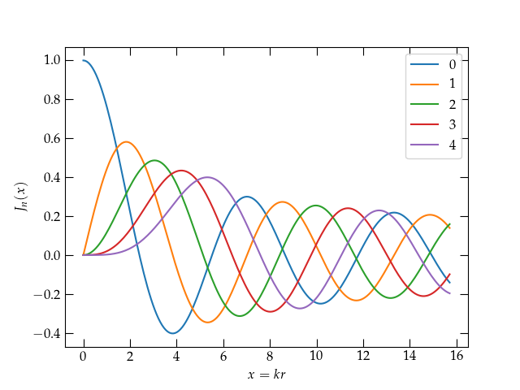
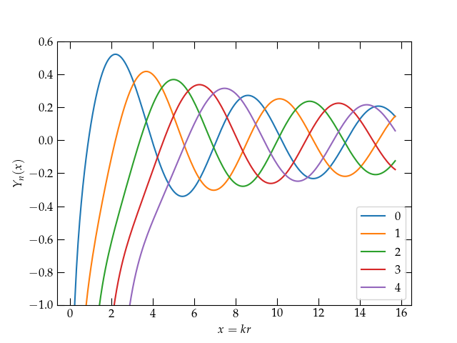

{:menu DE}
{::comment}menu-start{:/comment}

<label id="hamburger-menu"></label>

<ul>
<li><a href="DE-DEs.html">Ordinary Differential Equations</a></li>
<li><a href="DE-PDEs.html">Partial Differential Equations I</a></li>
<li><a href="DE-PDE-II.html">Partial Differential Equations II</a></li>
</ul>

{::comment}menu-end{:/comment}

# Bessel's Equation

* toc
{:toc}

Bessel's equation arises when we solve the wave equation in a circular region, for instance in the shape of a taut drum head after being struck or the ripples on a smooth pond after a pebble is thrown into it—at least while the shore is far away. If we imagine the energy density in the ripples as they proceed outward, it must diminish as $$1/r$$, since the perimeter of the ripple is growing proportional to $$r$$. The energy is proportional to the amplitude squared (same as for a harmonic oscillator), so the amplitude of the wave must decay proportional to $$1/\sqrt{r}$$. So, roughly speaking, we should expect a form something like $$\frac{\sin(kr)}{\sqrt{kr}}$$, where $$k = 2\pi/\lambda$$ is the wave vector.

The wave equation is 
\\[
    \laplacian \psi = \frac{1}{v^2} \pdv[2]{\psi}{t}
\\]
[As shown here](DE-PDE-II#solving-laplaces-equation-in-a-circular-region), the form of the Laplacian in polar coordinates is
\\[
    \laplacian \psi = \frac{1}{r} \pdv{}{r}\qty(r \pdv{\psi}{r}) + \frac{1}{r^2} \pdv[2]{\psi}{\theta}
\\]
We will assume that we can look for a solution of the form
\\[
    \psi(r, \theta, t) = R(r) \Theta(\theta) T(t)
\\]
which we substitute into the wave equation to get
\\[
    \qty[R^{\prime\prime}(r) + \frac1r R'(r)]\Theta(\theta)T(t) +
    \frac{1}{r^2} R(r) \Theta^{\prime\prime}(\theta) T(t) =
    \frac{1}{v^2} R(r) \Theta(\theta) T^{\prime\prime}(t)
\\]
Dividing both sides by $$\psi = R\Theta T$$ gives
\begin{equation}\label{eq:B1}
    \frac{R^{\prime\prime} + \frac1r R'}{R} + 
    \frac{1}{r^2} \frac{\Theta^{\prime\prime}}{\Theta} =
    \frac{1}{v^2} \frac{T^{\prime\prime}}{T}
\end{equation}
which shows that all the time dependence is on the right-hand side. For this equation to hold, both sides must be equal to a constant, which I will call $$-k^2$$, yielding the time dependence
\\[
    T^{\prime\prime} = - k^2 v^2 T = -\omega^2 T
    \qquad\longrightarrow\qquad
    T(t) = e^{\pm i \omega t}
\\]
(I could also use $$\sin\omega t$$ and $$\cos\omega t$$.) Returning now to the left-hand side of Eq. (\ref{eq:B1}) and multiplying by $$r^2$$ we have
\\[
    \frac{r^2 R^{\prime\prime} + r R'}{R} + \frac{\Theta^{\prime\prime}}{\Theta} = -k^2 r^2
    \qquad\longrightarrow\qquad
    \frac{r^2 R^{\prime\prime} + r R'}{R} + k^2 r^2 = - \frac{\Theta^{\prime\prime}}{\Theta}
\\]
Once again, all $$\theta$$ dependence is on the right, while all radial dependence is on the left. Each side must equal a constant, which I will call $$n^2$$. Solving the azimuthal equation then gives
\\[
    \Theta^{\prime\prime} = -n^2 \Theta
    \qquad\longrightarrow\qquad
    \Theta(\theta) = \begin{cases} \sin n\theta & \\\ \cos n\theta & \end{cases}
\\]
Finally, the radial equation becomes
\\[
    r^2 R^{\prime\prime} + r R' + (k^2 r^2 - n^2) R = 0
\\]
The quantity $$kr = x$$ is dimensionless. Noting that
\\[
    \dv{R}{r} = k \dv{R}{kr} = k \dv{R}{x}
\\]
and taking $$y(x) = R(kr)$$, we get finally **Bessel's equation**
\begin{equation}\label{eq:Bessel}
  \boxed{ x^2 y^{\prime\prime} + x y' + (x^2 - n^2) y = 0 }
\end{equation}

If the domain over which we seek to solve the equation includes the full circle, then $$n$$ must be an integer to make $$\Theta(\theta)$$ single valued.

The solutions to Bessel's equation that are bounded at the origin are called **Bessel functions** (of the first kind) and denoted $$J_n(x)$$. 

  

The first five Bessel functions of integer order.

The solutions that diverge at the origin are called **Neumann functions** (or Bessel functions of the second kind) and denoted $$Y_n(x)$$.

  

The first few Neumann functions of integer order.

~~~~ python
import matplotlib.pyplot as plt
from scipy.special import jv, yn

fig, ax = plt.subplots()
x = np.pi * np.linspace(0,5,201)
for n in range(5):
    ax.plot(x, jv(n,x), label=f"{n}")
ax.legend()
ax.set_xlabel("$x = kr$")
ax.set_ylabel("$J_n(x)$")

fig, ax = plt.subplots()
x = np.pi * np.linspace(0.05,5,201)
for n in range(5):
    ax.plot(x, yn(n,x), label=f"{n}")
ax.legend()
ax.set_xlabel("$x = kr$")
ax.set_ylabel("$Y_n(x)$")
ax.set_ylim(-1,0.6)
~~~~

If the domain of solution includes the origin, then we must rule out the Neumann functions. On the other hand, if we are working in an annular region, we will generally need both Bessel and Neumann functions.

