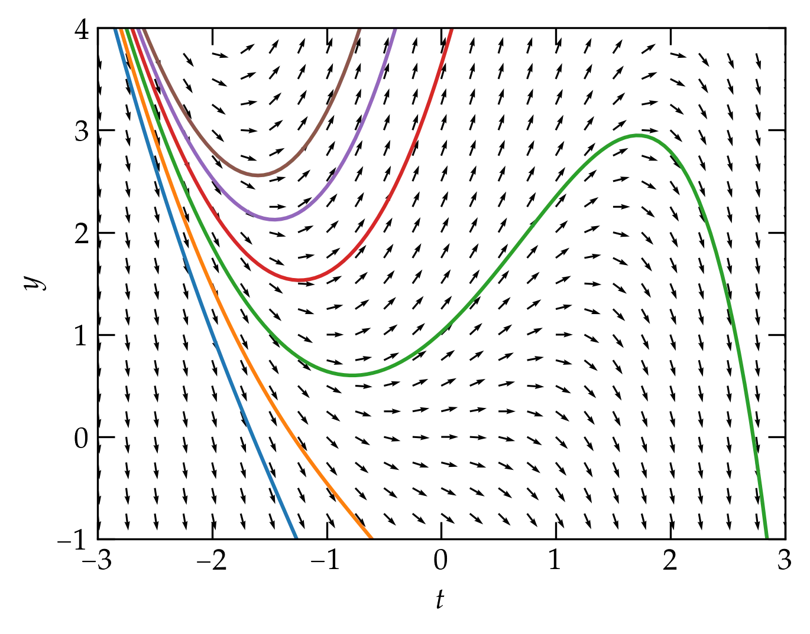

{:menu DE}

# First-Order ODEs

* toc
{:toc}

A linear first-order differential equation has the form
\begin{equation}\label{eq:DE1}
  \dv{y}{t} + p(t) y(t) = q(t)
\end{equation}
where $$t$$ is the independent variable, $$y(t)$$ is the dependent variable, and $$q(t)$$ is a forcing function. If $$q(t) = 0$$, the equation is **homogeneous**; if not, it is **nonhomogeneous**. For given functions $$p(t)$$ and $$q(t)$$, a solution requires the additional input of the value of $$y(t)$$ at some chosen initial time (typically $$t = 0$$). Under general conditions we will outline below, the solution $$y(t)$$ exists and is unique. In the following, I will typically use a prime to indicate differentiation with respect to the independent variable.

## The Method of Integrating Factors

One strategy for finding $$y(t)$$ is to seek to express the left-hand side of the equation as the total derivative of some function of $$t$$.

- To that end, let us suppose that $$P(t) = \int p(t)\dd{t}$$, where we may pick any constant of integration.
- Multiply the differential equation by $$\exp[P(t)]$$ to get $$ [e^{P(t)} y]' = e^{P(t)} q(t) $$.
- Integrate both sides with respect to time to get
\\[
    e^{P(t)} y(t) = Q(t) + c \equiv \int e^{P(t)} q(t) \dd{t}
\\]
- Multiply by $$e^{-P(t)}$$ to solve for $$y(t)$$:
\begin{equation}\label{eq:integrating-factor}
  y(t) = e^{-P(t)} (Q(t) + c)
\end{equation}
for arbitrary constant $$c$$.

## Existence and Uniqueness

We would like to know under what conditions a solution to the equation $$y' = f(t, y)$$, with $$y(t_0) = y_0$$ has a solution. The **Existence and Uniqueness Theorem** holds the following:

> If $$f(t, y)$$ and $$\pdv{f}{y}$$ are continuous on a closed rectangle $$R$$ on the $$ty$$ plane and the point $$(t_0, y_0)$$ is inside $$R$$, then a solution $$y(t)$$ exists on some interval of $$t$$ that contains $$t_0$$ in its interior, and no more than one solution in $$R$$ on any $$t$$ interval that contains $$t_0$$.

## Slope Fields

One way to visualize a first-order equation is to show the slope $$y' = f(t, y)$$ as a
function of $$t$$ and $$y$$ in a slope field. We start at a particular point on the $$ty$$ plane
and follow the local value of slope to determine how the value of $$y$$
should change in the next small interval of time. This takes us to a new value
of $$y$$, from which we can determine a new value of slope and then a new value of
$$y$$, etc. The result is illustrated in <a href="#Fig1">in Figure 1</a>.

  

<a name="Fig1">Figure 1</a> — The arrows show the derivative $$y'$$; the smooth curves show example solutions to the first-order equation.

## Separation of Variables

If the differential equation you seek to solve can be written in the form
\begin{equation}\label{eq:separable}
  a(y) y' + b(x) = 0
\end{equation}
we can effectively separate the variables as follows. If $$A'(y) = a(y)$$, then
\begin{equation}\label{eq:dy}
  \dv{[A(y)]}{x} = \dv{A}{y} \dv{y}{x} = a(y) y'
\end{equation}
by the chain rule. So,
\begin{equation}\label{eq:sep}
  \dv{[A(y)]}{x} = - \dv{B}{x} = -b(x)
  \qquad\longrightarrow\qquad
  A(y) + B(x) = C
\end{equation}
for an integration constant $$C$$. Note that this is the fussy mathematician's way. Physicists are happy proceeding as follows:
\begin{align}
  a(y) \dd{y} &= -b(x)\dd{x}  \notag
  \\\
  \int a(y) \dd{y} &= \int -b(x)\dd{x} + C
\end{align}
Simple. The mathematicians have a point that you must be careful about "tearing apart a derivative" this way if you think it establishes a pattern that you can do the same thing with second-order derivatives, which you cannot!
