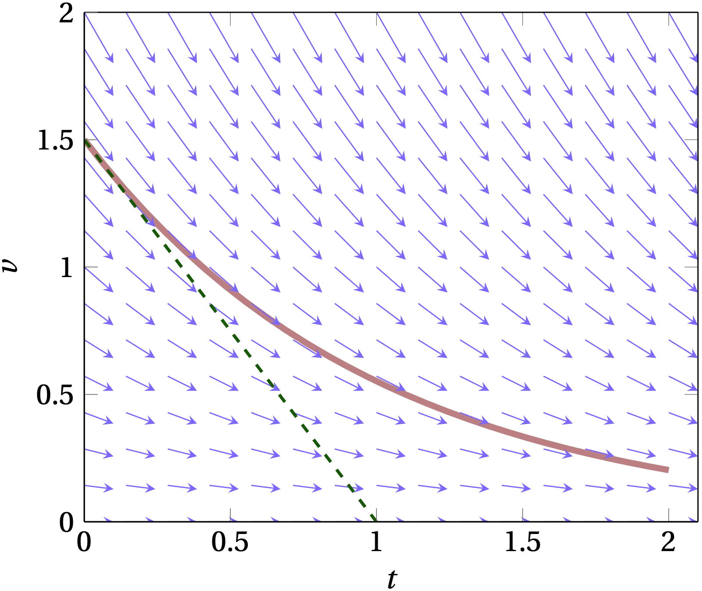
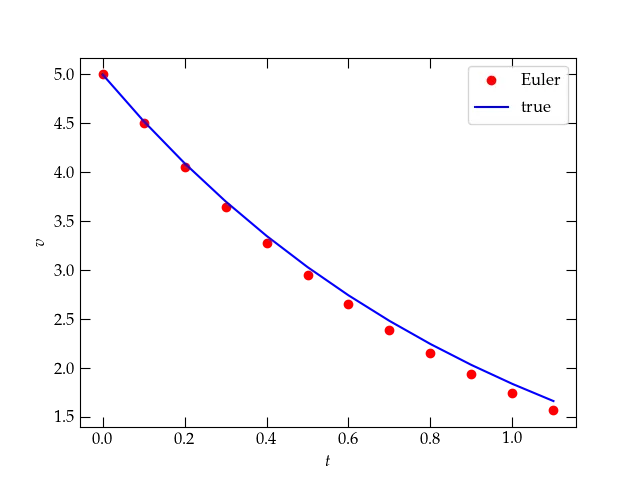
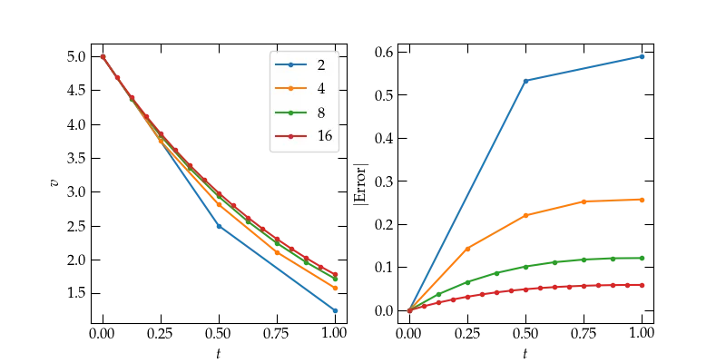
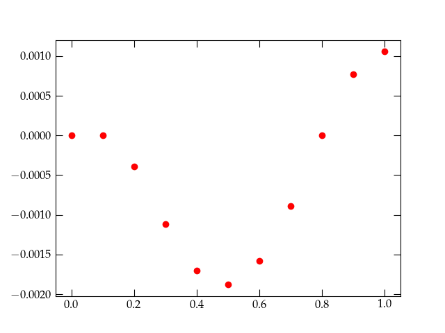
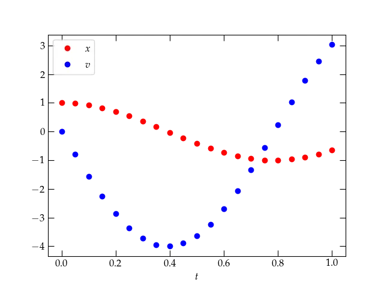
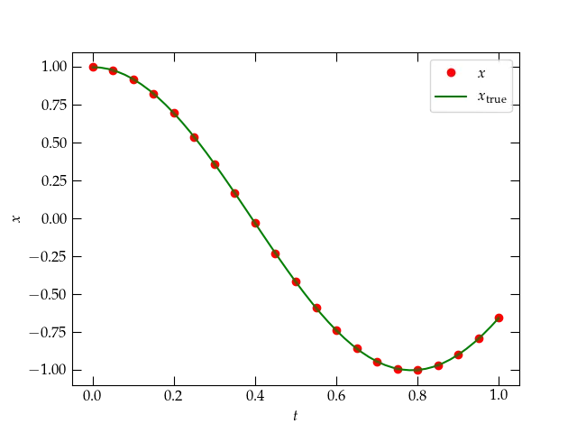
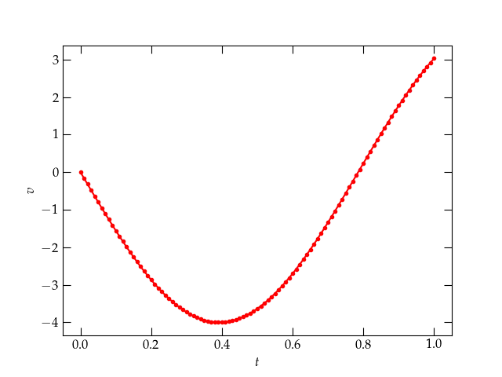
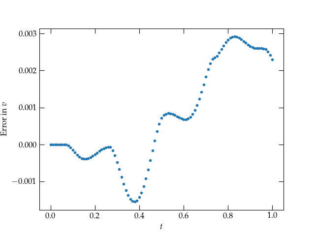

{:menu DE}

# Numerical Approaches to Solving ODEs

* toc
{:toc}

Newton’s equations of motion (in one dimension) are typically second-order
differential equations of the form $$\displaystyle m \frac{d^2 x}{dt^2} = F(x, v, t) $$ where
$$v = dx/dt$$ and $$F$$ is some function of the position, velocity, and time. To get
started in understanding how to solve such equations numerically, let’s start
with a simpler situation in which the acceleration is proportional to the
velocity,
$$
  m \dot{v} = f(v)
$$
where the dot indicates differentiation with respect to time and $$f$$ is a known
function that depends only on the velocity $$v$$. This form could describe, for
example, a ball bearing moving through a viscous fluid.

## Seeing a path to solution

One way to visualize this equation is to show the slope $$dv/dt = f(v)/m$$ as a
function of $$t$$ and $$v$$ in a slope field. We start at a particular value of $$v$$
at $$t = 0$$ and follow the local value of slope to determine how the value of $$v$$
should change in the next small interval of time. This takes us to a new value
of $$v$$, from which we can determine a new value of slope and then a new value of
$$v$$, etc. The result is illustrated by the light red line in the figure below.

  

The arrows show the derivative $$\dot{v}$$; the red curve shows an example solution to the first-order equation, while the dashed green line shows the continuation of the slope from its value at $$t = 0$$.

## Solving a first-order differential equation of time

Let us take the first-order differential equation above and simplify it by
moving the mass to the right-hand side,
$$
  \frac{dv}{dt} = \frac{1}{m} f(v)
$$
which we can also write suggestively as

\begin{equation}
  dv = \frac{f(v)}{m}  \, dt
  \label{eq:DE}
\end{equation}

Conceptually, this equation says that if we know $$v(t)$$ at some moment of time
$$t$$, we know how $$v$$ will change in the next *infinitesimal* increment of time
$$dt$$; the rate of that change is just given by $$f(v)/m$$. However, this
expression is only true in the limit that $$dt$$ is infinitesimal (infinitely
tiny), which means that we would need to apply this rule an infinite number of
times to cover even a modest (finite) time interval.

We would much rather take time steps larger than “infinitely small,” so that we can
cover a *finite* interval of time in a *finite* number of steps. In that case,

\begin{equation}
  \delta v \approx \frac{f(v)}{m} \delta t
\end{equation}

where $$\delta t$$ is now a small but finite interval of time. This equation
embodies **Euler’s method** of approximating the solution of a differential
equation: it pretends that the derivative doesn’t change over the finite time
interval $$\delta t$$, which is only really true if $$f(v)$$ is a constant. (I am going to
reserve $$\Delta t$$ to represent an extended interval of time, which we might break up
into a number of smaller steps $$\delta t$$ to which we apply the above equation.)

## Testing Euler’s method

To see how successfully Euler’s method works, let’s consider a situation where
the damping force on a particle of mass $$m$$ is proportional to the particle’s
velocity,

\begin{equation}
  f(v) = -b v
  \label{eq:damping}
\end{equation}

where $$b$$ is a constant whose dimensions in SI units would be newton-seconds per
meter. This damping force is definitely not independent of the particle’s
velocity; as the particle slows down, the damping force retarding its further
motion diminishes. Therefore, we should expect that using Euler’s method will
tend to be increasingly inaccurate the larger we make the time steps $$\Delta
t$$. Let’s test that hypothesis using in a Jupyter notebook. First, we&rsquo;ll use
nothing but the straight Python you have already learned. Then we’ll introduce
some refinements.

At the top of the notebook, enter

~~~ python
%matplotlib notebook
import numpy as np
import matplotlib.pyplot as plt
~~~

The first line enables graphics output by matplotlib to be embedded in the
notebook; the other two load the numpy and matplotlib modules.

~~~ python
b = 1      # the damping coefficient (you can change this value)
m = 1      # the particle mass (you can change this, too)
v0 = 5     # the initial velocity
dt = 0.1   # the time step (you can also change this, if you like)
v = [v0,]  # initialize an array of velocities
t = [0, ]  # and an array of times
while t[-1] < 1:
    dv = -b / m * v[-1] * dt  # compute the change in velocity, assumed constant over time interval
    v.append(v[-1] + dv)      # append the new velocity to the growing array of velocities
    t.append(t[-1] + dt)      # and append the new time

# Solving exactly gives the equation v(t) = v0 * exp(-b/m t)
# Let's plot the comparison between the Euler’s-method solution and the true function

fig, ax = plt.subplots()   # create a plot
ax.plot(t, v, 'ro', label='Euler')
ax.plot(t, v0 * np.exp(-b/m * np.array(t)), 'b-', label='true')
ax.set_xlabel('$$t$$')
ax.set_ylabel('$$v$$')
ax.legend();
~~~

The results are shown in Fig. [20](#org8565d13), which indicates that the values calculated
using Euler’s method lie below the true solution to the differential equation,
which is $$v(t) = v_0 \exp(-\frac{b}{m} t)$$.

  

Euler’s method (red dots) compared to the true solution to the differential equation.

### Question

*Can you explain why the dots lie below the line?*

## Errors

One way to explore how (in)accurate Euler’s method is would be to plot the
difference between its predictions and the correct answer. We would expect these
differences to grow over time; the more steps we take, the farther away from the
correct solution we will stray. It will be convenient to write first a little
function to “run” Euler’s method. It will take a list of time values and the
starting velocity and then calculate all the remaining velocities.

~~~ python
def Euler(tvals, v0, b=1, m=1):
    """Starting at v0 at the first entry in tvals, use Euler's
    method to integrate the first-order differential equation to
    find v at each of the remaining tvals.
    """
    v = [v0,] # initialize the output array
    for n in range(1, len(tvals)):
    dt = tvals[n] - tvals[n-1] # in case the time steps aren't even
    dv = -b * v[-1] * dt / m
    v.append(v[-1] + dv)
    return np.array(v)
~~~

We can now use this routine to explore the errors.

~~~ python
def EulerError(nsteps:list, b=1, m=1, v0=5):
    """Prepare a graph showing errors accumulated by using Euler's
    method to integrate a first-order differential equation.
    """
    assert isinstance(nsteps, (tuple, list, np.ndarray)), "Pass in a list of positive integers"
    fig, axes = plt.subplots(1, 2, figsize=(8, 4))  # create an empty plot
    ax1, ax2 = axes
    ax1.set_xlabel('$$t$$')
    ax1.set_ylabel('$$v$$')
    ax2.set_xlabel('$$t$$')
    ax2.set_ylabel('Error')
    for n in nsteps:
    tvals = np.linspace(0, 1.0, n+1) # linspace divides the span between the arguments into n equal steps
    vvals = Euler(tvals, v0, b, m)
    ax1.plot(tvals, vvals, '.-', label=str(n))
    ax2.plot(tvals, np.abs(vvals - v0 * np.exp(-tvals * b/m)), '.-', label=str(n))
    ax1.legend()

EulerError([2, 4, 8, 16]) # Cover the [0,1] range in 2, 4, 8, and 16 steps
~~~

The results for crossing the 1-second time interval in 2, 4, 8, and 16 steps are
shown in Fig. 2. Clearly, the smaller the steps we take, the more accurate the
numerical approximation is. We could quantify

  

Euler’s method solution (left) and absolute error (right) for different numbers of steps. Clearly, taking smaller steps leads to smaller final error. But how efficiently?

### Exercise

Prepare a plot that shows how the error after 1 second depends on the size of
the time step $$dt = (1~\mathrm{s}) / n$$, where $$n$$ is the number of equal steps
used to subdivide the 1-second interval. You can use the `Euler` function above
to do much of the computing, along with `np.linspace` to produce the time
values.

Hints:

* Your plot should only involve the “final” error, which is how far away from
    the true solution the Euler’s method value is at the 1-second mark.
* The plot works best if you use logarithmic axes. Instead of calling
    `ax.plot(...)`, use `ax.loglog(...)`.
* Can you summarize your findings in a simple relationship?

## A better way

Your results from the previous exercise might persuade you that the secret to an
accurate numerical solution is just to take lots of tiny steps—a sort of “brute
force” approach.

The upshot of our investigation of Euler’s method is that it has two salient
properties, one good, and one bad:

* Euler’s method is easy to understand, which is great!
* Euler’s method yields **large** errors, which is terrible!

Fortunately, there are much better ways. I won’t drag you through all the
**interesting** applications of Taylor’s theorem which can be used to explore how
the errors depend on step size of various methods, but I can offer a hint of the
basic idea. Many of the methods are founded on the insight that it is bad
strategy to base the behavior over the entire step on the derivative we
calculate at the beginning of the step. It would be smarter to use the initial
derivative to make a tentative first step, say, half-way across the full step
$$\delta t$$, then see what the derivative looks like there. We could then use
that value of the derivative to try another half-way step, which would land us
in a slightly different spot and with a slightly different slope. Somehow, we
then combine all this information to take the full step. In a nutshell, this is
the recipe in the celebrated **Runge-Kutta** method, which is fourth-order in
$$\delta t$$. (It was developed around 1900 by the German mathematicians Carle
Runge and Wilhelm Kutta.) That is, if you take twice as many steps to cross a
given time range, the error should drop by a factor of 16! Now we’re talking!

Many years later, some folks realized that it would be nifty if the same
intermediate points we calculate while working up the courage to step across
$$\delta t$$ could be used for two methods of different order. The standard
Runge-Kutta-Fehlberg 4th-5th order does this, using the difference between the
two methods to estimate the error of the step. The **RK45** method is the
default method used by the scipy function `solve_ivp` which we will use instead
of Euler’s method. This method is a real workhorse and should suffice for almost
all of our work. First, we need to import the routine.

~~~ python
from scipy.integrate import solve_ivp
~~~

To use this marvelous routine, let me remind you of the problem we’re trying to
solve. In a nutshell, it is that we have a function that computes the
derivative,

\begin{equation}
     \frac{dy}{dt} = f(t, y)
\end{equation}

and we are trying to solve for $$y(t)$$ assuming that we know the value of $$y(t_0)
= y_0$$. In the case of the pearl sliding through the viscous fluid, $$y$$
represented the pearl’s velocity $$v$$ and the function $$f(t, y)$$ took the form
$$f(t, y) = - y \times b / m$$
As in this case, we commonly need to pass the function $$f$$ additional
parameters, such as $$b$$ and $$m$$, so we will define the derivative function as
follows:

~~~ python
def myderiv(t, v, b, m):
    """Given the current value of v and t, and the parameters
    b (damping) and m (mass), compute and return the derivative."""
    return -v * b / m
~~~

Now, we can use the function `solve_ivp` to integrate Eq. (7) from a starting
value of $$y$$ at $$t = 0$$. At a minimum, we need to supply the name of the
function that computes the derivative, the time interval over which to
integrate, and the initial value $$y_0$$. If our derivative function takes
additional parameters (as ours does), we need to supply the extra parameters in
a tuple as the `args` keyword argument, as shown below.

~~~ python
res = solve_ivp(myderiv, [0, 1], [5.0], t_eval=np.linspace(0, 1, 11), args=(1, 1))
res

    message: 'The solver successfully reached the end of the integration interval.'
        nfev: 14
        njev: 0
        nlu: 0
        sol: None
    status: 0
    success: True
        t: array([0. , 0.1, 0.2, 0.3, 0.4, 0.5, 0.6, 0.7, 0.8, 0.9, 1. ])
    t_events: None
        y: array([[5.        , 4.52418709, 4.09326263, 3.70297271, 3.34989891,
        3.03077272, 2.74247553, 2.48203859, 2.24664309, 2.03362008,
        1.84045052]])
    y_events: None
~~~

As you can see from res, the call to solveivp completed successfully; it
required 14 evaluations of the function myderiv; and returned the time values at
which we requested output by passing the keyword parameter teval with a list
(array) of time values, along with the computed values of 𝑦. We can get a sense
of the errors that this “marvelous” routine computed for us with the following:

~~~ python
errors = res.y[0,:] - 5.0 * np.exp(-res.t * 1.0 / 1.0)
fig, ax = plt.subplots()
ax.plot(res.t, errors, 'ro');
~~~

  

The errors from a call to `solve_ivp` using default parameters. **Do you think they are acceptable?**

# Options for `solve_ivp`

You probably find that the errors reported in Fig. [41](#orga19636d) are a bit
large for your taste. It depends on the application. If it took a long time to
compute the derivative function `myderiv`, we might be satisfied with these
results. But, if that part of the computation isn’t burdensome, perhaps we&rsquo;d
like some improved accuracy. For this purpose, we have a range of choices.

## Choosing the method

The default method for integrating the differential equation uses the
**Runge-Kutta-Fehlberg** 4th-5th-order method, but `solve_ivp` can use other
methods. You can find all about them by running

~~~ python
    help(solve_ivp)
~~~

In particular, you should try the "DOP853" method, to see if a higher-order
method yields a more accurate solution.

### Choosing the absolute and relative tolerances

The self-monitoring routines (those that have a way of estimating their errors)
need criteria by which to judge how well they are working. By default, these are
defined by the parameters

* `rtol` = $$10^{-3}$$
* `atol` = $$10^{-6}$$

which stand for the relative tolerance and the absolute tolerance,
respectively. These are optional parameters that you can set using Python’s
keyword argument mechanism. Here’s an example:

~~~ python
res = solve_ivp(myderiv,        # the derivative function
[0, 1],                         # the range of the independent variable, t
[5.0],                          # the initial value of the dependent variable, v
method='RK45',                  # the algorithm to be used
t_eval=np.linspace(0, 1, 11),   # the times at which we wish to know the values of v
args=(1, 1),                    # the additional parameters (b, m) to be passed to myderiv
rtol=1e-6,                      # the value of relative tolerance to use
atol=1e-8)                      # the value of absolute tolerance to use
~~~

### Exercise

Explore how the method and values of `rtol` and `atol` influence the error in
the value of $$v$$ at $$t = 1$$ s, the final value of the integration. Summarize
your findings in your Jupyter notebook.

## Second-Order Equations

We have seen how to solve first-order differential equations of the form

\begin{equation}
  \frac{d v}{d t} = f(v) \qquad\text{or}\qquad \frac{d x}{d t} = g(x)
  \label{eq:firstorder}
\end{equation}

However, Newton’s equations of motion (in one dimension) are typically *second-order*
differential equations of the form $$ m \frac{d^2 x}{dt^2} = F(x, v, t) $$ where
$$v = dx/dt$$ and $$F$$ is some function of the position, velocity, and time. We have seen how
we can use Euler’s method to develop an approximate numerical solution to a **first-order**
equation, where we use the fact that we know the function that computes the derivative,
and we can use small but finite steps to estimate the true solution. We have also seen
that nifty functions like `solve_ivp` can use higher-order numerical methods to compute
more accurate solutions **to first-order equations** without having to take really tiny
steps. Wouldn’t it be nice if we could somehow take advantage of these tools to solve
second-order differential equations?

## The Secret

As it turns out, we can leverage all we have learned to handle a second-order
equation! The trick is to use twice as many first-order equations. Let’s see how
that can work using a particularly simple example. Suppose we wish to solve

\begin{equation}
  m\ddot{x} = - k x
\end{equation}

which describes a particle of mass $$m$$ subject to a restoring force that grows linearly with
displacement from $$x = 0$$. (Remember that the dots signify derivatives with respect to time.)

If we use more conventional notation, in which $$\dot{x} = v$$ and $$\ddot{x} =
\dot{v}$$, we could write

\begin{align}
  \dot{v} &= - \frac{k}{m} x \\\ 
  \dot{x} &= v
\end{align}

each of which is a **first-order equation**. That is, by introducing as a new
variable the first-derivative of position with respect to time ($$v$$), we can
break apart the single second-order equation into **two coupled first-order
equations**.

Let’s say that again. To solve a second-order differential equation of the form

\begin{equation}
  \ddot{x} = f(x, \dot{x}, t)
\end{equation}

use **two** dependent variables, $$x$$ and $$v$$, to write the coupled equations

\begin{equation}
  \left[
  \begin{array}
    \dot{x}
    \\\ 
    \dot{v}
 \end{array}
 \right]
 =
  \left[ \begin{array}\ v \\\ f(x, v, t) \end{array} \right]
\end{equation}

then we can use Euler’s method—or the better methods of `solve_ivp` —to solve
**simultaneously** for $$x(t)$$ and $$v(t)$$. Recall that the call signature of
`solve_ivp` is `solve_ivp(deriv_func, time_range, initial_values, ...)`.
Fortunately, the `deriv_func` can return an array of derivatives, and the
`initial_values` can be a corresponding array of the initial values of the
coordinates. Let’s see how the example plays out.

~~~ python
# First prepare the notebook by loading the necessary modules
%matplotlib notebook
import numpy as np
import matplotlib.pyplot as plt
from scipy.integrate import solve_ivp
~~~

We have to define a function that computes the vector of derivatives at time $$t$$
and a vector of the coordinates, $$X = [x, v]$$. We can list the coordinates in
any order we like, as long as use the same order for the derivatives, $$[\dot{x},
\dot{v}]$$.

~~~ python
def SHOderivs(t, X, k, m):
    """
    Compute the derivatives of a simple harmonic oscillator of mass m and spring constant k
    where the dependent variable X holds [x, v].
    """
    x, v = X # we use x = X[0] and v = X[1]
    # the derivative dx/dt = v, and 
    # the derivative dv/dt = -k/m * x
    # we have to return the derivatives in the same order as the coordinates
    # were delivered in X
    derivs = np.array([v, -k/m * x])
    return derivs
~~~

Note again that this function receives the coordinates [x, v] in a list (array)
in the variable `X`, so it returns the derivates [v, a]. We can now integrate
the differential equation for the time range $$0 \le t \le 1$$, starting with
$$x(0) = 1$$ and $$v(0) = 0$$.

~~~ python
res = solve_ivp(SHOderivs, [0, 1], [1.0, 0.0],
t_eval=np.linspace(0, 1, 21), args=(4, 0.25))
res

message: 'The solver successfully reached the end of the integration interval.'
nfev: 56
njev: 0
nlu: 0
sol: None
status: 0
success: True
t: array([0.  , 0.05, 0.1 , 0.15, 0.2 , 0.25, 0.3 , 0.35, 0.4 , 0.45, 0.5 ,
0.55, 0.6 , 0.65, 0.7 , 0.75, 0.8 , 0.85, 0.9 , 0.95, 1.  ])
t_events: None
y: array([[ 1.        ,  0.98006663,  0.92107572,  0.825395  ,  0.6967433 ,
0.54024223,  0.36225911,  0.16986033, -0.02929309, -0.22738616,
-0.41646995, -0.58889897, -0.73787313, -0.85727112, -0.94240378,
-0.9900373 , -0.99845565, -0.96702272, -0.89675673, -0.79050156,
-0.65289549],
[ 0.        , -0.79467787, -1.55781879, -2.25895497, -2.86969046,
-3.36596441, -3.72862823, -3.94317039, -3.99972153, -3.89581286,
-3.63647339, -3.23315991, -2.7011724 , -2.06107624, -1.33812055,
-0.56208386,  0.23632515,  1.02504019,  1.77273867,  2.45002813,
3.0295073 ]])
y_events: None
~~~

Looking at the output of `solve_ivp`, we see that the array returned as `y` is
now two-dimensional, since our coordinate “vector” consists of X = [x, v]. Let&rsquo;s
make a plot of the solution.

~~~ python
fig, ax = plt.subplots()
t = res.t
x = res.y[0,:]
v = res.y[1,:]
ax.plot(t, x, 'ro', label="$$x$$")
ax.plot(t, v, 'bo', label="$$v$$")
ax.legend()
ax.set_xlabel('$$t$$');
~~~

  

The solution to Eq. (2) provided by `solve_ivp`.

This plot looks very promising. It looks like the start of an oscillation, which
you might expect for a mass suspended from a spring. After all, the differential
equation we’re solving is

\begin{equation}
  \frac{d^2 x}{dt^2} = - \frac{k}{m} x
\end{equation}

which simplifes to

\begin{equation}
  \frac{d^2 x}{dt^2} = - 16 x
\end{equation}

for the particular values of $$k = 4$$ and $$m = 1/4$$ that we used in our
solution. As you can readily verify, the function

\begin{equation}
  x = \cos(4t)
\end{equation}

solves this equation. Furthermore, its derivative vanishes at $$t = 0$$, as we
require. Let’s add this function to the plot to see how the numerical solution
is doing.

~~~ python
fig, ax = plt.subplots()
t = res.t
x = res.y[0,:]
ax.plot(t, x, 'ro', label="$$x$$")
tvals = np.linspace(0, 1, 51)
xvals = np.cos(4 * tvals)
ax.plot(tvals, xvals, 'g-', label=r"$$x_{\mathrm{true}}$$")
ax.legend()
ax.set_xlabel('$$t$$')
ax.set_ylabel('$$x$$');
~~~

  

### Exercise

That agreement between the theoretical curve and the numerical solution looks very good, but we
expect that there will be some errors in the numerical solution. Make a plot of the errors for
both $$x$$ and $$v$$. How small do you have to make `rtol` to produce an “acceptable” level of error,
in your opinion?

## Smooth output

So far, we have asked `solve_ivp` to produce a solution at specific values of
the **independent** variable $$t$$, which we specify by the keyword parameter
`t_eval` set to a list or array of values. It can be useful, however, not to
have to specify the particular values at the start, but to have `solve_ivp`
return a smooth function. We can manage this by asking for
`dense_output=True`. Let’s see how this works.

~~~ python
res = solve_ivp(SHOderivs, [0, 1], [1.0, 0.0], dense_output=True, args=(4, 0.25))
res

    message: 'The solver successfully reached the end of the integration interval.'
    nfev: 56
    njev: 0
    nlu: 0
    sol: <scipy.integrate._ivp.common.OdeSolution object at 0x137e455e0>
    status: 0
    success: True
    t: array([0.00000000e+00, 6.24375624e-05, 6.86813187e-04, 6.93056943e-03,
        6.93681319e-02, 2.63647530e-01, 5.07499921e-01, 7.37486428e-01,
        9.86950372e-01, 1.00000000e+00])
    t_events: None
    y: array([[ 1.00000000e+00,  9.99999969e-01,  9.99996226e-01,
    9.99615762e-01,  9.61750781e-01,  4.93512971e-01,
    -4.43557322e-01, -9.81750147e-01, -6.91522218e-01,
    -6.52895491e-01],
        [ 0.00000000e+00, -9.99000989e-04, -1.09889972e-02,
    -1.10874908e-01, -1.09570295e+00, -3.47885073e+00,
    -3.58484295e+00, -7.59559602e-01,  2.88912221e+00,
    3.02950730e+00]])
    y_events: None
~~~

Notice that the output now includes an `OdeSolution` object in `res.sol`. We can
use it to evaluate the solution at a point in time within the range we have
simulated as follows:

~~~ python
res.sol(0.5)

array([-0.41646995, -3.63647339])
~~~

The solution returns an array (vector) of values of the dependent variables $$[x,
v]$$. Here&rsquo;s how we can use the solution to make a nice smooth plot of the
results. We’ll plot the velocity:

~~~ python
tvals = np.linspace(0, 1, 101)
Xvals = res.sol(tvals)
fig, ax = plt.subplots()
ax.plot(tvals, Xvals[1,:], 'r.-', label=r'$$v$$')
ax.set_xlabel('$$t$$')
ax.set_ylabel('$$v$$');
~~~

  

Let’s see what the error in the velocity looks like:

~~~ python
errors = Xvals[1,:] + 4 * np.sin(tvals * 4)
fig, ax = plt.subplots()
ax.plot(tvals, errors, '.')
ax.set_xlabel('$$t$$')
ax.set_ylabel('Error in $$v$$');
~~~

  

## Practice

Now, choose a (set of) differential equation(s) to integrate and write a
function that takes in a vector of coordinates and returns the derivatives of
those coordinates. Suggestions for systems you could use:

1. A simple harmonic oscillator: $$\ddot{x} = -\frac{k}{m} x$$ for which the
    analytic solution is $$x(t) = x_0 \cos\omega t + \frac{v_0}{\omega}
    \sin\omega t$$ where $$\omega = \sqrt{k/m}$$. Use coordinates $$[x, v]$$, and the
    derivatives $$[v, -\omega^2 x]$$.
2. A damped simple harmonic oscillator: $$\ddot{x} = -\frac{k}{m} x - \frac{b}{m}
    \dot{x}$$, which has analytic solution
    $$x(t) = \left(x_0 \cos \omega_1 t + \frac{v_0 + \beta x_0}{\omega_1} \sin\omega_1 t\right) e^{-\beta t}$$
    for $$\beta = 2b/m$$, $$\omega_0 = \sqrt{k/m}$$, and $$\omega_1 = \sqrt{\omega_0^2 -
    \beta^2}$$. Use coordinates $$[x, v]$$, and the derivatives $$[v, -\omega_0^2 x -
    \beta v]$$ for $$\omega_0 = \sqrt{k/m}$$.

3. A projectile subject to linear drag:
    $$ \ddot{x} = -g - \frac{b}{m} \dot{x} $$
    which has the solution
    $$ x(t) = x_0 - v_T\left(t + \frac{e^{-\beta t}}{\beta} \right) + \frac{v_0}{\beta}(1 - e^{-\beta t}) $$
    where $$\beta = b/m$$ and the terminal velocity is $$v_T = m g / b = g / \beta$$.
    Use coordinates $$[x, v]$$ and the derivatives $$[v, -g - \frac{b}{m} v]$$.

4. A planet subject to the Sun’s gravitational pull, $$[r, \dot{r}, \theta,
       \dot{\theta}]$$, and you figure out the derivatives. Recommendation: use
    A.U. for distances and years for times. Hints: $$GM = 4\pi^2$$ in these units,
    and you can take advantage of the fact that an inverse square force law
    produces closed orbits. You might want to use `plt.polar(θ, r)` to make polar
    plots of the trajectories.

Then call `solve_ivp` with your function and see how well it does. Investigate
how the error depends on the method and/or the tolerances (`rtol` or
`atol`). Use a log-log plot for the absolute value of the error.

## Generalizing to multiple variables

The step to handling more than one variable is now very small. For each second
derivative, we use two variables, one for the coordinate and one for its first
derivative, to get the coupled equations

\begin{equation}
  \left[
    \begin{array}
      \dot{x}_1 \\\ \dot{v}_1 \\\ \dot{x}_2 \\\ \dot{v}_2
    \end{array}
  \right]
  =
  \left[
  \begin{array}\
      v_1 \\\ \ddot{x}_1 = f_1(t, x_1, v_1, x_2, v_2)
      \\\ v_2 \\\ \ddot{x}_2 = f_2(t, x_1, v_1, x_2, v_2)
    \end{array}
  \right]
\end{equation}

Then we pack all these **dependent variables** in a single array `Y` and supply a
function that computes each one’s derivatives like so:

~~~ python
def bigderivs(t, Y, *other_parameters):
    x1, v1, x2, v2 = Y # break apart the individual variables, for convenience
    a1 = ...           # compute the acceleration of coordinate 1
    a2 = ...           # compute the acceleration of coordinate 2
    return np.array([v1, a1, v2, a2]) # return the vector of derivatives
~~~

The argument `*other_parameters` is a list of any additional parameters that our
function may require to evaluate the derivatives. When you precede a variable
name with an asterisk, it means that the variable holds a (possibly empty)
list. (When you precede a variable name with a double asterisk, the variable
holds a dictionary of key-value pairs. It’s the way optional keyword arguments
may be passed to a function.)

### Exercise

A conical pendulum is a point mass suspended by a rigid rod that is held fixed
at a frictionless pivot. Before we attempt a general solution for arbitrarily
large angles with respect to the vertical, we could attempt a solution valid for
small angles. Let’s use a cartesian coordinate system with $$z$$ pointing up, so
the $$x$$-$$y$$ plane is horizontal. For a pendulum of length $$\ell$$, it is possible
to show that in the case of small displacements from equilibrium, the
accelerations in the $$x$$ and $$y$$ directions are given by

\begin{align}
  \ddot{x} &= -\frac{g}{\ell} x \\\ 
  \ddot{y} &= -\frac{g}{\ell} y
\end{align}

Write a function that computes the derivatives for such a conical pendulum in
the small-amplitude limit and investigate the behavior of the solution for
different initial conditions.

* Does your solution produce closed figures in the $$x$$-$$y$$ plane?
* Can you think of a way to check whether energy is conserved? Try ignoring any
    velocity along the $$z$$ axis, as a first approximation, and consider
    gravitational potential energy and kinetic energy.
* For this system, the angular momentum around the $$z$$ axis should be
    the mass of the bob times the quantity $$x \dot{y} - y \dot{x}$$. Is it in fact
    conserved?

### Extension to Large Angles Using Lagrangian Mechanics

To handle angles that are not small, it is more convenient to use spherical
polar angles $$\theta$$ and $$\phi$$ and to employ Lagrangian mechanics, which develops the equations of motion
from energy, rather than forces. We will discuss this soon. In the meantime, the
summary is the following:

1. Pick generalized coordinates $$q_i$$ that uniquely identify the configuration of the system. These 
may be Cartesian, but may also be angles or other convenient quantities.
2. Compute the potential energy $$U$$ in terms of the $$q_i$$.
3. Compute the kinetic energy $$T$$ in terms of the $$q_i$$ and their time derivatives, $$\dot{q}_i$$.
4. Form the lagrangian $$L = T-U$$, which is a function of the $$q_i$$ and $$\dot{q}_i$$.