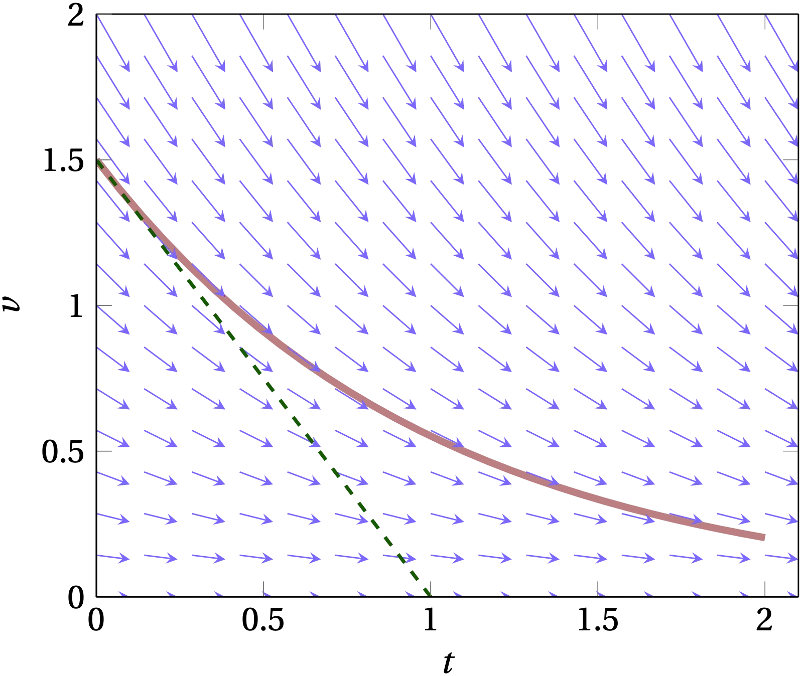
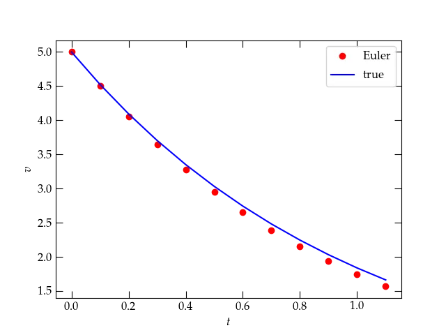
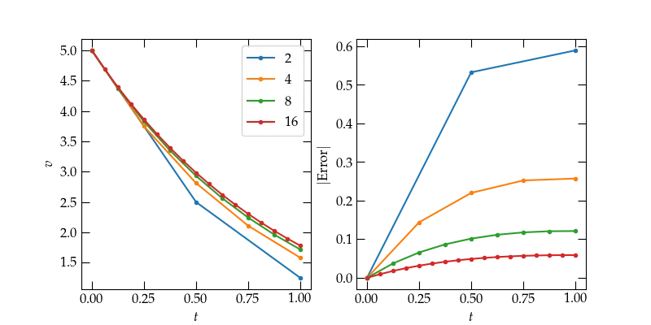
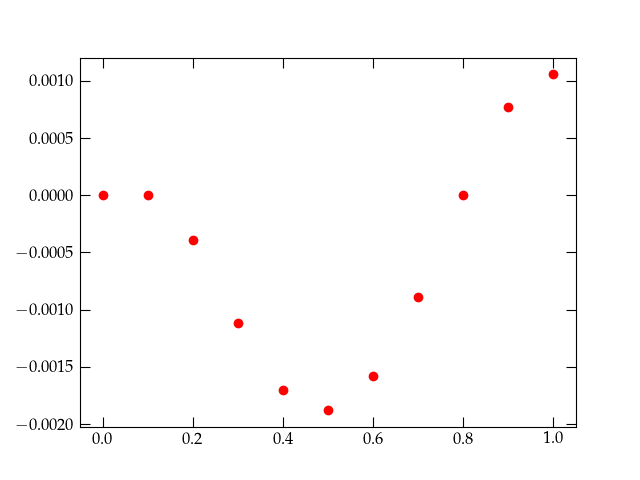

{:menu DE}

# Numerical Approaches to Solving ODEs

* toc
{:toc}

Newton’s equations of motion (in one dimension) are typically second-order
differential equations of the form $$\displaystyle m \frac{d^2 x}{dt^2} = F(x, v, t) $$ where
$$v = dx/dt$$ and $$F$$ is some function of the position, velocity, and time. To get
started in understanding how to solve such equations numerically, let’s start
with a simpler situation in which the acceleration is proportional to the
velocity,
$$
  m \dot{v} = f(v)
$$
where the dot indicates differentiation with respect to time and $$f$$ is a known
function that depends only on the velocity $$v$$. This form could describe, for
example, a ball bearing moving through a viscous fluid.

## Seeing a path to solution

One way to visualize this equation is to show the slope $$dv/dt = f(v)/m$$ as a
function of $$t$$ and $$v$$ in a slope field. We start at a particular value of $$v$$
at $$t = 0$$ and follow the local value of slope to determine how the value of $$v$$
should change in the next small interval of time. This takes us to a new value
of $$v$$, from which we can determine a new value of slope and then a new value of
$$v$$, etc. The result is illustrated by the light red line in the figure below.

  

<a name="Fig1">Figure 1</a> — The arrows show the derivative $$\dot{v}$$; the red curve shows an example solution to the first-order equation, while the dashed green line shows the continuation of the slope from its value at $$t = 0$$.

## Solving a first-order differential equation of time

Let us take the first-order differential equation above and simplify it by
moving the mass to the right-hand side,
$$
  \frac{dv}{dt} = \frac{1}{m} f(v)
$$
which we can also write suggestively as

\begin{equation}
  dv = \frac{f(v)}{m}  \, dt
  \label{eq:DE}
\end{equation}

Conceptually, this equation says that if we know $$v(t)$$ at some moment of time
$$t$$, we know how $$v$$ will change in the next *infinitesimal* increment of time
$$dt$$; the rate of that change is just given by $$f(v)/m$$. However, this
expression is only true in the limit that $$dt$$ is infinitesimal (infinitely
tiny), which means that we would need to apply this rule an infinite number of
times to cover even a modest (finite) time interval.

We would much rather take time steps larger than “infinitely small,” so that we can
cover a *finite* interval of time in a *finite* number of steps. In that case,

\begin{equation}
  \delta v \approx \frac{f(v)}{m} \delta t
\end{equation}

where $$\delta t$$ is now a small but finite interval of time. This equation
embodies **Euler’s method** of approximating the solution of a differential
equation: it pretends that the derivative doesn’t change over the finite time
interval $$\delta t$$, which is only really true if $$f(v)$$ is a constant. (I am going to
reserve $$\Delta t$$ to represent an extended interval of time, which we might break up
into a number of smaller steps $$\delta t$$ to which we apply the above equation.)

## Testing Euler’s method

To see how successfully Euler’s method works, let’s consider a situation where
the damping force on a particle of mass $$m$$ is proportional to the particle’s
velocity,

\begin{equation}
  f(v) = -b v
  \label{eq:damping}
\end{equation}

where $$b$$ is a constant whose dimensions in SI units would be newton-seconds per
meter. This damping force is definitely not independent of the particle’s
velocity; as the particle slows down, the damping force retarding its further
motion diminishes. Therefore, we should expect that using Euler’s method will
tend to be increasingly inaccurate the larger we make the time steps $$\Delta
t$$. Let’s test that hypothesis using in a Jupyter notebook. First, we&rsquo;ll use
nothing but the straight Python you have already learned. Then we’ll introduce
some refinements.

At the top of the notebook, enter

~~~ python
%matplotlib widget
import numpy as np
import matplotlib.pyplot as plt
~~~

The first line enables graphics output by matplotlib to be embedded in the
notebook; the other two load the numpy and matplotlib modules. If you are using the older Jupyter Notebook, change `widget` to `notebook` in the first line.

~~~~ python
b = 1      # the damping coefficient (you can change this value)
m = 1      # the particle mass (you can change this, too)
v0 = 5     # the initial velocity
dt = 0.1   # the time step (you can also change this, if you like)
v = [v0,]  # initialize an array of velocities
t = [0, ]  # and an array of times
while t[-1] < 1:
    dv = -b / m * v[-1] * dt  # compute the change in velocity, assumed constant over time interval
    v.append(v[-1] + dv)      # append the new velocity to the growing array of velocities
    t.append(t[-1] + dt)      # and append the new time

# Solving exactly gives the equation v(t) = v0 * exp(-b/m t)
# Let's plot the comparison between the Euler’s-method solution and the true function

fig, ax = plt.subplots()   # create a plot
ax.plot(t, v, 'ro', label='Euler')
ax.plot(t, v0 * np.exp(-b/m * np.array(t)), 'b-', label='true')
ax.set_xlabel('$$t$$')
ax.set_ylabel('$$v$$')
ax.legend();
~~~~

The results are shown in <a href="#Fig2">Fig.&nbsp;2</a>, which indicates that the values calculated
using Euler’s method lie below the true solution to the differential equation,
which is $$v(t) = v_0 \exp(-\frac{b}{m} t)$$.

  

<a name="Fig2">Figure 2</a> — Euler’s method (red dots) compared to the true solution to the differential equation.

### Question

*Can you explain why the dots lie below the line?*

## Errors

One way to explore how (in)accurate Euler’s method is would be to plot the
difference between its predictions and the correct answer. We would expect these
differences to grow over time; the more steps we take, the farther away from the
correct solution we will stray. It will be convenient to write first a little
function to “run” Euler’s method. It will take a list of time values and the
starting velocity and then calculate all the remaining velocities.

~~~ python
def Euler(tvals, v0, b=1, m=1):
    """Starting at v0 at the first entry in tvals, use Euler's
    method to integrate the first-order differential equation to
    find v at each of the remaining tvals.
    """
    v = [v0,] # initialize the output array
    for n in range(1, len(tvals)):
    dt = tvals[n] - tvals[n-1] # in case the time steps aren't even
    dv = -b * v[-1] * dt / m
    v.append(v[-1] + dv)
    return np.array(v)
~~~

We can now use this routine to explore the errors.

~~~ python
def EulerError(nsteps:list, b=1, m=1, v0=5):
    """Prepare a graph showing errors accumulated by using Euler's
    method to integrate a first-order differential equation.
    """
    assert isinstance(nsteps, (tuple, list, np.ndarray)), "Pass in a list of positive integers"
    fig, axes = plt.subplots(1, 2, figsize=(8, 4))  # create an empty plot
    ax1, ax2 = axes
    ax1.set_xlabel('$$t$$')
    ax1.set_ylabel('$$v$$')
    ax2.set_xlabel('$$t$$')
    ax2.set_ylabel('Error')
    for n in nsteps:
    tvals = np.linspace(0, 1.0, n+1) # linspace divides the span between the arguments into n equal steps
    vvals = Euler(tvals, v0, b, m)
    ax1.plot(tvals, vvals, '.-', label=str(n))
    ax2.plot(tvals, np.abs(vvals - v0 * np.exp(-tvals * b/m)), '.-', label=str(n))
    ax1.legend()

EulerError([2, 4, 8, 16]) # Cover the [0,1] range in 2, 4, 8, and 16 steps
~~~

The results for crossing the 1-second time interval in 2, 4, 8, and 16 steps are
shown in <a href="#Fig3">Fig. 3</a>. Clearly, the smaller the steps we take, the more accurate the
numerical approximation is. We could quantify

  

<a name="Fig1">Figure 1</a> — <a name="Fig3">Figure 3</a> — Euler’s method solution (left) and absolute error (right) for different numbers of steps. Clearly, taking smaller steps leads to smaller final error. But how efficiently?

### Exercise

Prepare a plot that shows how the error after 1 second depends on the size of
the time step $$dt = (1~\mathrm{s}) / n$$, where $$n$$ is the number of equal steps
used to subdivide the 1-second interval. You can use the `Euler` function above
to do much of the computing, along with `np.linspace` to produce the time
values.

Hints:

* Your plot should only involve the “final” error, which is how far away from
    the true solution the Euler’s method value is at the 1-second mark.
* The plot works best if you use logarithmic axes. Instead of calling
    `ax.plot(...)`, use `ax.loglog(...)`.
* Can you summarize your findings in a simple relationship?

## A better way

Your results from the previous exercise might persuade you that the secret to an
accurate numerical solution is just to take lots of tiny steps—a sort of “brute
force” approach.

The upshot of our investigation of Euler’s method is that it has two salient
properties, one good, and one bad:

* Euler’s method is easy to understand, which is great!
* Euler’s method yields **large** errors, which is terrible!

Fortunately, there are much better ways. I won’t drag you through all the
**interesting** applications of Taylor’s theorem which can be used to explore how
the errors depend on step size of various methods, but I can offer a hint of the
basic idea. Many of the methods are founded on the insight that it is bad
strategy to base the behavior over the entire step on the derivative we
calculate at the beginning of the step. It would be smarter to use the initial
derivative to make a tentative first step, say, half-way across the full step
$$\delta t$$, then see what the derivative looks like there. We could then use
that value of the derivative to try another half-way step, which would land us
in a slightly different spot and with a slightly different slope. Somehow, we
then combine all this information to take the full step. In a nutshell, this is
the recipe in the celebrated **Runge-Kutta** method, which is fourth-order in
$$\delta t$$. (It was developed around 1900 by the German mathematicians Carle
Runge and Wilhelm Kutta.) That is, if you take twice as many steps to cross a
given time range, the error should drop by a factor of 16! Now we’re talking!

Many years later, some folks realized that it would be nifty if the same
intermediate points we calculate while working up the courage to step across
$$\delta t$$ could be used for two methods of different order. The standard
Runge-Kutta-Fehlberg 4th-5th order does this, using the difference between the
two methods to estimate the error of the step. The **RK45** method is the
default method used by the scipy function `solve_ivp` which we will use instead
of Euler’s method. This method is a real workhorse and should suffice for almost
all of our work. (However, see Prof. Tamayo on alternative strategies which do a better job of conserving energy in propagating equations of motion.) First, we need to import the routine.

~~~ python
from scipy.integrate import solve_ivp
~~~

To use this routine, let me remind you of the problem we’re trying to
solve. In a nutshell, it is that we have a function that computes the
derivative,

\begin{equation}\label{eq:theDE}
     \frac{dy}{dt} = f(t, y)
\end{equation}

and we are trying to solve for $$y(t)$$ assuming that we know the value of $$y(t_0)
= y_0$$. In the case of the pearl sliding through the viscous fluid, $$y$$
represented the pearl’s velocity $$v$$ and the function $$f(t, y)$$ took the form
$$f(t, y) = - y \times b / m$$
As in this case, we commonly need to pass the function $$f$$ additional
parameters, such as $$b$$ and $$m$$, so we will define the derivative function as
follows:

~~~ python
def myderiv(t, v, b, m):
    """Given the current value of v and t, and the parameters
    b (damping) and m (mass), compute and return the derivative."""
    return -v * b / m
~~~

Now, we can use the function `solve_ivp` to integrate Eq.&nbsp;(\ref{eq:theDE}) from a starting
value of $$y$$ at $$t = 0$$. At a minimum, we need to supply the name of the
function that computes the derivative, the time interval over which to
integrate, and the initial value $$y_0$$. If our derivative function takes
additional parameters (as ours does), we need to supply the extra parameters in
a tuple as the `args` keyword argument, as shown below.

~~~ python
res = solve_ivp(myderiv, [0, 1], [5.0], t_eval=np.linspace(0, 1, 11), args=(1, 1))
res

    message: 'The solver successfully reached the end of the integration interval.'
        nfev: 14
        njev: 0
        nlu: 0
        sol: None
    status: 0
    success: True
        t: array([0. , 0.1, 0.2, 0.3, 0.4, 0.5, 0.6, 0.7, 0.8, 0.9, 1. ])
    t_events: None
        y: array([[5.        , 4.52418709, 4.09326263, 3.70297271, 3.34989891,
        3.03077272, 2.74247553, 2.48203859, 2.24664309, 2.03362008,
        1.84045052]])
    y_events: None
~~~

As you can see from res, the call to `solve_ivp` completed successfully; it
required 14 evaluations of the function myderiv; and returned the time values at
which we requested output by passing the keyword parameter `t_eval` with a list
(array) of time values, along with the computed values of 𝑦. We can get a sense
of the errors that this “marvelous” routine computed for us with the following:

~~~ python
errors = res.y[0,:] - 5.0 * np.exp(-res.t * 1.0 / 1.0)
fig, ax = plt.subplots()
ax.plot(res.t, errors, 'ro');
~~~

  

<a name="Fig2">Figure 2</a> — <a name="Fig4">Figure 4</a> — The errors from a call to `solve_ivp` using default parameters. **Do you think they are acceptable?**

# Options for `solve_ivp`

You probably find that the errors reported in <a href="#Fig4">Fig. 4</a> are a bit
large for your taste. It depends on the application. If it took a long time to
compute the derivative function `myderiv`, we might be satisfied with these
results. But, if that part of the computation isn’t burdensome, perhaps we&rsquo;d
like some improved accuracy. For this purpose, we have a range of choices.

## Choosing the method

The default method for integrating the differential equation uses the
**Runge-Kutta-Fehlberg** 4th-5th-order method, but `solve_ivp` can use other
methods. You can find all about them by running

~~~ python
    help(solve_ivp)
~~~

In particular, you should try the "DOP853" method, to see if a higher-order
method yields a more accurate solution.

### Choosing the absolute and relative tolerances

The self-monitoring routines (those that have a way of estimating their errors)
need criteria by which to judge how well they are working. By default, these are
defined by the parameters

* `rtol` = $$10^{-3}$$
* `atol` = $$10^{-6}$$

which stand for the relative tolerance and the absolute tolerance,
respectively. These are optional parameters that you can set using Python’s
keyword argument mechanism. Here’s an example:

~~~ python
res = solve_ivp(myderiv,        # the derivative function
[0, 1],                         # the range of the independent variable, t
[5.0],                          # the initial value of the dependent variable, v
method='RK45',                  # the algorithm to be used
t_eval=np.linspace(0, 1, 11),   # the times at which we wish to know the values of v
args=(1, 1),                    # the additional parameters (b, m) to be passed to myderiv
rtol=1e-6,                      # the value of relative tolerance to use
atol=1e-8)                      # the value of absolute tolerance to use
~~~

### Exercise

Explore how the method and values of `rtol` and `atol` influence the error in
the value of $$v$$ at $$t = 1$$ s, the final value of the integration. Summarize
your findings in your Jupyter notebook.

Next: [Solving Second-Order ODEs Numerically](DE-DE3.md)
