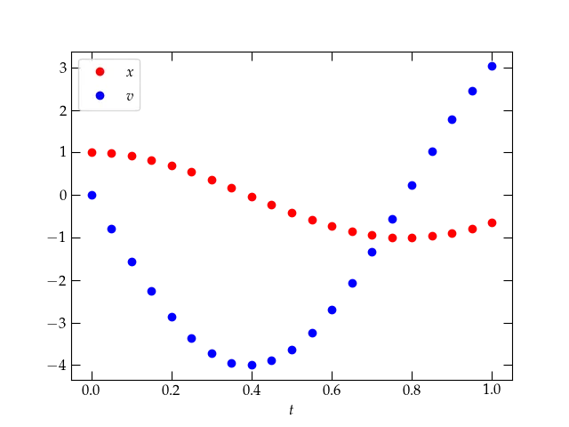
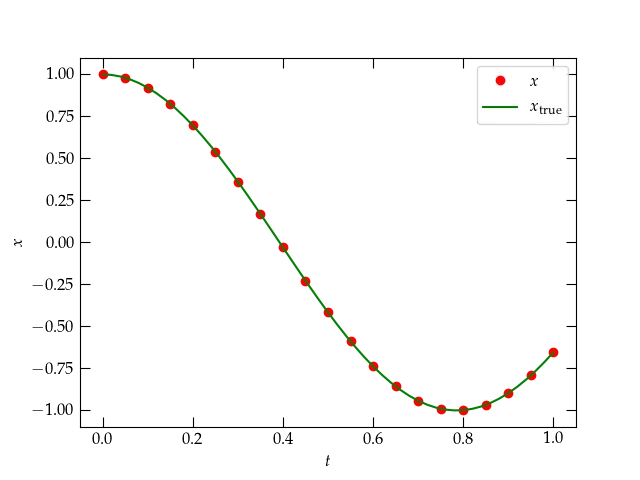
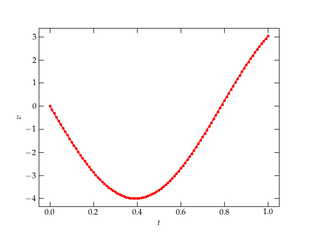
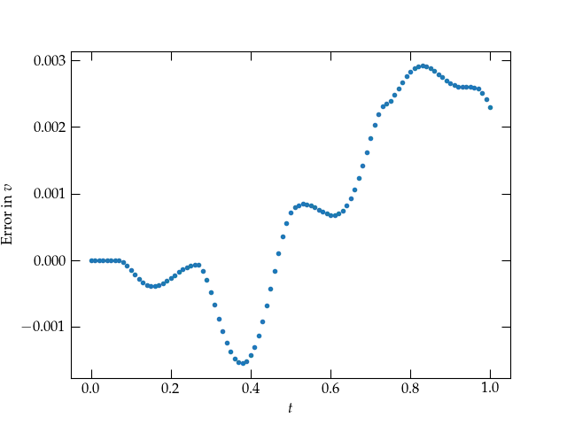

{:menu DE}

# Solving Second-Order ODEs Numerically

* toc
{:toc}

We have seen how to solve first-order differential equations of the form

\begin{equation}
  \frac{d v}{d t} = f(v) \qquad\text{or}\qquad \frac{d x}{d t} = g(x)
  \label{eq:firstorder}
\end{equation}

However, Newton’s equations of motion (in one dimension) are typically *second-order*
differential equations of the form $$ m \frac{d^2 x}{dt^2} = F(x, v, t) $$ where
$$v = dx/dt$$ and $$F$$ is some function of the position, velocity, and time. We have seen how
we can use Euler’s method to develop an approximate numerical solution to a **first-order**
equation, where we use the fact that we know the function that computes the derivative,
and we can use small but finite steps to estimate the true solution. We have also seen
that nifty functions like `solve_ivp` can use higher-order numerical methods to compute
more accurate solutions **to first-order equations** without having to take really tiny
steps. Wouldn’t it be nice if we could somehow take advantage of these tools to solve
second-order differential equations?

## The Secret

As it turns out, we can leverage all we have learned to handle a second-order
equation! The trick is to use twice as many first-order equations. Let’s see how
that can work using a particularly simple example. Suppose we wish to solve

\begin{equation}
  m\ddot{x} = - k x
\end{equation}

which describes a particle of mass $$m$$ subject to a restoring force that grows linearly with
displacement from $$x = 0$$. (Remember that the dots signify derivatives with respect to time.)

If we use more conventional notation, in which $$\dot{x} = v$$ and $$\ddot{x} =
\dot{v}$$, we could write

\begin{align}
  \dot{v} &= - \frac{k}{m} x \\\
  \dot{x} &= v
\end{align}

each of which is a **first-order equation**. That is, by introducing as a new
variable the first-derivative of position with respect to time ($$v$$), we can
break apart the single second-order equation into **two coupled first-order
equations**.

Let’s say that again. To solve a second-order differential equation of the form

\begin{equation}
  \ddot{x} = f(x, \dot{x}, t)
\end{equation}

use **two** dependent variables, $$x$$ and $$v$$, to write the coupled equations

\begin{equation}
  \left[
  \begin{array}
    \dot{x}
    \\\
    \dot{v}
 \end{array}
 \right]
 =
  \left[ \begin{array}\ v \\\ f(x, v, t) \end{array} \right]
\end{equation}

then we can use Euler’s method—or the better methods of `solve_ivp` —to solve
**simultaneously** for $$x(t)$$ and $$v(t)$$. Recall that the call signature of
`solve_ivp` is `solve_ivp(deriv_func, time_range, initial_values, ...)`.
Fortunately, the `deriv_func` can return an array of derivatives, and the
`initial_values` can be a corresponding array of the initial values of the
coordinates. Let’s see how the example plays out.

~~~ python
# First prepare the notebook by loading the necessary modules
%matplotlib notebook
import numpy as np
import matplotlib.pyplot as plt
from scipy.integrate import solve_ivp
~~~

We have to define a function that computes the vector of derivatives at time $$t$$
and a vector of the coordinates, $$X = [x, v]$$. We can list the coordinates in
any order we like, as long as use the same order for the derivatives, $$[\dot{x},
\dot{v}]$$.

~~~ python
def SHOderivs(t, X, k, m):
    """
    Compute the derivatives of a simple harmonic oscillator of mass m and spring constant k
    where the dependent variable X holds [x, v].
    """
    x, v = X # we use x = X[0] and v = X[1]
    # the derivative dx/dt = v, and
    # the derivative dv/dt = -k/m * x
    # we have to return the derivatives in the same order as the coordinates
    # were delivered in X
    derivs = np.array([v, -k/m * x])
    return derivs
~~~

Note again that this function receives the coordinates [x, v] in a list (array)
in the variable `X`, so it returns the derivates [v, a]. We can now integrate
the differential equation for the time range $$0 \le t \le 1$$, starting with
$$x(0) = 1$$ and $$v(0) = 0$$.

~~~ python
res = solve_ivp(SHOderivs, [0, 1], [1.0, 0.0],
t_eval=np.linspace(0, 1, 21), args=(4, 0.25))
res

message: 'The solver successfully reached the end of the integration interval.'
nfev: 56
njev: 0
nlu: 0
sol: None
status: 0
success: True
t: array([0.  , 0.05, 0.1 , 0.15, 0.2 , 0.25, 0.3 , 0.35, 0.4 , 0.45, 0.5 ,
0.55, 0.6 , 0.65, 0.7 , 0.75, 0.8 , 0.85, 0.9 , 0.95, 1.  ])
t_events: None
y: array([[ 1.        ,  0.98006663,  0.92107572,  0.825395  ,  0.6967433 ,
0.54024223,  0.36225911,  0.16986033, -0.02929309, -0.22738616,
-0.41646995, -0.58889897, -0.73787313, -0.85727112, -0.94240378,
-0.9900373 , -0.99845565, -0.96702272, -0.89675673, -0.79050156,
-0.65289549],
[ 0.        , -0.79467787, -1.55781879, -2.25895497, -2.86969046,
-3.36596441, -3.72862823, -3.94317039, -3.99972153, -3.89581286,
-3.63647339, -3.23315991, -2.7011724 , -2.06107624, -1.33812055,
-0.56208386,  0.23632515,  1.02504019,  1.77273867,  2.45002813,
3.0295073 ]])
y_events: None
~~~

Looking at the output of `solve_ivp`, we see that the array returned as `y` is
now two-dimensional, since our coordinate “vector” consists of X = [x, v]. Let&rsquo;s
make a plot of the solution.

~~~ python
fig, ax = plt.subplots()
t = res.t
x = res.y[0,:]
v = res.y[1,:]
ax.plot(t, x, 'ro', label="$$x$$")
ax.plot(t, v, 'bo', label="$$v$$")
ax.legend()
ax.set_xlabel('$$t$$');
~~~

  

The solution to Eq. (2) provided by `solve_ivp`.

This plot looks very promising. It looks like the start of an oscillation, which
you might expect for a mass suspended from a spring. After all, the differential
equation we’re solving is

\begin{equation}
  \frac{d^2 x}{dt^2} = - \frac{k}{m} x
\end{equation}

which simplifes to

\begin{equation}
  \frac{d^2 x}{dt^2} = - 16 x
\end{equation}

for the particular values of $$k = 4$$ and $$m = 1/4$$ that we used in our
solution. As you can readily verify, the function

\begin{equation}
  x = \cos(4t)
\end{equation}

solves this equation. Furthermore, its derivative vanishes at $$t = 0$$, as we
require. Let’s add this function to the plot to see how the numerical solution
is doing.

~~~ python
fig, ax = plt.subplots()
t = res.t
x = res.y[0,:]
ax.plot(t, x, 'ro', label="$$x$$")
tvals = np.linspace(0, 1, 51)
xvals = np.cos(4 * tvals)
ax.plot(tvals, xvals, 'g-', label=r"$$x_{\mathrm{true}}$$")
ax.legend()
ax.set_xlabel('$$t$$')
ax.set_ylabel('$$x$$');
~~~

  

### Exercise

That agreement between the theoretical curve and the numerical solution looks very good, but we
expect that there will be some errors in the numerical solution. Make a plot of the errors for
both $$x$$ and $$v$$. How small do you have to make `rtol` to produce an “acceptable” level of error,
in your opinion?

## Smooth output

So far, we have asked `solve_ivp` to produce a solution at specific values of
the **independent** variable $$t$$, which we specify by the keyword parameter
`t_eval` set to a list or array of values. It can be useful, however, not to
have to specify the particular values at the start, but to have `solve_ivp`
return a smooth function. We can manage this by asking for
`dense_output=True`. Let’s see how this works.

~~~ python
res = solve_ivp(SHOderivs, [0, 1], [1.0, 0.0], dense_output=True, args=(4, 0.25))
res

    message: 'The solver successfully reached the end of the integration interval.'
    nfev: 56
    njev: 0
    nlu: 0
    sol: <scipy.integrate._ivp.common.OdeSolution object at 0x137e455e0>
    status: 0
    success: True
    t: array([0.00000000e+00, 6.24375624e-05, 6.86813187e-04, 6.93056943e-03,
        6.93681319e-02, 2.63647530e-01, 5.07499921e-01, 7.37486428e-01,
        9.86950372e-01, 1.00000000e+00])
    t_events: None
    y: array([[ 1.00000000e+00,  9.99999969e-01,  9.99996226e-01,
    9.99615762e-01,  9.61750781e-01,  4.93512971e-01,
    -4.43557322e-01, -9.81750147e-01, -6.91522218e-01,
    -6.52895491e-01],
        [ 0.00000000e+00, -9.99000989e-04, -1.09889972e-02,
    -1.10874908e-01, -1.09570295e+00, -3.47885073e+00,
    -3.58484295e+00, -7.59559602e-01,  2.88912221e+00,
    3.02950730e+00]])
    y_events: None
~~~

Notice that the output now includes an `OdeSolution` object in `res.sol`. We can
use it to evaluate the solution at a point in time within the range we have
simulated as follows:

~~~ python
res.sol(0.5)

array([-0.41646995, -3.63647339])
~~~

The solution returns an array (vector) of values of the dependent variables $$[x,
v]$$. Here&rsquo;s how we can use the solution to make a nice smooth plot of the
results. We’ll plot the velocity:

~~~ python
tvals = np.linspace(0, 1, 101)
Xvals = res.sol(tvals)
fig, ax = plt.subplots()
ax.plot(tvals, Xvals[1,:], 'r.-', label=r'$$v$$')
ax.set_xlabel('$$t$$')
ax.set_ylabel('$$v$$');
~~~

  

Let’s see what the error in the velocity looks like:

~~~ python
errors = Xvals[1,:] + 4 * np.sin(tvals * 4)
fig, ax = plt.subplots()
ax.plot(tvals, errors, '.')
ax.set_xlabel('$$t$$')
ax.set_ylabel('Error in $$v$$');
~~~

  

## Practice

Now, choose a (set of) differential equation(s) to integrate and write a
function that takes in a vector of coordinates and returns the derivatives of
those coordinates. Suggestions for systems you could use:

1. A simple harmonic oscillator: $$\ddot{x} = -\frac{k}{m} x$$ for which the
    analytic solution is $$x(t) = x_0 \cos\omega t + \frac{v_0}{\omega}
    \sin\omega t$$ where $$\omega = \sqrt{k/m}$$. Use coordinates $$[x, v]$$, and the
    derivatives $$[v, -\omega^2 x]$$.
2. A damped simple harmonic oscillator: $$\ddot{x} = -\frac{k}{m} x - \frac{b}{m}
    \dot{x}$$, which has analytic solution
    $$x(t) = \left(x_0 \cos \omega_1 t + \frac{v_0 + \beta x_0}{\omega_1} \sin\omega_1 t\right) e^{-\beta t}$$
    for $$\beta = 2b/m$$, $$\omega_0 = \sqrt{k/m}$$, and $$\omega_1 = \sqrt{\omega_0^2 -
    \beta^2}$$. Use coordinates $$[x, v]$$, and the derivatives $$[v, -\omega_0^2 x -
    \beta v]$$ for $$\omega_0 = \sqrt{k/m}$$.

3. A projectile subject to linear drag:
    $$ \ddot{x} = -g - \frac{b}{m} \dot{x} $$
    which has the solution
    $$ x(t) = x_0 - v_T\left(t + \frac{e^{-\beta t}}{\beta} \right) + \frac{v_0}{\beta}(1 - e^{-\beta t}) $$
    where $$\beta = b/m$$ and the terminal velocity is $$v_T = m g / b = g / \beta$$.
    Use coordinates $$[x, v]$$ and the derivatives $$[v, -g - \frac{b}{m} v]$$.

4. A planet subject to the Sun’s gravitational pull, $$[r, \dot{r}, \theta,
       \dot{\theta}]$$, and you figure out the derivatives. Recommendation: use
    A.U. for distances and years for times. Hints: $$GM = 4\pi^2$$ in these units,
    and you can take advantage of the fact that an inverse square force law
    produces closed orbits. You might want to use `plt.polar(θ, r)` to make polar
    plots of the trajectories.

Then call `solve_ivp` with your function and see how well it does. Investigate
how the error depends on the method and/or the tolerances (`rtol` or
`atol`). Use a log-log plot for the absolute value of the error.

## Generalizing to multiple variables

The step to handling more than one variable is now very small. For each second
derivative, we use two variables, one for the coordinate and one for its first
derivative, to get the coupled equations

\begin{equation}
  \left[
    \begin{array}
      \dot{x}_1 \\\ \dot{v}_1 \\\ \dot{x}_2 \\\ \dot{v}_2
    \end{array}
  \right]
  =
  \left[
  \begin{array}\
      v_1 \\\ \ddot{x}_1 = f_1(t, x_1, v_1, x_2, v_2)
      \\\ v_2 \\\ \ddot{x}_2 = f_2(t, x_1, v_1, x_2, v_2)
    \end{array}
  \right]
\end{equation}

Then we pack all these **dependent variables** in a single array `Y` and supply a
function that computes each one’s derivatives like so:

~~~ python
def bigderivs(t, Y, *other_parameters):
    x1, v1, x2, v2 = Y # break apart the individual variables, for convenience
    a1 = ...           # compute the acceleration of coordinate 1
    a2 = ...           # compute the acceleration of coordinate 2
    return np.array([v1, a1, v2, a2]) # return the vector of derivatives
~~~

The argument `*other_parameters` is a list of any additional parameters that our
function may require to evaluate the derivatives. When you precede a variable
name with an asterisk, it means that the variable holds a (possibly empty)
list. (When you precede a variable name with a double asterisk, the variable
holds a dictionary of key-value pairs. It’s the way optional keyword arguments
may be passed to a function.)

### Exercise

A conical pendulum is a point mass suspended by a rigid rod that is held fixed
at a frictionless pivot. Before we attempt a general solution for arbitrarily
large angles with respect to the vertical, we could attempt a solution valid for
small angles. Let’s use a cartesian coordinate system with $$z$$ pointing up, so
the $$x$$-$$y$$ plane is horizontal. For a pendulum of length $$\ell$$, it is possible
to show that in the case of small displacements from equilibrium, the
accelerations in the $$x$$ and $$y$$ directions are given by

\begin{align}
  \ddot{x} &= -\frac{g}{\ell} x \\\
  \ddot{y} &= -\frac{g}{\ell} y
\end{align}

Write a function that computes the derivatives for such a conical pendulum in
the small-amplitude limit and investigate the behavior of the solution for
different initial conditions.

* Does your solution produce closed figures in the $$x$$-$$y$$ plane?
* Can you think of a way to check whether energy is conserved? Try ignoring any
    velocity along the $$z$$ axis, as a first approximation, and consider
    gravitational potential energy and kinetic energy.
* For this system, the angular momentum around the $$z$$ axis should be
    the mass of the bob times the quantity $$x \dot{y} - y \dot{x}$$. Is it in fact
    conserved?

### Extension to Large Angles Using Lagrangian Mechanics

To handle angles that are not small, it is more convenient to use spherical
polar angles $$\theta$$ and $$\phi$$ and to employ Lagrangian mechanics, which develops the equations of motion
from energy, rather than forces. We will discuss this approach soon in more detail, as it can
be very helpful for certain projects. In the meantime, the
summary is the following:

1. Pick generalized coordinates $$q_i$$ that uniquely identify the configuration of the system. These
may be Cartesian, but may also be angles or other convenient quantities.
2. Compute the potential energy $$U$$ in terms of the $$q_i$$.
3. Compute the kinetic energy $$T$$ in terms of the $$q_i$$ and their time derivatives, $$\dot{q}_i$$.
4. Form the lagrangian $$L = T-U$$, which is a function of the $$q_i$$ and $$\dot{q}_i$$.
5. Use the Euler-Lagrange equations,
\begin{equation}
  \dv{}{t}\left[ \pdv{L}{\dot{q}_i} \right] - \pdv{L}{q_i} = 0
\end{equation}
to find the equations of motion.

In this case, the potential energy is
\begin{equation}\label{eq:U}
  U = - m g \ell \cos\theta
\end{equation}
if we measure $$\theta$$ from the south pole and the kinetic energy is
\begin{equation}\label{eq:T}
  T = \frac12 m \ell^2 ( \dot{\theta}^2 + \sin^2\theta \dot{\phi}^2)
\end{equation}

After computing the lagrangian $$L = T-U$$ and applying the Euler-Lagrange equation
for $$\theta$$ and $$\phi$$, we get the following equations of motion:
\begin{align}
  \ddot{\theta} &= \sin\theta \cos\theta \dot{\phi}^2 - \frac{g}{l} \sin\theta \label{eq:thd} \\\
  \ddot{\phi} &= - 2\frac{\dot{\phi}_0 \sin^2 \theta_0}{\sin^3 \theta} \cos\theta \; \dot{\theta} \label{eq:phid}
\end{align}

Use these dynamical equations and `solve_ivp` to compute trajectories in the projection of the pendulum's position in the $$xy$$ plane.
