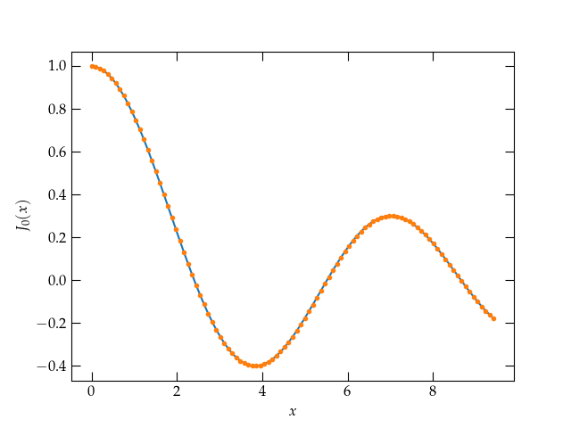

{:menu DE}
{::comment}menu-start{:/comment}

<label id="hamburger-menu"></label>

<ul>
<li><a href="DE-DEs.html">Ordinary Differential Equations</a></li>
<li><a href="DE-PDEs.html">Partial Differential Equations I</a></li>
<li><a href="DE-PDE-II.html">Partial Differential Equations II</a></li>
</ul>

{::comment}menu-end{:/comment}

# Ordinary Differential Equations

* toc
{:toc}

You have encountered a few ordinary differential equations (ODEs) in chemistry, mechanics, engineering, and especially in Math 82. This page will serve as a quick reminder of some basic linear ODEs that are especially important in physics and some approaches to solving them. 

### Singular Points

The most general second-order linear differential equation is
\\[
    y^{\prime\prime} + P(x) y' + Q(x) y = R(x)
\\]
The point $$x_0$$ is called a **regular point** of the ODE if each of $$P(x)$$ and $$Q(x)$$ has a convergent power series expansion in the neighborhood of $$x_0$$. A point for which this is not the case is called a **singular point**. A **regular singular point** is one for which both $$(x-x_0)P(x)$$ and $$(x-x_0)^2 Q(x)$$ have convergent power series in the neighborhood of $$x_0$$. The method of Frobenius, which is outlined below, can be applied in the neighborhood of regular singular points; other singular points require more complicated techniques.

Some of the most important ODEs in physics include

<table class="nicetable" style="width: 600px;">
  <tr>
    <th>Equation</th><th>Form</th><th>Singular points</th>
  </tr>
  <tr class="sep">
    <td>Damped SHO</td><td>$$y^{\prime\prime} + \beta y' + \omega_0^2 y = F(x)$$</td><td> — </td>
  </tr>
  <tr>
    <td>Equidimensional equation</td>
    <td>$$y^{\prime\prime} + \frac1x y' + \frac{1}{x^2} y = 0$$</td>
    <td> — </td>
  </tr>
  <tr>
    <td>Legendre's equation</td>
    <td>$$(1-x^2)y^{\prime\prime} - 2 x y' + \ell(\ell+1) y = 0$$</td>
    <td>$$\text{regular @ }x = \pm 1$$</td>
  </tr>
  <tr>
    <td>Bessel's equation</td>
    <td>$$x^2 y^{\prime\prime} + x y' + (x^2 - n^2) y = 0$$</td>
    <td>$$\text{regular @ }x = 0$$</td>
  </tr>
  <tr>
    <td>Generalized Laguerre equation</td>
    <td>$$ x y^{\prime\prime} + (\alpha + 1 - x)y' + ny = 0$$</td>
    <td>$$\text{regular @ } x = 0$$</td>
  </tr>
</table>

## Using the ODE to Characterize its Solutions

As a simple example, consider the differential equation
\\[
    y^{\prime\prime} + y = 0
\\]
This is a second-order linear differential equation with constant coefficients. It has two linearly independent solutions; you already know that the solutions are $$\sin x$$ and $$\cos x$$. But, suppose that you don't. Can we use the differential equation itself to derive the properties of the solutions.

With tongue in cheek, let us call the two solutions $$s(x)$$ and $$c(x)$$, with $$s(0) = 0$$, $$s'(0) = 1$$, $$c(0)=1$$, and $$c'(0) = 0$$, and note that the general solution must take the form
\\[
    y(x) = A c(x) + B s(x)
\\]
Consider the derivative $$y'$$. If we differentiate the original differential equation, we get
\\[
    y^{\prime\prime\prime} + y' = 0
\\]
which means that $$y'$$ is also a solution to the original differential equation. Therefore, $$y'$$ may be expressed as a linear combination of the eigenfunctions $$c(x)$$ and $$s(x)$$. So, for example,
\\[
    s'(x) = \alpha c(x) + \beta s(x)
\\]
Since we have assumed $$s'(0) = 1$$, $$\alpha = 1$$, and $$\beta$$ is as yet undetermined. Differentiating again,
\\[
    s^{\prime\prime}(x) = c'(x) + \beta s'(x) = -s(x)
\\]
At $$x = 0$$, this implies $$0 = 0 + \beta 1$$. Therefore, $$\beta = 0$$ and we have determined that
\\[
    s'(x) = c(x)
\\]
The same reasoning starting with $$c'(x) = A c(x) + B s(x)$$ and applying it at $$x = 0$$ gives
\\[
    c'(0) = 0 = A + 0 B \qquad\longrightarrow\qquad A = 0
\\]
Differentiating again gives $$c''(x) = -c(x)$$, which at 0 yields
\\[
    c^{\prime\prime}(0) = -c(0) = -1 = B s'(0) = B 
    \qquad \longrightarrow\qquad c'(x) = -s(x)
\\]
We can also establish that $$c^2(x) + s^2(x) = 1$$, which is true at $$x = 0$$, by differentiating:
\\[
    2 c c' + 2 s s' = 2 c(x) [-s(x)] + 2 s(x) c(x) = 0
\\]

## Wronskian

If we consider a more general second-order linear differential equation,
\\[
    y^{\prime\prime} = A(x) y'(x) + B(x) y(x)
\\]
The Wronskian of two functions is defined by $$W(f,g) = f g' - g f'$$. If each of $$f(x)$$ and $$g(x)$$ solves the differential equation, we can compute the derivative of the Wronskian,
\\[
    \dv{W}{x} = f' g' + f g^{\prime\prime} - (g' f' + g f^{\prime\prime}) = 
    f g^{\prime\prime} - g f^{\prime\prime}
\\]
Now we take advantage of the fact that each function solves the differential equation:
\begin{align}
  \dv{W}{x} &= f(x)[A(x) g'(x) + B(x)g(x)] - g(x)[A(x) f'(x) + B(x) f(x)]  \notag \\\ 
  &= A(x) [f(x) g'(x) - g(x) f'(x)] = A(x) W(x) \notag \\\ 
  \frac{1}{W} \dd{W} &= A(x)\dd{x} \notag \\\ 
  \ln W &= \int A(x)\dd{x} \qquad\longrightarrow\qquad
  W(x) = c \exp\qty[\int A(x)\dd{x}]
  \notag
\end{align}
Using this expression and knowledge of one of the two solutions, we can generate a first-order equation to yield the other solution.
   
## Method of Frobenius

The method of Frobenius is to way of developing series solutions to differential equations that aren't "too bad"—meaning that any singular points are regular. The method is quite simple. We assume a (Frobenius) series solution of the form
\\[
    y(x) = \sum_{k=0}^{\infty} a_k x^{k+s}
\\]
which is a generalization of a Taylor series that includes the possibility of negative or nonintegral powers, and substitute it into the differential equation. We then perform appropriate index shifts to group all terms to the same power of $$x$$. For a homogeneous ODE, each of these must be zero.

To illustrate, let's apply the method to Bessel's equation,
\begin{equation}\label{eq:Bessel}
  x^2 y^{\prime\prime} + x y' + (x^2 - n^2) y = 0
\end{equation}
See [the page on Bessel's equation](DE-Bessel.md) for some background on why this equation arises in physical problems.

Substituting the Frobenius series into this equation gives
\begin{align}
    x^2 \sum_{k=0}^\infty (k+s)(k+s-1)a_k x^{k+s-2} +
    x \sum_{k=0}^\infty (k+s) a_k x^{k+s-1} +
    \sum_{k=0}^\infty (x^2 - n^2) a_k x^{k+s} &= 0 \notag \\\ 
    \sum_{k=0}^\infty [(k+s)(k+s-1) + (k+s) - n^2 ] a_k x^{k+s}
    + \sum_{k=0}^\infty a_k x^{k+s+2}
    &= 0 \notag \\\ 
    x^s \qty\{\sum_{l=0}^\infty [(s+l)^2 - n^2] a_l x^l +
    \sum_{l=2}^\infty a_{l-2} x^l \} &= 0
\end{align}
There is only one term in the sums with $$l = 0$$. Although we could choose $$a_0 = 0$$, but that would just shift the start of the series (effectively shifting $$s$$). So, if $$a_0 \ne 0$$, then we must have for $$l = 0$$ that
\\[
    s^2 = n^2 \qquad\longrightarrow\qquad s = \pm n
\\]
Taking $$a_0 = 1$$, the next required relationship between coefficients happens for $$l = 2$$. Combining the series for $$l \ge 2$$, we have
\\[
    a_0 + \sum_{l=2}^\infty \qty[(l^2 \pm 2 n l)a_l + a_{l-2} ] x^l
\\]
Therefore,
\\[
    a_l = - \frac{a_{l-2}}{l(l \pm 2n)}
\\]
Let's use this recursion relation to solve for $$J_0(x)$$, the zeroth-order Bessel function of the first kind for $$n = 0$$.
\begin{align}
  a_2 &= - \frac{1}{2^2}  \notag \\\ 
  a_4 &= - \frac{a_2}{4^2} = \frac{1}{(2 \cdot 4)^2} \notag \\\ 
  a_{2k} &= (-1)^k \frac{1}{2^{2k}} \qty(\frac{1}{k!})^2 \notag
\end{align}
which we can combine to form
\\[
    J_0(x) = 1 - \qty(\frac{x}{2})^2 + \frac{1}{(2!)^2} \qty(\frac{x}{2})^4 - \frac{1}{(3!)^2} \qty(\frac{x}{2})^6 + \cdots
\\]

What does this look like?

~~~~ python
def myJ0(x, n_max=16):
    j0, y = 1, (x/2)**2
    a, yn = 1, 1
    for n in range(1, n_max+1):
        a /= -(n*n)
        yn *= y
        j0 += a * yn
    return j0

fig, ax = plt.subplots()
x = np.pi * np.linspace(0, 3, 101)
y = myJ0(x)
ax.plot(x, y)

# Now let's add the scipy version
from scipy.special import jv
j0 = jv(0, x)
ax.plot(x, j0, '.')
ax.set_xlabel("$x$")
ax.set_ylabel(r"$J_0(x)$");
~~~~

  

The behavior of $$J_0(x)$$ for small $$x$$ computed via `myJ0` (smooth curve) and `scipy.special.jv` (dots).

