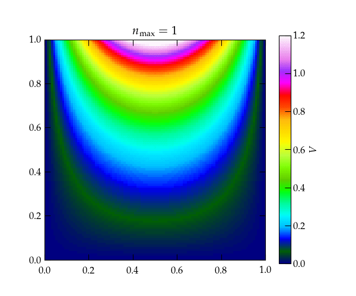

{:menu DE}
{::comment}menu-start{:/comment}

<label id="hamburger-menu"></label>

<ul>
<li><a href="DE-DEs.html">Ordinary Differential Equations</a></li>
<li><a href="DE-PDEs.html">Partial Differential Equations I</a></li>
<li><a href="DE-PDE-II.html">Partial Differential Equations II</a></li>
</ul>

{::comment}menu-end{:/comment}

# Partial Differential Equations II

* toc
{:toc}

## Laplace's Equation

Laplace’s equation
\begin{equation}\label{eq:Laplace}
  \laplacian V = \pdv[2]{V}{x} + \pdv[2]{V}{y} + \pdv[2]{V}{z} = 0
\end{equation}
describes the electrostatic potential $$V$$ in a charge-free region of space. It also describes the steady-state temperature distribution in a region of space that lacks sources or sinks (if we substitute $$T$$ for $$V$$). If that region has rectangular boundaries, then the natural approach to solving it is to look for separated-variable solutions of the form
\\[
    V = X(x) Y(y) Z(z)
\\]
which leads to
\\[
    X^{\prime\prime}(x) Y(y) Z(z) + X(x) Y^{\prime\prime}(y) Z(z) +
    X(x) Y(y) Z^{\prime\prime}(z) = 0
\\]
Dividing by $$X(x)Y(y)Z(z)$$ yields
\\[
    \frac{X^{\prime\prime}(x)}{X(x)} + 
    \frac{Y^{\prime\prime}(y)}{Y(y)} +
    \frac{Z^{\prime\prime}(z)}{Z(z)} = 0
\\]
which is the sum of three functions of a single variable. For this to work each of these terms must separately equal a constant. Boundary conditions impose constraints on the allowed constants. 

For simplicity, let's consider a two-dimensional example in which a square region of side $$L$$ has three sides held at $$V = 0$$ and the side at $$y = L$$ held at $$V = 1$$:
\begin{align}
  V_{xx} + V_{yy} &= 0 \notag \\\ 
  V(0, y) = V(L, y) &= 0  \notag \\\ 
  V(x, 0) &= 0 \notag \\\ 
  V(x, L) &= 1 \notag
\end{align}

  

A square region of space in which three of the walls are held at $$V=0$$, while the back wall is held at $$V = 1$$.

To satisfy boundary conditions at $$x = 0$$ and $$x = L$$, we must have
\\[
    X(x) = \sin \qty(\frac{n \pi x}{L})
\\]
so that $$X^{\prime\prime}/X = - (n \pi /L)^2$$. Therefore, the equation for $$Y(y)$$ must be 
\\[
    \frac{Y^{\prime\prime}}{Y} = \qty(\frac{n\pi}{L})^2
    \qquad\longrightarrow\qquad
    Y(y) = a e^{n \pi y/L} + b e^{-n \pi y/L}
\\]
We need to find the right combination of $$a$$ and $$b$$ to make $$Y(0) = 0$$, which means that we need $$a = -b$$. I will take $$a = \frac12$$, so that
\\[
    Y(y) = \frac{e^{n \pi y/L} - e^{-n \pi y/L}}{2} = \sinh\qty(\frac{n \pi y}{L})
\\]
To satisfy the boundary condition on the back wall, we need to superpose solutions for different values of $$n$$ and use the orthogonality of the eigenfunctions:
\\[
    V(x,y) = \sum_{n = 1}^{\infty} c_n \sin\qty(\frac{n\pi x}{L})
    \sinh\qty(\frac{n\pi y}{L})
\\]
At the back wall
\\[
    1 = \sum_{n=1}^{\infty} c_n \sin\qty(\frac{n\pi x}{L})
    \sinh(n\pi)
\\]
Multiplying both sides by $$\sin(m \pi x/L)$$ and integrating from 0 to $$L$$ gives
\begin{align}
    \int_0^L \sin(m \pi x/L)\dd{x} &= c_m \frac{L}{2} \sinh(m\pi) \notag \\\ 
    -\frac{L}{m \pi} \left. \cos(m\pi x/L) \right|_0^L &= c_m \frac{L}{2} \sinh(m\pi) \notag \\\ 
    c_m &= \frac{2}{m\pi \sinh(m\pi)} \qty(1 - \cos(m\pi)) \notag
\end{align}
Hence, the solution for the potential inside the square region is
\begin{equation}\label{eq:Lapl2}
  \boxed{
    V(x,y) = \sum\_{n\text{ odd}} \frac{4}{n\pi\sinh(n\pi)} \sin\qty(\frac{n \pi x}{L}) \sinh\qty(\frac{n\pi y}{L})
  }
\end{equation}

  

Heat map showing the convergence of the solution shown in Eq. (\ref{eq:Lapl2}) for the first several terms in the series. Note that because the hyperbolic sine grows large very rapidly, the successive terms after the first few serve only to impace the very top of the figure, right next to the wall that is held at $$V = 1$$. 

Here's some code to generate the successive plots.

~~~~ python
def Lapl2d(nmax):
    x = np.linspace(0, 1, 101)
    y = np.linspace(0, 1, 101)
    V = np.zeros((len(y), len(x)))
    for n in range(1, nmax+1, 2):
        npi = n * np.pi
        c = 4 / (npi * np.sinh(npi))
        a, b = np.sin(npi * x), np.sinh(npi*y)
        V += c*np.tensordot(b, a, axes=0)

    fig = plt.figure()
    im = plt.imshow(V, cmap='gist_ncar', origin='lower', extent=(0,1,0,1),vmin=0, vmax=1.2)
    fig.colorbar(im, label="$V$")
    fig.axes[0].set_title(r"$n_{\rm max} = %d$" % nmax)
~~~~

## Solving Laplace's Equation in a Circular Region

If the region in which you seek to solve Laplace's equation is not rectangular but circular, it will make sense to return to the definition of the laplacian and express this operator in terms of polar coordinates. Since the laplacian is the divergence of the gradient, we need to work out (or look up) expressions for these operators in polar coordinates.

The gradient is straightforward:
\\[
    \grad V = \pdv{V}{r} \vu{r} + \frac1r \pdv{V}{\theta} \vu*{\theta}
\\]
To figure out the divergence, recall that it is defined as the ratio of the flux out of the "volume" divided by the volume as the volume goes to zero. In the 2-D case, volume is replaced by area, which is $$\dd{A} = r\dd{\theta} \dd{r}$$. As illustrated in the figure below, the net flux of vector field $$\vb{A}$$ out of the area is
\\[
    A_r(r+\dd{r}, \theta) (r+\dd{r}) \dd{\theta} - A_r(r,\theta) r\dd{\theta} 
    + A_\theta(r, \theta + \dd{\theta}) \dd{r} - A_\theta(r,\theta) \dd{r}
\\]

  

A small area element in polar coordinates showing the flux of a vector field $$\vb{A}$$ into and out of the area element. 

Dividing by the area and taking the limit gives
\\[
    \div \vb{A} = \frac1r \pdv{(r A_r)}{r} + \frac1r \pdv{A_\theta} {\theta}
\\]
Hence, the laplacian in polar coordinates is
\begin{equation}\label{eq:LaplPolar}
  \boxed{
    \laplacian V = \frac1r \pdv{}{r}\qty(r \pdv{V}{r}) + \frac{1}{r^2} \pdv[2]{V}{\theta} =
    \pdv[2]{V}{r} + \frac{1}{r} \pdv{V}{r} + \frac{1}{r^2} \pdv[2]{V}{\theta}
    }
\end{equation}

To have a definite problem to work out, let us suppose that a circular region of radius $$a$$ is surrounded by electrodes that maintain the potential
\\[
    V(a, \theta) = \begin{cases}
      +1 & 0 < \theta < \pi \\\ 
      -1 & \pi < \theta < 2\pi
    \end{cases}
\\]
We seek the potential in the interior of the circle.

We look for a separated variable solution of the form $$V(r, \theta) = R(r)\Theta(\theta)$$ which we substitute into the expression for the laplacian to get
\\[
    R^{\prime\prime}(r) \Theta(\theta) +
    \frac1r R'(r)(r) \Theta(\theta) +
    \frac{1}{r^2} R(r) \Theta^{\prime\prime}(\theta) = 0
\\]
Dividing by $$\dd{A}$$ and multiplying by $$r^2$$ separates the variables to give
\\[
    \frac{r^2 R^{\prime\prime} + r R'}{R} + \frac{\Theta^{\prime\prime}}{\Theta} = 0
\\]
Since our domain includes the entire range of $$\theta$$, and since $$\theta = 0$$ corresponds to the same point as $$\theta = 2\pi$$, we must insist that $$\Theta(\theta)$$ have period $$2\pi$$. Hence,
\\[
    \Theta(\theta) = \alpha \cos n\theta + \beta \sin n\theta \qqtext{for $$n \in 0, 1, 2, \ldots$$}
\\]
(In some problems it may be more useful to use complex exponentials for the $$\theta$$ dependence.)

Given the angular dependence, the equation for the radial dependence becomes
\\[
    r^2 R^{\prime\prime} + r R' - n^2 R = 0
\\]
which is equidimensional.

If $$n = 0$$, on solution is to take $$R' = 0$$, so $$R = a_0$$. If $$R' = \rho$$ is not constant, we must solve
\\[
    r \rho' + \rho = 0  = \dv{(r \rho)}{r} \qqtext{$$\longrightarrow$$}
    r R' = a'\_0
    \qqtext{$$\longrightarrow$$}
    R = a'\_0 \ln r
\\]
When $$n > 0$$, we can look for a solution of the form $$R = r^k$$:
\\[
    r^2 k(k-1) r^{k-2} + r k r^{k-1} - n^2 r^k = 0
\\]
or
\\[
    r^k[k^2 - k + k - n^2] = 0 \qquad\longrightarrow\qquad
    k = \pm n
\\]
The potential may thus be represented by the series
\\[
    V(r, \theta) = a\_0 + a'\_0 \ln r + \sum_{n=1}^{\infty} (\alpha_n r^n + \beta_n r^{-n})(a_n \cos n\theta + b_n \sin n\theta)
\\]
Is we were solving in annular region, we would need to keep all terms, in principle. However, since our region of interest includes the origin, we must exclude the terms that diverge there. Hence, $$a'_0 = \beta_n = 0$$, and we are left with 
\\[
    V(r, \theta) = a_0  + \sum_{n=1}^{\infty} \qty(\frac{r}{a})^n (a_n \cos n\theta + b_n \sin n\theta)
\\]
after removing dimensions from the radial portion.
It remains to determine the unknown coefficients $$a_n$$ and $$b_n$$.  The potential on the boundary has odd symmetry (imagine the range of $$\theta$$ going from $$-\pi$$ to $$\pi$$), so all the $$a_n$$ vanish. Multiplying by $$\sin m\theta$$ and integrating from $$-\pi to \pi$$, we have
\\[
    \int_{-\pi}^{\pi} \mathrm{sign}\theta \sin m\theta \dd{\theta} = b_m \pi
\\]
The integral is
\\[
    2 \int_0^\pi \sin m\theta\dd{\theta} = -\frac{2}{m} \left. \cos m\theta \right|_0^\pi = \frac{2}{m}(1 - (-1)^m)
\\]
Hence,
\begin{equation}\label{eq:LaplRound}
  V(r,\theta) = \sum\_{n \text{ odd}} \frac{4}{n} \qty(\frac{r}{a})^n \sin n\theta
\end{equation}

