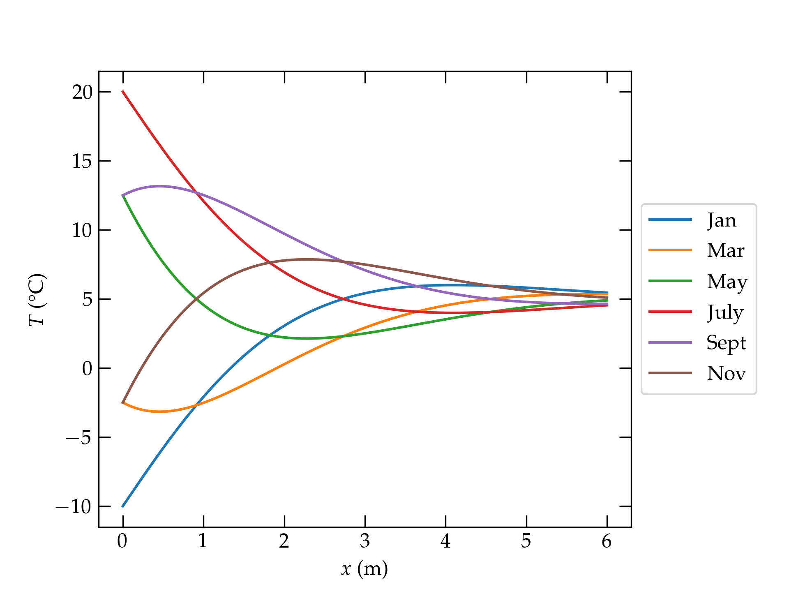

{:menu DE}
{::comment}menu-start{:/comment}

<label id="hamburger-menu"></label>

<ul>
<li><a href="DE-DEs.html">Ordinary Differential Equations</a></li>
<li><a href="DE-PDEs.html">Partial Differential Equations</a></li>
</ul>

{::comment}menu-end{:/comment}

# Partial Differential Equations

* toc
{:toc}

## Some Example Equations

You have already encountered several partial differential equations in your physics and engineering courses. Let's take a moment to remind ourselves:

+ By applying Newton's second law to a small segment of a taut, flexible string, we worked out
\\[
    \pdv[2]{y}{x} = \frac{\mu}{F} \pdv[2]{y}{t}
\\]
where $$y(x,t)$$ is the displacement of the string from its equilibrium position, $$\mu$$ is the mass per unit length of the string, and $$F$$ is the tension in the string. We saw that solutions took the form
\\[
    y(x,t) = f(x - vt) + g(x + vt)
\\]
where $$v = \sqrt{F/\mu}$$ is the wave speed and $$f$$ and $$g$$ are arbitrary functions.

+ Maxwell's equation for the electric field is
\\[
    \div\vb{E} = \begin{cases}
       \frac{\rho(\vb{r}, t)}{\epsilon_0} & \text{S.I.} \\\ 
       4\pi\rho(\vb{r}, t) & \text{gaussian}
    \end{cases}
\\]
which is a statement that charge generates a diverging electric field. If the charge distribution is independent of time, then we can define an electrostatic potential such that $$\vb{E} = -\grad V$$, which leads to **Poisson's equation** for the electric potential,
\\[
    \laplacian V(\vb{r}) =
    \pdv[2]{V}{x} + \pdv[2]{V}{y} + \pdv[2]{V}{z}
    = \begin{cases}
      -\rho(\vb{r}) / \epsilon_0 & \text{S.I.} \\\ 
      -4\pi\rho(\vb{r}) & \text{gaussian}
    \end{cases}
\\]
In a region of charge-free space, the potential satisfies **Laplace's equation**
\\[
    \laplacian V(\vb{r}) =
    \pdv[2]{V}{x} + \pdv[2]{V}{y} + \pdv[2]{V}{z}
    = 0
\\]
[I have written the laplacian in cartesian coordinates here, but the meaning of the laplacian is the divergence of the gradient, regardless of the coordinate system, and the expression in terms of coordinates is more complicated in cylindrical, spherical, and other curvilinear coordinate systems.]

+ The Schrödinger equation of quantum mechanics is
\\[
    -\frac{\hslash^2}{2m} \laplacian\Psi(\vb{r},t) + 
    V(\vb{r},t) \Psi(\vb{r}, t) = \frac{\hslash}{i} \pdv{\Psi(\vb{r},t)}{t}
\\]
which is second order in space and first order in time.

For our development, we will focus on an equation quite similar to the Schrödinger equation that describes heat flow. This equation was investigated by **Jean-Baptiste Joseph Fourier** in the early 1800s, after he returned from Napoleon's expedition to Egypt.

## The Heat Equation

Newton argued that heat flowed from a hot region to a cold region in proportion to the temperature difference between them. To keep the exposition as simple as possible, we consider a uniform cylindrical rod, whose surface is thermally insulated, and whose axis is aligned with the $$x$$ axis. In particular, focus on a small segment of the rod, as illustrated in Fig. 1.

  

Figure 1 — We consider a small segment of the insulated rod, with cross section $$A$$ and thickness $$\delta x$$.

The temperature inside this little chunk of the rod can change because it is being heated by an outside source (a flame?), or because more heat is flowing in from the left than out on the right. The relationship between energy change and temperature is
\\[
    \delta E = C \delta u
\\]
where $$C$$ is the **heat capacity** of the little chunk and $$u$$ is its temperature. The heat capacity is proportional to the amount of material in the chunk, so it is more common to express this relation in terms of the **specific heat capacity**, which is the heat capacity per unit volume of the material of the rod,
\\[
    \delta E = (c A \delta x) \delta u
\\]

The heat (thermal energy) flow into the segment through the face at $$x$$ is given by
\\[
    A J(x,t) = -A \kappa(x,t) \pdv{u}{x}
\\]
where $$u(x,t)$$ is the temperature of the rod and $$\kappa(x,t)$$ is thermal conductivity of the material of the rod, $$A$$ is the cross-sectional area of the rod, and $$J(x,t)$$ is the power per unit area flowing into the segment. Similarly, the heat flow out of the right face is
\\[
    A J(x+\delta x, t) = -A \kappa(x+\delta x,t) \pdv{u(x+\delta x, t)}{x}
\\]
Finally, the heat generated in the segment is $$G \delta t = g A \delta x \delta t$$, where $$g$$ is the power per unit volume deposited and $$\delta t$$ is the time over which the heat is deposited. Putting this all together, conservation of energy applied to the little segment gives
\begin{equation}\label{eq:heat-equation}
  \underbrace{c A \delta x \pdv{u}{t}}\_{\text{net power in}} = 
  \underbrace{g(x,t) A \delta x\vphantom{\pdv{u}{t}}}\_{\text{source power}} -
  \underbrace{\kappa(x,t) A \pdv{u(x,t)}{x}}\_{\text{heat flow in}} +
  \underbrace{\kappa(x+\delta x,t) A \pdv{u(x+\delta x, t)}{x}}\_{\text{heat flow out}}
\end{equation}
We can simplify this expression by dividing by $$A\delta x$$ and taking the limit as $$\delta x \to 0$$, which gives
\\[
  c \pdv{u}{t} = g + \pdv{}{x}\qty(\kappa \pdv{u}{x})
\\]
or, if we rearrange to put the differential terms on the left and the source term on the right, we have 
\begin{equation}\label{eq:heat-eq}
  \boxed{c \pdv{u}{t} - \pdv{}{x}\qty(\kappa \pdv{u}{x}) = g(x,t)}
\end{equation}
which is the **one-dimensional heat equation**. Had we been more adventurous and chosen to work in three honest dimensions, we would have gotten
\\[
    c\pdv{u}{t} - \div (\kappa \grad u) = g(\vb{r},t)
\\]

### Simplifications

It is typically reasonable to take the specific heat and thermal conductivity to be independent of temperature and position. If we make these simplifications, the one-dimensional heat equation becomes
\\[
    c u_t - \kappa u_{xx} = g
\\]
where the subscripts indicate partial differentiation.

In many situations, there is no source term in the body of the rod, which allows a further simplification to
\begin{equation}\label{eq:one-D}
    u_t = D u_{xx}
\end{equation}
where the **thermal diffusivity** $$D$$ is defined by $$D = \kappa/c$$.

### Dimensions

For clarity, let's work out the dimensions and S.I. units of the important quantities describing thermal behavior. Besides the usual dimensions of M, L, and T for mass, length, and time, we will need K for temperature.

<table class="nicetable">
  <tr>
    <th>Quantity</th><th>Symbol</th><th>Dimensions</th><th>S.I. Units</th>
  </tr>
  <tr class="sep">
    <td>temperature</td>
    <td>$$u$$</td>
    <td>K</td>
    <td>kelvin = K</td>
  </tr>
  <tr>
    <td>specific heat</td>
    <td>$$c$$</td>
    <td>$$\rm M L^{-1} T^{-2} K^{-1}$$</td>
    <td>$$\rm J \, m^{-3} \, K^{-1}$$</td>
  </tr>
  <tr>
    <td>thermal conductivity</td>
    <td>$$\kappa$$</td>
    <td>$$\rm M \, L \, T^{-3} \, K^{-1}$$</td>
    <td>$$\rm W \, m^{-1} \, K^{-1}$$</td>
  </tr>
  <tr>
    <td>thermal diffusivity</td>
    <td>$$D$$</td>
    <td>$$\rm L^{2} T^{-1}$$</td>
    <td>$$\rm m^{2} \, s^{-1}$$</td>
  </tr>
</table>

## First Look

As a first pass at learning how to solve Eq. (\ref{eq:one-D}), let us consider a uniform rod of length $$L$$ whose initial temperature is $$u = 1$$, and whose ends at $$x = 0$$ and $$x = L$$ are held at temperature 0. That is
\begin{align}
  \pdv{u}{t} &= D \pdv[2]{u}{x} \label{eq:DE} \\\ 
  u(x,0) &= 1 \\\ 
  u(0, t) &= 0 \\\ 
  u(L, t) &= 0
\end{align}

The basic strategy we will use relies on the fact that the differential equation we seek to solve is **linear**: the variable $$u$$ appears in each term to the first power (including in derivatives). A crucial consequence of this linearity is that we can superpose solutions; if $$f(x,t)$$ and $$g(x,t)$$ solve Eq. (\ref{eq:DE}), then so does $$c_1 f(x,t) + c_2 g(x,t)$$ for constants $$c_1$$ and $$c_2$$. This **principle of superposition** motivates the hope that we can find solutions of the separated-variable form 
\begin{equation}\label{eq:sepv}
    u(x,t) = X(x) T(t)
\end{equation}
which we can then superpose to match the initial and boundary conditions. In terms of Eq. (\ref{eq:sepv}), we have
\begin{align}
  \pdv{u}{t} &= X(x) T'(t) \\\ 
  \pdv[2]{u}{x} &= X^{\prime\prime}(x) T(t)
\end{align}
which we can substitute into Eq. (\ref{eq:DE}) to get
\\[
    X(x) T'(t) = D X^{\prime\prime}(x) T(t)
\\]
To make progress, divide both sides by $$D u = D X(x)T(t)$$ to get
\begin{equation}\label{eq:sepvar}
    \frac{1}{D} \frac{T'(t)}{T(t)} = \frac{X^{\prime\prime}(x)}{X(x)} = -k^2
\end{equation}
The left-hand side is a function of time, while the right-hand side is a function of position. The only way that these can be equal to each other is for each to be equal to a constant, which I will call $$-k^2$$. We can now solve separately the ordinary differential equations for $$T(t)$$ and $$X(x)$$, getting
\\[
    \dv{T}{t} = -k D T(t) 
    \qquad\longrightarrow\qquad
    T(t) = a e^{-k^2 D t}
\\]
for some constant $$a$$, and
\\[
    \dv[2]{X}{x} = -k^2 X(x)
    \qquad\longrightarrow\qquad
    X(x) = c_1 \sin k x + c_2 \cos k x
\\]
for constants $$c_j$$. 

The boundary conditions at $$x = 0$$ and $$x = L$$ require that $$X(0) = X(L) = 0$$, which requires that
\\[
    X_n(x) = c_n \sin \frac{n \pi x}{L}
\\]
for positive integer $$n$$, meaning that $$k = n\pi/L$$. The most general solution is then
\\[
    u(x,t) = \sum_{n=1}^{\infty} c_n \sin \frac{n\pi x}{L} e^{-n^2 \pi^2 D t/L^2}
\\]
To determine the coefficients $$c_n$$, we need to satisfy the initial condition:
\\[
    u(x,0) = \sum_{n=1}^{\infty} c_n \sin \frac{n\pi x}{L} = 1
\\]
As we learned in our study of [Fourier series](FO-FourierSeries.md), we can use the orthogonality of the eigenfunctions to solve for the coefficients $$c_n$$. Multiplying both sides by $$\sin m\pi x/L$$ and integrating from $$0$$ to $$L$$, we have
\\[
    c_m \frac{L}{2} = \int_0^L \sin m \pi x/L = \left.\frac{-\cos m\pi x/L}{m\pi/L}\right|_0^L = \frac{L}{m\pi}\qty(1 - \cos m\pi)
\\]
Hence,
\\[
    c_n = \begin{cases}
      \frac{4}{n\pi} & n\text{ odd} \\\ 
      0 & n\text{ even}
    \end{cases}
\\]
Therefore, the solution for the temperature as a function of time is
\begin{equation}\label{eq:solution}
  \boxed{
    u(x,t) = \sum\_{n=0}^\infty \frac{4}{(2n+1)\pi}
    \sin \frac{(2n+1)\pi x}{L} \exp[-(2n+1)^2 \pi^2 D t/L^2]
    }
\end{equation}

Let's make a plot to see if this has a chance of being credible.

~~~~ python
import numpy as np
import matplotlib.pyplot as plt

def PDE0(x, t, D=1, L=1, n_max=20):
    u = np.zeros(len(x))
    for n in range(n_max):
        m = 2 * n + 1
        u += 4/(np.pi * m) * np.sin(m*np.pi*x/L) * np.exp(-(m*np.pi/L)**2 * D * t)
    return u

fig, ax = plt.subplots()
x = np.linspace(0, 1, 201)
for t in (0, 0.01, 0.02, 0.05, 0.1, 0.2):
    ax.plot(x, PDE0(x, t, n_max=500), label=f"$t = {t}$")
plt.subplots_adjust(right=0.8)
ax.legend(loc='center left', bbox_to_anchor=(1,0.5))
ax.set_xlabel("$x/L$")
ax.set_ylabel("$u$");
~~~~

  

Plot of Eq. (\ref{eq:solution}) using the first 500 terms in the series and the values $$D=1$$ and $$L=1$$. Note that the solution at $$t = 0$$ shows the Gibbs phenomenon at the points of discontinuity at $$x = 0$$ and $$x = L$$. Note, as well, that the modes with higher spatial frequency (larger $$n$$) decay much more rapidly, so that by $$t = 0.05$$, the temperature distribution is dominated by the fundamental mode ($$\sin \pi x/L$$), which decays with a time constant $$\tau = L^2/(\pi^2 D) \approx 10$$.

The plot shows that the initially uniform temperature distribution, with the rod at $$u = 1$$, is rapidly altered near the ends of the rod, which are forced to be at zero temperature. Their influence gradually propagates inwards towards the center of the rod, which is always the point of maximum temperature. As time elapses, the shape of the temperature distribution converges to the shape of the fundamental spatial mode, $$\sin \pi x/L$$, which decays slowest. All-in-all, this solution seems to make good physical sense.

## Another Example

Let's alter the previous situation slightly. We'll continue to hold the left end of the rod at $$x = 0$$ at 0°C, but this time we will insulate the end at $$x = L$$ so that heat cannot flow in or out. Let's also suppose that the initial temperature distribution in the rod is linear. So, we take
\begin{align}
  u(0, t) &= 0 \\\ 
  u_x(L, t) &= 0 \\\ 
  u(x, 0) &= \frac{x}{L}
\end{align}

Since we solve the same differential equation, we already know the form of the separated-variable solutions: 
\\[
    \varphi_k(x,t) = X(x) T(t) = \sin k x \; e^{-k^2 D t}
\\]
where I have eliminated the cosine solutions because they are inconsistent with the boundary condition at $$x = 0$$.

To satisfy the boundary condition at $$x = L$$, we differentiate $$\varphi_k$$ with respect to $$x$$ and set the result to zero:
\\[
    \pdv{\varphi}{x} = k \cos kx \; e^{-k^2 D t} = 0 \qqtext{when $$x = L$$}
\\]
which requires that
\\[
    k_n = \qty(n+\frac12)\frac{\pi}{L} \qquad n = 0, 1, \ldots
\\]
I leave as an exercise the demonstration that the basis functions
\\[
    \varphi_n(x,0) = \sin \frac{(n+\frac12)\pi x}{L}
\\]
are indeed orthogonal on the interval $$[0, L]$$. We thus seek a series representation of the solution to the partial differential equation of the form
\\[
    u(x,t) = \sum_{n=0}^{\infty} b_n \sin \frac{(n+\frac12)\pi x}{L} 
    \exp\qty(-Dt \qty[\frac{(n+\frac12)\pi)}{L}]^2)
\\]

We now use the initial condition to determine the coefficients $$b_n$$:
\begin{align}
  \sum_{n=0}^{\infty} b_n \sin\frac{(n+\frac12)\pi x}{L}
  &= u(x,0)= \frac{x}{L}  \notag \\\ 
  b_m \frac{L}2 &= \int_0^L \frac{x}{L} \sin\frac{(m+\frac12)\pi x}{L} \dd{x}
   \\\ 
  b_m &= \frac{2}{L} \int_0^{(m+\frac12)\pi} \frac1L \qty[\frac{L}{(m+\frac12)\pi}]^2 y \sin y \dd{y}
\end{align}
We now integrate by parts
\begin{align}
    b_m &= \frac{2}{(m+\frac12)^2 \pi^2} 
    \qty[ \left.-y \cos y \right|_0^{(m+\frac12)\pi} + \int\_0^{(m+\frac12)\pi}
    \cos y\dd{y} ] \\\ 
    &= \frac{2}{(m+\frac12)^2 \pi^2} \sin\qty[\qty(m+\frac12)\pi] =
    \frac{2 (-1)^m}{(m+\frac12)^2 \pi^2} = \frac{8 (-1)^m}{(2m+1)^2 \pi^2}
\end{align}
Substituting into the expansion for $$u(x,t)$$, we have finally
\begin{equation}\label{eq:PDE2}
  \boxed{
    u(x,t) = \frac{8}{\pi^2} \sum\_{n=0}^{\infty}  \frac{(-1)^m}{(2 n+1)^2}
  \sin\qty[ \frac{(2n+1)\pi x}{2L}]
  \exp\qty(-Dt \qty[ \frac{(2n+1)\pi}{2L} ]^2 )
  }
\end{equation}

Let's take a look at this solution.

~~~~ python
def PDE1(x, t, D=1, L=1, n_max=100):
    m = np.arange(0.5, n_max, 1.0) * np.pi / L
    bn = 2 * np.power(-1, np.arange(0, n_max-0.5, 1.0)) / np.power(m,2)
    u = np.zeros(len(x))
    for n in range(len(m)):
        u += bn[n] * np.sin(m[n]*x) * np.exp(-t * D * m[n]**2)
    return u

fig, ax = plt.subplots()
x = np.linspace(0, 1, 201)
for t in (0, 0.01, 0.05, 0.2, 0.5, 1):
    ax.plot(x, PDE1(x, t, n_max=500), label=f"$t = {t}$")
plt.subplots_adjust(right=0.8)
ax.legend(loc='center left', bbox_to_anchor=(1,0.5))
ax.set_xlabel("$x/L$")
ax.set_ylabel("$u$");
~~~~

  

The temperature profile in an insulated rod whose left end is mantained at 0°C and whose right end is insulated, as developed in Eq. (\ref{eq:PDE2}).

## Temperature Variation Underground

The temperature of the soil varies over the course of a day-night cycle, and also with the change of the seasons. If the surface temperature oscillates in a sinusoidal fashion, what can we say about the temperature of the ground as a function of depth?

For simplicity, let us assume that the surface temperature varies as
\\[
    u(0, t) = u_0 + A \cos\omega t
\\]
where $$\omega$$ represents the angular frequency corresponding either to a period of 24 hours or 1 year. We will also pretend that the thermal conductivity and specific heat of the ground are approximately constant. Although the thermal diffusivity of soil depends on its moisture content, a value of $$D \approx 6 \times 10^{-7} \mathrm{m^2\,s^{-1}}$$ is reasonable.

The partial differential equation we must solve is still the same: $$u_t = D u_{xx}$$, for which we seek separated-variable solutions of the form $$u(x,t) = X(x)T(t)$$. For reasons that will become apparent below, it is handy to write the temperature at the surface as the real part of
\\[
    u(0, t) - u_0 = A e^{-i\omega t}
\\]
so that $$T(t) = A e^{-i\omega t}$$. Substituting in Eq. (\ref{eq:sepvar}) gives
\begin{align}
    \frac{1}{D} \frac{-i\omega A e^{-i\omega t}}{Ae^{-i\omega t}} &=
    \frac{X^{\prime\prime}(x)}{X(x)} \notag \\\ 
    \underbrace{-\frac{i\omega}{D}}_{k^2} X(x) &= X^{\prime\prime}(x) \notag
\end{align}
The solutions for $$X(x)$$ are $$e^{\pm k x}$$ where 
\\[
    k = \sqrt{\frac{-i \omega}{D}} = \sqrt{\frac{\omega}{D} e^{-i\pi/2}}
    = \sqrt{\frac{\omega}{D}} e^{-i \pi/4} = \sqrt{\frac{\omega}{2D}} (1 - i)
    = \beta (1 - i)
\\]
where $$\beta = \sqrt{\omega/2D} = \sqrt{\pi/\tau D}$$ for period $$\tau$$.
So, the full time-dependent solution is
\\[
    u(x,t) = \Re\qty[u_0 + e^{-i\omega t} \qty(c_1 e^{\beta x (1-i)}
    + c_2 e^{-\beta x(1-i)}) ]
\\]
The term proportional to $$c_1$$ grows in amplitude with increasing depth $$x$$, which is unphysical for this problem, so we must take $$c_1 = 0$$. Therefore, the solution for the temperature profile is
\begin{align}
  u(x,t) &= u_0 + A  e^{-\beta x} \cos \qty(\beta x - \omega t)\label{eq:Tprofile} \\\ 
  \beta &= \sqrt{\frac{\omega}{2D}} = \sqrt{\frac{\pi}{\tau D}}
\end{align}
where $$\tau$$ is the period of oscillation of the driving surface temperature. The shorter the period, the larger the value of $$\beta$$ and the more rapidly the surface variation dies out with depth. The daily variations in surface temperature barely penetrate into the ground, but the annual variations do.

  

Illustration of Eq. (\ref{eq:Tprofile}), which describes the temperature of the ground as a function of depth over the course of an annual temperature oscillation at the surface of amplitude 15°C, with an average of 5°C. Note: this does *not* attempt to describe facts “on” the ground in Claremont!

