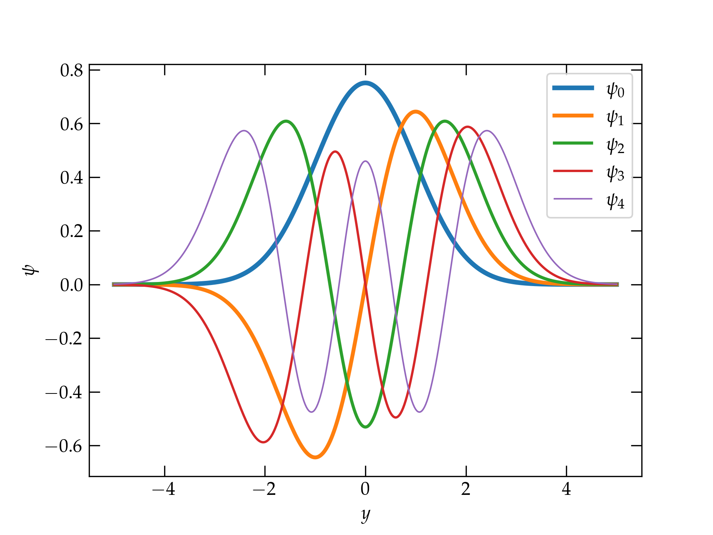

{:menu DE}
{::comment}menu-start{:/comment}

<label id="hamburger-menu"></label>

<ul>
<li><a href="DE-DEs.html">Ordinary Differential Equations I</a></li>
<li><a href="DE-DE-2.html">Ordinary Differential Equations II</a></li>
<li><a href="DE-SHO-analytic.html">The Quantum SHO, Analytic Treatment</a></li>
<li><a href="DE-SHO-numerical.html">The Quantum SHO, Numerical Treatment</a></li>
<li><a href="DE-PDEs.html">Partial Differential Equations I</a></li>
<li><a href="DE-PDE-II.html">Partial Differential Equations II</a></li>
</ul>

{::comment}menu-end{:/comment}

# The Quantum Simple Harmonic Oscillator

* toc
{:toc}

The **time-independent Schrödinger equation** describes the wave function $$\psi(x)$$ of a particle in a static potential $$V(x)$$. It is
\begin{equation}
  -\frac{\hbar^2}{2m} \frac{d^2 \psi}{d x^2} + V(x) \psi(x) = E \psi(x)
\end{equation}
The first term expresses the **kinetic energy** of the particle, so that the Schrödinger equation is a statement that the total energy of the particle must be the sum of its kinetic and potential energy.

In a quadratic potential
\begin{equation}
  V(x) = \frac{1}{2} k x^2 = \frac{m \omega^2}{2} x^2
\end{equation}
we have the following equation to solve for the unknown function $$\psi(x)$$:
\begin{equation}
  -\frac{\hbar^2}{2m} \frac{d^2 \psi}{d x^2} + \frac{m \omega^2 x^2}{2} \psi(x) = E \psi(x)
\end{equation}

We can perhaps simplify this equation a bit by looking for a combination of the constants $$\hbar$$, $$m$$, and $$\omega$$ to produce a length scale, which we can then use to yield a dimensionless position coordinate.
\begin{align}
  [\hbar] &= \mathrm{M \, L^2 \, T^{-1}} \\\ 
  [m] &= \mathrm{M} \\\ 
  [\omega] &= \mathrm{T^{-1}} \\\ 
  \left[ \sqrt{\frac{\hbar}{m \omega}} \right] &= \mathrm{L}
\end{align}
So, we can produce a dimensionless coordinate $$y$$ via
\begin{equation}
  \boxed{ x = \sqrt{\frac{\hbar}{m\omega}} y }
\end{equation}
to give
\begin{align}
  -\frac{\hbar^2}{2m} \left(\frac{m\omega}{\hbar}\right) \psi''
  + \frac{m\omega^2}{2} \left( \frac{\hbar}{m\omega} \right) y^2 \psi
  &= E \psi(y) \\\ 
  - \psi'' + y^2 \psi &= \frac{E}{\hbar \omega} \psi = \epsilon\psi
  \label{eq:escale}
\end{align}
In this last equation, $$\epsilon = E/\hbar\omega$$ is the dimensionless energy eigenvalue. Our task, therefore, is to solve the equation
\begin{equation}
  \boxed{ -\psi'' + (y^2 - \epsilon) \psi = 0 }
  \label{eq:SHODE}
\end{equation}
and we expect that this will work out nicely only for discrete values of $$\epsilon$$ (the energy eigenvalues).

## Asymptotic Behavior

The wave function $$\psi$$ is the **probability amplitude** of the particle of mass $$m$$ (which we may take to be an electron), which means that $$\psi^{*} \psi(x) \, dx$$ measures the probability that the electron may be found between $$x$$ and $$x + dx$$. For a solution to Eq. (\ref{eq:SHODE}) to be normalizable, the magnitude of $$\psi$$ must go strongly to zero as $$\|y\| \gg 1$$. In that region, we may safely ignore $$\epsilon$$ in the differential equation, so we must have
\begin{equation}\label{eq:SHOasy}
  \psi'' \approx y^2 \psi
\end{equation}
That is, each derivative needs to bring down a factor of $$y$$. Let's try $$\psi = e^{-\alpha y^2}$$, for some unknown (positive) constant $$\alpha$$. Taking derivatives, we have
\begin{align}
  \psi' &= -2\alpha y e^{-\alpha y^2} \\\ 
  \psi'' &= (-2\alpha + 4 \alpha^2 y^2) e^{-\alpha y^2}
\end{align}
For large $$|y|$$, this form will approximately solve Eq. (\ref{eq:SHOasy}) if we take $$\alpha = 1/2$$. Therefore, we look for a solution to Eq. (\ref{eq:SHODE}).

## Frobenius Solution

We look for a solution to Eq. (\ref{eq:SHODE}) with the form
\begin{equation}\label{eq:Frobenius}
  \psi(y) = e^{-y^2/2} \sum_{k=0}^{\infty} a_k y^{k+s}
\end{equation}
for unknown coefficients $$a_k$$ and possible offset $$s$$. Provided that the coefficients $$a_k$$ fall off rapidly enough, this form should be normalizable. Of course, if the sum were to represent the Taylor series of $$e^{y^2/2}$$, we'd have a problem. That series is
\begin{equation}\label{eq:asyseries}
  e^{y^2/2} = 1 + \frac{y^2}{2} + \frac{1}{2!} \left(\frac{y^2}{2}\right)^2 +
    \frac{1}{3!} \left(\frac{y^2}{2}\right)^3 + \cdots
\end{equation}
for which the ratio of successive terms is
\begin{equation}\label{eq:badlimit}
  \frac{a_{k+2}}{a_k} = \frac{1}{2} \frac{(k/2)!}{(k/2+1)!} = \frac{1}{2(k/2+1)} = \frac{1}{k+2}
\end{equation}

Differentiating Eq. (\ref{eq:Frobenius}) gives
\begin{equation}\label{eq:d1}
  \psi' = e^{-y^2/2} \sum_{k=0}^{\infty} a_k [(k+s) y^{k+s-1} - y^{k+s+1}]
\end{equation}
and then
\begin{equation}\label{eq:d2}
  \psi'' = e^{-y^2/2} \sum_{k=0}^{\infty} a_k \left[(k+s)(k+s-1)y^{k+s-2} - (k+s+1)y^{k+s}
    -(k+s) y^{k+s} + y^{k+s+2}
   \right]
\end{equation}
Now we need to perform index shifts to combine terms with the same powers of $$y$$. In the first sum, we take $$j = k-2$$, so that we need to start the sum at $$j=-2$$.
\begin{equation}
  \psi'' = e^{-y^2/2} \left[ \sum_{j=-2} a_{j+2} (j+s+2)(j+s+1)
  - \sum_{j=0} a_j (2k + 2s +1) 
  + \sum_{j=2} a_{j-2} \right] y^{j+s}
\end{equation}

We also need to represent $$(y^2 - \epsilon)\psi$$ with appropriate index shifting, which gives
\begin{equation}\label{eq:shift2}
  (y^2 - \epsilon)\psi = e^{-y^2/2} \sum_{j=0} (-\epsilon a_j + a_{j-2} )y^{j+s}
\end{equation}
with the understanding that $$a_{-2} = 0$$. Substituting all these (shifted) series into Eq. (\ref{eq:SHODE}) gives
\begin{equation}\label{eq:what}
  e^{-y^2/2} \sum_{j=0}^{\infty} y^{j+s} \left[
    -a_{j+2}(j+s+2)(j+s+1) + a_j(2j + 2s + 1 - \epsilon)
    -a_{j-2} + a_{j-2}
     \right] = 0
\end{equation}
Since each power of $$y$$ is linearly independent of all others, and since the leading prefactor is strictly nonzero for finite values of $$y$$, the coefficient inside the brackets must vanish for each value of $$j$$, which leads to the recurrence relation
\begin{equation}\label{eq:recurrence}
  a_{j+2}(j+s+2)(j+s+1) = a_j (2j + 2s + 1 - \epsilon)
\end{equation}
There are a couple of things to notice about this relation. First, it couples only even values of $$j$$ or only odd values. Assuming that $$s$$ is an integer, this means that the solutions are either even or odd, which we expect from the symmetry of the potential. The lowest-energy solution should have no nodes and so should be symmetric, which suggests we take $$s = 0$$. In that case, we get for the ratio of successive terms
\begin{equation}\label{eq:ratio}
  \frac{a_{j+2}}{a_j} = \frac{2j + 1 - \epsilon}{(j+2)(j+1)}
\end{equation}
The second thing to notice is that for large values of $$j$$, successive terms in the series all have the same sign, so they don't tend to cancel one another out.

To show that the series must terminate by choosing $$\epsilon = 2j + 1$$ for some integer $$j$$, consider the asymptotic form of the ratio in Eq. (\ref{eq:ratio}) when $$j$$ is so large that we can neglect the constants. The numerator approaches $$2j$$ and the denominator approaches $$j^2$$, so the ratio approaches
\begin{equation}\label{eq:ratio2}
  \frac{a_{j+2}}{a_j} \to \frac{2}{j}
\end{equation}
which has the same limit as Eq. (\ref{eq:badlimit}) which represents the series for $$e^{y^2/2}$$.
If the series does not terminate, then it asymptotically approaches a nonzero constant, which means that we cannot scale the wave function to produce a normalized probability density.

### Energy Eigenvalues

Hence, to yield a physically meaningful solution, we just choose $$\epsilon = 2n+1$$ for whole number $$n$$. Using Eq. (\ref{eq:escale}) to convert to energy implies that the energy eigenvalues are
\begin{equation}\label{eq:EEV}
  \boxed{E_n = \hbar \omega \left(n + \frac12 \right) \qquad n = 0, 1, 2, \ldots }
\end{equation}

It should perhaps not be too surprising that the energy of the ground state is not zero, which is the minimum value of the potential. For the expectation value of the potential to vanish would require that we find the electron with certainty within an infinitesimal region surrounding $$x = 0$$; the wave function would have to be a Dirac $$\delta(x)$$ function. However, such a solution has infinite kinetic energy, so its total energy is definitely not zero. The ground-state wave function has equal kinetic and potential energy contributions. From the recurrence relation, Eq. (\ref{eq:recurrence}), with $$n = 0$$ and $$\epsilon = 1$$, we see that for $$a_0 = 1$$, $$a_2 = 0$$ and the series terminates. Hence, the (non-normalized) ground-state wave function is
\begin{equation}\label{eq:groundstate}
  \Psi_0 (x) = e^{-y^2/2} = \exp\left(-\frac{m \omega x^2}{2\hbar}\right)
\end{equation}

> If you'd like to normalize, you can use the fact that $$\int_{-\infty}^{\infty} e^{-\alpha x^2}\,dx = \sqrt{\pi/\alpha}$$ to get

\begin{equation}\label{eq:normgs}
  \boxed{
    \psi_0 (x) = \left( \frac{m\omega}{\pi\hbar} \right)^{1/4} \exp\left(-\frac{m\omega x^2}{2\hbar} \right)
    }
\end{equation}

Higher-order solutions have the same Gaussian form, multiplied by a **Hermite polynomial** of order $$n$$. The first few of these are

<table style="width: 250px; padding: 0px; margin: 0 auto;">
  <tr>
    <th>$$n$$</th><th>Hermite Polynomial $$H_n(y)$$</th>
  </tr>
  <tr class="sep">
    <td>0</td><td>$$ 1 $$</td>
  </tr>
  <tr><td>1</td><td>$$ 2y $$</td></tr>
  <tr><td>2</td><td>$$ 4y^2 - 2 $$</td></tr>
  <tr><td>3</td><td>$$ 8y^3 - 12 y $$</td></tr>
  <tr><td>4</td><td>$$ 16y^4  - 48 y^2 + 12 $$</td></tr>
  <tr><td>5</td><td>$$ 32 y^5 - 160 x^3 + 120x $$</td></tr>
</table>

  

The five lowest-energy normalized wave functions of a simple harmonic
oscillator. Note that each successive wave function has one more node than the previous.

The next step is to investigate [numerical approaches](DE-SHO-numerical.md) to solve the equation.