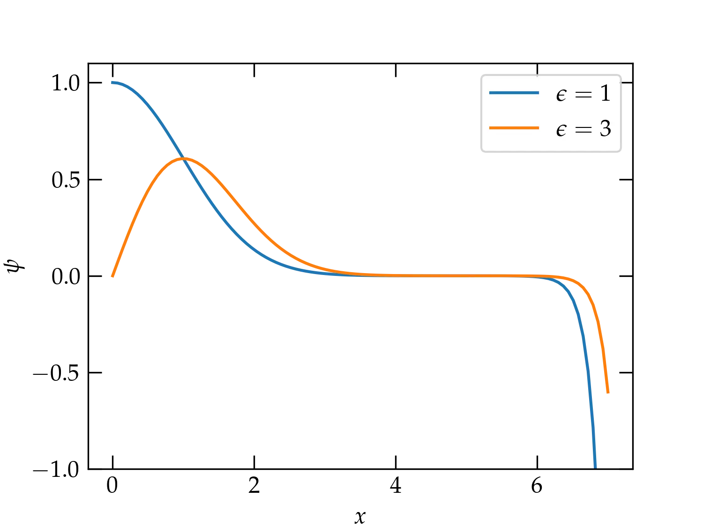
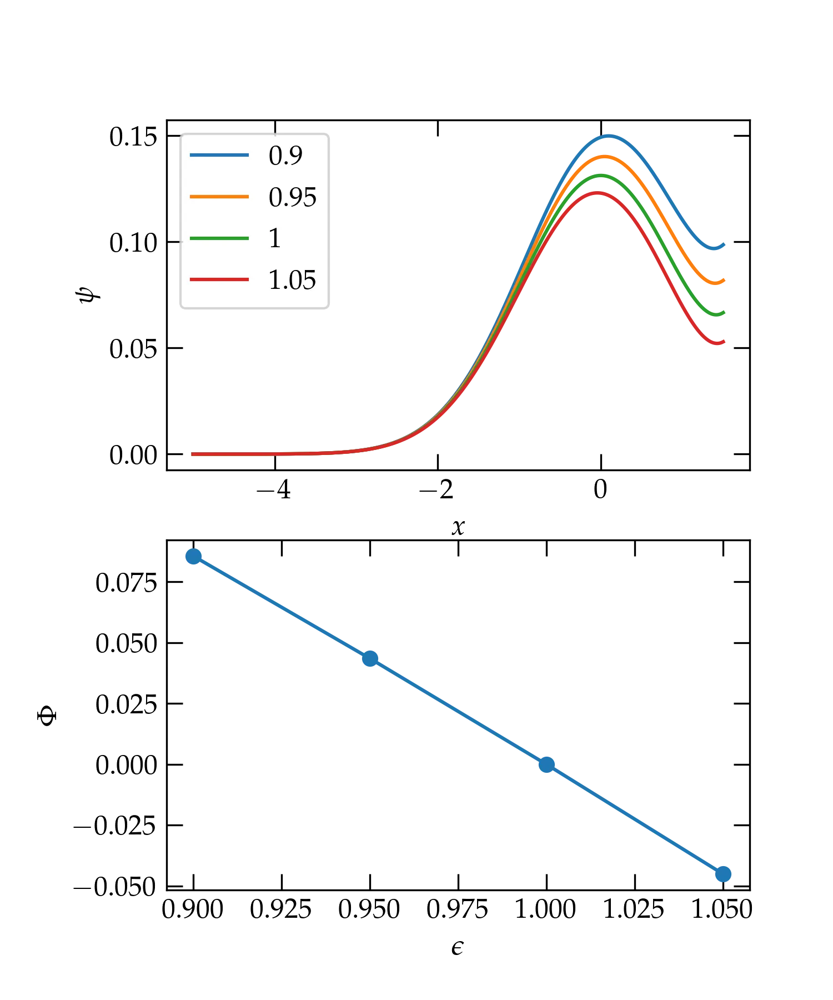

{:menu DE}

# The Quantum SHO—Numerical Approaches

* toc
{:toc}

We will start our numerical approach from the nondimensionalized version of the one-dimensional Schrödinger equation for the simple harmonic oscillator:
\begin{align}
  \psi'' &=  (y^2-\epsilon)\psi  \\\ 
  y &= \sqrt{\frac{m\omega}{\hbar}} x \\\ 
  \epsilon &= \frac{2E}{\hbar \omega}
\end{align}

## General Properties

From the symmetry of the potential, we expect solutions with either even or odd symmetry. Even solutions should have a vanishing derivative at $$x = 0$$, while odd solutions should vanish at $$x = 0$$:
\begin{align}
  \psi'(0) &= 0 &\qquad n \text{ even}  \notag \\\ 
  \psi(0) &= 0 &\qquad n \text{ odd} \notag
\end{align}

## Shooting Method

A naive strategy would integrate from the origin out, starting either from $$(\psi, \psi') = (1,0)$$ at $$x = 0$$ for even $$n$$ or $$(\psi, \psi') = (0,1)$$ for odd $$n$$. This approach will work for a while, but is ultimately doomed to fail. The differential equation we seek to solve is second order, so it has two, linearly independent solutions. Far from the origin, one solution is (roughly) exponentially decreasing, while the other is (roughly) exponentially increasing. To be physically meaningful, an eigenfunction must consist *exclusively* of the exponentially decreasing solution; any component of the exponentially increasing solution will eventually diverge to infinity. When we use a numerical approach, we cannot avoid round-off errors that will inevitably inject a tiny amount of the exponentially growing solution. Eventually, it takes over and comes to dominate the behavior of the numerical solution, as shown in <a ref="Fig1">Figure 1</a>.

  

<a name="Fig1">Figure 1</a> — An illustration of integrating from the origin with $$\psi(0) = 1$$ and $$\psi'(0) = 0$$ for $$\epsilon = 1$$ (blue curve) and with $$\psi'(0) = 1$$ and $$\psi(0) = 0$$ for $$\epsilon=3$$. The solutions start out looking great, but eventually, numerical error admixes enough of the exponentially blowing-up solution that they begin to diverge.

The way to avoid this problem is to integrate *in reverse*. Rather than starting at the point of symmetry at $$x = 0$$ and integrating out, start at a fairly large value of $$x$$ and integrate towards the origin, with the aim of requiring the desired symmetry at $$x = 0$$. The procedure may be summarized as follows:

1. Guess a value of $$\epsilon$$.
2. Integrate towards the origin from a value of $$x$$ that should be deep in the classically forbidden zone, where $$V(x) \gg E$$, which implies that the kinetic energy is large and negative. As an initial condition, take $$\psi(x_0) = \delta$$ and $$\psi'(x_0) = 0$$, for some suitably small value of $$\delta$$.
3. For an even eigenfunction, require that $$\psi'(0) = 0$$; for an odd eigenfunction, require that $$\psi(0) = 0$$. That is, adjust the value of $$\epsilon$$ to drive the solution towards the sought-after behavior at the origin. It can be helpful to define the figure of merit
\begin{equation}
  \Phi = \begin{cases}
    \displaystyle\frac{\psi'(0)}{\psi(0)} & n\text{ even} \\\ 
    \displaystyle\frac{\psi(0)}{\psi'(0)} & n\text{ odd}
  \end{cases}
\end{equation}
and look for the value of $$\epsilon$$ that drives $$\Phi \to 0$$.

### Implementation with `solve_ivp`
~~~ python
from scipy.integrate import solve_ivp

def derivs(x, Y, epsilon):
    """
    Compute the derivatives for Y = [psi, psi']
    """
    ψ, ψp = Y
    return [ψp, (x**2-epsilon) * ψ]

def stop_at_zero(x, Y, epsilon): # event function to record situation at x = 0
    return x

def shoot(epsilon:float, n:int, x_start=-5, y0=(1e-6, 0), x_stop=0):
    """
    Use the shooting method to integrate from x_start with initial condition y0
    to x_stop. 
    Inputs:
       epsilon: the value of the dimensionless energy eigenvalue to test
       n:       the number of the expected energy eigenfunction
    Output:
       A dictionary with fields:
       sol:      the full solution supplied by solve_ivp
       FOM:      the figure of merit at x = 0
       psi:      function that computes the value of ψ(x)
       psiprime: function to compute ψ'(x)
    """
    assert x_stop > x_start
    sol = solve_ivp(derivs, (x_start, x_stop), y0, events=stop_at_zero, args=(epsilon,), rtol=1e-8, atol=1e-8, dense_output=True)
    psi, psip = sol.y_events[0][0,:]
    FOM = psi/psip if n % 2 else psip/psi
    return dict(sol=sol, FOM=FOM, psi=lambda x: sol.sol(x)[0,:], psiprime=lambda x: sol.sol(x)[1,:])
~~~

We can use `shoot` to explore the shooting method using the following code

~~~ python
fig, axs = plt.subplots(nrows=2)
x = np.linspace(-5, 1.5, 501)
epsilons = (0.9, 0.95, 1.0, 1.05)
foms = []
ax = axs[0]
for eps in epsilons:
    s = shoot(eps, 0)
    foms.append(s['FOM'])
    ax.plot(x, s['psi'](x), label=f"{eps:.3g}")
ax.set_xlabel('$$x$$')
ax.set_ylabel(r'$$\psi$$')
ax.legend()
ax = axs[1]
ax.set_xlabel(r'$$\epsilon$$')
ax.set_ylabel(r'$$\Phi$$')
ax.plot(epsilons, foms, 'o-')
savefig("SHO-shooting")
~~~

which produces the graph below. Note that even with the right eigenvalue (the green curve in the upper panel), the solution degrades quite rapidly after the peak because of the small but nonzero value of $$\psi'$$ at the origin. However, the figure of merit appears to be doing the right thing and should allow us to home in on legitimate eigenvalues.

  

<a name="Fig2">Figure 2</a> — Solution for $$\psi(x)$$ for different test values of $$\epsilon$$ (upper panel) and the corresponding figure of merit $$\Phi$$ (lower panel).

### Root-Finding a Solution

~~~ python
from scipy.optimize import root_scalar

def FOM(epsilon:float, n:int, x_start=-5, y0=(1e-6, 0)):
    if x_start == -5:
        x_start = -5 - n
    sol = solve_ivp(derivs, (x_start,0), y0,
                    events=stop_at_zero, args=(epsilon,),
                    rtol=1e-12, atol=1e-12)
    psi, psip = sol.y_events[0][0,:]
    return psi/psip if n % 2 else psip/psi

def shoot_eigenvalue(epsilon_range, n:int):
    r = root_scalar(FOM, args=(n,), x0=epsilon_range[0], x1=epsilon_range[1])
    return r.root

nvals = np.arange(6)
evals, eps = [], []
for n in nvals:
    true = 2*n+1
    sev = shoot_eigenvalue((true-rng.random(), true+rng.random()), n)
    eps.append(true - sev)
    evals.append(sev)
df = pd.DataFrame(dict(n=nvals, ev=evals, eps=eps))
print(df)

   n    ev           eps
0  0   1.0  1.602619e-10
1  1   3.0  2.486900e-13
2  2   5.0  1.953993e-14
3  3   7.0  2.309264e-14
4  4   9.0  2.842171e-14
5  5  11.0  3.375078e-14
~~~

The table shows just how accurately this method is able to determine the eigenvalues, since the third column labeled `eps` shows the error of each determination. What do you think causes the first two roots to be comparatively less accurate?

## Discretizing the Differential Equation

Another numerical approach to solving the differential equation is to divide the range in $$x$$ values into a number of equally spaced steps, to approximate the derivatives with finite differences, and then solve the problem using matrix methods. To see how this works, let us suppose that we divide the range from $$-y_0$$ to $$y_0$$ into an integral number $$N$$ of steps of size $$\Delta y$$ (where I am using the same dimensionless position variable as before, $$y = x \sqrt{m\omega/\hbar}$$ ). That is, we will look for the values of $$\psi$$ at the set of positions
\begin{equation}\label{eq:xpos}
  y_k = -y_0 + k \Delta y \qquad k = 0, 1, 2, \ldots, N
\end{equation}

The approximate value of the derivative $$\psi'$$ can be computed with a finite difference:
\begin{equation}\label{eq:psifinite}
  \psi'(y_j + \Delta y/2) \approx \frac{\psi(y_{j+1}) - \psi(y_j)}{\Delta y} = \frac{\psi_{j+1} - \psi_j}{\Delta y}
\end{equation}
Note that the position at which this best approximates the derivative is halfway between the two $$y$$ positions we use. 

To compute the second derivative, we can subtract values of the derivative at $$y_j-\Delta y/2$$ from its value at $$y_j+\Delta y/2$$ and divide by the displacement ($$\Delta y$$)
to get
\begin{equation}\label{eq:2dfinite}
  \psi^{\prime\prime}(y_j) \approx \frac{\psi_{j+1} - 2 \psi_j + \psi_{j-1}}{(\Delta y)^2}
\end{equation}

Using this approximation, the differential equation
\\[
  -\psi'' + y^2 \psi = \epsilon\psi
\\]
becomes the finite difference equations
\begin{equation}\label{eq:FDeq}
  \frac{-\psi_{j+1} + 2 \psi_j - \psi_{j-1}}{(\Delta y)^2} + y_j^2 \psi_j = \epsilon \psi_j
\end{equation}
(To handle the edge cases, we will take $$\psi_{-1} = \psi_{N+1} = 0$$.)

Equation&nbsp;(\ref{eq:FDeq}) may be cast in matrix form as
\begin{equation}\label{eq:eveq}
  \underbrace{\begin{pmatrix}
  a_{00} & a_{01} & 0 & 0 & \cdots & 0 \\\ 
  a_{10} & a_{11} & a_{12} & 0 & \cdots & 0 \\\ 
  0 & a_{21} & a_{22} & a_{23} & \cdots & 0\\\ 
  0 & 0 & a_{32} & a_{33} & \cdots & 0 \\\ 
  \vdots & \vdots & \vdots & \vdots & \ddots & a_{N-1\, N} \\\ 
  0 & 0 & 0 & 0 & a_{N\, N-1} & a_{NN}
  \end{pmatrix}
  }\_{\mat{A}}
  \begin{pmatrix}
  \psi_0 \\\ \psi_1 \\\ \psi_2 \\\ \psi_3 \\\ \vdots \\\ \psi_N
  \end{pmatrix}
  =
  \epsilon
    \begin{pmatrix}
  \psi_0 \\\ \psi_1 \\\ \psi_2 \\\ \psi_3 \\\ \vdots \\\ \psi_N
  \end{pmatrix}
\end{equation}
where the elements of the matrix $$\mat{A}$$ are given by
\begin{equation}\label{eq:Amat}
  a_{ij} = \begin{cases}
    \frac{2}{(\Delta y)^2} + y_j^2 & i = j \\\ 
    -\frac{1}{(\Delta y)^2} & i = j \pm 1 \\\ 
    0 & \text{otherwise}
  \end{cases}
\end{equation}

You can solve this kind of eigenvalue equation using `scipy.linalg.eigh` or `scipy.sparse.linalg.eigsh`. Which approach do you think will give more accurate eigenvalues and eigenvectors?
