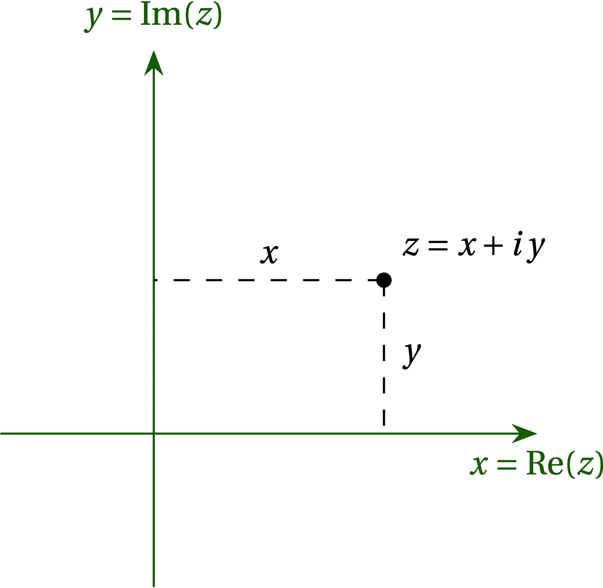

{:menu FO}

# Complex Variables

* toc
{:toc}

## Definitions and Algebra

The imaginary unit was conjured to be able to solve $$z^2 = x$$ for all $$x \in \mathbb{R}$$. The cheapest extension to the real numbers is to define $$i = \sqrt{-1}$$ and to represent an arbitrary **complex number** as
\\[
    z = x + iy\qquad x,y \in \mathbb{R}
\\]
Here $$x$$ represents the real part of $$z$$ and $$y$$ the imaginary part of $$z$$. The algebra of the two parts is just the algebra of the real numbers, so addition is commutative. As for multiplication of two complex numbers, we have
\begin{align}
   (x\_1 + i y\_1)\times (x_2 + i y\_2) &= x\_1 x\_2 + x\_1 i y\_2 + i y\_1 x\_2 + i^2 y\_1 y\_2 \notag\\\ 
   &= (x\_1 x\_2 - y\_1 y\_2) + i(x\_1 y\_2 + y\_1 x\_2) \notag
\end{align}
Both the real and imaginary parts of the product are unchanged on exchanging 1 and 2; multiplication of complex numbers is also commutative.

### Quaternions

There are more involved ways to solve $$z^2 = x$$ that preserve the commutative property of addition but not for multiplication. In particular, the **quaternions** are defined by
\begin{align}
  -1 &= i^2 = j^2 = k^2  \notag \\\ 
  i j &= k = - j i \qqtext{and cyclic permutations}\notag
\end{align}
The quaternions have three distinct square roots of $$-1$$, and the products of these roots are antisymmetric; the multiplication of quaternions does not commute. Quaternions were all the rage when **James Clerk Maxwell** was working out electromagnetic theory and figure prominently in his treatise. Before long, **Oliver Heaviside** and **Josiah Willard Gibbs** developed vector notation and the quaternions were shelved, by and large, although they can be very convenient for representing rotations in three-dimensional space. Perhaps out of fondness for quaternions, mathematicians insist on using $$\vb{i}$$, $$\vb{j}$$, and $$\vb{k}$$ for unit vectors in the $$x$$, $$y$$, and $$z$$ directions, respectively, but that's just silly and certainly does not generalize to the curvilinear coordinate systems that play such an important role in physics.

### Argand Plane

A common way to visualize complex numbers is on the **Argand plane**, in which the real part of the number is plotted on the $$x$$ axis and the imaginary part along the $$y$$ axis. 

  

<a name="Fig1">Figure 1</a> — The complex number $$z = x + i y$$ (for real $$x$$ and $$y$$) is plotted on the $$xy$$ plane at point $$(x,y)$$.

Of course, we could also use a polar coordinate system in which
\begin{align}
  r &= \sqrt{x^2 + y^2} = |z| & \qquad x &= r \cos\phi = \Re(z) \notag \\\ 
  \phi &= \arctan(y/x) &\qquad y &= r \sin\phi = \Im(z) \notag
\end{align}
Using Euler’s identity,
\begin{equation}\label{eq:Euler}
  e^{i \phi} = \cos\phi + i \sin\phi
\end{equation}
we have
\\[
    z = r e^{i\phi}
\\]
for the polar representation of the complex number $$z$$.

Addition is straightforward when complex numbers use the rectangular (Cartesian) representation, but the expression for the product of complex numbers is more involved. On the other hand, products and quotients of complex numbers are simple in polar form, but addition and subtraction are more involved.

Euler’s identity allows us to represent sines and cosines in terms of complex exponentials:
\begin{align}
  \cos\phi &= \frac{e^{i\phi} + e^{-i\phi}}{2} = \Re(e^{i\phi}) \notag \\\ 
  \sin\phi &= \frac{e^{i\phi} - e^{-i\phi}}{2i} = \Im(e^{i\phi}) \notag 
\end{align}
The complex representation makes it easy to work out trigonometric identities. For example,
\begin{align}
  e^{i\theta} e^{i\phi} = e^{i(\theta+\phi)} &= \cos(\theta+\phi) + i \sin(\theta+\phi) \notag \\\ 
  (\cos\theta + i \sin\theta)(\cos\phi+i\sin\phi) &= \cos(\theta+\phi) + i \sin(\theta+\phi) \notag \\\ 
  (\cos\theta\cos\phi - \sin\theta\sin\phi) + i(\sin\theta\cos\phi + \cos\theta\sin\phi) &= \cos(\theta+\phi) + i \sin(\theta+\phi) \notag
\end{align}
therefore by comparing real and imaginary parts on both sides, we have
\begin{align}
  \cos(\theta+\phi) &= \cos\theta\cos\phi - \sin\theta\sin\phi  \notag \\\ 
  \sin(\theta+\phi) &= \sin\theta\cos\phi + \cos\theta\sin\phi
\end{align}

Or another:
\begin{align}
  \cos^4\theta &= \frac{(e^{i\theta} + e^{-i\theta})^4}{2^4} 
  = \frac{e^{4i\theta} + 4 e^{2i\theta} + 6 + 4e^{-2i\theta}+e^{4i\theta}}{16}\notag \\\ 
  &= \frac18 \cos 4\theta + \frac12 \cos 2\theta + \frac38
\end{align}
You can confirm the plausibility of this last identity by checking out $$\theta \in \{0, \frac\pi2, \pi\}$$.

## Functions of a Complex Variable

Just as a function of a real variable $$x$$ takes $$\mathbb{R} \to \mathbb{R}$$, a function of a complex variable takes $$\mathbb{C} \to \mathbb{C}$$. If $$z = x + iy$$, we can define $$f(z) = u(x, y) + i v(x,y)$$, where $$u(x,y)$$ is the real part of $$f(z)$$ and $$v(x,y)$$ is the imaginary part of $$f(z)$$. For example, suppose $$f(z) = z^2$$. Then,
\\[
    f(z) = (x^2 - y^2) + i 2 x y
\\]
so
\\[
    u(x,y) = x^2 - y^2 \qqtext{and} v(x,y) = 2 x y
\\]

Another example: if $$f(z) = e^{iz} = e^{i(x + iy)} = e^{-y} e^{ix} = e^{-y}(\cos x + i\sin x)$$, then
\\[
    u(x, y) = e^{-y} \cos x  \qquad\text{and}\qquad v(x,y) = e^{-y} \sin x
\\]

What would it mean to take the sine of a complex variable $$z$$?
\\[
    \sin z = \frac{e^{iz} - e^{-iz}}{2i}
    = \frac{e^{i x - y} - e^{-i x + y}}{2i} = \frac{e^{-y} e^{ix} - e^{y} e^{-ix}}{2i}
\\]
In particular, if $$z$$ is purely imaginary, then
\\[
    \sin iy = i \sinh y
\\]

## Derivative of a Complex Function

We might think to define the derivative of a function of a complex variable in analogy with functions of a real variable:
\\[
    f'(z) = \lim_{\delta z \to 0} \frac{f(z+\delta z) - f(z)}{\delta z}
\\]
but a little thought reveals a major concern: the value of $$\delta z = \delta x + i \delta y$$ can be made to shrink to zero in any direction on the complex plane. Would this limit make any sense if the value for the derivative depended on the direction of approach?

If we assume that the limit is well-defined and independent of the direction of approach, then there will need to be careful coordination between the real and imaginary parts of $$f(z)$$, which we can deduce by representing $$f(z) = u(x,y) + i v(x,y)$$. Making this substitution, we have
\begin{equation}\label{eq:CR0}
    f'(z) = \lim_{\delta x, \delta y \to 0} \frac{
        u(x + \delta x, y + \delta y) + i v(x + \delta x, y + \delta y) -
        u(x, y) - i v(x,y)
    }{\delta x + i \delta y}
\end{equation}
Let us suppose, on the one hand, that $$\delta y = 0$$ and that we approach the point $$z$$ parallel to the $$x$$ axis. Then Eq. (\ref{eq:CR0}) becomes
\begin{align}
  f'(z) &= \lim_{\delta x\to0} \frac{[u(x+\delta x, y) - u(x,y)] +
  i[v(x+\delta x, y)-v(x, y)]}{\delta x} \notag \\\ 
  &= \pdv{u}{x} + i\pdv{v}{x} \label{eq:CR1}
\end{align}
On the other hand, if we let $$\delta x = 0$$ and approach $$z$$ parallel to the imaginary axis, we get
\begin{align}
  f'(z) &= \lim_{\delta y\to0} \frac{[u(x, y + \delta y) - u(x,y)] +
  i[v(x, y+\delta y)-v(x, y)]} {i \delta y} \notag \\\ 
  &= -i\pdv{u}{y} + \pdv{v}{y} \label{eq:CR2}
\end{align}
For Eqs. (\ref{eq:CR1}) and (\ref{eq:CR2}) to be consistent, we must have
\begin{align}
  \pdv{u}{x} &= \pdv{v}{y}  \label{eq:CR3} \\\ 
  -\pdv{u}{y} &= \pdv{v}{x} \label{eq:CR4}
\end{align}
which are called the **Cauchy-Riemann conditions**. In sum, for the derivative of a function of a complex variable to exist, the Cauchy-Riemann conditions must be satisfied. Such functions are called **analytic**. More generally, functions may be analytic in a region of the complex plane, but nonanalytic at certain points or in certain regions.

We already worked out that if $$f(z) = z^2$$, then $$u(x,y) = x^2 - y^2$$ and $$v(x,y) = 2 x y$$. We can see immediately that both Cauchy-Riemann conditions are satisfied in this case.

It is straightforward to confirm that
\\[
  \dv{}{z} \left[ f(z)g(z) \right] = \dv{f}{z} g + f \dv{g}{z}  \notag
\\]
and to use induction to show that
\\[
    \dv{(z^n)}{z} = n z^{n-1}
\\]

### A Non-differentiable Function of a Complex Variable

However, it is possible to produce a very simple function that does not have a derivative. Consider
\\[
    f(z) = z^* = x - i y
\\]
so that $$u(x,y) = x$$ and $$v(x,y) = -y$$. This function satisfies Eq. (\ref{eq:CR2}), but fails to satisfy (\ref{eq:CR1}), so its derivative does not exist.

The Cauchy-Riemann conditions are sufficient to ensure that we get the same limit for the derivative regardless of the direction along which we let $$\delta z \to 0$$. You may readily verify that if they are satisfied for two functions $$f(z)$$ and $$g(z)$$, then they are satisfied by $$(f+g)(z)$$ and $$(f-g)(z)$$; and you may verify that they are satisfied for $$z^n$$ for $$n \in \mathbb{Z}$$.

## Cauchy Integral Theorem

The Cauchy-Riemann conditions describe the coordination necessary between the real and imaginary parts of a complex function for it to be differentiable. In some measure, the notion of an integral of a complex function is much simpler. We pick a path from some point on the complex plane to another, subdivide it into infinitely small segments, and tally up the product of $$f(z)\dd{z}$$ for all those segments. Naïvely, we should expect that the value of the integral should depend both on the end points and on the particular path that connects them. However, as for conservative forces—for which the work done in going from one point to another is independent of the path—in a wide variety of cases, the complex path integral depends only on the end points and the value of the integral around a closed path is precisely zero!

More formally, **Cauchy's integral theorem** holds that the path integral *vanishes* around any contour within a simply connected region in which the Cauchy-Riemann conditions hold. Crudely speaking, a **simply connected** region has no holes. Any closed path within a simply connected region can be shrunk continuously to a point without having left the region.

Before proceeding to a proof, let us consider the integral of $$z^n$$ around a small circle of radius $$r$$ around the origin. Along that circle, we have $$z = r e^{i\theta}$$ and $$\dd{z} = r i e^{i\theta}\dd{\theta}$$,  so the integral is
\\[
    \oint z^n\dd{z} = \int_0^{2\pi} r^n e^{i n \theta} \, r i e^{i\theta}\dd{\theta}
    = i r^{n+1} \left. \frac{e^{i(n+1)\theta}}{i(n+1)}\right|_0^{2\pi}
    = 0
\\]
Provided that $$n \ne -1$$, the integral vanishes, since $$e^{i(n+1)\theta}$$ is periodic with period $$2\pi$$. However, if $$n = -1$$, we have the integral
\\[
    \oint \frac{\dd{z}}{z} = \int_0^{2\pi} r^{-1} e^{-i\theta} r i e^{i\theta}\dd{\theta} =\int_0^{2\pi} i\dd{\theta} =  2\pi i
\\]
This result does not violate Cauchy's integral theorem because the function $$f(z) = 1/z$$ is not analytic at $$z = 0$$, where it diverges. 

There is a generalization of a Taylor expansion appropriate for functions of a complex variable. It is
\begin{equation}\label{eq:Laurent}
  f(z) = \sum_{n=-\infty}^{\infty} a_n (z-z_0)^n
\end{equation}
called a **Laurent expansion** about the point $$z_0$$. If such an expansion exists, integrating around a closed contour that contains the point $$z_0$$ would yield zero for every term in the series except for $$n = -1$$. That is,
\\[
    \underset{C}{\oint} f(z) = 2\pi i a_{-1} 
\\]
The coefficient $$a_{-1}$$ is called **the residue** of the pole at $$z = z_0$$.

This result is truly remarkable! If we integrate around a closed path containing no singularity, the result is zero. On the other hand, if we integrate around a closed path containing a singularity, which may contain terms in its Laurent expansion proportional to many terms proportional to $$z-z_0$$ to a variety of negative integral powers, only the term proportional to $$(z-z_0)^{-1}$$ yields a nonzero contribution to the path integral—and that contribution is $$2 \pi i a_{-1}$$.

Cauchy's theorem says that we are free to deform the integration contour through regions that are analytic with impunity, since integrals around closed contours in those regions yield nothing. We can even ignore most singularities within the contour; only those that are proportional to $$(z-z_0)^{-1}$$ produce a nonzero value for the integral.

### Proof of Cauchy's Integral Theorem

We start by reminding you of **Stokes's theorem**, which holds that the integral of a vector function $$\vb{F}$$ around a closed path is equal to the integral of the curl of $$\vb{F}$$ over any area bounded by the closed path:
\\[
    \oint \vb{F}\vdot\dd{\vb{s}} = \iint (\curl \vb{F}) \vdot \dd{\vb{A}}
\\]
We can understand the theorem by noting that the curl of a vector function is defined as the limit of the circulation ($$\oint \vb{F}\vdot\dd{\vb{s}}$$) divided by the area bounded by the path over which the integral is taken as the area shrinks to zero. In integrating the curl over an extended area, the contributions to the circulation along all interior paths cancel, leaving only the contribution from the path around the entire area.

If we focus on the $$z$$ component of curl, Stokes's theorem says that
\begin{equation}\label{eq:CIT0}
    \oint (F_x\dd{x} + F_y\dd{y}) = \iint \qty(\pdv{F_y}{x} - \pdv{F_x}{y})\dd{x}\dd{y}
\end{equation}

To prove Cauchy's integral theorem, we need to evaluate
\\[
    \oint f(z)\dd{z} = \oint \qty[u(x,y) + i v(x,y)] (\dd{x} + i\dd{y})
    = \oint \qty( u\dd{x} - v\dd{y}) + i\qty(u\dd{y} + v\dd{x})
\\]

Consider, first, the real part of the integrand. Comparison with Eq. (\ref{eq:CIT0}) suggests that we take $$u = F_x$$ and $$-v = F_y$$ in Stokes's theorem to get
\\[
    \oint \qty( u\dd{x} - v\dd{y}) = \iint \qty(-\pdv{v}{x} - \pdv{u}{y}) \dd{x}\dd{y}
\\]
But by Eq. (\ref{eq:CR4}), the quantity in parentheses is zero. A similar argument shows that the imaginary part also vanishes, which proves the theorem. Goursat showed how to relax the constraint that the region be simply connected by making infinitely thin bridges between regions and showing that integrating on either side of the bridges produced contributions to the integral that exactly cancel. 

## Cauchy's Integral Formula

Cauchy's integral formula holds that
\begin{equation}\label{eq:CauchyInt}
  f(z_0) = \frac{1}{2\pi i} \underset{C}{\oint} \frac{f(z)}{z-z_0} \dd{z}
\end{equation}
where the function $$f(z)$$ must be analytic on the closed contour $$C$$ and in its interior, the point $$z_0$$ is inside $$C$$, and $$C$$ is traversed in the counterclockwise direction.
To prove the formula, note that we are free to distort the contour from $$C$$ through analytic regions without changing the value of the integral, since the integral of an analytic function around a closed contour vanishes by Cauchy's integral theorem. So, we shrink the contour down to a tiny circle surrounding $$z_0$$. Along this contour, $$z - z_0 = \epsilon e^{i\theta}$$ and $$\dd{z} = \epsilon i e^{i\theta}\dd{\theta}$$ so that
\\[
  \frac{1}{2\pi i} \underset{C}{\oint} \frac{f(z)}{z-z_0} \dd{z}
  = \frac{1}{2\pi i} \int_0^{2\pi} \frac{f(z_0+\epsilon e^{i\theta})}{\epsilon e^{i\theta}} \; \epsilon i e^{i\theta}\dd{\theta}
  = \frac{1}{2\pi i} \int_0^{2\pi} f(z_0) i \dd{\theta} = f(z_0)
\\]

We can extend this result by differentiating both sides with respect to $$z_0$$:
\begin{align}
    f'(z_0) &= \frac{1}{2\pi i} \underset{C}{\oint}
    \frac{f(z)}{(z-z_0)^2} \dd{z} \\\ 
    f^{\prime\prime}(z_0) &= \frac{2!}{2\pi i} \underset{C}{\oint}
    \frac{f(z)}{(z-z_0)^3}\dd{z} \\\ 
    f^{(n)}(z_0) &= \frac{n!}{2\pi i} \underset{C}{\oint}
    \frac{f(z)}{(z-z_0)^{n+1}}\dd{z}
\end{align}

## The Residue Theorem

If a function $$f(z)$$ is analytic along a contour $$C$$ and inside region $$R$$ bounded by $$C$$ except at a finite number $$N$$ of poles (locations where the function diverges) in $$R$$, then 
\begin{equation}
  \int_C f(z) \dd{z} = 2 \pi i \sum_{j=1}^N (a_{-1})_j
\end{equation}
where $$(a_{-1})_j$$ is the the residue at pole $$j$$. 

The residue theorem establishes a method for evaluating integrals along closed paths on the complex plane. Quite often, however, we wish to evaluate an integral of a real function of a real variable along the real axis. Since the residue theorem requires that we integrate around a closed contour in the complex plane, an important step in using the residue theorem to calculate such integrals is to identify a contour that either

- closes along a segment that adds nothing to the value of the integral, or
- generates a multiple of the desired integral (e.g., by integrating along a return path that goes from $$x = \infty$$ to $$x = -\infty$$ at some nonzero value of the imaginary part of $$z$$).

Sometimes it is necessary to use a modified integrand so that the difference between the two paths parallel to the $$x$$ axis yields the actual integral we seek to evaluate.

## Computing Residues

The residue is the coefficient of the $$(z - z_0)^{-1}$$ term in the Laurent expansion. There are several ways to compute residues. The Laurent expansion of an $$n$$th-order pole at $$z_0$$ has the form
\begin{equation}
  f(z) = \sum_{j=-n}^{\infty} a_j (z-z_0)^j
\end{equation}

For a simple pole, the sum begins at $$n = -1$$. One strategy to compute the residue, then, is to multiply $$f(z)$$ by $$(z-z_0)$$ and take the limit as $$z \to z_0$$:
\begin{equation}\label{eq:blah}
  \lim_{z\to z_0} [f(z) (z-z_0)] = \lim_{z\to z_0} \left[ a_{-1} + a_0 (z-z_0) + a_1 (z-z_0)^2 + \cdots \right] = a_{-1}
\end{equation}

The series for a second-order pole begins with $$n = -2$$. If we multiply $$f(z)$$ by $$(z-z_0)^2$$ and then differentiate once with respect to $$z$$ before taking the limit as $$z \to z_0$$, we get
\begin{align}
  \dv{}{z}[f(z) (z-z_0)^2] &= \dv{}{z} \left[ a_{-2} + a_{-1}(z-z_0) + a_0 (z-z_0)^2 + \cdots \right] \\\ 
  \lim_{z \to z_0} \dv{}{z}[f(z) (z-z_0)^2] &= \lim_{z \to z_0} a_{-1} + 2 a_0 (z-z_0) + \cdots = a_{-1}
\end{align}

If we multiply $$f(z)$$ by $$(z-z_0)^n$$, we get
\begin{equation}
  f(z) (z-z_0)^n = \sum_{k = 0}^\infty a_{k-n} (z-z_0)^k
\end{equation}
Taking $$n$$ derivatives, we get
\begin{equation}\label{eq:}
  \dv[n]{}{z} [f(z) (z-z_0)^n] = n! a_{-1} (z - z_0)
\end{equation}

## Problems

1. Use Euler's identity to work out an expression for $$\sin^3 \theta$$ in terms of $$\sin 3\theta$$ and $$\sin\theta$$. Be sure to check your expression for a few values of $$\theta$$. 

2. Simplify $$\cos i z$$ for $$z = x + i y$$.

3. Show that both the real part and the imaginary part of a differentiable function of a complex variable satisfy Laplace's equation,
\\[
    \pdv[2]{u}{x} + \pdv[2]{u}{y} = 0
\\]
and similarly for $$v$$.

