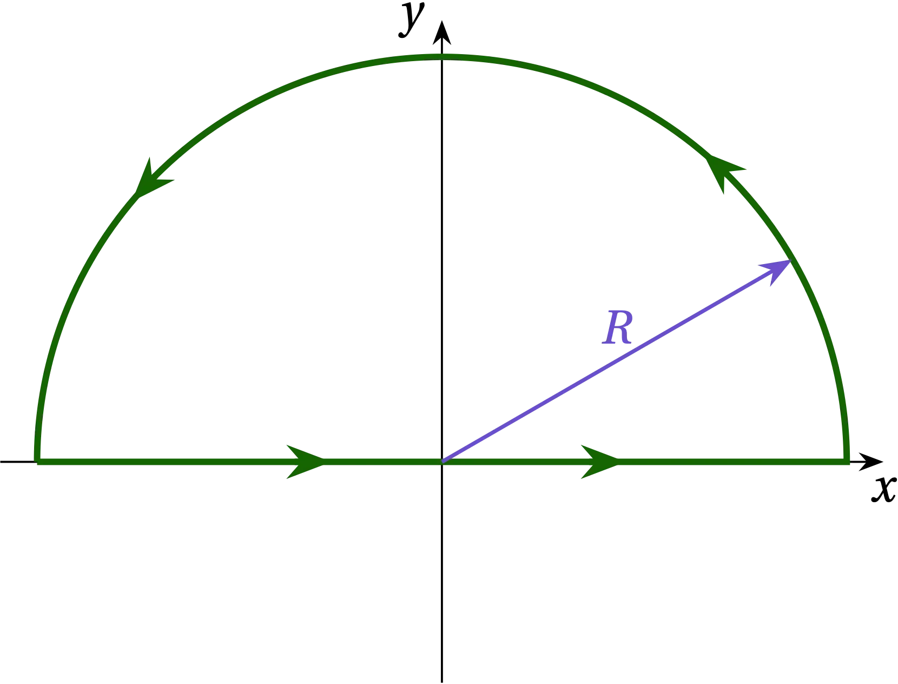

{:menu FO}

# Contour Integration

* toc
{:toc}

We saw in [the page on Complex Variables](FO-ComplexVariables.md) that the integral around a closed contour on the complex plane may be evaluated by summing the residues of the enclosed poles. Let’s check this out by evaluating the following integral:
\begin{equation}
  I = \int_{-\infty}^{\infty} \frac{1}{1 + x^2}\dd{x}
\end{equation}
This is not an integral for which we require the methods of contour integration; we could simply use a $$u$$ substitution, letting $$x = \tan u$$, so that $$\dd{x} = \sec^2{u}\dd{u}$$ to transform the integral to
\begin{equation}
  I = \int_{-\pi/2}^{\pi/2} \frac{1}{1 + \tan^2 u} \sec^2{u}\dd{u} = \int_{-\pi/2}^{\pi/2} \dd{u} = \pi
\end{equation}

Can we get the same result from contour integration?

We need to find a way to close the contour that includes the entire real axis, but needs to somehow get from $$x = \infty$$ to $$x = -\infty$$. Would a large semicircle work?

## A Simple Example of Contour Integration

To get our feet wet using contour integration, let's try integrating
\begin{equation}
  f(x) = \frac{1}{1+x^2}
\end{equation} over the infinite interval. This function will provide a
way of checking our methods, since we can readily evaluate it by a
straight trigonometric substitution. If $$x = \tan\phi$$, so that
$$\dd{x} = \sec^2 \phi \dd{\phi}$$, then \begin{equation}
  \int_{-\infty}^{\infty} f(x)\dd{x} = \int_{-\pi/2}^{\pi/2} \frac{\sec^2 \phi\dd{\phi}}{1+\tan^2\phi}
  = \int_{-\pi/2}^{\pi/2} \frac{\sec^2\phi}{\sec^2\phi} \dd{\phi} = \pi
\end{equation} Can we get this same result via contour integration?

Is it as simple as \begin{equation}
  I = \int_{-\infty}^{\infty} \frac{\dd{z}}{1 + z^2}
\end{equation} Almost, except if we integrate along the real axis, we
don't have a closed path, so we can't use the residue theorem.

We need to add a segment to the path that gets us from $$x = \infty$$
back to $$x = -\infty$$ without adding anything to the value of the
integral. Let's try closing along a semicircular arc of radius $$R$$, as
illustrated below, and then take the limit as $$R \to \infty$$.

  

<a name="Fig1">Figure 1</a> — A possible way to produce a closed contour

Along the semicircular arc, $$z = R e^{i\theta}$$, so
$$\dd{z} = iR e^{i\theta}\dd{\theta}$$ and the contribution to the
integral is
\begin{equation}
  I' = \int_{0}^{\pi} \frac{i R e^{i\theta}}{1 + R^2 e^{2i\theta}} \dd{\theta}
\end{equation}
Let's pull the leading dependence on $$R$$ out of the
integral: 
\begin{equation}
  I' = \frac{1}{R} \int_{0}^{\pi} \frac{i e^{i\theta}}{e^{2i\theta} + 1/R^2} \dd{\theta}
\end{equation}
As $$R \to \infty$$, the integral becomes
\begin{equation}
  I' = \frac{1}{R} \int_{0}^{\pi} \frac{i e^{i\theta}}{e^{2i\theta} + 0} \dd{\theta}
  = \frac{1}{R} \int_0^\pi i e^{-i\theta} \dd{\theta}
\end{equation}
which clearly goes to zero as $$R \to 0$$. So, by closing
the contour along the semicircular arc at infinity, we add no
contribution to the integral. So, the integral around the closed contour
has the same value as the integral we care about along the $$x$$ axis,
and that means we can use the residue theorem to evaluate it.

The integrand
\begin{equation}
\frac{1}{z^2+1} = \frac{1}{(z+i)(z-i)}
\end{equation}
has poles at $$z = \pm i$$. If we close the contour in the upper half-plane, as
illustrated in the figure, then we proceed around the contour in the
positive direction and we enclose the pole at $$z = i$$. By the residue
theorem, therefore, the value of the integral $$I$$ is $$2 \pi i$$ times
the residue at $$z = i$$. Let $$\xi = z-i$$, so that the integrand in
the vicinity of the pole has the form.
\begin{equation}
  \frac{1}{(z + i)(z - i)} = \frac{1}{(\xi + 2i)\xi} = \frac{a_{-1}}{\xi}
\end{equation}
for $$a_{-1} = \frac{1}{2i}$$, since
$$\lim_{\xi \to 0} \frac{1}{\xi + 2i} = \frac{1}{2i}$$. Therefore,
\begin{equation}
  I = 2 \pi i \times \frac{1}{2i} = \pi
\end{equation} just as we found from the $$u$$ substitution.
**Well, that's reassuring!**

## Another Example

To appreciate the power of contour integration, we need to modify the
integral to yield something that would require a lot more work to
integrate with a standard method such as substitution. Can you evaluate
\begin{equation}
  J = \int_{-\infty}^{\infty} \frac{1}{1 + x^4}\dd{x}
\end{equation}
analytically? Perhaps, but I'm going to try to use contour integration.

The argument we developed above to evaluate $$I'$$ works even better for
this integrand, which goes much more strongly to zero at large $$R$$.
So, we can surely close the contour in the upper half-plane using the
same semicircular path as before, which will contribute nothing to the
integral. So, we just need to locate the poles and evaluate the residues
of the poles that lie in the upper half-plane.

Where are the zeros of $$z^4 + 1$$? At $$z^4 = -1$$. They are at
$$z = e^{i \phi}$$ for
$$\phi \in \left\{\pi/4, 3\pi/4, 5\pi/4, 7\pi/4\right\}$$. The first two
lie in the upper half-plane, so we need to calculate the residues at
these two poles.

  

<a name="Fig2">Figure 2</a> — Location of the poles of $$1/(z^4+1)$$. The dashed circle has radius 1.

**Claim:**
$$z^4 + 1 = (z - e^{i\pi/4})(z - e^{3i\pi/4})(z - e^{5i\pi/4})(z - e^{7i\pi/4})$$,
since this product is fourth-order in $$z$$ and has zeros in all the
right places. As a check, let's compute the $$z^3$$ term, which is
$$z^3 (-e^{i\pi/4}-e^{3i\pi/4}-e^{5i\pi/4}-e^{7i\pi/4}) = 0$$, since the
zeros are distributed symmetrically about the origin along the unit
circle.

I will illustrate three different approaches to computing the residues.

1. The first method is perhaps the most straightforward:
\\[
    a_{-1} = \lim_{z \to z_0} [f(z) (z-z_0)]
\\]
The residue at $$z_0 = e^{i\pi/4}$$ is
\\[
    a_{-1} = \lim_{z \to e^{i\pi/4}} \frac{z - e^{i\pi/4}}{z^4+1}
    = \lim_{z \to e^{i\pi/4}} \frac{1}{4z^3} = \frac{e^{-i 3\pi/4}}{4}
\\]
where I have used l’Hôpital’s rule to simplify the limit of the fraction. Similarly, the residue at 
$$z_0 = e^{i 3\pi/4}$$ is
\\[
    b_{-1} = \lim_{z \to e^{i3\pi/4}} \frac{z - e^{i 3\pi/4}}{z^4+1}
    = \lim_{z \to e^{i3\pi/4}} \frac{1}{4z^3} = \frac{e^{-i 9\pi/4}}{4} = \frac{e^{-i\pi/4}}{4}
\\]

2. For the second method, consider the residue as $$z \to e^{i\pi/4}$$. Let $$\zeta = z-e^{i\pi/4}$$. Then
\\[
    \frac{1}{z^4 + 1} = \frac{1}{(e^{i\pi/4} + \zeta)^4 + 1} 
    = \frac{1}{-1 + 4 \zeta e^{3i\pi/4} + 6 \zeta^2 e^{i\pi/2} + 4 \zeta^3 e^{i\pi/4} + \zeta^4 + 1}
\\]
The ones cancel and we're left with 
\\[
    \frac{1}{\zeta} \frac{1}{(4 e^{3i\pi/4} + \O{\zeta})} \qquad\longrightarrow\qquad
    a_{-1} = \frac{e^{-3i\pi/4}}{4}
\\]
as we found before. We can find $$b_{-1}$$ in the same way.

3. In $$(z - e^{i\pi/4})(z - e^{3i\pi/4})(z - e^{5i\pi/4})(z - e^{7i\pi/4})$$, only one term goes to zero at each pole, so we just need to evaluate the denominators by multiplying together the three other terms:
\begin{align}
d_1 = (z - e^{3i\pi/4})(z - e^{5i\pi/4})(z - e^{7i\pi/4}) &\text{ as } z \to e^{i\pi/4} \\\ 
d_2 = (z - e^{i\pi/4})(z - e^{5i\pi/4})(z - e^{7i\pi/4}) &\text{ as } z \to e^{3i\pi/4}
\end{align}

Each term in the product is of the form $$t_{mn} = (e^{i m \pi/4} - e^{i n \pi/4})$$ for integer $$m$$ and $$n$$. If we factor out $$e^{i(m+n)\pi/8}$$, we get
\begin{equation}
    t_{mn} = e^{i(m+n)\pi/8} \bigg( e^{i(m-n)\pi/8} - e^{-i(m-n)\pi/8} \bigg)
    = e^{i(m+n)\pi/8} (-2i) \sin \left(\frac{(n-m)\pi}{8}\right)
\end{equation}

Using this expression to evaluate the denominators, we have
\begin{align}
d_1 &= t_{13} t_{15} t_{17} = (-2i)^3 e^{i(18)\pi/8}\sin(\pi/4) \sin(\pi/2) \sin(3\pi/4)
= 8i e^{i\pi/4} \frac12 = 4i e^{i\pi/4} = 4 e^{i 3\pi/4} \\\ 
d_2 &= t_{31} t_{35} t_{37} = (-2i)^3 e^{i(22)\pi/8}\sin(-\pi/4) \sin(\pi/4) \sin(\pi/2)
= 8i e^{i3\pi/4} \times -\frac12 = 4 e^{i\pi/4}
\end{align}
These values are the reciprocals of the residues we found before.

By the residue theorem, therefore,
\begin{equation}\label{eq:voila}
  J = 2 \pi i  e^{-i\pi/2} \left( \frac{e^{i\pi/4} + e^{-i\pi/4}}{4}  \right)
  = \frac{\pi}{2} 2 \cos(\pi/4) = \frac{\pi}{\sqrt{2}}
\end{equation}

Can we confirm this value numerically?

~~~~ python
import numpy as np 
import matplotlib.pyplot as plt
%matplotlib widget 
from scipy.integrate import quad

f = lambda x: 1 / (1 + x**4)
x = np.linspace(-10, 10, 201)
y = 1.0 / (1.0 + x**4)
fig, ax = plt.subplots()
ax.plot(x,y);
~~~~

  

<a name="Fig2">Figure 2</a> — Plot of $$f(x) = 1 / (1 + x^4)$$.

Because the contribution from the wings lives at a different scale than the bulk of the weight of the integrand near $$x = 0$$, I will break apart the integral into segments and then add the segments up.

~~~~ python
v = np.array([quad(f, 0, 2), quad(f, 2, 4), quad(f, 4, 10), 
    quad(f, 10, 20), quad(f, 20, 100)])
np.pi / np.sqrt(2)

2.22144147
~~~~

<table class="nicetable">
  <tr>
    <th>Range</th><th>Integral</th><th>Error Estimate</th>
  </tr>
  <tr>
    <td>0 – 2</td><td>1.070 127 69</td><td>1.49 ✕ 10–12</td>
  </tr>
  <tr>
    <td>2 – 4</td><td>0.035 393 409 8</td><td>3.9 ✕ 10–16</td>
  </tr>
  <tr>
    <td>4 – 10</td><td>0.004 866 316 59</td><td>2.86 ✕ 10–14</td>
  </tr>
  <tr>
    <td>10 – 20</td><td>0.000 291 652 493</td><td>3.2 ✕ 10–18</td>
  </tr>
  <tr>
    <td>20 – 100</td><td>0.000 041 332 217</td><td>1.2 ✕ 10–9</td>
  </tr>
  <tr>
    <th>Total</th><th>2.2214408 / 2</th><th>2.4 ✕ 10–9 / 2</th>
    </tr>
</table>

You can readily see that the numerical integration agrees well with the exact value we obtained via contour integration.

## Problems

1. Evaluate $$\displaystyle \int_{0}^{\infty} \frac{1}{1 + x^6}\dd{x}$$.

2. Show that $$\displaystyle \int_0^\infty \frac{\sin x}{x}\dd{x} = \frac{\pi}{2}$$.

3. Show that $$\displaystyle  \int_0^\infty \sin x^2 \dd{x} = \int_0^\infty \cos x^2\dd{x} = \frac12 \sqrt{\frac{\pi}{2}}$$. Hint: consider a path that returns to the origin along the line $$x = y$$.

4. 