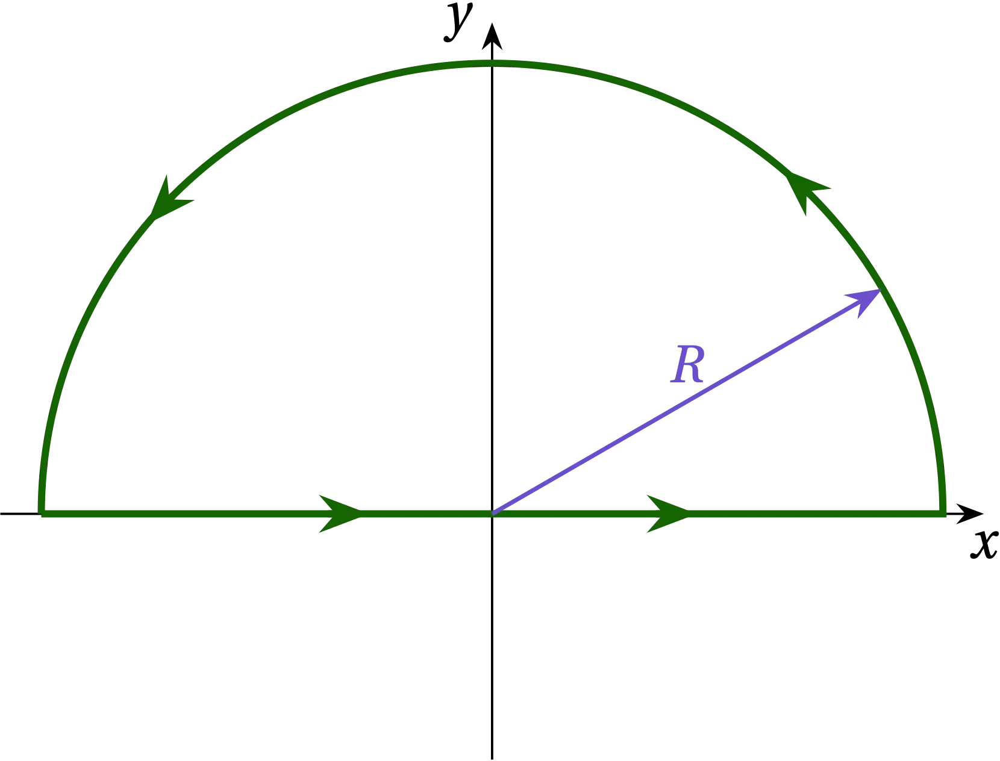
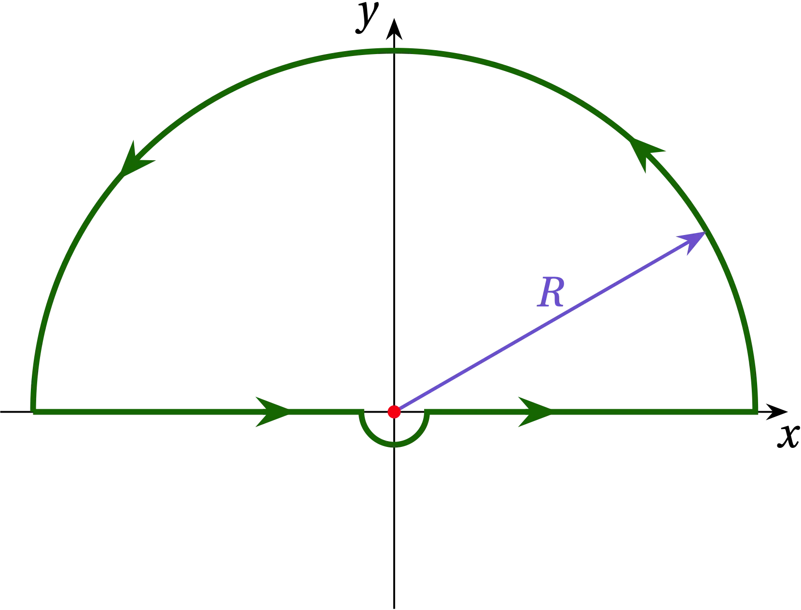

{:menu FO}

# The Dirac Delta Function

* toc
{:toc}

## The Idea

The Dirac delta function, $$\delta(x)$$, is the limit of a narrow spike, centered at $$x = 0$$, that grows infinitely tall, and infinitely narrow in just such a way as to integrate to one. That is, the area under the spike is normalized to one.

### A Gaussian Representation

We can make a smooth approximation to $$\delta(x)$$ using any smooth peaked function, but a particularly convenient one is a **gaussian**:
\begin{equation} \label{eq:gauss1}
    g(x) = \frac{1}{\sqrt{2 \pi \sigma^2}} e^{-x^2 / 2 \sigma^2}
\end{equation}
where the parameter $$\sigma$$ governs how narrow the peak, and I have written the prefactor (allegedly) so that $$g(x)$$ is normalized:
\begin{equation} \label{eq:gauss2}
    \int_{-\infty}^{\infty} g(x) \dd{x} = 1
\end{equation}

We'll verify below that $$g(x)$$ is indeed normalized. But, first notice that as $$\sigma$$ gets smaller, the prefactor gets larger and the exponential part falls off more rapidly as $$x$$ departs from zero.

### Normalization

Before struggling to evaluate the integral, let's at least make a variable substitution to simplify the exponent. Let
\\[
    y^2 = \frac{x^2}{2\sigma^2} \qquad\text{so that}\qquad y = \frac{1}{\sigma\sqrt{2}} x
\\]

If we knew the value of $$\int_{-\infty}^{\infty} e^{-x^2} \dd{x}$$, we could figure out what whether Eq.&nbsp;(\ref{eq:gauss2}) holds. So, let us determine the value of $$I$$ in
\begin{equation}
  I = \int_{-\infty}^{\infty} e^{-x^2}\dd{x}
\end{equation}
Sadly, we don't have the integrating factor we need to make this integral simple; if we were to let $$u = x^2$$, then $$\dd{u} = 2 x\dd{x}$$, but we don't have that factor of $$x$$ in the integrand.

Here's a beautiful trick for getting around that problem. Let's try to calculate $$I^2$$:
\begin{equation}\label{eq:I2}
  I^2 = \int_{-\infty}^{\infty} e^{-x^2}\dd{x} \int_{-\infty}^{\infty} e^{-y^2}\dd{y}
  = \iint\limits_{-\infty}^{\infty} e^{-x^2 - y^2} \dd{y} \dd{x}
\end{equation}
That is, we need to integrate $$e^{-(x^2+y^2)}$$ over the entire $$xy$$ plane. If we switch to polar coordinates, then
\\[
    x^2 + y^2 = r^2 \qquad\text{and}\qquad \dd{x}\dd{y} = r \dd{\theta} \dd{r}
\\]
so that the integral becomes
\\[
    I^2 = \int_0^\infty \int_0^{2\pi} \dd{\theta} e^{-r^2} r \dd{r}
    = 2\pi \int_0^\infty e^{-r^2} r\dd{r}
\\]
Now we have the integration factor we need, so let $$u = r^2$$, so that $$\dd{u} = 2 r \dd{r}$$. Therefore,
\\[
    I^2 = 2 \pi \int_0^{\infty} e^{-u} \frac{\dd{u}}{2} = \pi \left( -e^{-u} \right)_0^\infty = \pi
\\]
Therefore, $$I = \sqrt{\pi}$$.

If we now return to Eq.&nbsp;(\ref{eq:gauss1}) with our new-found knowledge, we can normalize $$g(t)$$:
\begin{align}
  1 &= \int_{-\infty}^{\infty} k e^{-\alpha t^2} \dd{t} = k \int_{-\infty}^{\infty} e^{-(\sqrt{\alpha} t)^2} \dd{t} \notag \\\ 
  &= k \int_{-\infty}^{\infty} e^{-y^2} \frac{\dd{y}}{\sqrt{\alpha}} = \frac{k}{\sqrt{\alpha}} \times \sqrt{\pi} \notag \\\ 
  k &= \sqrt{\frac{\alpha}{\pi}}
\end{align}

## Fourier Representation of $$\delta(x)$$

We seek to prove that
\begin{equation}\label{eq:FourierDelta}
  \boxed{\delta(x) = \frac{1}{2\pi} \int_{-\infty}^{\infty} e^{ikx} \dd{k}}
\end{equation}

Well, suppose that $$x \ne 0$$. Then the integrand is a phase that spins endlessly around the clock dial. Every point on the unit circle gets passed countless times; no point is more favored than any other, so the average is zero. On the other hand, if $$x = 0$$, then every phase is zero and we are adding up 1 over the infinite range, which sure seems like a recipe for infinity. So, at least *qualitatively*, this expression seems reasonable.

The quintessential behavior of a delta function is revealed by integrating over it. To confirm that
\\[
    \frac{1}{2\pi} \int_{-\infty}^{\infty} e^{ik x} \dd{k} = \delta(x)
\\]
let's integrate from $$x_1$$ to $$x_2$$. If these two points straddle zero, we should get something. If they don't, we should get zero.
\begin{equation}\label{eq:a}
    a = \int_{x_1}^{x_2}  \dd{x} \frac{1}{2\pi}
    \int_{-\infty}^{\infty} e^{ikx} \dd{k}
    = \frac{1}{2\pi} \int_{-\infty}^{\infty} \dd{k}
    \int_{x_1}^{x_2} e^{ikx} \dd{x}
    = \frac{1}{2\pi} \int_{-\infty}^{\infty}  \dd{k}
    \frac{e^{ikx_2} - e^{ikx_1}}{ik}
\end{equation}
This is two integrals of the form
\\[
    b(x_n) = \frac{1}{2\pi i} \int_{-\infty}^{\infty} \frac{e^{ikx_n}}{k} \dd{k}
\\]
Let's see if we can evaluate this integral using contour integration on the complex plane. That is, we want to find a closed contour around which we can integrate
\\[
   I = \frac{1}{2\pi i} \oint \frac{e^{i x_n z}}{z} \dd{z}
\\]
so that the path includes the integral we want (going from $$-\infty$$ to $$\infty$$ along the real axis) and then finding a way to close the contour that doesn't add anything to the integral.

Suppose that $$x_n > 0$$. Then if we close along a semicircle at $$ R = \infty $$ in the upper half-plane (UHP), along that path we have $$z = R e^{i \theta}$$ so that $$\dd{z} = iR e^{i \theta} \dd{\theta}$$
\\[
    I = \frac{1}{2\pi i} \int_0^{\pi} \frac{e^{i x_n R (\cos\theta + i\sin\theta)}}{R e^{i\theta}} i R e^{i\theta}\dd{\theta} = \frac{1}{2\pi} \int_{0}^{\pi} e^{ix_nR\cos\theta}
    e^{-x_n R \sin\theta} \dd{\theta}
\\]
In the UHP, the second exponential goes strongly to zero, while the first exponential oscillates at a frequency that diverges. Therefore, $$I \to 0$$ and by closing along the semicircular path at $$R \to \infty$$ in the UHP, we add no additional contribution to the integral.

  

Contour closing in the upper half-plane appropriate when $$x_n > 0$$.

We now need to evaluate $$I$$ along the illustrated path. The integrand has a simple pole at $$z = 0$$ which lies exactly along the path. We can either deviate the path on a tiny semicircular path passing underneath the origin, which puts the pole inside the path, or deviate on a tiny semicircle above the origin, which will exclude the pole from the path. I'll take the former choice, as illustrated in the following figure.

  

 Along that tiny semicircle, $$z = \epsilon e^{i\theta}$$ for $$\pi \le \theta \le 2\pi$$. The contribution to the path integral along this tiny portion of path is thus
\\[
    I_{sc} = \int_{\pi}^{2\pi} \frac{e^{ix_n \epsilon e^{i\theta}}}{\epsilon e^{i\theta}} i\epsilon e^{i\theta} \dd{\theta} = i \int_\pi^{2\pi} e^{i x_n \epsilon e^{i\theta}} \dd{\theta} = i\pi
\\]
as $$\epsilon \to 0$$. By distorting the path, we have added $$i\pi$$ to the value of the integral, so we need to subtract if from the result. Since the pole now lies within the contour, by the residue theorem, the value of the adjusted integral is
\\[
    I = \frac{1}{2\pi i}\times \qty(2\pi i a_{-1} - i\pi) = \frac{1}{2}
\\]
since $$a_{-1} = e^0 = 1$$. Or, translating back to $$b(x_n)$$, we have
\\[
    b(x_n) = \frac12 \qqtext{if $$x_n > 0$$}
\\]

If, on the other hand, $$x_n < 0$$, we must close in the lower half-plane (LHP). By an argument analogous to the one given just now—and noting that when we close in the LHP, we traverse the contour in the clockwise (negative) direction—we find that 
\\[
    b(x_n) = -\frac12 \qqtext{if $$x_n < 0$$}
\\]
But this is *exactly* what we need. If $$x_1$$ and $$x_2$$ have the same sign, then they integrate to give the same value (either $$\frac12$$ or $$-\frac12$$) and cancel one another in Eq. (\ref{eq:a}). If they straddle zero and $$x_2 > x_1$$ then the integral gives $$\frac12 - (-\frac12) = 1$$, as we expect for a $$\delta$$ function: integrating over where it turns on should give unity. If $$x_1$$ and $$x_2$$ straddle in the opposite order, then we get $$-1$$, again as we expect.