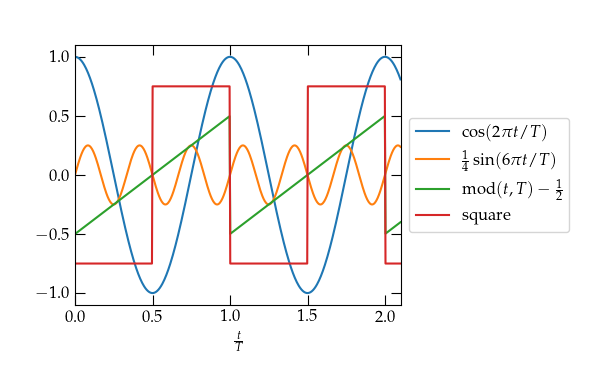
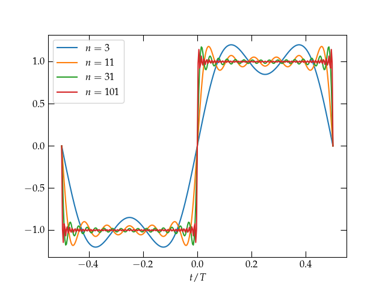
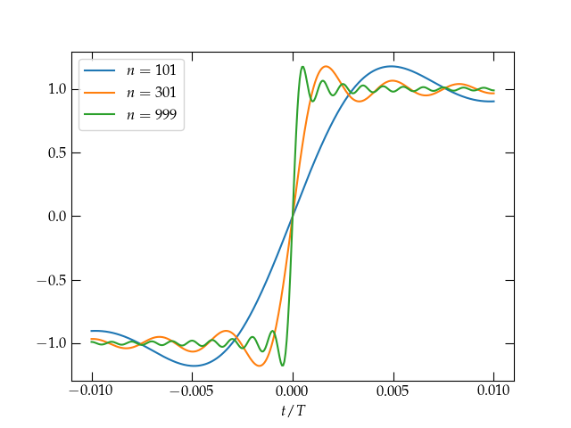
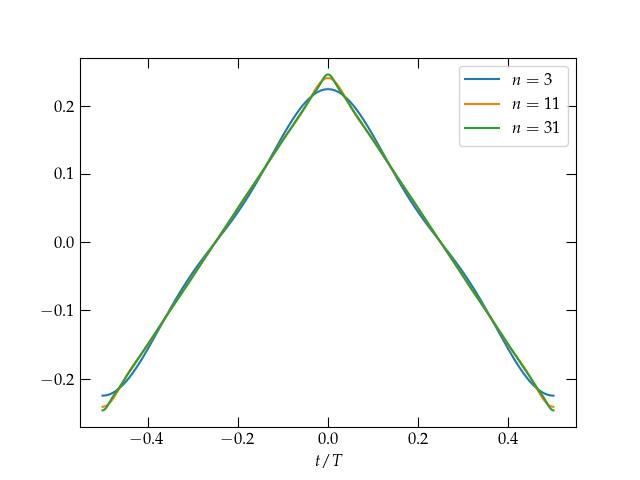
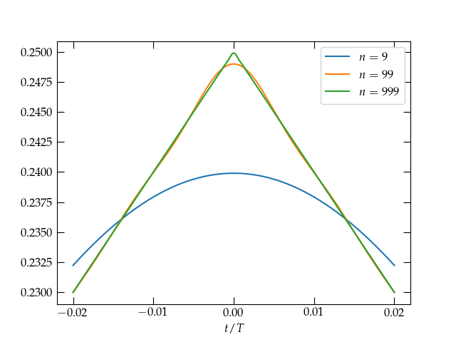

{:menu FO}
{::comment}menu-start{:/comment}

<label id="hamburger-menu"></label>

<ul>
<li><a href="FO-Intro.html">Introduction to Fourier Series and Transforms</a></li>
<li><a href="FO-ComplexVariables.html">Complex Variables</a></li>
<li><a href="FO-FourierSeries.html">Fourier Series</a></li>
<li><a href="FO-FourierTransforms.html">Fourier Transforms</a></li>
</ul>

{::comment}menu-end{:/comment}

# Fourier Series

* toc
{:toc}

[Back to the top](index.md)

+ Series to represent periodic functions
+ Convergence, Gibbs
+ integration and differentiation (?)
+ Dirac delta function, definition, real, and Fourier representation
+ Periodic boundary conditions

## Periodic Functions

A periodic function with period $$T$$ has the property that
\\[
    f(t+T) = f(t)
\\]
for all $$t$$. You are already familiar with a large class of periodic functions, the trigonometric functions sine, cosine, and tangent, along with their reciprocals, but these just scratch the surface. 

  

A few functions with period $$T$$.

## Series Representation of Periodic Functions

Let $$f(t)$$ be an arbitrary periodic function with period $$T$$. Can we find a series representation of $$f(t)$$ in terms of the very well-behaved trigonometric functions, sine and cosine? The most general combination of all sines and cosines with period $$T$$ would have the form
\begin{equation}\label{eq:fourierseries}
    f(t) = a_0 + \sum\_{n=1}^\infty
    \qty[a\_n \cos \qty(\frac{2 \pi n t}{T}) + 
        b\_n \sin \qty(\frac{2 \pi n t}{T})]
\end{equation}
where I have explicitly factored out the cosine term with $$n = 0$$, and the coefficients $$a_n$$ and $$b_n$$ are as yet unknown. This form of series is called a **Fourier series**, and Fourier found a straightforward way to determine these unknown coefficients.

The method relies on a perhaps surprising property of these trigonometric functions. First off, note that the product of two functions with period $$T$$ is itself a periodic function with period $$T$$. Second, if any of these functions is multiplied by itself, it oscillates between 0 and 1, instead of between $$-1$$ and 1. Instead of averaging to zero if we integrate over a period, the square of one of these functions averages to $$\frac12$$. The one exception is the constant function 1 ($$a_0$$), which of course averages to 1 ($$a_0$$). We say that the basis functions,
\\[
    \sin\qty(\frac{2\pi n t}{T}) \qqtext{and}
    \cos\qty(\frac{2\pi n t}{T})
\\]
are orthogonal to one another under integration over a period:
\begin{align}
  \int\_0^T \sin\qty(\frac{m 2\pi t}{T})
  \sin\qty(\frac{n 2\pi t}{T}) \;dt &= \begin{cases}  
  \frac{T}{2} & m = n \\\ 
  0 & m \ne n
  \end{cases} \label{eq:sinsin}
   \\\ 
  \int\_0^T \sin\qty(\frac{m 2\pi t}{T})
  \cos\qty(\frac{n 2\pi t}{T}) \;dt &= 0
  \\\ 
  \int\_0^T \cos\qty(\frac{m 2\pi t}{T})
  \cos\qty(\frac{n 2\pi t}{T}) \;dt &= \begin{cases}  
  T & m = n = 0 \\\ 
  \frac{T}{2} & m = n > 0 \\\ 
  0 & m \ne n
  \end{cases}
\end{align}
Can we prove these?

I will prove Eq. (\ref{eq:sinsin}), leaving the other two as the proverbial exercise for the reader. The proof relies on the trigonometric identity
\begin{equation}\label{eq:cossum}
    \cos(\alpha \pm \beta) = \cos\alpha\cos\beta \mp
    \sin\alpha\sin\beta
\end{equation}
which is straightforward to prove using Euler's identity,
\\[
    e^{i \theta} = \cos\theta + i \sin\theta
\\]
and letting $$\theta = \alpha \pm \beta$$.
Subtracting the sum formula from the difference gives
\\[
    \cos(\alpha - \beta) - \cos(\alpha + \beta) = 2 \sin\alpha \sin\beta
\\]
Therefore,
\\[
  \int\_0^T \sin\qty(\frac{m 2\pi t}{T})
  \sin\qty(\frac{n 2\pi t}{T}) \;dt =
  \frac12 \int\_0^T \qty[\cos\qty(\frac{(m-n)2\pi t}{T}) -
      \cos\qty(\frac{(m+n)2\pi t}{T})
  ] \; dt
\\]
The second term integrates to
\\[
    -\frac12 \int\_0^T 
      \cos\qty(\frac{(m+n)2\pi t}{T})
  \; dt = -\frac12 \qty[\frac{T}{(m+n)2\pi} \sin\qty(\frac{(m+n)2\pi t}{T})]_0^T = 0
\\]
since the integrated expression vanishes at both endpoints. 

If $$m\ne n$$ we get the same expression with $$m+n \to m-n$$, which vanishes for the same reason. However, if $$m=n$$, the first cosine term is just the constant 1, so it integrates to $$\frac{T}{2}$$.

The strategy for determining the coefficients $$a_n$$ and $$b_n$$ is now clear. To deduce $$b_m$$, multiply Eq. (\ref{eq:fourierseries}) by $$\sin(m 2 \pi t/T)$$ and integrate over a full period. The only term that survives on the right-hand side has coefficient $$b_m$$. Therefore,
\begin{equation}\label{eq:bn}
    b_m = \frac{2}{T} \int_0^T \sin\qty(\frac{m 2 \pi t}{T}) f(t) \; dt
\end{equation}

By similar reasoning, we get that
\begin{align}
  a_0 &= \frac{1}{T} \int\_0^T f(t) \; dt  \label{eq:a0} \\\ 
  a_m &= \frac{2}{T} \int\_0^T \cos \qty(\frac{m 2 \pi t}{T}) f(t) \; dt \qquad m > 0 \label{eq:an}
\end{align}

### Example

Let's see if we can determine the Fourier series for the square wave defined on the interval $$-\frac{T}{2} \le t < \frac{T}{2}$$ by
\begin{equation}\label{eq:square}
    f(t) = \begin{cases}
      -1 & -\frac{T}{2} \le t < 0 \\\ 
      +1 & 0 < t < \frac{T}{2}
    \end{cases}
\end{equation}
and periodic with period $$T$$. 

Consider first the cosine terms given by Eqs. (\ref{eq:a0}) and (\ref{eq:an}). All of them are even functions on this interval, $$f(-t) = f(t)$$,
whereas $$f(t)$$ is odd, $$f(-t) = -f(t)$$. Their product, therefore, is odd and integrates to zero. Hence, $$a_n = 0$$ by symmetry for all $$n$$. 

What about for the sine terms? All of them are odd, so we can't use the same symmetry argument to get rid of them. However, the product of two odd functions is an even function, and so it will suffice to double the value of the integral of Eq. (\ref{eq:bn}) over the range $$0 \le t \le T/2$$ to solve for $$b_n$$:
\begin{align}
  b\_n &= 2 \times \frac{2}{T} \int_0^{T/2} \sin\qty(\frac{2\pi n t}{T})\;dt \notag \\\ 
  &= \frac{4}{T} \; \left. -\frac{T}{2\pi n} \cos\qty(\frac{2\pi n t}{T})\;dt \right|_0^{T/2} \notag \\\ 
    &= \frac{2}{n\pi} \qty[1 - \cos(n\pi)] \notag
\end{align}
When $$n$$ is even, this expression vanishes; when $$n$$ is odd, it equals 2. So, we have determined that
\\[
    \boxed{
        f(t) = \frac{4}{\pi} \sum\_{n = 1}^\infty \frac1n
    \sin\qty(\frac{  2\pi n t}{T}) \qquad (n\text{ odd})
    }
\\]

What does this look like? To get some idea, we can truncate the infinite sum at a finite number of terms and get a sense for how it is converging. We can use the following bit of Python code to great a plot:

~~~~ python
t = np.linspace(-0.5,0.5,341)
fig, ax = plt.subplots()
ω = 2*np.pi
curves = (3, 11, 31, 101)
y = np.zeros(len(t))
for n in range(1, 102, 2):
    y += 4/(n*np.pi) * np.sin(ω*n*t)
    if n in curves:
        ax.plot(t, y, label=r"$n = %d$" % n)
ax.set_xlabel("$t / T$")
ax.legend();
~~~~

  

The Fourier series representation of the square wave defined in Eq. (\ref{eq:square}) for terms through the given order $$n$$. Increasing numbers of terms allow the series to approach ever more closely the constant value 1 for $$0 < t < \frac{T}{2}$$, but there appears to be a persistent overshoot at the discontinuities, which is called the **Gibbs phenomenon**.

Stopping after just two terms ($$n=3$$) does not make a very convincing representation of the square wave, but as we add more and more terms, it does indeed appear that the Fourier series is at least trying to converge to $$f(t)$$, at least away from its points of discontinuity. Let’s hone in on the region around $$t = 0$$.

  

At the point of discontinuity at $$t = 0$$, the series is clearly converging to the midpoint between the limit values on either side. As the number of terms increases, the transition from $$-1$$ to $$1$$ grows narrower, but the **Gibbs** overshoot phenomenon persists. See problem x.

The rate of convergence of this series is quite slow because of the discontinuity at $$t = 0$$ and the endpoints. We can explore the rate of convergence by investigating a continuous function that lacks a continuous first derivative, such as a triangular wave given by
\\[
    g(t) = \frac12 - \frac{2|t|}{T} \qquad -\frac{T}{2} \le t \le \frac{T}{2}
\\]

  

Truncated Fourier series approximation to
a sawtooth wave. Comparing the rate of convergence to the discontinuous square wave, it clearly takes many fewer terms for the Fourier series to converge to this continuous function that lacks a continuous first derivative.

  

Near a point of discontinuity in the first derivative, the rate of convergence is slower, although still significantly faster than in the first example.

## Now what?
