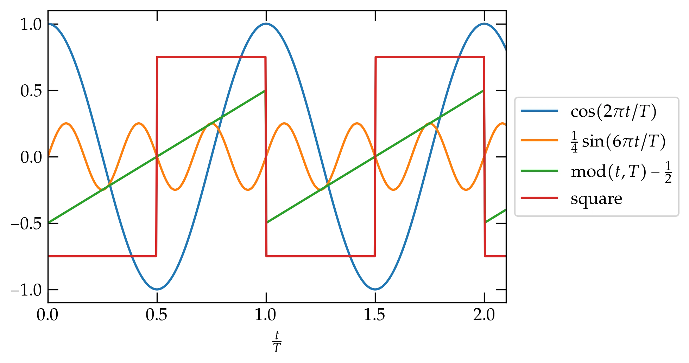

{:menu FO}

# Fourier Series

* toc
{:toc}

[Back to the top](index.md)

A Maclaurin series seeks to represent an arbitrary differentiable function, $$f(x)$$, in a power series as
\begin{equation}
  f(x) = f(0) + f'(0) x + \frac{f^{\prime\prime}(0)}{2!}x^2 + \cdots =
  \sum_{n=0}^\infty \frac{f^{(n)}(0)}{n!} x^n
\end{equation}
We showed that such series are unique, implying that the functions $$x^n$$ are linearly independent basis vectors. What other functions might we use in a general series expansion? In particular, suppose that we are interested in representing periodic functions.

## Periodic Functions

A periodic function with period $$T$$ has the property that
\\[
    f(t+T) = f(t)
\\]
for all $$t$$. You are already familiar with a large class of periodic functions, the trigonometric functions sine, cosine, and tangent, along with their reciprocals, but these just scratch the surface. 

  

A few functions with period $$T$$.

## Series Representation of Periodic Functions

Let $$f(t)$$ be an arbitrary periodic function with period $$T$$. Can we find a series representation of $$f(t)$$ in terms of the very well-behaved trigonometric functions, sine and cosine? The most general combination of all sines and cosines with period $$T$$ would have the form
\begin{equation}\label{eq:fourierseries}
    f(t) = a_0 + \sum\_{n=1}^\infty
    \qty[a\_n \cos \qty(\frac{2 \pi n t}{T}) + 
        b\_n \sin \qty(\frac{2 \pi n t}{T})]
\end{equation}
where I have explicitly factored out the cosine term with $$n = 0$$, and the coefficients $$a_n$$ and $$b_n$$ are as yet unknown. Apart from the lead constant, which represents the average value of the function, all terms in the series have frequencies that are integer multiples of the fundamental frequency, $$\nu = 1/T$$. This form of series is called a **Fourier series**, and Fourier found a straightforward way to determine these unknown coefficients.

The method relies on a perhaps surprising and deep property of these trigonometric functions. First, note that the product of two functions with period $$T$$ is itself a periodic function with period $$T$$. Second, if any of these functions is multiplied by itself, it oscillates between 0 and 1, instead of between $$-1$$ and 1. Instead of averaging to zero if we integrate over a period, the square of one of these functions averages to $$\frac12$$. The one exception is the constant function 1 (which multiplies $$a_0$$), which of course averages to $$1 \times a_0$$. We say that the basis functions,
\\[
    \sin\qty(\frac{2\pi n t}{T}) \qqtext{and}
    \cos\qty(\frac{2\pi n t}{T})
\\]
are orthogonal to one another under integration over a period:
\begin{align}
  \int\_0^T \sin\qty(\frac{m 2\pi t}{T})
  \sin\qty(\frac{n 2\pi t}{T}) \;dt &= \begin{cases}  
  \frac{T}{2} & m = n \\\ 
  0 & m \ne n
  \end{cases} \label{eq:sinsin}
   \\\ 
  \int\_0^T \sin\qty(\frac{m 2\pi t}{T})
  \cos\qty(\frac{n 2\pi t}{T}) \;dt &= 0
  \\\ 
  \int\_0^T \cos\qty(\frac{m 2\pi t}{T})
  \cos\qty(\frac{n 2\pi t}{T}) \;dt &= \begin{cases}  
  T & m = n = 0 \\\ 
  \frac{T}{2} & m = n > 0 \\\ 
  0 & m \ne n
  \end{cases}
\end{align}
Can we prove these?

I will first prove Eq. (\ref{eq:sinsin}) using "classic trig". The proof relies on the trigonometric identity
\begin{equation}\label{eq:cossum}
    \cos(\alpha \pm \beta) = \cos\alpha\cos\beta \mp
    \sin\alpha\sin\beta
\end{equation}
which is straightforward to prove using Euler's identity,
\\[
    e^{i \theta} = \cos\theta + i \sin\theta
\\]
and letting $$\theta = \alpha \pm \beta$$.
Subtracting the sum formula from the difference gives
\\[
    \cos(\alpha - \beta) - \cos(\alpha + \beta) = 2 \sin\alpha \sin\beta
\\]
Therefore,
\\[
  \int\_0^T \sin\qty(\frac{m 2\pi t}{T})
  \sin\qty(\frac{n 2\pi t}{T}) \;dt =
  \frac12 \int\_0^T \qty[\cos\qty(\frac{(m-n)2\pi t}{T}) -
      \cos\qty(\frac{(m+n)2\pi t}{T})
  ] \; dt
\\]
The second term integrates to
\\[
    -\frac12 \int\_0^T 
      \cos\qty(\frac{(m+n)2\pi t}{T})
  \; dt = -\frac12 \qty[\frac{T}{(m+n)2\pi} \sin\qty(\frac{(m+n)2\pi t}{T})]_0^T = 0
\\]
since the integrated expression vanishes at both endpoints. 

If $$m\ne n$$ we get the same expression with $$m+n \to m-n$$, which vanishes for the same reason. However, if $$m=n$$, the first cosine term is just the constant 1, so it integrates to $$\frac{T}{2}$$.

The strategy for determining the coefficients $$a_n$$ and $$b_n$$ is now clear. To deduce $$b_m$$, multiply Eq. (\ref{eq:fourierseries}) by $$\sin(m 2 \pi t/T)$$ and integrate over a full period. The only term that survives on the right-hand side has coefficient $$b_m$$. Therefore,
\begin{equation}\label{eq:bn}
    b_m = \frac{2}{T} \int_0^T \sin\qty(\frac{m 2 \pi t}{T}) f(t) \; dt
\end{equation}

By similar reasoning, we get that
\begin{align}
  a_0 &= \frac{1}{T} \int\_0^T f(t) \; dt  \label{eq:a0} \\\ 
  a_m &= \frac{2}{T} \int\_0^T \cos \qty(\frac{m 2 \pi t}{T}) f(t) \; dt \qquad m > 0 \label{eq:an}
\end{align}

### Example

Let's see if we can determine the Fourier series for the square wave defined on the interval $$-\frac{T}{2} \le t < \frac{T}{2}$$ by
\begin{equation}\label{eq:square}
    f(t) = \begin{cases}
      -1 & -\frac{T}{2} \le t < 0 \\\ 
      +1 & 0 < t < \frac{T}{2}
    \end{cases}
\end{equation}
and periodic with period $$T$$. 

Consider first the cosine terms given by Eqs. (\ref{eq:a0}) and (\ref{eq:an}). All of them are even functions on this interval, $$f(-t) = f(t)$$,
whereas $$f(t)$$ is odd, $$f(-t) = -f(t)$$. Their product, therefore, is odd and integrates to zero. Hence, $$a_n = 0$$ by symmetry for all $$n$$. 

What about for the sine terms? All of them are odd, so we can't use the same symmetry argument to get rid of them. However, the product of two odd functions is an even function, and so it will suffice to double the value of the integral of Eq. (\ref{eq:bn}) over the range $$0 \le t \le T/2$$ to solve for $$b_n$$:
\begin{align}
  b\_n &= 2 \times \frac{2}{T} \int_0^{T/2} \sin\qty(\frac{2\pi n t}{T})\;dt \notag \\\ 
  &= \frac{4}{T} \; \left. -\frac{T}{2\pi n} \cos\qty(\frac{2\pi n t}{T})\;dt \right|_0^{T/2} \notag \\\ 
    &= \frac{2}{n\pi} \qty[1 - \cos(n\pi)] \notag
\end{align}
When $$n$$ is even, this expression vanishes; when $$n$$ is odd, it equals 2. So, we have determined that
\\[
    \boxed{
        f(t) = \frac{4}{\pi} \sum\_{n = 1}^\infty \frac1n
    \sin\qty(\frac{  2\pi n t}{T}) \qquad (n\text{ odd})
    }
\\]

What does this look like? To get some idea, we can truncate the infinite sum at a finite number of terms and get a sense for how it is converging. We can use the following bit of Python code to great a plot:

~~~~ python
t = np.linspace(-0.5,0.5,341)
fig, ax = plt.subplots()
ω = 2*np.pi
curves = (3, 11, 31, 101)
y = np.zeros(len(t))
for n in range(1, 102, 2):
    y += 4/(n*np.pi) * np.sin(ω*n*t)
    if n in curves:
        ax.plot(t, y, label=r"$n = %d$" % n)
ax.set_xlabel("$t / T$")
ax.legend();
~~~~

  

The Fourier series representation of the square wave defined in Eq. (\ref{eq:square}) for terms through the given order $$n$$. Increasing numbers of terms allow the series to approach ever more closely the constant value 1 for $$0 < t < \frac{T}{2}$$, but there appears to be a persistent overshoot at the discontinuities, which is called the **Gibbs phenomenon**.

Stopping after just two terms ($$n=3$$) does not make a very convincing representation of the square wave, but as we add more and more terms, it does indeed appear that the Fourier series is at least trying to converge to $$f(t)$$, at least away from its points of discontinuity. Let’s hone in on the region around $$t = 0$$.

  

At the point of discontinuity at $$t = 0$$, the series is clearly converging to the midpoint between the limit values on either side. As the number of terms increases, the transition from $$-1$$ to $$1$$ grows narrower, but the **Gibbs** overshoot phenomenon persists. See problem x.

The rate of convergence of this series is quite slow because of the discontinuity at $$t = 0$$ and the endpoints. We can explore the rate of convergence by investigating a continuous function that lacks a continuous first derivative, such as a triangular wave given by
\\[
    g(t) = \frac12 - \frac{2|t|}{T} \qquad -\frac{T}{2} \le t \le \frac{T}{2}
\\]

  

Truncated Fourier series approximation to
a sawtooth wave. Comparing the rate of convergence to the discontinuous square wave, it clearly takes many fewer terms for the Fourier series to converge to this continuous function that lacks a continuous first derivative.

  

Near a point of discontinuity in the first derivative, the rate of convergence is slower, although still significantly faster than in the first example.

## General Theory

The trigonometric functions satisfy the differential equation
\begin{equation}\label{eq:DE}
  u^{\prime\prime}(x) = \lambda u(x)
\end{equation}
for a (negative) constant $$\lambda$$.
Consider two such solutions, $$u_1^{\prime\prime} = \lambda_1 u_1$$ and $$u_2^{\prime\prime} = \lambda_2 u_2$$.
Now form the quantity
\begin{equation}
  \label{eq:towardBC}
  (u\_1^{\prime\prime})^* u\_2 - (u\_1)^* u\_2^{\prime\prime} =  \lambda\_1^* 
  u\_1^* u_2 - u\_1^* \lambda_2 u_2 = (\lambda_1^* - \lambda_2) u\_1^* u_2
\end{equation}
and integrate from $$a$$ to $$b$$:
\begin{align}
  \int_a^b  [(u\_1^{\prime\prime})^* u\_2 - (u\_1)^* u\_2^{\prime\prime} ] dx &= (\lambda_1^* - \lambda_2) \int_a^b u\_1^* u_2 \, dx  \notag \\\ 
  \left[ u\_1^{\prime*} u\_2 - u_1^\* u_2^\prime \right]_a^b - 
  \int_a^b \left[ u\_1^{\prime\*} u\_2^{\prime} - u\_1^{\prime\*} u\_2^{\prime}\right] \, dx &=
  (\lambda_1^\* - \lambda_2) \int_a^b u\_1^\* u_2 \, dx \notag \\\ 
  \left[ u\_1^{\prime\*} u\_2 - u_1^\* u_2^\prime \right]_a^b  &=
  (\lambda_1^\* - \lambda_2) \int_a^b u\_1^\* u_2 \, dx
\end{align}

The term on the left is called the **bilinear concomitant**. If we use the boundary condition $$u(a) = 0$$ or $$u'(a) = 0$$, and similarly at $$x = b$$, then the bilinear concomitant vanishes.

Let us suppose that we do indeed impose such boundary conditions that make the bilinear concomitant vanish. If $$u_2$$ = $$u_1$$, then we get
\begin{equation}\label{eq:BC0}
  0 = (\lambda_1^\* - \lambda_1) \int_a^b |u_1(x)|^2 \, dx
\end{equation}
Unless $$u_1(x) = 0$$, the integral is positive definite, which implies that $$\lambda_1$$ must be real.

Now let $$\lambda_1$$ differ from $$\lambda_2$$. Then
\begin{equation}\label{eq:orthogonal}
  0 = (\lambda_1 - \lambda_2) \int_a^b u_1^\* u_2 \, dx = (\lambda_1 - \lambda_2) \langle u_1, u_2 \rangle
\end{equation}
Since, by assumption, the eigenvalues differ, the integral (inner product) must vanish. That is, the eigenfunctions corresponding to different eigenvalues are orthogonal in the sense defined by Eq.&nbsp;(\ref{eq:orthogonal}).

### Example

What functions satisfy the differential equation Eq.&nbsp;(\ref{eq:DE}) and the boundary conditions $$u(0) = 0$$ and $$u'(L) = 0$$? Cosine functions are nonzero at the origin, so the boundary condition there rules them out. We must have
\begin{equation}\label{eq:exa}
    u_n(x) = \sin \left[ \left(n+\frac12 \right)\frac{\pi x}{L} \right] \qquad\text{for } n \in \mathbb{Z}
\end{equation}
These functions are orthogonal on the interval $$[0,L]$$ and can be used to represent an arbitrary function on that interval.

As an example, suppose we use a parabolic arc that vanishes at the origin and has zero slope at $$L$$:
\begin{equation}\label{eq:fx}
  f(x) = 1 - \left(\frac{L-x}{L}\right)^2 = \frac{2x}{L} - \frac{x^2}{L^2}
\end{equation}

Using the orthogonality of the functions defined in Eq.&nbsp;(\ref{eq:exa}), you can show that
\begin{equation}\label{eq:result}
  f(x) = \sum_{n = 0}^\infty \frac{32}{\pi^3 (1+2n)^3} \sin\left[\left(n+\frac12\right)\frac{\pi x}{L}\right]
\end{equation}

As is apparent in <a href="#FO-parabola">Figure 4</a>, the series converges extremely rapidly, since the basis function with $$n = 0$$ is a pretty close approximation to the parabola.

  

<a name="FO-parabola">Figure 4</a> — Convergence of the Fourier series representation of the parabolic function defined in Eq.&nbsp;(\ref{eq:fx}). The top panel shows the true function and the Fourier approximation that uses only the terms with $$n=0$$ and $$n=1$$. The bottom panel shows the difference between the truncated series and the true function for different points of truncation.

The convergence of the previous example seems a bit too good. What happens if we ask the Fourier series to converge to a function that is inconsistent with the boundary conditions we have imposed? Suppose, for instance, that we use the same basis functions of Eq.&nbsp;(\ref{eq:exa}) to represent a parabola that peaks not at $$x = L$$ but in the middle of the range? The result is 
\begin{equation}\label{eq:awk}
  g(x) = \frac{4}{L^2} x (L-x) = \sum_{n=0}^\infty \frac{16 - 8 \pi (n+\frac12) (-1)^n}{[\pi(n+\frac12)]^3}
  \sin\left[\pi (n+\frac12)\frac{x}{L}\right]
\end{equation}
illustrated in <a href="#convslow">Figure 5</a>.

  

<a name="convslow">Figure 5</a> — Convergence of the Fourier series using basis functions to represent a parabola that is symmetric in the interval $$[0, L]$$. The percentage shown in the legend is the value of $$\sqrt{ \langle f-s_n, f-s_n\rangle }$$.

  

<a name="FOawk">Figure 6</a> — Same as above, but showing versions of the series through increasing number of terms. The series converges more slowly than the parabola that agrees with the boundary conditions. Note the additional power of $$n$$ in the numerator.

## Parseval's Identity

When the bilinear concomitant vanishes, we are guaranteed that basis eigenfunctions $$u_n(x)$$ corresponding to different eigenvalues $$\lambda_n$$ are orthogonal: $$\ev{u_m, u_n} = 0$$ when $$m \ne n$$. Let us also assume that we have normalized the basis functions so that
\begin{equation}\label{eq:normalization}
  \ev{u_m, u_n} = \delta_{mn}
\end{equation}
(Remember that our inner product is defined as $$\ev{u_m, u_n} = \int_a^b u_m^*(x) u_n(x) \dd{x}$$.)
That is, the functions $$u_n$$ for an **orthonormal basis** for functions on the interval $$a \le x \le b$$, which means that we can represent an arbitrary function $$f(x)$$ as
\begin{equation}\label{eq:arbf}
  f(x) = \sum_{n} a_n u_n(x)
\end{equation}
and we can evaluate the coefficients $$a_n$$ via $$a_n = \ev{u_n, f}$$. Put another way, 
\begin{equation}\label{eq:compact}
  f(x) = \sum_n \ev{u_n, f} u_n(x)
\end{equation}
which is precisely parallel to using an orthonormal basis of $$\mathbb{R}^n$$ via
\begin{equation}\label{eq:vector}
  \va{r} = \sum_n \ev{\vu{e}_n, \va{r}} \vu{e}_n
\end{equation}

Compute
\begin{align}
  \int_a^b |f(x)|^2 \dd{x} &= \int_a^b \dd{x} \left[ \sum_m a_m u_m(x) \right]^\* 
  \left[ \sum_n a_n u_n(x) \right] \notag \\\ 
  \ev{f,f} &= \sum_{m,n} a_m^* a_n \ev{u_m, u_n} = \sum_n |a_n|^2 \ev{u_n, u_n} \notag \\\ 
  \ev{f,f} &= \sum_n |a_n|^2 \label{eq:Prseval}
\end{align}
The last line, Eq.&nbsp;(\ref{eq:Prseval}), is **Parseval's identity**. As a mathematical result, it is akin to the **Pythagorean theorem**; we add up the squares of the components of a vector and we get its magnitude squared. But, it also has an important physical interpretation. The energy in an oscillatory function (a wave) is proportional to its amplitude squared. The coefficients $$|a_n|$$ represent the energy in each basis function. 

<!--
1. Have them work out some series of varying symmetry
2. Have them confirm appropriate orthogonality integrals
3. Investigate the root-mean-square difference between the truncated series and the original function as a function of the number of terms in the series? (i.e., rate of convergence)
4. Evaluate Gibbs overshoot.
5. Analytic investigation of the role discontinuity in the $$n$$th derivative on the rate of convergence?
-->