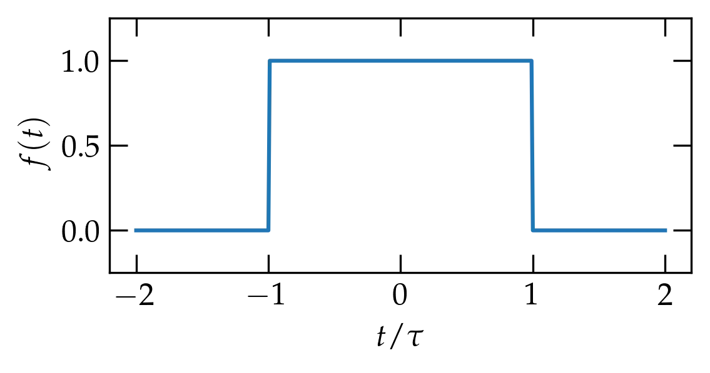
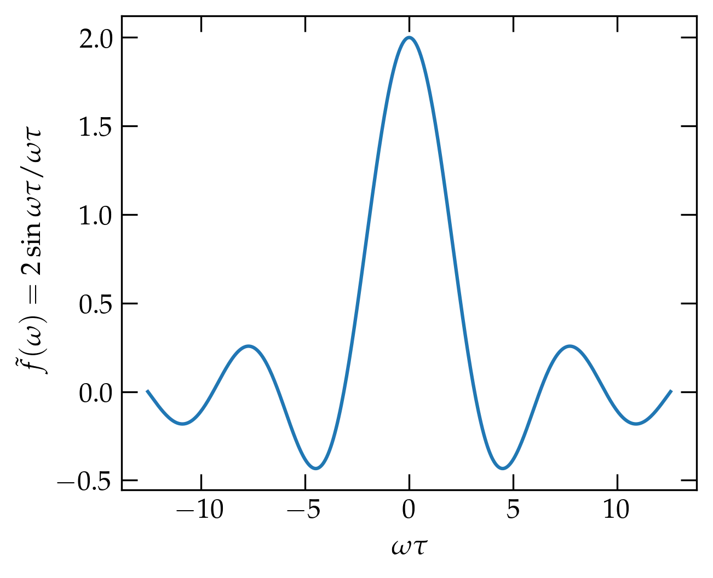
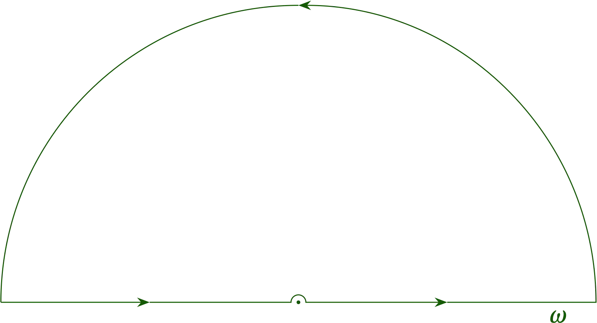

{:menu FO}

# Fourier Transforms

* toc
{:toc}

[Back to the top](index.md)

## Definition

In Engineering 79 you got some practice using **Laplace transforms** to convert differential equations into algebraic equations. Recall that the Laplace transform of a function $$f(t)$$ is given by
\\[
  F(s) = \int_{0}^{\infty} f(t) e^{-st}\dd{t}
\\]
After performing various algebraic manipulations in "Laplaceland", you either recognized the resulting function as the Laplace transform of a known function of time, or you used a table of transforms to perform the inversion.

A **Fourier transform** is similar in some respects, but has a more symmetric structure for going between time- and frequency-space. It may be defined by
\begin{align}
  \tilde{f}(\omega) &= \int_{-\infty}^\infty f(t) e^{-i\omega t} \dd{t}  \label{eq:FT1} \\\ 
  f(t) &= \frac{1}{2\pi} \int_{-\infty}^\infty  \tilde{f}(\omega) e^{i\omega t}\dd{\omega} \label{eq:FT2}
\end{align}
I say "may be" because different authors use different conventions on how to distribute the factor of $$1/2\pi$$ between the two expressions. For example, it is common in quantum mechanics to symmetrize by putting a factor of $$1/\sqrt{2\pi}$$ in front of each integral.

Before attempting to justify these two expressions, let's play around a bit. Suppose, for instance, that $$f(t) = \cos(\Omega t)$$, a cosine wave at angular frequency $$\Omega$$. If we substitute into Eq. (\ref{eq:FT2}), we get
\\[
    \cos\Omega t = \frac{e^{i\Omega t} + e^{-i\Omega t}}{2} 
    = \frac{1}{2\pi} \int_{-\infty}^{\infty}
    \tilde{f}(\omega) e^{i\omega t} \dd{\omega}
\\]
On the right-hand side, we integrate over all frequencies, but on the left-hand side we have a sum of just two frequencies, $$\Omega$$ and $$-\Omega$$. Evidently, $$\tilde{f}(\omega)$$ must be zero when $$\omega \ne \pm \Omega$$. On the other hand, it must really blow up when $$\omega = \pm \Omega$$ in just the right way so that integrating over the spike gives the finite results on the left. That is, it must be
\\[
    \tilde{f}(\omega) = \pi \delta(\omega - \Omega) + \pi \delta (\omega + \Omega)
\\]
where the **Dirac delta function** is the limiting case of a peak with unit area as its width shrinks to zero. See [the page on the Dirac delta function](FO-Delta.md) for details about $$\delta(x)$$.

## The Limit of a Fourier Series

As usual, we will sneak up on the infinite interval by working on the interval  $$-T \le t \le T$$ and then gently taking the limit as $$T\to\infty$$. I will use the basis functions
\begin{equation}\label{eq:basis}
  u(t) = e^{i \omega t} \qqtext{where} u(-T) = e^{-i\omega T} = u(T) = e^{i\omega T}
\end{equation}
which implies that
\begin{equation}\label{eq:omegas}
  e^{2 i \omega T} = 1 \qqtext{or} 2\omega T = 2 \pi n \qqtext{so} \boxed{
    u_n(t) = e^{i \omega_n t}
  \qqtext{where}  \omega_n = 2\pi n / (2T) = n\pi / T }
\end{equation}
for integer $$n$$. Note that these basis functions are not normalized, since
\\[
    \ev{u_n, u_m} = 2 T \delta_{n m}
\\]
A Fourier series representation of $$f(t)$$ using these basis functions is thus
\begin{equation}\label{eq:FSrep}
  f(t) = \sum_{n = -\infty}^\infty a_n u_n(t) = \frac{1}{2T} \sum_{n=-\infty}^{\infty} \ev{u_n, f} u_n(t)
  = \frac{1}{2T} \sum_{n=-\infty}^\infty \int_{-T}^{T} \dd{t}' e^{-i \omega_n t'} f(t') \; e^{i \omega_n t}
\end{equation}
where in the final expression I explicitly indicate the dummy variable of integration, since by the time we have taken the inner product $$\ev{u_n,f}$$ there is no remaining time variable.

As $$T$$ gets large, the "distance" between successive values of $$\omega_n$$, 
\\[
    \Delta \omega = \omega_{n+1} - \omega_n = \frac{\pi}{T}
\\]
gets very small. Let's use this relation to modify the prefactor in the expansion:
\begin{equation}\label{eq:gettingthere}
  f(t) = \sum_{n=-\infty}^{\infty} \frac{\Delta \omega}{2\pi} 
  \underbrace{\left[ \int_{-T}^{T} \dd{t'} e^{-i \omega_n t'} f(t') \right]}_{\tilde{f}(\omega_n)} \; e^{i\omega_n t}
\end{equation}
We will define the integral in brackets as the function $$\tilde{f}(\omega_n)$$; provided that $$f(t')$$ goes to zero strongly enough as $$|t'|$$ gets large, this integral should converge to a well-defined function of $$\omega_n$$ in the limit as $$T \to \infty$$. Then
\begin{equation}\label{eq:there}
  f(t) = \frac{1}{2\pi} \sum\_{n = -\infty}^{\infty} \Delta \omega \tilde{f}(\omega_n) e^{i\omega_n t} = \frac{1}{2\pi} \int\_{-\infty}^{\infty} \tilde{f}(\omega) e^{i\omega t} \dd{\omega}
\end{equation}
where in the final step we have converted the infinite sum into an integral, as appropriate as $$T \to \infty$$.
Thus, we see that Eqs.&nbsp;(\ref{eq:FT1}) and (\ref{eq:FT2}) are indeed consistent with taking the limit of a Fourier series representation of a function $$f$$ as the range of periodicity tends to infinity.

## Example: a Step Function

Consider a unit step function $$f(t)$$,
\begin{equation}\label{eq:ft}
  f(t) = \begin{cases} 1 & -\tau < t < \tau \\\ 0 & \text{otherwise} \end{cases}
\end{equation}

  

It clearly vanishes strongly enough as $$|t|$$ grows large, so we should have no problem computing its Fourier transform:
\begin{equation}\label{eq:ftofstep}
     \tilde{f}(\omega) = \int_{-\infty}^\infty f(t) e^{-i\omega t}\dd{t}
    = \int _{-\tau}^\tau e^{-i\omega t}\dd{t} = \frac{e^{-i\omega\tau} - e^{i\omega\tau}}{-i\omega} =
    \frac{2 \sin \omega \tau}{\omega} 
\end{equation}

  

<a name="sinc">Figure 1</a> — The Fourier transform of a unit step centered on the origin (Eq.&nbsp;(\ref{eq:ft}), which is given by Eq.&nbsp;(\ref{eq:ftofstep}). Note that the longer the step, the narrower the range of frequencies $$\omega$$ spanned by the central peak.

### Inversion

Suppose we were given $$\tilde{f}(\omega) = \frac{2}{\omega} \sin \omega \tau$$. Could we use Eq.&nbsp;(\ref{eq:FT2}) to deduce the original function of time? That is, can we evaluate
\\[
  g(t) =  \frac{1}{2\pi} \int_{-\infty}^\infty \frac{e^{i\omega \tau} - e^{-i\omega\tau}}{i\omega} e^{i\omega t} \dd{\omega}
\\]
This function, $$g(t)$$, is the sum of two functions of the basic form
\\[
  h(T) = \frac{1}{2\pi i} \int_{-\infty}^{\infty} \frac{e^{i\omega T}}{\omega} \dd{\omega}
\\]
for some value of $$T$$. However, the pole at $$\omega \to 0$$ lies smack-dab on the path of integration, which would appear to be a problem.

Cauchy worried about this issue and defined the **Cauchy principal value** of the integral via Eq.&nbsp;\ref{eq:CPV}
\begin{equation}\label{eq:CPV}
  \lim_{\epsilon \to 0} \frac{1}{2\pi i} \left( \int_{-\infty}^{-\epsilon} \frac{e^{i\omega T}}{\omega} \dd{\omega} +\int^{\infty}_{\epsilon} \frac{e^{i\omega T}}{\omega} \dd{\omega}
  \right)
\end{equation}
That is, we integrate just short of the pole on the negative side, and pick up just after the pole on the positive side. In view of the fact that the integrand looks odd in the neighborhood of the origin, we might expect the explosion to cancel by symmetry.

 We can evaluate this integral via contour integration, although we have to make a slight detour around the pole at $$\omega = 0$$, which lies directly on the path of integration.
Let us suppose for the moment that $$T$$ is positive (we'll worry about negative $$T$$ momentarily). When $$T > 0$$, we can close the contour in the upper half-plane, because the integrand goes exponentially to zero as the radius of the semicircle approaches infinity. So, we contemplate a slightly distorted contour, as illustrated in <a href="#avoidance">Figure&nbsp;2</a>, in which we make a slight detour to avoid the pole at the origin. In making this detour, we have indeed altered the value of the integral, but we can readily compute by how much. Along the tiny semicircle at radius $$\epsilon$$, $$\omega = \epsilon e^{i\phi}$$ and the path integral from $$\phi=\pi$$ to $$\phi=0$$ evaluates to
\begin{equation}\label{eq:detour}
  \int \frac{e^{i\omega T}}{\omega} \dd{\omega} = \int_\pi^0 \frac{e^{i\omega T}}{\epsilon e^{i\phi}} i\epsilon e^{i\phi}\dd{\phi} = -\int_0^\pi e^{i \epsilon T(\cos\phi + i\sin\phi)} i \dd{\phi}
\end{equation}
In the limit as $$\epsilon \to 0$$, the integral is equal to $$-i\pi$$. That is, **it is equal to $$-\frac12$$ of the value in integrating entirely around the pole**. It is negative, because we are going around the pole backwards, and it is half because we only go halfway around. Since the closed contour encloses no poles, the value of the integral on the contour is zero, but we must subtract the contribution we introduced by distorting the contour. So, we get that 
\\[
    h(T) = \frac{1}{2\pi i} i\pi = \frac12 \qqtext{for} T > 0
\\]

> Of course, we could have distorted the contour to go around the pole in the positive direction by making a little semicircle *underneath* the pole, which would then have rendered the pole entirely in the contour. However, we then need to subtract the contribution we get integrating around the tiny semicircle, which would be $$\frac{1}{2\pi i} (i\pi) = \frac12$$, from the full value of the pole, which is 1, which gives the same final answer of $$h(T) = \frac12$$.

  

<a name="avoidance">Figure 2</a> — The pole at the origin lies directly on the contour. We consider distorting the contour in a tiny semicircle in the neighborhood of the origin, as suggested in the figure.

You can readily show that if $$T < 0$$, we must close in the lower half-plane, meaning that we need to traverse the contour in the negative direction. Of course, the pole has the same residue, so we get $$h(T) = -\frac12$$ in this case.

Combining these two results, we get
\\[
    g(t) = \frac12 \left[\mathrm{sgn}(t+\tau) - \mathrm{sgn}(t-\tau) \right]
\\]
where 
\begin{equation}\label{eq:sgn}
  \mathrm{sgn}(x) = \begin{cases}
    1 & x > 0 \\\ 
    -1 & x < 0 \\\ 
    0 & x = 0
    \end{cases}
\end{equation}
This function does indeed give back the original unit step function, $$f(t)$$.

## A Gaussian

Most Fourier transforms in frequency don't look much like the temporal function from which they are computed. An exception is a gaussian, $$f(t) = \exp(-t^2/\tau^2)$$ as we can readily work out from the general expression for Gaussian integrals,
\begin{equation}\label{eq:gaussian}
  \int_{-\infty}^\infty e^{-\alpha x^2 - \beta x - \gamma} \dd{x} = \sqrt{\frac{\pi}{\alpha}} e^{\beta^2/4\alpha - \gamma}
\end{equation}
as we derived in class. The Fourier transform of Eq.&nbsp;(\ref{eq:gaussian}) is
\begin{equation}\label{eq:ftg}
  \tilde{f}(\omega) = \int_{-\infty}^{\infty} e^{-i\omega t} e^{-t^2/\tau^2}\dd{t}
\end{equation}
which means that $$\alpha = 1/\tau^2$$ and $$\beta = i\omega$$. Using these values in Eq.&nbsp;(\ref{eq:gaussian}), we get
\begin{equation}\label{eq:ftga}
  \tilde{f}(\omega) = \tau\sqrt{\pi} e^{-\omega^2 \tau^2/4}
\end{equation}
*which is also a gaussian*. Notice that the Fourier transform of a function of time has dimensions of time, as is clear from the definition of the transform.

A classical simple harmonic oscillator has the energy equation
\\[
    E = \frac{k}{2} x^2 + \frac{1}{2m} p^2
\\]
which suggests that position $$x$$ and momentum $$p$$ play identical roles in determining the energy. When you study the quantum simple harmonic oscillator in Physics 52 and later in Physics 116, you will see that the ground state of a simple harmonic oscillator is indeed a gaussian when "projected" into position space (meaning as a function of $$x$$) or when projected into momentum space (as a function of $$p = kx$$). You may suspect that the symmetry of the roles played by position and momentum in the energy of a harmonic oscillator would make **all** quantum mechanical solutions (eigenfunctions) of the harmonic oscillator potential have the same form in positions space (as functions of $$x$$) and in momentum space; you will have a chance to confirm an example in homework.

Another example function that arises in physics with this property is the hyperbolic secant, which often describes the temporal profile of an ultrashort laser pulse,
\\[
    f(t) = \frac{A}{\cosh (t/\tau)} = A \sech(t/\tau)
\\]

# Convolution

The **convolution** of functions $$f(t)$$ and $$g(t)$$ is defined by
\begin{equation}\label{eq:convolution}
   (f * g)(t) = \int_{-\infty}^{\infty} g(t') f(t - t') \dd{t'}
\end{equation}
and represents how one signal gets smeared out by another (such as a system response function). The convolution of two functions has a particularly straightforward representation in terms of their Fourier transforms. Given
\begin{align}
  \tilde{f}(\omega) &= \int_{-\infty}^\infty f(t) e^{-i\omega t} \dd{t}  \notag \\\ 
  \tilde{g}(\omega) &= \int_{-\infty}^\infty g(t) e^{-i\omega t} \dd{t}  \notag
\end{align}
then
\begin{align}
  (f*g)(t) &= \int_{-\infty}^{\infty}\dd{t'} 
  \frac{1}{2\pi} \int_{-\infty}^{\infty} \dd{\omega} \tilde{f}(\omega) e^{i\omega t'}
  \frac{1}{2\pi} \int_{-\infty}^{\infty} \dd{\Omega} \tilde{g}(\Omega) e^{i\Omega (t-t')} \notag \\\ 
  &= \frac{1}{2\pi} \int_{-\infty}^{\infty} \dd{\omega} \tilde{f}(\omega)
  \int_{-\infty}^{\infty} \dd{\Omega} \tilde{g}(\Omega) e^{i\Omega t}
  \underbrace{\frac{1}{2\pi} \int\_{-\infty}^{\infty} \dd{t'} e^{i (\omega - \Omega) t'}}\_{\delta(\omega-\Omega)} \notag \\\ 
  &= \frac{1}{2\pi} \int_{-\infty}^{\infty} \dd{\omega} \tilde{f}(\omega) \tilde{g}(\omega) e^{i\omega t}
\end{align}
That is, **the Fourier transform of the convolution is the product of the Fourier transforms**. This result is known as the **convolution theorem**.

# Correlation

The **correlation** of functions $$f(t)$$ and $$g(t)$$ is closely related to the convolution operation just described. It is defined by
\begin{equation}\label{eq:correlation}
  \mathrm{Corr}(f, g)(t) = \int_{-\infty}^{\infty} f(\tau) g(\tau+t) \dd{\tau}
\end{equation}
You may readily confirm that the Fourier transform of the correlation is the product of $$\tilde{f}(\omega) [\tilde{g}(\omega)]^*$$, which is known as the **correlation theorem**.

By extension, the autocorrelation of a function with itself satisfies
\begin{equation}\label{eq:autocorrelation}
  \mathrm{FT}\qty[\mathrm{Corr}(f, f)
  ] = |\tilde{f}(\omega)|^2
\end{equation}
which is known as the **Wiener-Khinchin theorem**. The autocorrelation of a function describes how self-similar it is at various delays.
