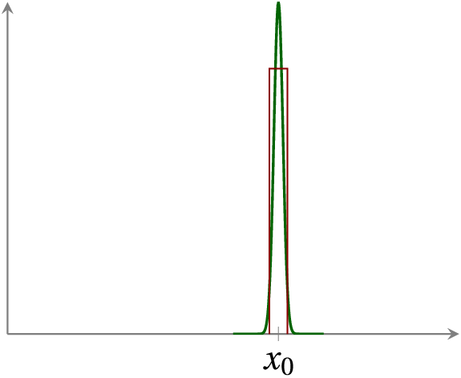
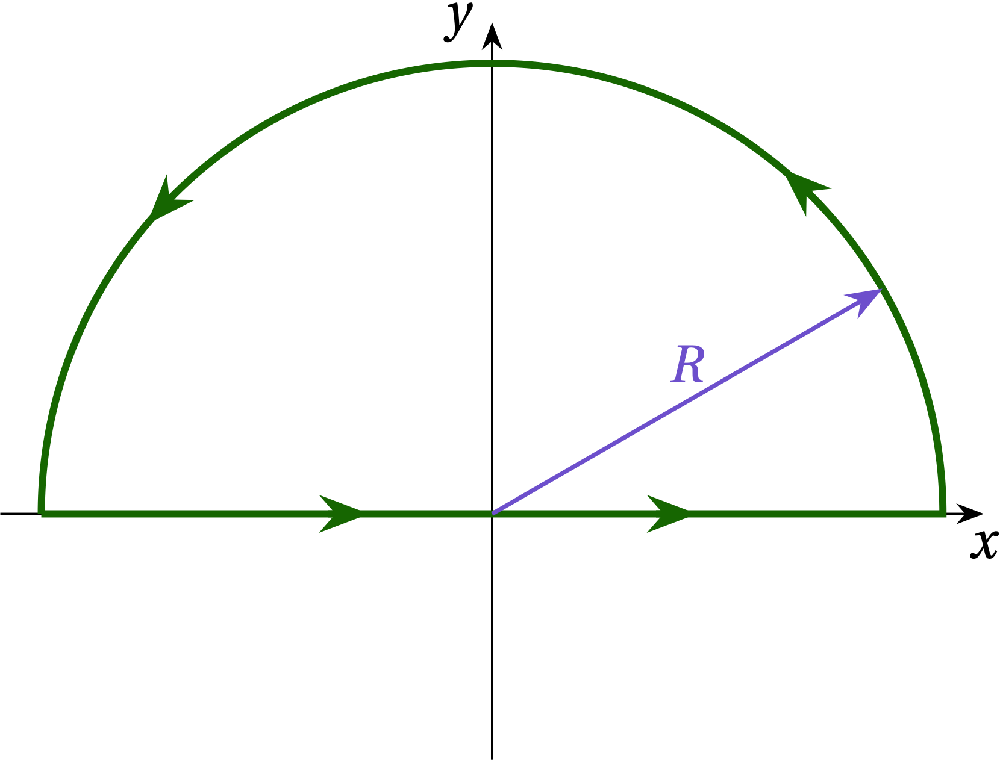
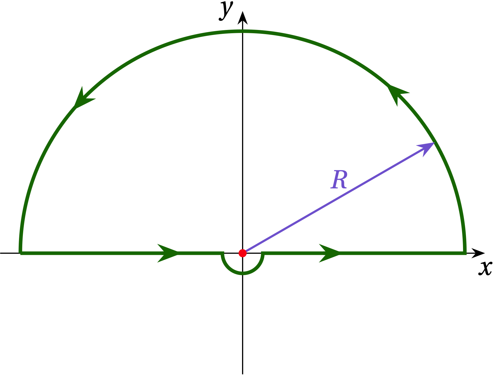

{:menu FO}
{::comment}menu-start{:/comment}

<label id="hamburger-menu"></label>

<ul>
<li><a href="FO-Intro.html">Introduction to Fourier Series and Transforms</a></li>
<li><a href="FO-ComplexVariables.html">Complex Variables</a></li>
<li><a href="FO-Series.html">Series</a></li>
<li><a href="FO-FourierSeries.html">Fourier Series</a></li>
<li><a href="FO-FourierTransforms.html">Fourier Transforms</a></li>
</ul>

{::comment}menu-end{:/comment}

# Fourier Transforms

* toc
{:toc}

[Back to the top](index.md)

## Definition

In Engineering 79 you got some practice using **Laplace transforms** to convert differential equations into algebraic equations. Recall that the Laplace transform of a function $$f(t)$$ is given by
\\[
  F(s) = \int_{0}^{\infty} f(t) e^{-st}\dd{t}
\\]
After performing various algebraic manipulations in "Laplaceland", you either recognized the resulting function as the Laplace transform of a known function of time, or you used a table of transforms to perform the inversion.

A **Fourier transform** is similar in some respects, but has a more symmetric structure for going between time and frequency space. It may be defined by
\begin{align}
  \tilde{f}(\omega) &= \int_{-\infty}^\infty f(t) e^{-i\omega t} \dd{t}  \label{eq:FT1} \\\ 
  f(t) &= \frac{1}{2\pi} \int_{-\infty}^\infty  \tilde{f}(\omega) e^{i\omega t}\dd{\omega} \label{eq:FT2}
\end{align}
I say "may be" because different authors use different conventions on how to distribute the factor of $$1/2\pi$$ between the two expressions. For example, it is common in quantum mechanics to put a factor of $$1/\sqrt{2\pi}$$ in front of each integral.

Before attempting to justify these two expressions, let's play around a bit. Suppose, for instance, that $$f(t) = \cos(\Omega t)$$, a cosine wave at angular frequency $$\Omega$$. If we substitute into Eq. (\ref{eq:FT2}), we get
\\[
    \cos\Omega t = \frac{e^{i\Omega t} + e^{-i\Omega t}}{2} 
    = \frac{1}{2\pi} \int_{-\infty}^{\infty}
    \tilde{f}(\omega) e^{i\omega t} \dd{\omega}
\\]
On the right-hand side, we integrate over all frequencies, but on the left-hand side we have a sum of just two frequencies, $$\Omega$$ and $$-\Omega$$. Evidently, $$\tilde{f}(\omega)$$ must be zero when $$\omega \ne \pm \Omega$$. On the other hand, it must really blow up when $$\omega = \pm \Omega$$ in just the right way so that integrating over the spike gives the finite results on the left. That is, it must be
\\[
    \tilde{f}(\omega) = \pi \delta(\omega - \Omega) + \pi \delta (\omega + \Omega)
\\]
where the **Dirac delta function** is the limiting case of a peak with unit area as its width shrinks to zero. 

## Dirac Delta Function

One way to represent it would be a skinny rectangle:
\\[
    \delta (x - x_0) = \lim_{\epsilon \to 0} 
    \begin{cases} 
      \frac{1}{\epsilon} & |x-x_0| < \epsilon/2 \\\ 
      0 & \text{otherwise}
    \end{cases}
\\]
Another would be a normalized Gaussian peak, 
\\[
    G(x) = \frac{1}{\sqrt{2\pi \sigma^2}} \exp\qty[\frac{(x-x_0)^2}{2\sigma^2}]
\\]
whose width tends to zero
\\[
    \delta (x - x_0) = \lim_{\sigma \to 0} 
    \frac{1}{\sqrt{2\pi \sigma^2}} \exp\qty[\frac{(x-x_0)^2}{2\sigma^2}]
\\]
For finite $$\sigma$$, the peak has unit area and as $$\sigma \to 0$$ the region over which the function differs appreciably from zero shrinks to zero.

  

Suggestions for ways to approximate a Dirac delta function: a tall skinny rectangle (red) or a narrow Gaussian peak (green).

To see that Eqs. (\ref{eq:FT1}) and (\ref{eq:FT2}) are consistent with one another, we could substitute Eq. (\ref{eq:FT1}) into Eq. (\ref{eq:FT2}), taking care to a different (dummy) variable of integration for Eq. (\ref{eq:FT1}):
\\[
    f(t) \overset{?}{=} \frac{1}{2\pi} \int_{-\infty}^{\infty}  \dd{\omega} e^{i\omega t}
    \int_{-\infty}^{\infty}  \dd{t'} f(t') e^{-i\omega t'}
\\]
Assuming that $$f$$ dies off adequately at infinity, we may exchange the order of these two integrations:
\\[
    f(t) \overset{?}{=} \int\_{-\infty}^{\infty} \dd{t'}
     f(t')  \times 
     \underbrace{\frac{1}{2\pi} \int_{-\infty}^{\infty} \dd{\omega} e^{i\omega (t-t')}}_{\delta(t-t')}
\\]

If this is going to work, then the second integral has to be some kind of representation of the Dirac delta function. That is,
\begin{equation}\label{eq:FourierDelta}
  \boxed{\delta(x) = \frac{1}{2\pi} \int_{-\infty}^{\infty} e^{ikx} \dd{k}}
\end{equation}

Can we confirm that it is? Well, suppose that $$x \ne 0$$. Then the integrand is a phase that spins endlessly around the clock dial. Every point on the unit circle gets passed countless times; no point is more favored than any other, so the average is zero. On the other hand, if $$x = 0$$, then every phase is zero and we are adding up 1 over the infinite range, which sure seems like a recipe for infinity. So, at least *qualitatively*, this expression seems reasonable.

The quintessential behavior of a delta function is revealed by integrating over it. To confirm that
\\[
    \frac{1}{2\pi} \int_{-\infty}^{\infty} e^{ik x} \dd{k} = \delta(x)
\\]
let's integrate from $$x_1$$ to $$x_2$$. If these two points straddle zero, we should get something. If they don't, we should get zero.
\\[
    a = \int_{x_1}^{x_2}  \dd{x} \frac{1}{2\pi}
    \int_{-\infty}^{\infty} e^{ikx} \dd{k}
    = \frac{1}{2\pi} \int_{-\infty}^{\infty} \dd{k}
    \int_{x_1}^{x_2} e^{ikx} \dd{x}
    = \frac{1}{2\pi} \int_{-\infty}^{\infty}  \dd{k}
    \frac{e^{ikx_2} - e^{ikx_1}}{ik}
\\]
This is two integrals of the form
\\[
    b(x_n) = \frac{1}{2\pi i} \int_{-\infty}^{\infty} \frac{e^{ikx_n}}{k} \dd{k}
\\]
Let's see if we can evaluate this integral using contour integration on the complex plane. That is, we want to find a closed contour around which we can integrate
\\[
   I = \frac{1}{2\pi i} \oint \frac{e^{i x_n z}}{z} \dd{z}
\\]
so that the path includes the integral we want (going from $$-\infty$$ to $$\infty$$ along the real axis) and then finding a way to close the contour that doesn't add anything to the integral.

Suppose that $$x_n > 0$$. Then if we close along a semicircle at $$ R = \infty $$ in the upper half-plane (UHP), along that path we have $$z = R e^{i \theta}$$ so that $$\dd{z} = iR e^{i \theta} \dd{\theta}$$
\\[
    I = \frac{1}{2\pi i} \int_0^{\pi} \frac{e^{i x_n R (\cos\theta + i\sin\theta)}}{R e^{i\theta}} i R e^{i\theta}\dd{\theta} = \frac{1}{2\pi} \int_{0}^{\pi} e^{ix_nR\cos\theta}
    e^{-x_n R \sin\theta} \dd{\theta}
\\]
In the UHP, the second exponential goes strongly to zero, while the first exponential oscillates at a frequency that diverges. Therefore, $$I \to 0$$ and by closing along the semicircular path at $$R \to \infty$$ in the UHP, we add no additional contribution to the integral.

  

Contour closing in the upper half-plane appropriate when $$x_n > 0$$.

We now need to evaluate $$I$$ along the illustrated path. The integrand has a simple pole at $$z = 0$$ which lies exactly along the path. We can either deviate the path on a tiny semicircular path passing underneath the origin, which puts the pole inside the path, or deviate on a tiny semicircle above the origin, which will exclude the pole from the path. I'll take the former choice, as illustrated in the following figure.

  

 Along that tiny semicircle, $$z = \epsilon e^{i\theta}$$ for $$\pi \le \theta \le 2\pi$$. The contribution to the path integral along this tiny portion of path is thus
\\[
    I_{sc} = \int_{\pi}^{2\pi} \frac{e^{ix_n \epsilon e^{i\theta}}}{\epsilon e^{i\theta}} i\epsilon e^{i\theta} \dd{\theta} = i \int_\pi^{2\pi} e^{i x_n \epsilon e^{i\theta}} \dd{\theta} = i\pi
\\]
as $$\epsilon \to 0$$. By distorting the path, we have add $$i\pi$$ to the value of the integral, so we need to subtract if from the result. Since the pole now lies within the contour, by the residue theorem, the value of the adjusted integral is
\\[
    I = \frac{1}{2\pi i}\times \qty(2\pi i a_{-1} - i\pi) = \frac{1}{2}
\\]
Or, translating back to $$b(x_n)$$, we have
\\[
    b(x_n) = \frac12 \qqtext{if $$x_n > 0$$}
\\]

If, on the other hand, $$x_n < 0$$

+ Definition and connection to Fourier series
+ Example transform pairs
+ Connection to Laplace from STEMs?
+ Inversion?
+ Convolutions
+ Correlations
+ Power spectra
