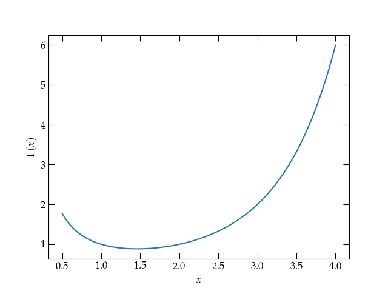

{:menu FO}

# Euler's Gamma Function

* toc
{:toc}

You are quite familiar with factorials,
\\[
    n! = n \times (n-1) \times \cdot \times 2 \times 1
\\]
with the understanding that $$0! = 1$$. The gamma function generalizes the factorial function to nonintegral values. It is defined by
\\[
    \Gamma(n+1) = \int_0^\infty x^n e^{-x} \dd{x}
\\]
where the extra 1 in the argument is courtesy of Legendre. To see that $$\Gamma(n+1)$$ corresponds to the factorial function, integrate by parts:
\\[
    \Gamma(n+1) =  \underbrace{\left. n x^{n-1} e^{-x} \right|\_0^\infty}\_{\text{vanishes}} + \int_0^\infty n x^{n-1} e^{-x}\dd{x} = n \Gamma(n)
\\]
or
\begin{equation}\label{eq:recurrence}
  \Gamma(n+1) = n \Gamma(n)
\end{equation}

When $$n = 1$$, we have a straightforward integral to do
\\[
    \Gamma(1) = \int_0^\infty x^0 e^{-x} \dd{x} = \left. -e^{-x} \right|\_0^\infty = 1
\\]
Hence, the recursion relation $$\Gamma(n+1) = n \Gamma(n)$$ along with the termination condition $$\Gamma(1) = 1$$ proves that $$\Gamma(n+1) = n!$$ for nonnegative integer $$n$$.

What about when $$n$$ is non-integral? For instance, what about $$n = -\frac12$$? That is, can we evaluate
\\[
    I = \int_0^\infty \frac{1}{\sqrt{t}} e^{-t} \dd{t}
\\]
Let $$x = \sqrt{t}$$ or $$x^2 = t$$, so that $$\dd{t} = 2 x \dd{x} $$, giving
\\[
    I = \int_0^\infty \frac1x e^{-x^2} 2x \dd{x}  = 2\int_0^\infty e^{-x^2}\dd{x} = \int_{-\infty}^{\infty} e^{-x^2}\dd{x}
\\]
While it may not look like we are any closer to an evaluation, it is undeniably true that squaring this expression yields
\\[
    I^2 = \int_{-\infty}^\infty \dd{x} \int_{-\infty}^\infty \dd{y} \, e^{-x^2} e^{-y^2} =
    \int_{-\infty}^\infty \dd{x} \int_{-\infty}^\infty \dd{y} \; e^{-(x^2+y^2)}
\\]
since both $$x$$ and $$y$$ are dummy variables of integration. On the other hand, we can read this expression as the integral over the $$xy$$ plane of the integrand $$e^{-x^2-y^2} = e^{-r^2}$$, where $$r$$ is the distance from the origin. Rather than integrating in cartesians, we can use polar coordinates:
\\[
    I^2 = \int_0^{2\pi} \int_0^\infty e^{-r^2} \, r \dd{r} \dd{\theta}
\\]
Making the $$u$$ substitution $$u = r^2$$, so that $$\dd{u} = 2 r \dd{r}$$, we can rewrite this double integral as
\\[
    I^2 = \int_0^{2\pi} \int_0^\infty e^{-u}  \frac{\dd{u}}{2} \dd{\theta} = \pi
\\]
Therefore,
\\[
    I = \Gamma\qty(\frac12) =  \int_{-\infty}^\infty e^{-x^2}\dd{x} = \sqrt{\pi}
\\]
We can then use the recurrence relation of Eq. (\ref{eq:recurrence}) to deduce that
\begin{align}
    \Gamma\qty(\frac32) &= \frac12 \Gamma\qty(\frac12) = \frac{\sqrt{\pi}}{2} \notag \\\ 
    \Gamma\qty(\frac52) &= \frac32 \Gamma\qty(\frac32) = \frac{3\sqrt{\pi}}{4} \notag
\end{align}
and in general
\\[
    \Gamma\qty(n+\frac12) = \frac{2n-1}{2} \times \frac{2n-3}{2} \times \cdots \frac{1}{2} \Gamma\qty(\frac12)
    = \frac{(2n-1)!!}{2^n} \sqrt{\pi}
\\]
where the double factorial is defined by
\\[
    n!! = n \times (n-2) \times \cdots \times \begin{cases} 1 & n\text{ odd} \\\ 
    2 & n\text{ even}
    \end{cases}
\\]

  

The gamma function $$\Gamma(x)$$ for small arguments $$x$$. For large values of $$x$$, $$\Gamma(x) = (x-1)!$$.

The figure was generated with the following Python code:

~~~~ python
import matplotlib.pyplot as plt
from scipy.special import gamma

f,a = plt.subplots()
x = np.linspace(0.5, 4, 100)
a.plot(x, gamma(x))
a.set_xlabel("$x$")
a.set_ylabel(r"$\Gamma(x)$");
~~~~

## Stirling's Approximation

Factorials grow extremely rapidly with their argument; it could be handy to have an approximate expression. It might be easier to estimate $$\ln n!$$, though, since the logarithm converts all the multiplications to addition:
\\[
    \ln n! = \ln 1 + \ln 2 + \cdots + \ln n
\\]

  

<a name="Fig1">Figure 1</a> — A way to estimate $$\ln x!$$ would be to compute the area under the red curve, although that sure looks like an overestimate, since there is area outside the blue bars. By contrast, the area under the green curve would be an underestimate, since it is entirely contained in the bars.

The area under the red curve would be
\\[
    \ln n!\_{\text{red}} = \int\_{1}^{n+1} \ln x \dd{x} = x\ln x - x \bigg|\_1^{n+1} = (n+1) \ln (n+1) - n - 1
\\]
The upper limit on the integral is $$n+1$$ because the bar for $$\ln n$$ starts at $$n$$ and goes to $$n+1$$. The area under the green curve would be
\\[
    \ln n!\_{\text{green}} = \int\_{2}^{n+1} \ln (x-1) \dd{x} = \int\_1^{n} \ln x' \dd{x'} = x'\ln x' - x' \bigg|\_1^{n} = 
    n \ln n - n
\\]
The true value lies above green but below red. So, crudely, $$\ln n! \approx n \ln n - n$$ and $$n! \approx n^n e^{-n}$$, although that's going to be a modest underestimate. As a spot check, we can evaluate $$6! = 720$$:
\\[
    6^6 e^{-6} = 115.65
\\]
Wow, that's not very good, is it? Well, the red estimate would be $$7^7 e^{-7} = 751$$, so at least the upper bound seems pretty reasonable.

### A Continuum Approach

We know from above that $$\Gamma(n+1) = n!$$ for nonnegative integers $$n$$. That is,
\\[
    n! = \int_0^{\infty} x^n e^{-x} \dd{x}
\\]