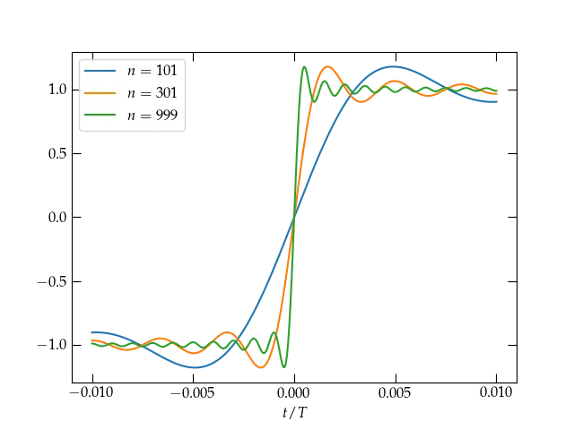

{:menu FO}

# The Gibbs Phenomenon

* toc
{:toc}

We saw on [the previous page](FO-FourierSeries.md) that the Fourier series for a square wave overshot the mark at the point of discontinuity at $$t = 0$$ where the square wave jumps from $$-1$$ to $$1$$, as illustrated in 

  

<a name="Fig1">Figure 1</a> — At the point of discontinuity at $$t = 0$$, the series is clearly converging to the midpoint between the limit values on either side. As the number of terms increases, the transition from $$-1$$ to $$1$$ grows narrower, but the **Gibbs** overshoot phenomenon persists.

