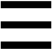

{:menu FO}
{::comment}menu-start{:/comment}

<label id="hamburger-menu"></label>

<ul>
<li><a href="FO-Intro.html">Introduction to Fourier Series and Transforms</a></li>
<li><a href="FO-ComplexVariables.html">Complex Variables</a></li>
<li><a href="FO-Series.html">Series</a></li>
<li><a href="FO-FourierSeries.html">Fourier Series</a></li>
<li><a href="FO-FourierTransforms.html">Fourier Transforms</a></li>
<li><a href="FO-Delta.html">Dirac Delta Function</a></li>
</ul>

{::comment}menu-end{:/comment}

# Complex Numbers and All Things Fourier

At the conclusion of Physics 24, you may have had the opportunity to play an instrument or sing while the sounds you made were sampled digitally and “Fourier transformed” to reveal the frequency components of the sounds. Sound waves are pressure variations that travel through a medium, such as the air. At any given point in space, the pressure varies as a function of time. But our ears do not perceive sounds with a time resolution of fractions of a millisecond. Rather, they perform a marvelous frequency decomposition so that we hear time-dependent tones (frequencies).

The idea of Fourier analysis is that we can represent any function of time in either the time domain or in the frequency domain; the **Fourier transform** allows us to go back and forth between the two *representations* of the “same function.”

If we are really thinking about a periodic signal, the analogous idea is a **Fourier series**, in which we represent the periodic signal in a series of sines and cosines whose fundamental frequency is determined by the period of the signal. While Fourier series are typically represented with the “real” functions sine and cosine, it is rare to use anything but the complex exponential representation for Fourier transforms. So, our first step is to remind ourselves of the [algebra of complex numbers](FO-ComplexVariables.md). We will then proceed to explore the extension of the notions of differential and integral calculus to functions of a complex variable before attacking [series](FO-Series.md) in general, [Fourier series](FO-FourierSeries.md) in particular, and [Fourier transforms](FO-Fourier).