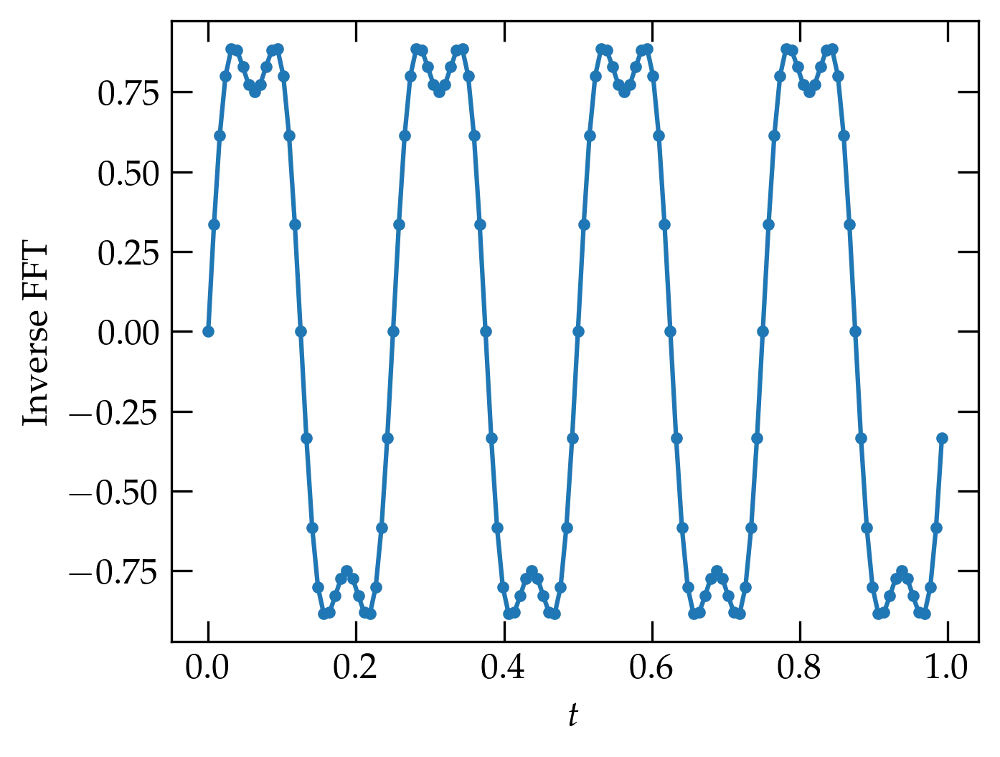

{:menu FO}

# Numerical Fourier Transforms

* toc
{:toc}

[Back to the top](index.md)

The Fourier transform takes a function in the time (spatial) domain and transforms it to a representation in the frequency (spatial frequency) domain, as represented by
\begin{align}
  \tilde{f}(\omega) &= \int_{-\infty}^\infty f(t) e^{-i\omega t} \dd{t}  \label{eq:FT1} \\\ 
  f(t) &= \frac{1}{2\pi} \int_{-\infty}^\infty  \tilde{f}(\omega) e^{i\omega t}\dd{\omega} \label{eq:FT2}
\end{align}
and discussed on [the page on Fourier Transforms](FO-FourierTransforms.md). 

We commonly consider functions of time, which may or may not be periodic, but which may be quasi-periodic, such as the sounds from a musical instrument. After all, they don't go on forever, so they can't be composed of pure tones! Typically, we sample such functions at a fixed period. For example, suppose we consider the function
\begin{equation}\label{eq:fft1}
  f(t) = \sin(2\pi \nu t) + \frac14 \sin(6 \pi \nu t)
\end{equation}
where the frequency $$ \nu $$ is 4 Hz. To keep things modest, we'll divide the time interval between 0 and 1 into 128 equal intervals:

~~~~ python
t = np.linspace(0, 1, 128, endpoint=False)
f = np.sin(2*np.pi*4*t) + 0.25 * np.sin(6*np.pi*4*t)
fig, ax = plt.subplots(figsize=(5,3.75))
ax.plot(t, f, '.-')
ax.set_xlabel("$t$");
~~~~

The result of these commands is shown in <a href="#Fig1">Figure&nbsp;1</a>.

  

<a name="Fig1">Figure 1</a> — A simple periodic function, defined in Eq.&nbsp;(\ref{eq:fft1}). The dots show the sampled values; the lines are a guide to the eye.

We notice that there is a **fast Fourier transform** routine in **scipy**, so without investing any real thought, let's see what happens when we use it:

~~~~ python
from scipy.fft import fft

g = fft(f)
fig, axs = plt.subplots(nrows=2, sharex=True)
axs[0].plot(np.real(g), '.')
axs[0].set_ylabel("Real")
axs[1].plot(np.imag(g), '.')
axs[1].set_ylabel("Imaginary")
axs[1].set_xlabel("$n$")
fig.align_ylabels(axs);
~~~~

  

<a name="Fig2">Figure 2</a> — The output of the `fft` command on the input 128-point array plotted in <a href="#1">Figure&nbsp;1</a>.

The upper panel of <a href="#Fig2">Figure&nbsp;2</a> shows the real part of the output of the `fft` function; the lower panel the imaginary part. Notice that the real part is just noise. You may also notice that the plot seems to have left-right mirror symmetry.

The lower panel shows the imaginary part of the output of the `fft` function. Most of the entries seem to be zero, but there are two values on the left side of the plot that sink below the zero level. The one at $$n = 4$$ looks like it has a value of about $$-64$$; the one at $$n = 12$$ might have a value of 8 or so. If would appear, therefore, that these two dots represent the two frequencies that are actually present in $$f(t)$$, as shown in Eq.&nbsp;(\ref{eq:fft1}).

According to the [scipy documentation](https://docs.scipy.org/doc/scipy/tutorial/fft.html), the function `fft` computes
\begin{equation}\label{eq:fft3}
  g_k = \sum_{n=0}^{N-1} e^{-2 \pi i n k / N} f_n
\end{equation}
for $$k = 0, 1, 2, \ldots, N-1$$, where $$f_n = f(t_n) = f(n/N)$$. Does this seem to be consistent?

Using Eq.&nbsp;(\ref{eq:fft3}), we can compute the elements of the `f[n]` vector:
\\[
    f_n = \sin(8\pi n/N) + \frac14 \sin(24\pi n/N)
\\]
so that the real and imaginary parts of the transform are
\begin{align}
  g_k^{\rm re} &= \sum_{n=0}^{N-1} f_n \cos(2\pi k n/N) \notag \\\ 
  g_k^{\rm im} &= -\sum_{n=0}^{N-1} f_n \sin(2\pi k n/N) \notag
\end{align}
Our source function $$f(t)$$ is an odd function of $$t$$, since it is composed of two sine functions. So, the real part of a Fourier transform should vanish and the imaginary part should be nonzero for the two values $$k = 4$$ and $$k = 12$$. Since the average value of $$\sin^2 \phi$$ over a full period is $$\frac12$$, we should expect that the magnitude at $$n=4$$ should be $$\frac12 N = 64$$, which does indeed appear to be the case.

The two conspicuous nonzero imaginary coefficients towards the end of $$g$$ arise from **aliasing**. Noting that
\\[
    \sin(2\pi(N-k)n/N) = \sin(2\pi n)\cos(2\pi nk/N) - \cos(2\pi n)\sin(2\pi nk/N)
    = -\sin(2\pi nk/N)
\\]
we can see that the right half of the transformed array should be the negative mirror image of the left half.

Aliasing makes the right half of the output array correspond to negative frequencies; it would be helpful to have a routine that computes an appropriate frequency axis to go with the transform. Numpy's routine is called `fftfreq(N, dt)`, where `N` is the number of points in the source array and `dt` is the **sampling period**. Example:

~~~~ python
freqs = fftfreq(len(f), 1/len(f))
fig, axs = plt.subplots(nrows=2, sharex=True)
axs[0].plot(freqs, np.real(g), '.')
axs[0].set_ylabel(r"$\mathrm{Re} (g_k)$")
axs[1].plot(freqs, np.imag(g), '.')
axs[1].set_ylabel(r"$\mathrm{Im} (g_k)$")
axs[1].set_xlabel("Frequency (Hz)")
fig.align_ylabels(axs)
plt.subplots_adjust(bottom=0.15)
~~~~

  

<a name="Fig3">Figure 3</a> — The same data as in the previous figure, but now plotted against an honest frequency axis computed by `fftfreq`.

### Inverse transform

We can transform back from $$g_k$$ to $$f_n$$ using the inverse Fourier transform (`ifft`), given by
\\[
    f_n = \frac{1}{N} \sum_{k=0}^{N-1} g_k e^{2\pi i k n/N}
\\]
The result is a complex function, although the original function $$f$$ was real. The tiny imaginary parts arise from roundoff error, but we can plot simply the real part:

~~~~ python
ig = ifft(g)
fig, ax = plt.subplots()
ax.plot(t, np.real(ig), '.-')
ax.set_xlabel("$t$")
ax.set_ylabel("Inverse FFT")
plt.subplots_adjust(left=0.15)
~~~~

  

<a name="Fig4">Figure 4</a> — Inverse transform of $$g_k$$, which indeed reproduces the original data (to within roundoff error).

## FFT Algorithm

Before exploring some of the potential pitfalls of the fast Fourier transform, I want to take a moment to explore how it manages to take a problem that would naively appear to involve (for each value of $$k$$) $$N$$ complex multiplications and $$N-1$$ complex additions, leading to a complexity of order $$N^2$$ operations. For a $$N = 2^{16} = 65536$$ data points, that means $$2^{32} > 4 \times 10^9$$ operations, which can take a long time (although it can readily be parallelized).

In the mid-1960s, J. W. Cooley and J. W. Tukey at IBM Yorktown Heights Research Center rediscovered a method to reduce the count to $$N \log_2 N$$ operations. For out example of 65536 points, this means something like $$2^{16} \times 16 = 2^{20} \approx 10^6$$ operations, roughly 4000 times fewer. Such a speed-up converts an hour to a second, give or take, which has made the FFT a workhorse for a variety of scientific computations.

So how does it work? Let $$W = e^{2\pi i / N}$$ so that 
\begin{equation}\label{eq:ffta}
  g_k = \sum_{n=0}^{N-1} e^{2\pi i n k/N} f_n = \sum_{n=0}^{N-1} W^{nk} f_n
\end{equation}
The basis of the algorithm is the Danielson-Lanczos Lemma, which factors Eq.&nbsp;(\ref{eq:ffta}) into a sum over the even indices and a sum over the odd indices:
\begin{align}
  g_k &= \sum_{j=0}^{N/2-1} \qty[ W^{2kj} f_{2j} + W^{k(2j+1)} f_{2j+1} ]\notag \\\ 
  &= g_k^{\rm even} + W^k g_k^{\rm odd} \notag
\end{align}
Each of these two transforms involves sums over just half of the $$N$$ elements of the original sum. The lemma can be applied recursively to each of these smaller transforms, each time dividing the number of points in the remaining transform by 2. For a number of initial data points $$N$$ that is a power of 2, after $$\log_2 N $$ divisions we are left with a single point. Summing is then trivial.

The following is a poor-man's implementation of the Cooley-Tukey algorithm placed here merely for pedagogic purposes. For real work, avail yourself of more robust routines, including the MIT routine FFTW (fastest Fourier transform in the west), which is a self-optimizing routine to adapt code to the hardware on which you are running it.

~~~~ python
def Cooley_Tukey(v, inverse=False):
    """
    A naive implementation of the Cooley-Tukey algorithm in Python/numpy.
    It can only handle input vectors that have a number of points equal
    to a power of 2.
    """
    n = len(v)
    d = np.log2([n])[0]
    assert d == np.floor(d) # we only deal with powers of 2
    d = int(d)

    # copy/convert input array to complex
    f = np.array(v, dtype=np.complex64)
    twopi = 2.0 * np.pi * (-1 if inverse else 1)

    def fft_rec(x):
        """Recursive routine to apply the Danielson-Lanczos algorithm.
        The array x is modified in place."""
        N = len(x)
        if N <= 1:
            return # nothing left to do
        
        # copy input values into even and odd arrays
        even, odd = np.array(x[0:N:2]), np.array(x[1:N:2])
        
        # transform each of these in place
        fft_rec(even)
        fft_rec(odd)
        
        # now update x by combining the even and odd versions
        halfN = N // 2
        for k in range(0, halfN):
            t = np.exp(complex(0, twopi * k / N)) * odd[k]
            x[k] = even[k] + t
            x[halfN + k] = even[k] - t
        
    fft_rec(f)
    if inverse:
        f /= n
    return f
~~~~

To test Cooley_Tukey, let's run the following code and compare the transform and the inverse transforms to our expectations.

~~~~ python
t = np.linspace(0,4*np.pi, 64, endpoint=False)
myf = np.sin(t)
myd = Cooley_Tukey(myf)
myid = Cooley_Tukey(myd, True)
fig, axs = plt.subplots(ncols=2)
ax = axs[1]
ax.plot(np.imag(myd), '.-')
ax = axs[0]
ax.plot(t, myf, '.', label="original")
ax.plot(t, np.real(myid), label="inv(inv(f))")
ax.legend();
~~~~

  

<a name="Fig5">Figure 5</a> — Computation of the FFT and the inverse FFT for a sinusoidal input whose period is commensurate with the sampling period. The results suggest that our implementation of the Cooley-Tukey algorithm does indeed produce expected results.

## Nyquist frequency

If the data aren't sampled fast enough, the discrete samples will not be able to faithfully represent the underlying signal, as illustrated in <a href="#Fig6">Figure&nbsp;6</a>. In the illustrated case, the true signal goes through more than a full oscillation during each sampling interval. That full oscillation is lost in sampling this slowly. The **Nyquist theorem** holds that the maximum frequency that can be represented is given by
\begin{equation}\label{eq:Nyquist}
  \nu_{\rm Nyquist} = \frac{1}{2 \, \tau}
\end{equation}
where $$\tau$$ is the sampling period. Signals at frequencies greater than the Nyquist frequency are **aliased** to frequencies at the Nyquist frequency of lower. Aliasing can cause major headaches when your signal has high-frequency components that exceed the Nyquist frequency.

  

<a name="Fig6">Figure 6</a> — Illustration of aliasing. The blue curve represents the true source signal, the red dots show the actual samples, and the dashed red curve shows the sine wave we can infer from the discrete samples: it oscillates way more slowly than the true signal.

All is not lost, however. If you can pass your signal through a low-pass filter that eliminates frequencies above the Nyquist frequency, then you can take advantage of an absolutely amazing theorem called **the sampling theorem**. If you are sampling a **bandwidth-limited** signal (meaning that it has no Fourier components above the Nyquist frequency), then the function is faithfully represented by the evenly spaced samples. The function is fully characterized by its samples $$f_n = f(n \, \tau)$$ via
\begin{equation}\label{eq:sampling}
  f(t) = \sum_{n=-\infty}^{\infty} f_n \frac{\sin \qty[2\pi \nu_{\rm Nyquist} (t - n \, \tau)]}{2\pi \nu_{\rm Nyquist} (t - n\, \tau)}
\end{equation}
which is a sum of sinc functions with unit amplitude at $$t - n\tau$$ and zero amplitude at $$t - m\tau$$ for all integers $$m \ne n$$.

## Problems

So far, we have carefully sampled signals that go through an integral number of periods over the time we sample. What happens when we miss? To explore the problem, it is handy to look not at the Fourier transform of the signal but its **power spectrum**,
given by $$| \tilde{f}(\nu) |^2 $$, which combines the real and imaginary parts of the Fourier transform to give a single real number for each discrete frequency. A little routine to compute the power spectrum is

~~~~ python
def power_spectrum(foft, dt=None):
    if len(foft) % 2:
        f = np.zeros(len(foft)+1)
        f[:len(foft)] = foft
    else:
        f = foft
    xform = fft(f)
    left = xform[:len(xform)//2]
    power = np.abs(left)**2
    power[power < 1e-16] = 0
    if dt is None:
        dt = 1.0 / len(f)
    freq = np.arange(0, 0.5 / dt, 1.0 / (len(xform) * dt))
    df = pd.DataFrame(dict(power=power), index=freq)
    df.index.name = 'freq'
    return df
~~~~

To illustrate with a very small set of data, the following code generates two periods of a sinusoid, sampled 16 times per period, and shows the resulting power spectrum. It agrees with our naive expectations.

~~~~ python
t7 = np.arange(0, 1, 1/32)
s7 = np.cos(4*np.pi*t7)
fig, axs = plt.subplots(ncols=2)
axs[0].plot(t7, s7, '.-', c=fs.traces[1])
ps7 = power_spectrum(s7)
axs[1].plot(ps7.index, ps7.power, 'o', c=fs.traces[0])
axs[0].set_xlabel('$t$ (s)')
axs[1].set_xlabel(r'$\nu$ (Hz)');
~~~~

  

<a name="Fig7">Figure 7</a> — A sinusoid going through two periods and sampled 16 times per period (left panel) produces a very clean power spectrum (right panel) in which a single nonzero value at $$\nu = 2$$ Hz appears, as is to be expected.

What happens if we don't quite make it through a full period? I'll modify the example just slightly by changing the frequency of the source wave. The frequency is shown in the legend of the power spectrum plot. When the sampled wave "doesn't fit" in the time window over which we sample, a periodic continuation of the function has a discontinuity at the right edge. This sharp discontinuity leads to aliasing of high-frequency power into the Nyquist range, and causes the power to be smeared out over a broad range of frequencies.

  

<a name="Fig8">Figure 8</a> — Computed power spectra from the sinusoidal input shown in the left panel. When the periodic signal cannot complete an integral number of cycles in the sampling period, there is an implicit discontinuity between the right edge and left edge, resulting in power spreading into nearby frequencies.

## Windowing

As shown in the previous section, the leakage of power into frequency bins far from the frequency of the true signal arises from the implicit discontinuity between the left and right edges of the sampled time interval. A standard approach to reducing the impact of this discontinuity is to modify the raw data to avoid it! If we multiply the raw data by a **window function** that goes smoothly to zero at the beginning and end of the interval, then we can prevent the discontinuity from happening.

We have plenty of choices for such functions and the literature abounds with them. Some are tailored to particular sorts of signals, or to strongly suppress the wings, or to limit the broadening of an honest spectral peak as a consequence of multiplying the data by a window function. To appreciate why the multiplication does this, consider the simple window function
\begin{equation}\label{eq:sine2}
  w(t) = 2\sin^2(\pi t/T)
\end{equation}
which clearly vanishes at $$t = 0$$ and $$t = T$$, where $$T$$ is the period of time over which the signal is sampled and has an average of 1. Using a standard trigonometric identity, we have that
\\[
    w(t) = 1 - \cos(2\pi t/T) = 1 - \frac12 e^{2\pi i t/T} - \frac12 e^{-2\pi i t /T}
\\]
In other words, the window function has frequency components at $$2\pi t/T$$ and $$-2\pi t/T$$ that will shift frequency components of the form $$e^{-i\omega t}$$ in the raw signal.

To illustrate the impact of this particular window function, I will take the signal generated by

~~~~ python
tw = np.linspace(0, 1, 4096, endpoint=False)
sw = np.cos(tw * 15.5 * 2 * np.pi)
~~~~

which is a pure cosine wave that makes it through a half-integral number of periods (i.e., $$15\frac12$$). In <a href="#Fig9">Figure&nbsp;9</a> the red curve shows power spectrum computed from these data. It has a strong peak at the “right” frequency, but the tails of the peak die off rather slowly. The blue curve shows the power spectrum we obtain on multiplying the raw signal by the window function shown in Eq.&nbsp;(\ref{eq:sine2}). While the resulting peak is not as sharp as it is with the raw data, the falloff with separation from the “true” peak is orders of magnitude faster with the windowed data.

  

<a name="Fig9">Figure 9</a> — Power spectrum of a pure sinusoidal signal that doesn’t fit in the sampled interval (red curve) and from that signal using the window function of Eq.&nbsp;(\ref{eq:sine2}) . 

