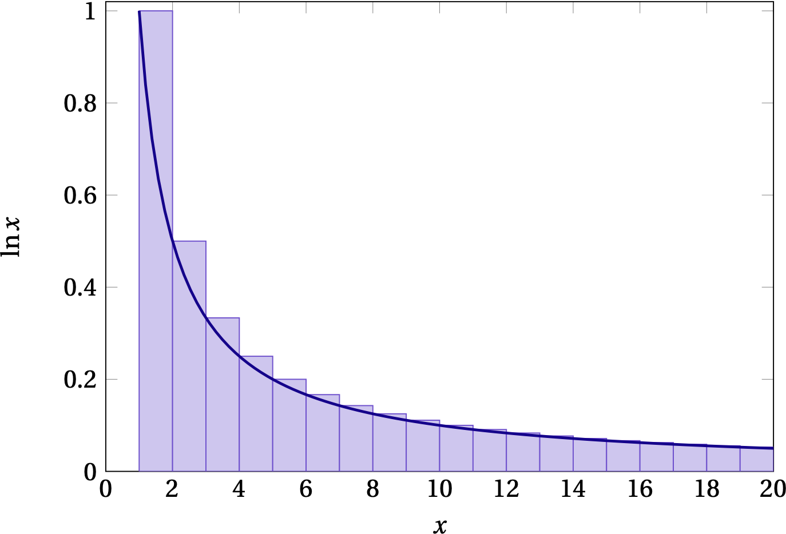

{:menu FO}
{::comment}menu-start{:/comment}

<label id="hamburger-menu"></label>

<ul>
<li><a href="FO-Intro.html">Introduction to Fourier Series and Transforms</a></li>
<li><a href="FO-ComplexVariables.html">Complex Variables</a></li>
<li><a href="FO-FourierSeries.html">Fourier Series</a></li>
<li><a href="FO-FourierTransforms.html">Fourier Transforms</a></li>
</ul>

{::comment}menu-end{:/comment}

# Series

* toc
{:toc}

+ Definitions, convergence
+ Taylor, power series
+ gamma function
+ binomial expansion/series?
+ Bernoulli numbers?

## Definitions

An infinite series is an infinite sum,
\begin{equation}\label{eq:infseries}
  s = \sum_{n=1}^{\infty} u_n = \lim_{N\to\infty} \sum_{n=1}^N u_n
\end{equation}
that is the limit of partial sums having a finite number of terms. For the limit to exist, the magnitude of the terms $$u_n$$ must go to zero as $$n\to\infty$$, but while a necessary condition it is not sufficient. The **harmonic series**,
\\[
    H = \sum_{n=1}^{\infty} \frac1n = 1 + \frac12 + \frac13 + \cdots
\\]
does not converge, although its divergence is logarithmic (weak), as illustrated in the following figure

  

Fig. 1 — The harmonic series is represented by the area shaded blue of the bars of height $$1$$, $$\frac12$$, $$\frac13$$, etc. The area of the bars is greater than the area under the curve $$1/x$$, since the curve is everywhere contained within a bar. Since $$\int_1^x \frac1{x'}\,dx' = \ln x$$, which slowly diverges as $$x\to\infty$$, the harmonic series diverges even though its individual terms tend to zero.

### Geometric Series

Successive terms of a geometric form a fixed ratio $$r$$:
\\[
    G_N = \sum_n^N a_0 r^n = a_0 \frac{1 - r^{N+1}}{1 - r}
\\]
The series converges as $$N\to\infty$$ provided that $$|r| < 1$$.

### Tests of Convergence

1. **Comparison tests**: by comparing one series of unknown convergence term-by-term to a series of known convergence properties, it may be possible to deduce the convergence of the first series. For instance, if the series of terms $$\sum_n a_n$$ is known to converge and $$b_n < a_n$$ for all $$n$$, then $$\sum_n b_n$$ converges.
2. **Cauchy Root Test**: if $$(a_n)^{1/n} \le r < 1$$ for all terms $$n \ge N$$, with $$r$$ independent of $$n$$, then $$\sum_n a_n$$ converges. This test is a comparison to the convergence geometric series.
3. **Ratio test**: the convergence of a series may be determined from the limit of the ratio of successive terms:
\\[
    \lim_{n\to\infty} \frac{a_{n+1}}{a_n} \begin{cases}
    < 1, & \text{convergence} \\\ 
    > 1, & \text{divergence} \\\ 
    = 1, & \text{indeterminate}
    \end{cases}
\\]
4. **Integral test** The caption to Fig. 1 above illustrates using an integral test 

### Riemann Zeta Function

The **Riemann zeta** function is defined by
\begin{equation}\label{eq:zeta}
  \zeta(x) = \sum_{n=1}^\infty \frac1{n^{x}}
\end{equation}
If $$x=1$$, this series becomes the harmonic series, which he know to be divergent. For $$x < 1$$ it diverges more rapidly, but for $$x > 1$$ we can use an integral test to check convergence:
\\[
    \zeta(x) = \sum_{n=1}^\infty \frac1{n^{x}} < \int_1^{\infty} n^{-x} \;dn
    = \left.\frac{n^{1-x}}{1-x}\right|_{n=1}^{n=\infty} = \frac{1}{x-1}
\\]
The Riemann zeta function pops up occasionally in physics, including the theory of blackbody radiation and the determination of the Stefan-Boltzmann constant.

### Alternating Series

If successive terms in a series alternate sign, and if the magnitude of the terms goes to zero as $$n\to\infty$$, then the series converges. An infinite series is **absolutely** convergent if the sum of the absolute value of its terms converges. If the series converges, but is not absolutely convergent, it is called **conditionally** convergent.

Properties of absolutely convergent series:

+ the series sum is independent of the order in which one adds the terms
+ two absolutely convergent series may be added, subtracted, or multiplied termwise to yield another absolutely convergent series
+ the product of two absolutely convergent series converges to the product of the individual series

Note that none of these claims can be made for conditionally convergent series.

## Taylor Series

Taylor's expansion is a way of approximating a function $$f(x)$$ in the neighborhood of a point $$x=a$$ with a polynomial in powers of $$(x-a)$$ such that the first $$n$$ derivatives of the polynomial match the first $$n$$ derivatives of $$f(x)$$ at $$a$$,
\\[
    f(x) \approx f(a) + (x-a) f'(a) + \frac{(x-a)^2}{2!} f^{\prime\prime}(a) + \cdots +
    \frac{(x-a)^n}{n!} f^{(n)}(a)
\\]
where the inequality comes from ignoring higher-order terms.

A useful way to bound the error associated with ignoring those terms is to integrate the $$n$$th derivative from $$a$$ to $$x$$ $$n$$ times:
\begin{align}
  \int\_a^{x\_{n-1}} f^{(n)} \, dx\_n &= f^{(n-1)}(x_{n-1}) - f^{(n-1)}(a) \notag \\\ 
  \int\_a^{x\_{n-2}} dx_{n-1} \int\_a^{x\_{n-1}} dx\_{n} f^{(n)}(x_n) &= f^{(n-2)}(x\_{n-2}) - f^{(n-2)}(a) -(x\_{n-2} - a) f^{(n-1)}(a) \notag \\\ 
  \vdots \qquad & \qquad \vdots \notag \\\ 
  &= f(x) - f(a) -(x-a) f'(a) - \frac{(x-a)^2}{2!} f^{\prime\prime}(a) - \cdots - \frac{(x-a)^{n-1}}{(n-1)!} f^{(n-1)}(a)
\end{align}
Rearranging slightly gives
\begin{equation}\label{eq:Taylor}
  f(x) = \sum\_{i=0}^{n-1} \frac{(x-a)^i}{i!} f^{(i)}(a) + R_n
\end{equation}
where the remainder is the $$n$$-dimensional integral,
\\[
    R_n = \int_a^x dx_1 \cdots \int_a^{x\_{n}} dx\_n\; f^{(n)}(x_n) = \frac{(x-a)^n}{n!} f^{(n)}(\xi)
\\]
for some value $$a \le \xi \le x$$ by the mean value theorem.

### Some Important Taylor Series

\begin{align}
  e^x &= 1 + x + \frac{x^2}{2!} + \frac{x^3}{3!} +  \cdots  \notag \\\ 
  \sin x &= x - \frac{x^3}{3!} + \frac{x^5}{5!} - \frac{x^7}{7!} + \cdots \notag \\\ 
  \cos x &= 1 - \frac{x^2}{2!} + \frac{x^4}{4!} - \frac{x^6}{6!} + \cdots \notag \\\ 
  \ln(1+x) &= x - \frac{x^2}{2} + \frac{x^3}{3} - \frac{x^4}{4} + \cdots \notag \\\ 
  (1+x)^n &= 1 + n x + \frac{n(n-1)}{2!} x^2 + \frac{n(n-1)(n-2)}{3!} x^3 + \cdots \tag{binomial}
\end{align}
Clearly, the radius of convergence of the logarithmic series does not include $$x = -1$$, which generates a divergent harmonic series. For the **binomial series**, the series terminates when $$n$$ is a positive integer and so converges for all $$x$$. When $$n$$ is not a positive integer, the series does not terminate and may not converge.

## Gamma Function

You are quite familiar with factorials,
\\[
    n! = n \times (n-1) \times \cdot \times 2 \times 1
\\]
with the understanding that $$0! = 1$$. The gamma function generalizes the factorial function to nonintegral values. It is defined by
\\[
    \Gamma(n+1) = \int_0^\infty x^n e^{-x} \, dx
\\]
where the extra 1 in the argument is courtesy of Legendre. To see that $$\Gamma(n+1)$$ corresponds to the factorial function, integrate by parts:
\\[
    \Gamma(n+1) =  \underbrace{\left. n x^{n-1} e^{-x} \right|\_0^\infty}\_{\text{vanishes}} + \int_0^\infty n x^{n-1} e^{-x}\,dx = n \Gamma(n)
\\]
When $$n = 1$$, we have a straightforward integral to do
\\[
    \Gamma(1) = \int_0^\infty x^0 e^{-x} \, dx = \left. -e^{-x} \right|\_0^\infty = 1
\\]
Hence, the recursion relation $$\Gamma(n+1) = n \Gamma(n)$$ along with the termination condition $$\Gamma(1) = 1$$ proves that $$\Gamma(n+1) = n!$$ for nonnegative integer $$n$$.

What about when $$n$$ is non-integral?