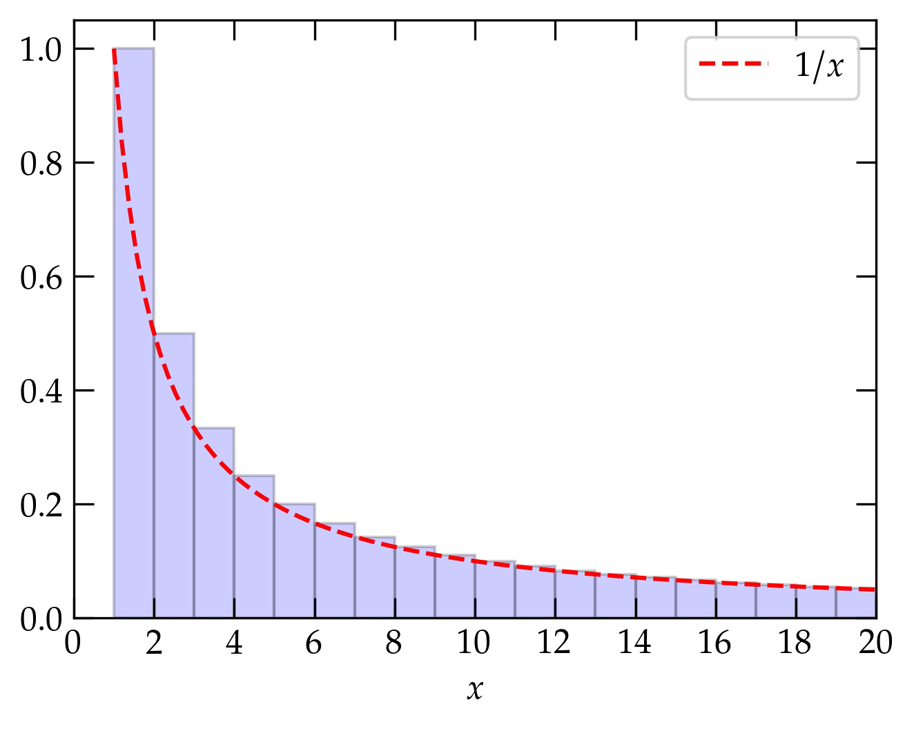

{:menu FO}

# Series

* toc
{:toc}

## Definitions

An infinite series is an infinite sum,
\begin{equation}\label{eq:infseries}
  s = \sum_{n=1}^{\infty} a_n = \lim_{N\to\infty} \sum_{n=1}^N a_n
\end{equation}
that is the limit of partial sums having a finite number of terms. For the limit to exist, the magnitude of the terms $$a_n$$ must go to zero as $$n\to\infty$$. However, while this is a necessary condition it is not sufficient.
The **harmonic series**,
\\[
    H = \sum_{n=1}^{\infty} \frac1n = 1 + \frac12 + \frac13 + \cdots
\\]
does not converge, even though its terms tend to zero as $$n \to \infty$$. Its divergence is logarithmic (i.e., weak), as illustrated in the following figure

  

<a name="Fig1">Figure 1 </a> — The harmonic series is represented by the area shaded blue of the bars of height $$1$$, $$\frac12$$, $$\frac13$$, etc. The area of the bars is greater than the area under the curve $$1/x$$ (shown in red), since the curve is everywhere contained within a bar. Since $$\int_1^x \frac1{x'}\dd{x'} = \ln x$$, which slowly diverges as $$x\to\infty$$, the harmonic series diverges even though its individual terms tend to zero.

### Geometric Series

Successive terms of a geometric form a fixed ratio $$r$$:
\\[
    S_N = \sum_{n=0}^N a_0 r^n
\\]
There is a nifty trick for summing a (finite) geometric series. Consider $$r S_N$$:
\begin{align}
    S\_N &= a\_0 (1 + r + r^2 + \cdots + r^N) \\\ 
    r S\_N &= a\_0(\hphantom{1 + } \;\, r + r^2 + \cdots + r^N + r^{N+1})
\end{align}
If we now subtract the second line from the first, we get
\begin{equation}
  S_N (1-r) = a_0 (1 - r^{N+1}) \qquad\text{so}\qquad \boxed{ S_N = a_0 \left( \frac{1 - r^{N+1}}{1 - r} \right) }
\end{equation}

The series converges to $$S_{\infty} = \frac{a_0}{1-r}$$ as $$N\to\infty$$, provided that
$$|r| < 1$$ (so that the numerator of the fraction goes to 1). Sometimes it is convenient to symmetrize this expression by factoring out $$r^{N/2}$$, which allows you to express the fraction in terms of the ratio between hyperbolic sine functions.

### Tests of Convergence

It is often necessary to know whether an infinite series converges to a finite value. Some of the useful tests to answer this question are:

1. **Comparison tests**: by comparing one series of unknown convergence term-by-term to a series of known convergence properties, it may be possible to deduce the convergence of the first series. For instance, if the series of terms $$\sum_n a_n$$ is known to converge and $$b_n < a_n$$ for all $$n$$, then $$\sum_n b_n$$ converges.
2. **Cauchy Root Test**: if $$(a_n)^{1/n} \le r < 1$$ for all terms $$n \ge N$$, with $$r$$ independent of $$n$$, then $$\sum_n a_n$$ converges. This test is a comparison to the convergence of a geometric series.
3. **Ratio test**: the convergence of a series may be determined from the limit of the ratio of successive terms:
\\[
    \lim_{n\to\infty} \frac{a_{n+1}}{a_n} \begin{cases}
    < 1 &\quad \text{convergence} \\\ 
    > 1 &\quad \text{divergence} \\\ 
    = 1 &\quad \text{indeterminate}
    \end{cases}
\\]
4. **Integral test**: The caption to Fig. 1 above illustrates using an integral test 

### Riemann Zeta Function

The **Riemann zeta** function is defined by
\begin{equation}\label{eq:zeta}
  \zeta(\nu) = \sum_{n=1}^\infty \frac1{n^{\nu}}
\end{equation}
If $$\nu=1$$, this series becomes the harmonic series, which we know to be divergent. For $$\nu < 1$$ it diverges more rapidly, but for $$\nu > 1$$ we can use an integral test to check convergence:
\\[
    \zeta(\nu) = \sum_{n=1}^\infty \frac1{n^{\nu}} 
    < 1 + \int_2^{\infty} (x-1)^{-\nu} \dd{x}
    = 1 + \left.\frac{(x-1)^{1-\nu}}{1-\nu}\right|_{x=2}^{\infty} = 1 + \frac{1}{\nu-1} = \frac{\nu}{\nu-1} < \infty
    \qquad\text{when } \nu > 1
\\]

  

<a name="Fig2">Figure 2 </a> — The Riemann zeta function for $$\nu = 1.1$$. The red and green curves clearly bound the area of the blue bars, which represents the Riemann $$\zeta$$&nbsp; for $$\nu = 1.1$$ (note the logarithmic vertical scale).

The Riemann zeta function pops up occasionally in physics, including the theory of blackbody radiation and the determination of the Stefan-Boltzmann constant, $$\sigma$$, which relates the power per unit area radiated by an ideal blackbody at temperature $$T$$:
\begin{equation}\label{eq:Stefan-Boltzmann}
  p = \sigma T^4 \qquad\text{where}\qquad
  \sigma = \frac{6 \zeta(4) k\_{\mathrm{B}}^4}{\pi^2 c^2 \hbar^3}
  = \frac{2 \pi^5 k\_{\mathrm{B}}^4}{15 c^2 h^3}
  \approx 5.67 \times 10^{-8}\,\mathrm{W \cdot m^{-2} \cdot K^{-4}}
\end{equation}

### Alternating Series

If successive terms in a series alternate sign, and if the magnitude of the terms goes to zero as $$n\to\infty$$, then the series converges. An infinite series is **absolutely** convergent if the sum of the absolute value of its terms converges. If the series converges, but it is not absolutely convergent, it is called **conditionally** convergent.

Properties of absolutely convergent series:

+ the series sum is independent of the order in which one adds the terms
+ two absolutely convergent series may be added, subtracted, or multiplied termwise to yield another absolutely convergent series
+ the product of two absolutely convergent series converges to the product of the individual series

Note that **none of these claims** can be made for conditionally convergent series.

## Taylor Series

Taylor's expansion is a way of approximating a function $$f(x)$$ in the neighborhood of a point $$x=a$$ with a polynomial in powers of $$(x-a)$$ such that the first $$n$$ derivatives of the polynomial match the first $$n$$ derivatives of $$f(x)$$ at $$a$$,
\begin{equation} \label{eq:Taylor}
    f(x) \approx f(a) + (x-a) f'(a) + \frac{(x-a)^2}{2!} f^{\prime\prime}(a) + \cdots +
    \frac{(x-a)^n}{n!} f^{(n)}(a)
\end{equation}
where the inequality comes from ignoring higher-order terms.

A useful way to bound the error associated with ignoring those terms is to integrate the $$n$$th derivative from $$a$$ to $$x$$ $$n$$ times:
\begin{align}
  \int\_a^{x\_{n-1}} f^{(n)} \dd{x\_n} &= f^{(n-1)}(x_{n-1}) - f^{(n-1)}(a) \notag \\\ 
  \int\_a^{x\_{n-2}} \dd{x_{n-1}} \int\_a^{x\_{n-1}} \dd{x\_{n}} f^{(n)}(x_n) &= f^{(n-2)}(x\_{n-2}) - f^{(n-2)}(a) -(x\_{n-2} - a) f^{(n-1)}(a) \notag \\\ 
  \vdots \qquad & \qquad \vdots \notag \\\ 
  &= f(x) - f(a) -(x-a) f'(a) - \frac{(x-a)^2}{2!} f^{\prime\prime}(a) - \cdots - \frac{(x-a)^{n-1}}{(n-1)!} f^{(n-1)}(a)
\end{align}
Rearranging slightly gives
\begin{equation}\label{eq:Taylor2}
  f(x) = \sum\_{i=0}^{n-1} \frac{(x-a)^i}{i!} f^{(i)}(a) + R_n
\end{equation}
where the remainder is the $$n$$-dimensional integral,
\\[
    R_n = \int_a^x \dd{x_1} \cdots \int_a^{x\_{n}} \dd{x\_n} \; f^{(n)}(x_n) = \frac{(x-a)^n}{n!} f^{(n)}(\xi)
\\]
for some value $$a \le \xi \le x$$ by the mean value theorem. Equation (\ref{eq:Taylor2}), with the explicit form of the residual $$R_n$$ is a particularly powerful way of not only estimating functions but also the magnitude of the error associated with a finite series.

### Some Important Taylor Series

Physicists should know the following series cold; they arise very frequently in physics and it is worth your time to learn so well that you don't need to think about them. (Actually, each of these is a **Maclaurin series**, which is a form of Taylor series in which the derivatives are evaluated at $$a = 0$$):

\begin{align}
  e^x &= 1 + x + \frac{x^2}{2!} + \frac{x^3}{3!} + \frac{x^4}{4!} + \cdots &  &-\infty < x <\infty \notag \\\ 
  \sin x &= x - \frac{x^3}{3!} + \frac{x^5}{5!} - \frac{x^7}{7!} + \cdots &  &-\infty < x <\infty \notag \\\ 
  \cos x &= 1 - \frac{x^2}{2!} + \frac{x^4}{4!} - \frac{x^6}{6!} + \cdots &  &-\infty < x <\infty\notag \\\ 
  \sinh x &= x + \frac{x^3}{3!} + \frac{x^5}{5!} + \frac{x^7}{7!} + \cdots &  &-\infty < x <\infty \notag \\\ 
  \cosh x &= 1 + \frac{x^2}{2!} + \frac{x^4}{4!} + \frac{x^6}{6!} + \cdots &  &-\infty < x <\infty\notag \\\ 
  \frac{1}{1-x} &= 1 + x + x^2 + x^3 + x^4 + \cdots & & -1 < x < 1 \notag \\\ 
  \ln(1+x) &= x - \frac{x^2}{2} + \frac{x^3}{3} - \frac{x^4}{4} + \cdots &  &-1 < x \le 1 \notag \\\ 
  (1+x)^n &= 1 + n x + \frac{n(n-1)}{2!} x^2 + \frac{n(n-1)(n-2)}{3!} x^3 + \cdots
  & & -1 < x < 1 \tag{binomial}
\end{align}
Clearly, the radius of convergence of the logarithmic series does not include $$x = -1$$, which generates a divergent harmonic series. For the **binomial series**, the series terminates when $$n$$ is a positive integer and so converges for all $$x$$. When $$n$$ is not a positive integer, the series does not terminate and may not converge.

## Manipulating Series

Suppose that you knew a Maclaurin series for a function $$f(x)$$ but you need the series for $$1/f(x)$$, valid for small values of $$x$$. For example, we know the series for $$\cosh x$$ from the above list (or we could derive it ourselves). The hyperbolic secant function, $$\sech x = 1 / \cosh x$$. How could we compute the series for $$\sech x$$, valid for small $$x$$ through terms of order $$x^6$$?

The "easy" way is to go back to the definition in Eq.&nbsp;(\ref{eq:Taylor}) and work out all the derivatives of $$\sech(x)$$. While this is straightforward, in principle, the expressions for the derivatives get more and more complicated as we proceed. [If you don't believe me, try it!]

Here's another option. For small $$x$$, 
\begin{equation}
  \cosh x = 1 + \underbrace{\frac{x^2}{2!} + \frac{x^4}{4!} + \frac{x^6}{6!} + \cdots}_{q}
\end{equation}
where $$q$$ is a "small quantity" as long as $$x$$ isn't too large. So,
\begin{equation}\label{eq:sech1}
  \sech x = \frac{1}{\cosh x} = \frac{1}{1 + q} = (1 + q)^{-1}
\end{equation}
But, the binomial series for $$n = -1$$ is just
\\[
    \frac{1}{1 + q} = 1 - q + q^2 - q^3 + \cdots
\\]
To produce the series for $$\sech x$$ valid for terms through $$x^6$$ just requires us to keep **all** the terms in $$-q + q^2 - q^3$$ through $$x^6$$. We'll work term by term:
\begin{align}
  -q &= -\frac{x^2}{2!} - \frac{x^4}{4!} - \frac{x^6}{6!} - \frac{x^8}{8!} + \O{x^{10}}     \notag \\\ 
  q^2 &= \frac{x^4}{(2!)^2} + 2 \frac{x^2 \; x^4}{2! \; 4!} +
   2 \frac{x^2}{2!} \frac{x^6}{6!} + \left( \frac{x^4}{4!} \right)^2 + \O{x^{10}} \notag \\\ 
   &= \frac{x^4}{4} + \frac{x^6}{4!} + x^8 \left( \frac{1}{6!} + \frac{1}{(4!)^2} \right) + \O{x^{10}} \notag \\\ 
   -q^3 &= -\left(\frac{x^2}{2!} \right)^3 - 3 \left(\frac{x^2}{2!}\right)^2 \frac{x^4}{4!}
   + \O{x^{10}} \notag \\\ 
   q^4 &= \frac{x^8}{16} + \O{x^{10}} \notag
\end{align}

Now, we just need to combine all these terms:
\begin{align}
  \sech x &= 1 - \frac{x^2}{2} +
   x^4 \left( -\frac{1}{4!} + \frac{1}{4} \right) 
   + x^6 \left( -\frac{1}{6!} + \frac{1}{4!} - \frac{1}{8} \right) \notag
   \\\ 
   &\qquad + x^8 \left( -\frac{1}{8!} + \frac{1}{6!} + \frac{1}{(4!)^2} - \frac{1}{32} 
   + \frac{1}{16}
   \right) + \O{x^{10}} \notag \\\ 
   &= 1 - \frac{x^2}{2} + \frac{5 x^4}{24} - \frac{61 x^6}{720} + \frac{277 x^8}{8064} + \O{x^{10}}
\end{align}

  

<a name="Fig3">Figure 3</a> — Maclaurin series for the hyperbolic cosine obtained by inverting the series for $$\cosh x$$. Each successive curve includes the terms through the order listed in the legend.

## Gamma Function

You are quite familiar with factorials,
\\[
    n! = n \times (n-1) \times \cdot \times 2 \times 1
\\]
with the understanding that $$0! = 1$$. The gamma function generalizes the factorial function to nonintegral values. It is defined by
\\[
    \Gamma(n+1) = \int_0^\infty x^n e^{-x} \dd{x}
\\]
where the extra 1 in the argument is courtesy of Legendre. To see that $$\Gamma(n+1)$$ corresponds to the factorial function, integrate by parts:
\\[
    \Gamma(n+1) =  \underbrace{\left. n x^{n-1} e^{-x} \right|\_0^\infty}\_{\text{vanishes}} + \int_0^\infty n x^{n-1} e^{-x}\dd{x} = n \Gamma(n)
\\]
or
\begin{equation}\label{eq:recurrence}
  \Gamma(n+1) = n \Gamma(n)
\end{equation}

When $$n = 1$$, we have a straightforward integral to do
\\[
    \Gamma(1) = \int_0^\infty x^0 e^{-x} \dd{x} = \left. -e^{-x} \right|\_0^\infty = 1
\\]
Hence, the recursion relation $$\Gamma(n+1) = n \Gamma(n)$$ along with the termination condition $$\Gamma(1) = 1$$ proves that $$\Gamma(n+1) = n!$$ for nonnegative integer $$n$$.

What about when $$n$$ is non-integral? For instance, what about $$n = -\frac12$$? That is, can we evaluate
\\[
    I = \int_0^\infty \frac{1}{\sqrt{t}} e^{-t} \dd{t}
\\]
Let $$x = \sqrt{t}$$ or $$x^2 = t$$, so that $$\dd{t} = 2 x \dd{x} $$, giving
\\[
    I = \int_0^\infty \frac1x e^{-x^2} 2x \dd{x}  = 2\int_0^\infty e^{-x^2}\dd{x} = \int_{-\infty}^{\infty} e^{-x^2}\dd{x}
\\]
While it may not look like we are any closer to an evaluation, it is undeniably true that squaring this expression yields
\\[
    I^2 = \int_{-\infty}^\infty \dd{x} \int_{-\infty}^\infty \dd{y} \, e^{-x^2} e^{-y^2} =
    \int_{-\infty}^\infty \dd{x} \int_{-\infty}^\infty \dd{y} \; e^{-(x^2+y^2)}
\\]
since both $$x$$ and $$y$$ are dummy variables of integration. On the other hand, we can read this expression as the integral over the $$xy$$ plane of the integrand $$e^{-x^2-y^2} = e^{-r^2}$$, where $$r$$ is the distance from the origin. Rather than integrating in cartesians, we can use polar coordinates:
\\[
    I^2 = \int_0^{2\pi} \int_0^\infty e^{-r^2} \, r \dd{r} \dd{\theta}
\\]
Making the $$u$$ substitution $$u = r^2$$, so that $$\dd{u} = 2 r \dd{r}$$, we can rewrite this double integral as
\\[
    I^2 = \int_0^{2\pi} \int_0^\infty e^{-u}  \frac{\dd{u}}{2} \dd{\theta} = \pi
\\]
Therefore,
\\[
    I = \Gamma\qty(\frac12) =  \int_{-\infty}^\infty e^{-x^2}\dd{x} = \sqrt{\pi}
\\]
We can then use the recurrence relation of Eq. (\ref{eq:recurrence}) to deduce that
\begin{align}
    \Gamma\qty(\frac32) &= \frac12 \Gamma\qty(\frac12) = \frac{\sqrt{\pi}}{2} \notag \\\ 
    \Gamma\qty(\frac52) &= \frac32 \Gamma\qty(\frac32) = \frac{3\sqrt{\pi}}{4} \notag
\end{align}
and in general
\\[
    \Gamma\qty(n+\frac12) = \frac{2n-1}{2} \times \frac{2n-3}{2} \times \cdots \frac{1}{2} \Gamma\qty(\frac12)
    = \frac{(2n-1)!!}{2^n} \sqrt{\pi}
\\]
where the double factorial is defined by
\\[
    n!! = n \times (n-2) \times \cdots \times \begin{cases} 1 & n\text{ odd} \\\ 
    2 & n\text{ even}
    \end{cases}
\\]

  

The gamma function $$\Gamma(x)$$ for small arguments $$x$$. For large values of $$x$$, $$\Gamma(x) = (x-1)!$$.

The figure was generated with the following Python code:

~~~~ python
import matplotlib.pyplot as plt
from scipy.special import gamma

f,a = plt.subplots()
x = np.linspace(0.5, 4, 100)
a.plot(x, gamma(x))
a.set_xlabel("$x$")
a.set_ylabel(r"$\Gamma(x)$");
~~~~

## Bernoulli Numbers

Unless Vatche provides a reasonable justification, I suspect I'll omit this section!

The Bernoulli numbers $$B_n$$ arise in many computational physics problems; they may be defined by 
\\[
    \frac{t}{e^t-1} = \sum\_{n=0}^\infty \frac{B\_n t^n}{n!}
\\]
One way to work out the first few Bernoulli numbers is to multiply both sides by $$(e^t-1)/t$$ to get
\begin{align}
  1 &= t^{-1} \qty(e^t - 1) \qty(B\_0 + B\_1 t + \frac{B\_2 t^2}{2!} + \cdots) \notag \\\ 
  1 &= \qty(1 + \frac{t}{2!} + \frac{t^2}{3!} + \cdots)\qty(B\_0 + B\_1 t + \frac{B\_2 t^2}{2!} + \cdots) \notag
\end{align}
The only term on the right that has $$t^0$$ in it is $$B_0$$, so we deduce that $$B_0 = 1$$.
There are two terms that involve $$t^1$$, which gives
\\[
    0 = B_0 \frac{t}{2} + B_1 t = \qty(\frac{B_0}{2} + B_1)t 
    \longrightarrow B_1 = -\frac12
\\]
Gathering terms proportional to $$t^2$$ yields
\\[
    0 = \qty(\frac{B\_0 }{3!} + \frac{B\_1}{2!} + \frac{B\_2}{2!} )t^2
    = \qty( \frac16 - \frac14 + \frac{B\_2}{2})t^2 \longrightarrow B\_2 = \frac16
\\]

A routine to compute the first $$n$$ Bernoulli numbers is available in `scipy.special.bernoulli`:

~~~~ python
from scipy.special import bernoulli

bernoulli(6)
array([ 1.        , -0.5       ,  0.16666667,  0.        , -0.03333333,
        0.        ,  0.02380952])
~~~~

As you can probably guess from this output, the Bernoulli numbers for odd $$n \ge 3$$ all vanish.

<!---
## Possible Problems

1. Do certain series converge?
2. Combining absolutely convergent series.
3. Illustrating failure to converge of alternating series?
4. Working out the Taylor series for something
5. Expressing a Gaussian integral in terms of $$\Gamma(x)$$.
6. Multiplying a pair of series to determine unknown coefficients.
-->