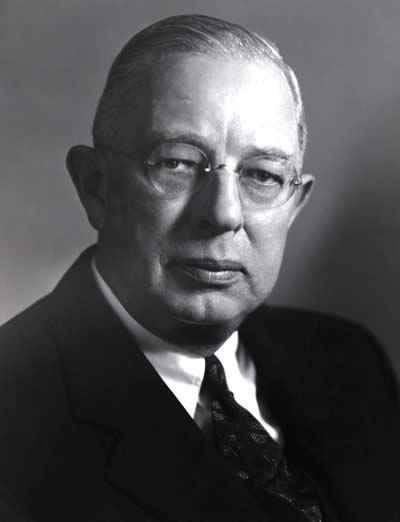
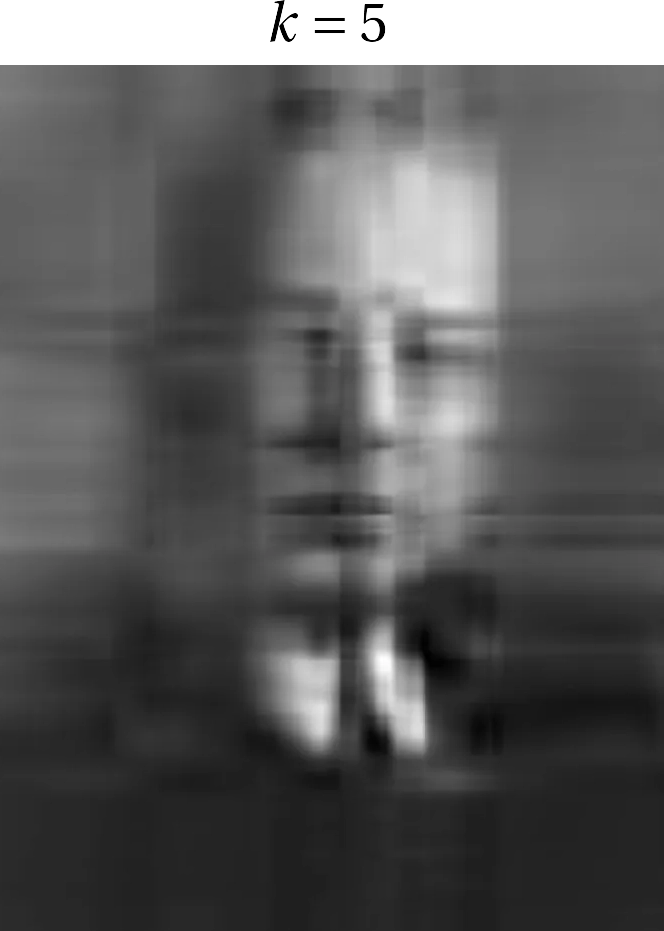
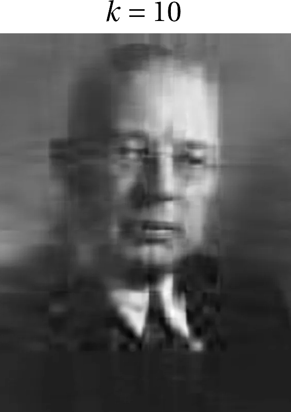

{:menu LA}

# Numerical Linear Algebra with NumPy

* toc
{:toc}

- [Back to Linear Algebra](LA-LinearAlgebra.md)
- [Introduction to NumPy](SW-NumPy.md)

## Matrix Multiplication

NumPy uses the `@` operator to perform matrix multiplication. Given that
\\[
  \mat{m} = \begin{pmatrix} 1 & 2 \\\ 3 & 4 \end{pmatrix}
  \qquad\text{and}\qquad
  \vb{v} = \begin{pmatrix} -2 \\\ 1 \end{pmatrix}
\\]
Then we would expect
\\[
  \mat{m}\vdot\mat{m} = \begin{pmatrix} 1 & 2 \\\ 3 & 4 \end{pmatrix} \vdot \begin{pmatrix} 1 & 2 \\\ 3 & 4 \end{pmatrix} = \begin{pmatrix} 7 & 10 \\\ 15 & 22\end{pmatrix}
\\]
\\[
  \mat{m}\vdot\vb{v} = \begin{pmatrix} 1 & 2 \\\ 3 & 4 \end{pmatrix} \vdot \begin{pmatrix} -2 \\\ 1 \end{pmatrix}
  = \begin{pmatrix} 0 \\\ -2 \end{pmatrix}
\\]
\\[
  \vb{v} \vdot \mat{m} = \begin{pmatrix}-2 & 1\end{pmatrix}\vdot\begin{pmatrix} 1 & 2 \\\ 3 & 4 \end{pmatrix} = \begin{pmatrix} 1 & 0 \end{pmatrix}
\\]
\\[
  \vb{v} \vdot \vb{v} = 5
\\]

~~~~ python
m = np.array([[1, 2], [3, 4]])
array([[1, 2],
       [3, 4]])

m @ m
array([[ 7, 10],
       [15, 22]])

v = np.array([-2, 1])
array([ -2, 1])

m @ v
array([ 0, -2])

v @ m
array([1, 0])

v @ v
5
~~~~

## Matrix Inversion

The generic matrix inversion routine in NumPy is `numpy.linalg.inv`:

~~~~ python
np.linalg.inv(m)
array([[-2. ,  1. ],
       [ 1.5, -0.5]])
~~~~

You can check that the inverse has been computed correctly (up to numerical rounding error):

~~~~ python
m @ np.linalg.inv(m)
array([[1.00000000e+00, 0.00000000e+00],
       [1.11022302e-16, 1.00000000e+00]])
~~~~

## Eigenvalues and Eigenvectors

You can get both the eigenvalues and the corresponding normalized eigenvectors by calling `np.linalg.eig(m)`

~~~~ python
evals, evecs = np.linalg.eig(m)
(evals, evecs)
(array([-0.37228132,  5.37228132]),
array([[-0.82456484, -0.41597356],
       [ 0.56576746, -0.90937671]]))
~~~~

We can confirm that the eigenvectors are normalized and that they are indeed eigenvectors

~~~~ python
np.linalg.norm(evecs, axis=0)
array([1., 1.])

evals[0] * evecs[:,0], m @ evecs[:,0]
(array([ 0.30697009, -0.21062466]), array([ 0.30697009, -0.21062466]))
~~~~

## Cholesky Decomposition

The Cholesky decomposition of a positive-definite symmetric (Hermitian)
square matrix factors
the matrix into a lower-triangular matrix $$\mat{L}$$ such that the matrix
product $$\mat{L} \vdot \mat{L}^{\rm H}$$ gives the original matrix, and
where $$^{\rm H}$$ denotes the Hermitian conjugate (the conjugate transpose).
For a real matrix, it is just the transpose.

### Example

The matrix
\\[
    \mat{n} = \begin{pmatrix}
    2 & -1 & 0 \\\ -1 & 2 & -1 \\\ 0 & -1 & 2
    \end{pmatrix}
\\]
may be Cholesky decomposed to give
\\[
    \mat{L} = \begin{pmatrix}
    \sqrt{2} & 0 & 0 \\\ -\frac{1}{\sqrt{2}} & \sqrt{\frac32} & 0 \\\ 0 & -\sqrt{\frac23} & \frac{2}{\sqrt{3}}
    \end{pmatrix}
\\]

~~~~ python
n = np.array([[2, -1, 0], [-1, 2, -1], [0, -1, 2]])
ch = np.linalg.cholesky(n)
ch
array([[ 1.41421356,  0.        ,  0.        ],
       [-0.70710678,  1.22474487,  0.        ],
       [ 0.        , -0.81649658,  1.15470054]])

ch @ ch.T
array([[ 2., -1.,  0.],
       [-1.,  2., -1.],
       [ 0., -1.,  2.]])
~~~~

According to *Numerical Recipes*, for matrices admitting a Cholesky decomposition, this method of solving $$\mat{A}\vdot\vb{x} = \vb{b}$$ is more numerically stable and about a factor of 2 faster than standard [LDU decomposition](LA-GaussJordan.md).

## Singular Value Decomposition

The singular value decomposition of a rectangular matrix $$\mat{M}$$ takes the form
\begin{equation}
  \mbox{\Large
  $$\underbrace{\mat{M}}_{m\times n} = \underbrace{\mat{u}}_{m\times m} \vdot
  \underbrace{\mat{S}}_{m\times n} \vdot \underbrace{\mat{v}^{\rm H}}_{n\times n} $$
  }
\end{equation}
where $$\mat{u}$$ is unitary, $$\mat{S}$$ is diagonal with the singular values in descending order along the main diagonal (and zeros elsewhere), and $$\mat{v}^{\rm H}$$ is also unitary.

~~~ python
sm = np.array([[1, 2, 3, 4],
              [-4, 2, 7, 8]])
u, s, vh = np.linalg.svd(sm, full_matrices=False)

u
array([[-0.38930378, -0.92110942],
       [-0.92110942,  0.38930378]])

s
array([12.46596449,  2.75676067])

vh
array([[ 0.26433044, -0.21023856, -0.61091761, -0.71603689],
       [-0.8989988 , -0.38581923, -0.0138575 , -0.20676711]])

u @ np.diag(s) @ vh
array([[ 1.,  2.,  3.,  4.],
       [-4.,  2.,  7.,  8.]])
~~~~

What is this good for? I'll offer an example from image processing inspired by [this page](https://www.geeksforgeeks.org/machine-learning/singular-value-decomposition-svd/).

As the matrix to analyze via singular value decomposition, we will use the grayscale values of this image of Harvey Seeley Mudd shown in Figure 1.

  

<a name="Fig1">Figure 1</a> — Mining engineer and philanthropist Harvey Seeley Mudd.

~~~~ python
harvey = plt.imread('Harvey-Mudd.jpg') # this is an RGB image
harvey = harvey[:,:,0] # convert to grayscale
from scipy.linalg import svd
U, S, V_T = svd(harvey, full_matrices=False)
S = np.diag(S)
fig, ax = plt.subplots(5, 2, figsize=(8, 20))
curr_fig = 0
for r in [5, 10, 20, 40, 80]:
    harvey_approx = U[:, :r] @ S[0:r, :r] @ V_T[:r, :]
    ax[curr_fig][0].imshow(harvey_approx, cmap='gray')
    ax[curr_fig][0].set_title(r"$$k = %d$$" % r)
    ax[curr_fig, 0].axis('off')
    ax[curr_fig][1].imshow(harvey, cmap='gray')
    ax[curr_fig][1].set_title("Original")
    ax[curr_fig, 1].axis('off')
    curr_fig += 1
~~~~

  

  

  
   
  

  

  

<a name="Fig">Figure </a> — 

