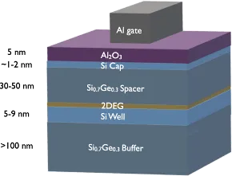
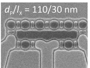
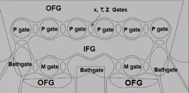
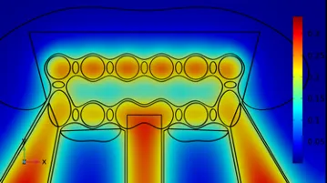
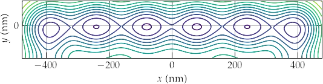
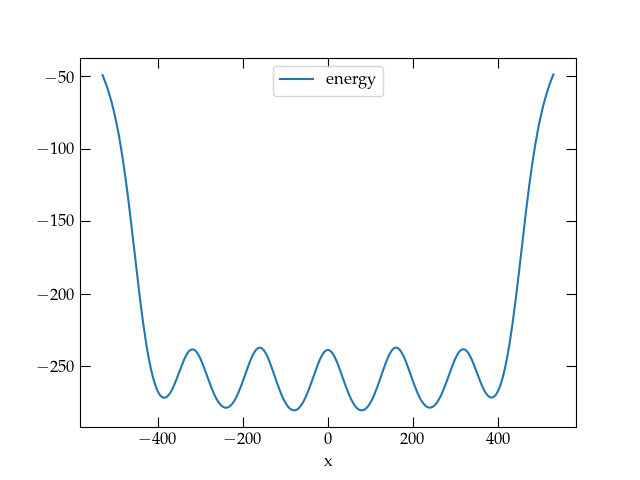

{:menu LE}

# Lecture 2 — A Research Problem

* toc
{:toc}

The HRL 2022–23 Clinic Team worked on a project to explore the use of ferroelectrics in HRL's solid-state qubit design. The strategy relies on trapping single electrons in potential wells that are created in a thin silicon layer by voltages on gates (electrodes) placed above the thin silicon layer. The structure of the layers is illustrated in the following figure. Because electrons in the silicon layer have lower energy than they would have if they moved to the surrounding Si0.7Ge0.3 layers, they are confined in the Si layer and can move about as a two-dimensional gas.

  

<a name="Fig1">Figure 1</a> — Layer structure of the HRL devices.

If a positive potential is applied to the Al gate, then electrons in the Si layer will be drawn to the potential well underneath the gate. If we use other gates to form potential barriers, it is possible to create a sequence of potential wells, each of which can trap a single electron. The spins of these electrons can then be manipulated as quantum bits —
superpositions of $$ |0 \rangle$$ 
and $$|1 \rangle$$
— in a quantum computer.

  
  

<a name="layout">Figure 2</a> — Micrograph of an actual sample (left); model representation (right).

 

## The Model

The team has a finite-element model based on the geometry shown in the micrograph of the left image, which they have implemented in a software package called COMSOL Multiphysics. Given material properties of each layer and object, and the potentials applied to the various gates, the COMSOL model solves for the electrostatic potential throughout the structure. We then extract the potential in the middle of the Si layer as a two-dimensional array of floating-point values, which we can analyze in numpy. Let's take a look at a sample.

  
  
  

<a name="Contour">Figure 3</a> — Contour plot of the potential resulting from identical potentials for all P gates and a (different) identical potential for all x gates.

Figure 3 is a contour plot of potential energy of an electron in the Si layer (in the two-dimensional electron gas, or 2DEG), showing six potential wells, one under each of the six *P gates*. There is a problem. The wells do not look symmetric. For the model to be useful, **each well needs to have the same minimum energy** and **the height of the barrier between each pair of wells should be the same**. When we apply equal positive voltages to each P gate and equal less positive voltages to each x gate (between adjacent P gates), we do not achieve this goal, as shown in the contour plot above.

The method `connect_the_dots` identifies each potential minimum and produces a one-dimensional cut along the lines that connect each successive minimum, producing a pandas DataFrame with the (x,y) coordinates of the points along the line, the potential energy at each point, and the corresponding energy value (`e_line`) along a horizontal line that passes through the central pair of minima. 

  

<a name="blah">Figure 4</a> — You can readily see from this plot that the minima are not all identical and the barriers aren't aren't equal, either. Evidently, we will need to increase the voltage on the outside plunger gates, and we may have to tweak the voltages on the x gates as well to achieve the desired condition of “identical” wells and barriers.

## The Problem

The shape of the curve in the figure above arises from 11 gate voltage values (6 P gates and 5 x gates). When all 6 P gates have the same voltage $$V_P$$ and all 5 x gates have the same voltage $$V_x$$, the resulting profile is as shown. *We need to devise a method to find a set of 11 applied voltages that yield **identical minima** and **identical maxima** across all 6 potential wells*. The problem is that each iteration in which we ask COMSOL to solve for the potential takes about 5 minutes. Therefore, we need to be very strategic in how we adjust the 11 voltages in order to achieve our desired goal.

**How do you propose that the team proceed?**

Team up in groups of 3–4 to discuss strategies.

## Approach

Let's call the input vector of 11 input voltages $$\vb{x}$$ and the vector of 11 output energies (6 minima and 5 intervening maxima) $$\vb{y}$$. The initial situation is that when we supply the COMSOL model with the input $$\vb{x}_0$$ we get the outputs $$\vb{y}_0$$:
\begin{equation}\label{eq:input}
  \vb{x}_0 = \begin{pmatrix}
  V_P \\\ V_X \\\ V_P \\\ V_X \\\ V_P \\\ V_X \\\ V_P \\\ V_X \\\ V_P \\\ V_X \\\ V_P
  \end{pmatrix}
  \longrightarrow
  \vb{y}_0 =
  \begin{pmatrix}
  y_0 = -271.840 \\\ y_1 = -238.409 \\\ y_2 = -278.703 \\\ y_3 = -237.215 \\\ y_4 = -280.549 \\\ y_5 = -238.842 \\\ y_6 = -280.534 \\\ y_7 = -237.219 \\\ y_8 = -278.658 \\\ y_9 = -238.296 \\\ y\_{10} = -271.694 
  \end{pmatrix}
\end{equation}
where $$V_P = 0.6$$ V and $$V_X = 0.3$$ V. More succinctly, we can represent COMSOL as a (nonlinear) operator that takes a vector of 11 input voltages ($$\vb{x}$$) and generates a vector of 11 output voltages $$\vb{y}$$,
\begin{equation}\label{eq:M}
  \vb{y} = M(\vb{x})
\end{equation}

We would like all the even values of $$\vb{y}$$ to be the same (let's say, $$V_P = -280$$ meV as a target) and all the barrier heights to be the same (say $$V_X = -240$$ meV). This means we need to find the changes in the input vector, $$\delta\vb{x}$$, that will change the output by $$\delta\vb{y}$$ where
\begin{equation}\label{eq:dy}
  \delta \vb{y} = \begin{pmatrix}
  -8.160 = V_P - (-271.840)\\\ -1.591 = V_X - (-238.409) \\\ -1.297 = V_P - (-278.703)
   \\\ -2.785 = V_X - (-237.215) \\\ 0.549 = V_P - (-280.549) \\\ -1.158 = V_X - (-238.842) \\\ 
    0.534 = V_P - (-280.534) \\\ -2.781 = V_X - (-237.219) \\\ -1.342 = V_P - (-278.658) \\\ 
     -1.704 = V_X - (-238.296) \\\ -8.306 = V_P - -271.694
  \end{pmatrix}
\end{equation}

Let's ask COMSOL to generate an output for the input vector $$\vb{x}_0 + \delta\vb{x}$$, where $$\delta\vb{x}$$ has all zeros except $$\delta x_j = \Delta = 0.01$$ V, which we can call $$\vb{y}_0 + \delta\vb{y}_j $$. In other words, we subtract $$\vb{y}_0$$ from the vector we get out, to find out how much the outputs changed. If we divide this vector by $$\Delta$$, we have a vector that approximates the rate of change:
\begin{equation}\label{eq:roc}
  \frac{M(\vb{x}\_0 + \Delta \vb{e}\_j) - M(\vb{x}\_0)}{\Delta} \approx 
  \begin{pmatrix}
  \pdv{y_0}{x_j} \\\ \pdv{y_1}{x_j} \\\ \pdv{y_2}{x_j} \\\ \vdots \\\ \pdv{y_{10}}{x_j}
  \end{pmatrix}
\end{equation}
We do this for each $$j$$ and pack the 11 column vectors into a matrix $$\mat{A}$$:
\begin{equation}\label{eq:mata}
  \mat{A} = \begin{pmatrix}
  \pdv{y_0}{x_0} & \pdv{y_0}{x_1} & \cdots & \pdv{y_0}{x_{10}} \\\ 
  \pdv{y_1}{x_0} & \pdv{y_1}{x_1} & \cdots & \pdv{y_1}{x_{10}} \\\ 
  \vdots & \vdots & \ddots & \vdots \\\ 
  \pdv{y_{10}}{x_0} & \pdv{y_{10}}{x_1} & \cdots & \pdv{y_{10}}{x_{10}}
  \end{pmatrix}
\end{equation}
Now, we must solve
\begin{equation}\label{eq:end}
  \mat{A} \vdot \vb{x} = \delta \vb{y}
\end{equation}
which we can manage by multiplying from the left by the inverse of $$\mat{A}$$.