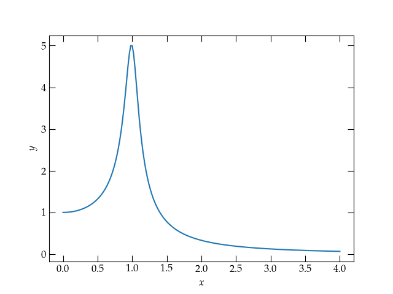
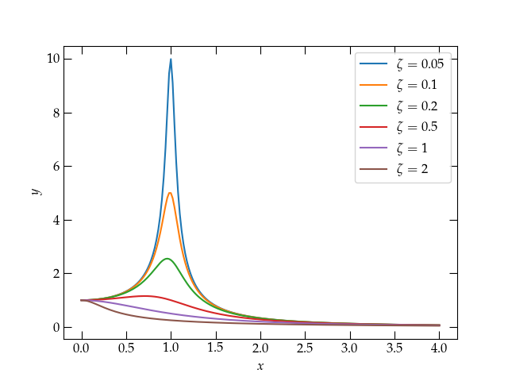
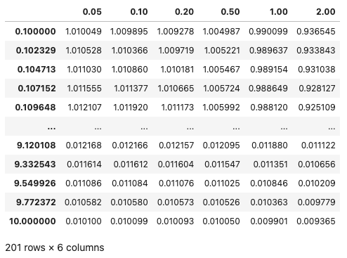
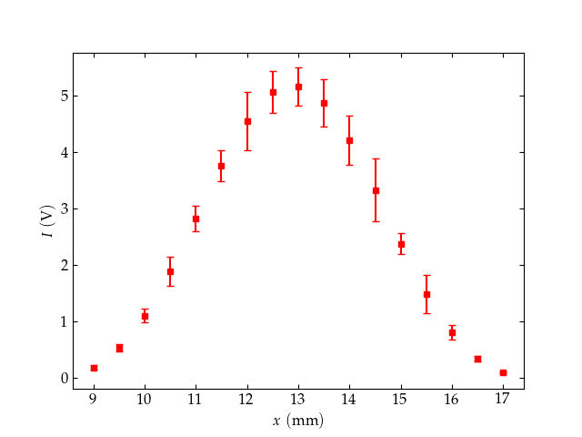

{:menu Setup}
{::comment}menu-start{:/comment}

<label id="hamburger-menu"></label>

<ul>
<li><a href="Installation.html">Installing necessary software</a></li>
<li><a href="Jupyter.html">Jupyter notebooks</a></li>
<li><a href="NumPy.html">NumPy</a></li>
<li><a href="Matplotlib.html">Matplotlib</a></li>
<li><a href="MPLFormatting.html">Formatting Plots</a></li>
</ul>

{::comment}menu-end{:/comment}

# Introduction to Plotting with Matplotlib

* toc
{:toc}

[Back to the top](index.md)

## Plotting a function

To plot a function in matplotlib you need to first compute $$x$$ values and $$y$$ values. Let’s see how to plot the function
\begin{equation}
    y(x) = \frac{1}{\sqrt{(1-x^2)^2 + 4 \zeta^2 x^2}}
\end{equation}
where $$\zeta$$ is called the *damping parameter* and *x* represents the ratio of
the frequency of an oscillator to its *natural frequency*, as you learned in E79.

Can you imagine what the curve looks like for $$x \ge 0$$? See if you can guess
the shape of the curve for a value of $$\zeta \ll 1$$ and also for $$\zeta >
1$$. Then proceed.

We need to pick a suitable range of the independent variable `x`. I’m going to
start at zero and go to $$x = 4$$ for starters. Let’s use 201 points over that
interval. Fortunately, numpy has a very convenient function we can use:

~~~~ python
x = np.linspace(0, 4, 201) # make an array of 201 equally spaced
                           # values between 0 and 4, inclusive
x                          # show the values we just computed
~~~~

*Can you explain why we used 201 points, not 200?*

Now we need to calculate the corresponding values of $$y$$. But those values
depend on the value of $$\zeta$$, which we haven’t yet specified. Let’s write a
little function to take two inputs, the `x` array of values and single value of
$$\zeta$$ and produce the corresponding values of `y`.

~~~~ python
def myfunc(x: np.ndarray, zeta:float):
    """Calculate the y values given by the equation defined above in the section
    called Plotting a function
    """
    return 1.0 / np.sqrt((1 - x*x)**2 + 4 * zeta**2 * x*x)
~~~~

Some explanations:
- `myfunc` takes two arguments, and their types are indicated after the
  colons. Where possible, specifying the type expected for the argument makes
  your functions easier to interpret. 
- the type `np.ndarray` is the kind of array that gets returned from
  `np.linspace`; it is a very commonly used type in numpy. 
- A docstring helps explain the purpose of the function.
- the square root function is defined differently in numpy than in the Python
  `math` module. The numpy version notices when an argument is not a single
  number but a np.ndarray of values and automatically calculates for each value
  in the array. 

Read that last bullet point again. Numpy calls this feature *broadcasting*; it
is **really** nice. It means we don’t need to write loops to compute array
values; numpy will take care of that for us. 

Let’s try a curve with a small value of damping parameter $$\zeta$$.

~~~~ python
    y = myfunc(x, 0.1)
    fig, ax = plt.subplots()
    ax.plot(x, y, label="0.1")
    ax.set_xlabel("$x$")
    ax.set_ylabel("$y$");
~~~~

  

Okay, that looks like a peak near $$x = 1$$ (which means that the frequency is
near the *natural frequency*). Now let’s add a curve on the same axes but with
$$\zeta = 0.5$$ this time. 

### Adding a second curve

~~~~ python
y2 = myfunc(x, 0.5)
ax.plot(x, y2, label="0.5")
ax.legend();
~~~~

  

Stronger damping attenuates the resonance peak.

Well, that’s interesting. Increasing the damping parameter really pushed the
peak down. I wonder if we could make a plot that showed curves for several
values of damping parameter. Let’s try. 

~~~~ python
fig, ax = plt.subplots()
ax.set_xlabel("$$x$$")
ax.set_ylabel("$$y$$")
for zeta in (0.05,0.1, 0.2, 0.5, 1, 2):
    y = myfunc(x, zeta)
    ax.plot(x, y, label=r"$\zeta = %g$" % zeta)
ax.legend();
~~~~

Now our resonance cup runneth over!

Can you summarize the behavior you observe?

### Logarithmic axes

It turns out that this plot will look better if we use logarithmic axes. Let’s see what that looks like. For grins, I’m going to compute a more suitable set of $$x$$ values first.

~~~~ python
logx = np.power(10, np.linspace(-1, 1, 201))
fig, ax = plt.subplots()
ax.set_xlabel("$$x$$")
ax.set_ylabel("$$y$$")
for zeta in (0.05, 0.1, 0.2, 0.5, 1, 2):
    y = myfunc(logx, zeta)
    ax.loglog(logx, y, label=r"$\zeta = %g$" % zeta)
ax.legend();
~~~~

Now our resonance cup runneth over in style!

How would you summarize the behavior you observe in this plot?

## Quiz

Let’s see if you can now apply what we’ve explored so far.

1. Make an array called `hermione` that has 51 equally spaced points between 0 and 1, inclusive.
2. Make a plot of the square of the values in `hermione`. Use blue dots to plot
   the points by passing **'bo'** to the `plot` function. 

## Pandas

Pandas is a module that provides features somewhat akin to a spreadsheet or
database and meshes very naturally with both numpy and matplotlib. Before we can
explore it, we need to import this module. 

~~~~ python
import pandas as pd # pd is the standard abbreviation for pandas
~~~~

I’m going to recompute the values plotted in the previous figure and store them
in a pandas DataFrame for easy display. 

~~~~ python
# First make a dictionary of vectors
values = {z:myfunc(logx, z) for z in (0.05, 0.1, 0.2, 0.5, 1, 2)}
# Now create a pandas DataFrame to store them
df = pd.DataFrame(values, index=logx)
df
~~~~

Displaying a pandas DataFrame.

You can access individual columns using their name:

~~~~ python
df[0.2]
df.plot(logx=True, logy=True, xlabel="$$x$$", ylabel="$$y$$");
~~~~

With the curves in a pandas DataFrame, the plot command takes a single line.

Notice how the value of $$\zeta$$ doesn’t affect the frequencies either
significantly below the natural frequency ($$x = 1$$) nor significantly above it,
where all the curves fall off in the same way with increasing frequency. Also
note how the plotting operation could be achieved with a single call, with the
various properties adjusted with keyword arguments. 

### Practice with pandas and matplotlib

I have placed some experimental data with uncertainties at
https://www.physics.hmc.edu/courses/p134/CircularMoore2004.txt. The $$x$$ axis
variable is the position of the detector (in mm); the $$y$$ axis variable is the
observed light intensity (in volts); the $$y$$ uncertainty values are in the same
units. 

Prepare a plot of these data using discrete points for the data, error bars set
according to the uncertainties, and see if you can style your graph *exactly*
like the one shown below. Feel free to consult the matplotlib documentation as
liberally as you like! 

Target practice: Can you make your plot look *exactly* like this one?

**Hints**

+ You can load the data into a convenient data structure defined by pandas with
   some code like 

~~~~ python
import pandas as pd
the_data = pd.read_table('filename_or_URL')
~~~~

You can then see a table of the data by entering `the_data` in a Jupyter
cell. You can access individual columns of the data by name: `the_data['x']` or
`the_data.x`. 

+ The command to plot with error bars is `ax.errorbar(xvals, yvals, yerrors)`
   and you can add lots of keyword arguments to make things look the way you
   wish. To make a pleasant-looking plot, I recommend scaling the errors in
   Moore’s data by a factor of 50 (yeah, he was good!). The data in the
   $$x$$ column is the position of the detector in millimeters, while the data in
   the columns labeled `I` and `I_err` are the intensity and intensity errors,
   with values in volts. 

+ Potentially interesting keywords:
    - `marker`
    - `fmt`
    - `markersize`
    - `capsize`

### Modifying the way a trace is displayed

You can modify the way a trace appears with both positional and keyword
arguments to the call to =plot(xvals, yvals)=. For a few basic colors, you can
use the following shortcuts:

| color code   | meaning | symbol code | meaning       |
|------------+---------+-------------+---------------|
| `'b'`        | blue    | `'o'`         | filled circle |
| `'r'`        | red     | `'.'`         | dot           |
| `'g'`        | green   | `'*'`         | star          |
| `'k'`        | black   | `'-'`         | line          |
| `'y'`        | yellow  | `'v'`         | triangle down |
| `'w'`        | white   | `'^'`         | triangle up   |
| `'m'`        | magenta | `'s'`         | square        |
| `'c'`        | cyan    | `'d'`         | thin diamond  |
|------------+---------+-------------+---------------|

You can also use an RGB or RGBA notation, such as =#0f0800= or =#0f0f0f80=. To
combine such a color specification with a marker designation, use a command such
as the following

~~~~ python
ax.plot([0, 0.25, 0.5, 0.75], [1, 0.75, 0.5, -0.25], 'o', color='#44bb60')
~~~~

See [markers](https://matplotlib.org/api/markers_api.html?highlight=marker#module-matplotlib.markers) for more marker options and [colors](https://matplotlib.org/api/colors_api.html?highlight=color#module-matplotlib.colors) for more options for representing colors.

[Next step: formatting in Matplotlib](MPLFormatting.md)
