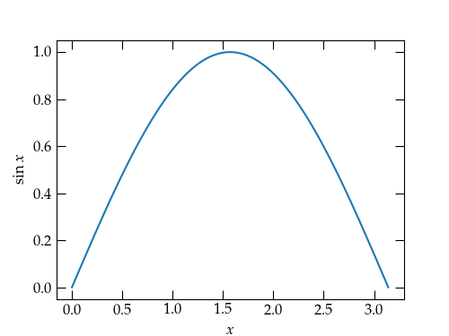

# Numerical Linear Algebra with NumPy

The standard way to access the routines of NumPy in a Python program is with an import statement of the form

    import numpy as np

A basic numerical type in NumPy is the `np.ndarray`, which can represent an array of arbitrary numbers of dimensions. You can create an array from basic Python types such as **lists** and **tuples** using `np.asarray(list_or_tuple)`. For example

    a = np.asarray([[1, 2, 3], [4, 5, 6]])

generates the $$2\times 3$$ array

    array([[1, 2, 3],
           [4, 5, 6]])

Besides listing all elements of a NumPy array, you can use a number of convenience functions to generate them:

+ `np.arange(start, end, dx)` generates a one-dimensional array of values (start, start + dx, start + 2 * dx, ..., start + n * dx) where the final value satisfies start + n * dx < end. For instance, `np.arange(1, 4, 1)` produces  `array([1, 2, 3])`
+ `np.linspace(start, end, n)` generates a one-dimensional array of values that divides [start, end] into $$n-1$$ equal intervals, so that `np.linspace(1, 4, 4)` produces `array([1, 2, 3, 4])`. That is, `linspace` includes the end points, whereas `arange` does not include its end point.
+ `np.zeros((nrows, ncols))` generates a nrows by ncols array of zeros
+ `np.ones((nrows, ncols))` generates a nrows by ncols array of ones
+ [See the NumPy page on Array creation routines](https://numpy.org/doc/stable/reference/routines.array-creation.html) for more information.

## Properties of NumPy arrays

Suppose that you want to multiply each element in a list by 3.2. In standard Python, you could write a list comprehension of the form

    b = [x * 3.2 for x in a]

for a list stored in `a`. If, instead, you use a NumPy array, you can simplify the notation to eliminate explicit loops:

    b = np.asarray(a) * 3.2

This notation also works for multiplying (or performing similar arithmetic operations) on all elements of a NumPy array of arbitrary dimensions.

All of the standard functions have NumPy versions that “broadcast” in this way over the elements of the array that they are passed. So, the following code computes a comb of equally spaced $$x$$ values and computes the corresponding sine values and then uses matplotlib to plot the result:

    import matplotlib.pyplot as plt
    x = np.linspace(0, np.pi, 101)
    y = np.sin(x)
    fig, ax = plt.subplots()
    ax.plot(x, y)

