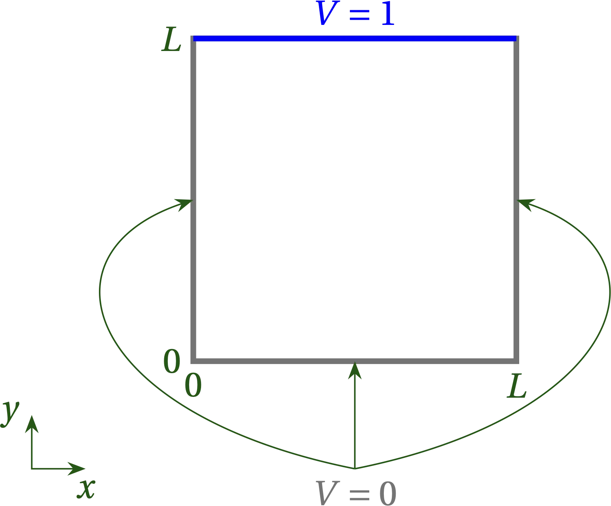
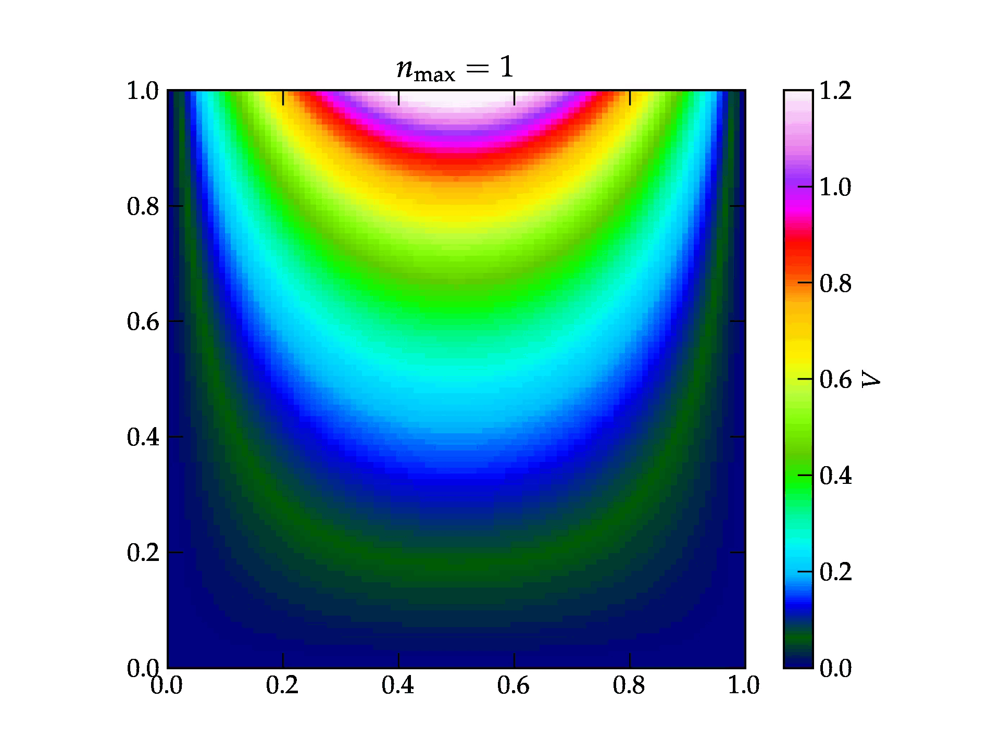
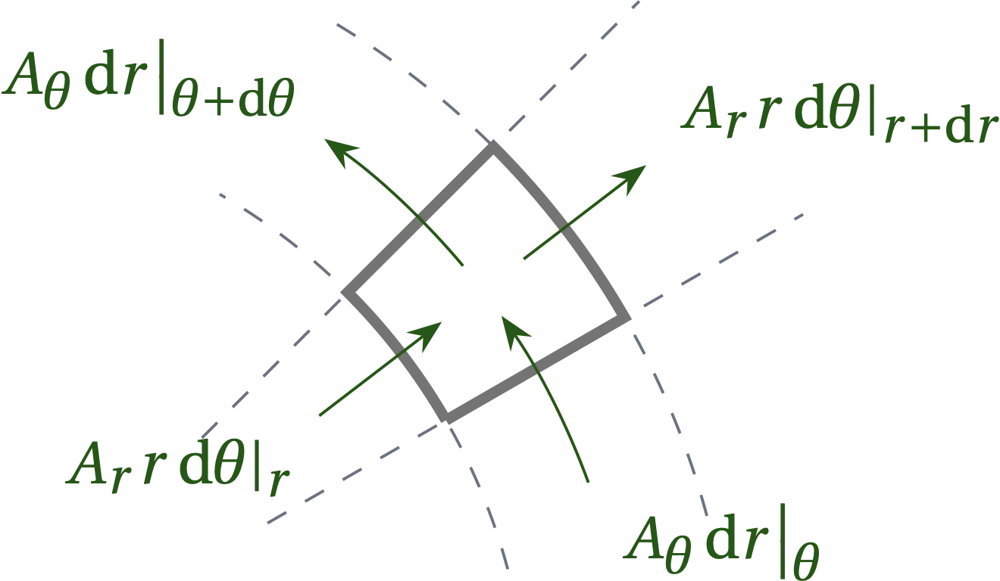
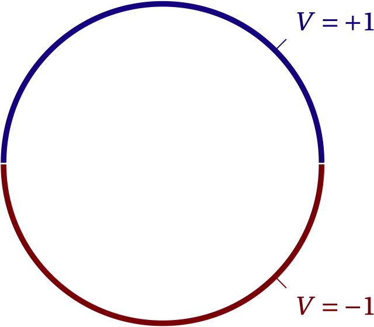
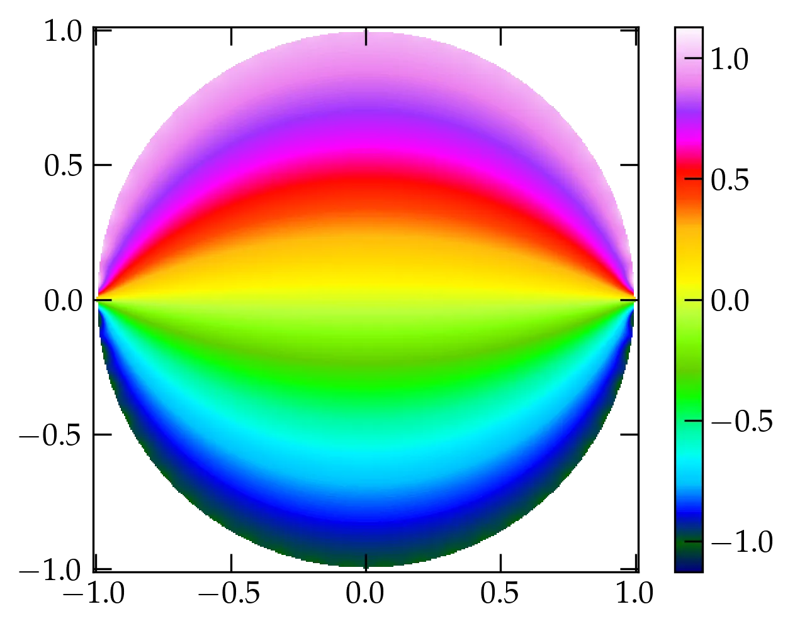
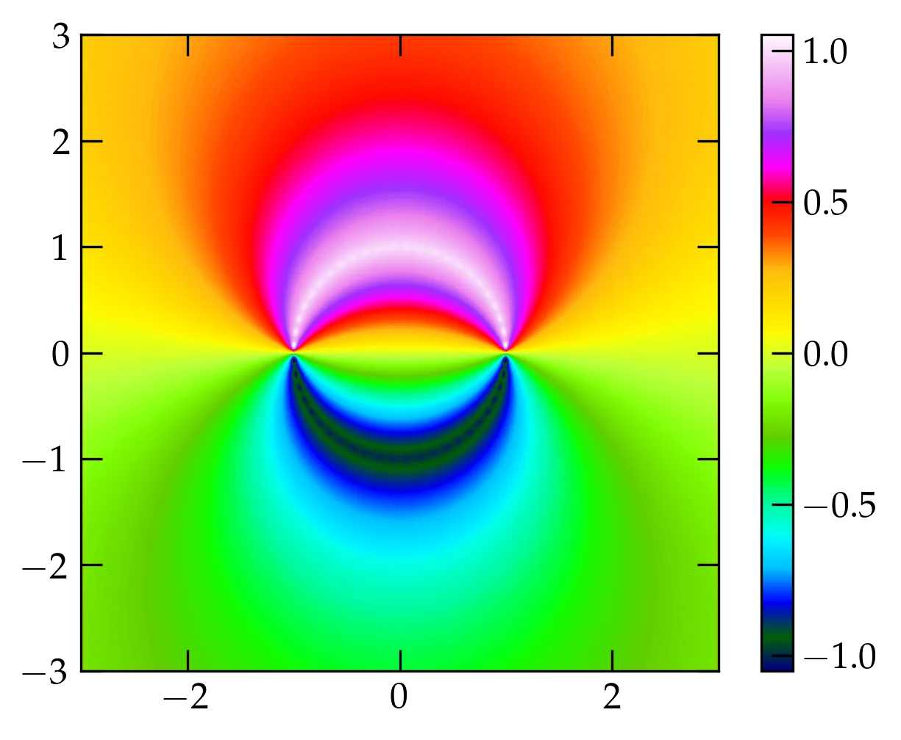

{:menu PD}

# PDEs II — Laplace’s Equation

* toc
{:toc}

Laplace’s equation
\begin{equation}\label{eq:Laplace}
  \laplacian V = \pdv[2]{V}{x} + \pdv[2]{V}{y} + \pdv[2]{V}{z} = 0
\end{equation}
describes the electrostatic potential $$V$$ in a charge-free region of space. It also describes the steady-state temperature distribution in a region of space that lacks sources or sinks (if we substitute $$T$$ for $$V$$).

> An important property of $$V$$ in a region where $$\laplacian V = 0$$ is that **the minimum and the maximum value of $$V$$ must occur on the boundary**. Why? At a local extremum, $$\grad V$$ must vanish and each $$\pdv[2]{V}{x_i}$$ must have the same sign (positive for a local minimum, negative for a local maximum). But the sum of the second partials has to be zero, so the only way they can sum to zero is if all vanish, in which case the gradient must be constant throughout the region. Either it is zero and the potential is uniform through the region, or it is nonzero and the extrema happen at the limits of the region along the direction of the gradient.

## Strategy

Solutions to a partial differential equation typically are complicated functions of the independent variables. However, we have seen that we can represent an arbitrary function on the interval $$0 \le x \le L$$ using periodic functions, so we may speculate that we might express arbitrary two- and three-dimensional functions as products of one-dimensional basis functions. If the region satisfying Eq.&nbsp;\eqref{eq:Laplace} has rectangular boundaries, then the natural approach to solving it is to look for **separated-variable solutions** of the form
\\[
    V = X(x) Y(y) Z(z)
\\]
which leads to
\\[
    X^{\prime\prime}(x) Y(y) Z(z) + X(x) Y^{\prime\prime}(y) Z(z) +
    X(x) Y(y) Z^{\prime\prime}(z) = 0
\\]
Dividing by $$X(x)Y(y)Z(z)$$ yields
\\[
    \frac{X^{\prime\prime}(x)}{X(x)} +
    \frac{Y^{\prime\prime}(y)}{Y(y)} +
    \frac{Z^{\prime\prime}(z)}{Z(z)} = 0
\\]
which is the sum of three functions of a single variable. For this to work each of these terms must separately equal a constant. Boundary conditions then impose constraints on the allowed constants, leading to discrete values.

Recapping this approach, our strategy is

* to represent a function of three variables, $$V(x,y,z)$$, as a product three functions of a single variable: $$V(x,y,z) = X(x)Y(y)Z(z)$$
* to substitute this form into the partial differential equation
* to divide by $$V(x)$$ to separate all $$x$$ dependence from all $$y$$ dependence and from all $$z$$ dependence
* and to argue that for this sum of functions of **independent variables** to vanish, the contribution from each independent variable must be a constant.

### A Two-Dimensional Example

For simplicity, let's consider a two-dimensional example in which a square region of side $$L$$ has three sides held at $$V = 0$$ and the side at $$y = L$$ held at $$V = 1$$:
\begin{align}
  V_{xx} + V_{yy} &= 0 \notag \\\
  V(0, y) = V(L, y) &= 0  \notag \\\
  V(x, 0) &= 0 \notag \\\
  V(x, L) &= 1 \notag
\end{align}

  

<a name="Fig1">Figure 1</a> — A square region of space in which three of the walls are held at $$V=0$$, while the back (top) wall is held at $$V = 1$$.

To satisfy boundary conditions at $$x = 0$$ and $$x = L$$, we must have
\\[
    X(x) = \sin \qty(\frac{n \pi x}{L})
\\]
so that $$X^{\prime\prime}/X = - (n \pi /L)^2$$. Therefore, the equation for $$Y(y)$$ must be
\\[
    \frac{Y^{\prime\prime}}{Y} = \qty(\frac{n\pi}{L})^2
    \qquad\longrightarrow\qquad
    Y(y) = a e^{n \pi y/L} + b e^{-n \pi y/L}
\\]
We need to find the right combination of $$a$$ and $$b$$ to make $$Y(0) = 0$$, which means that we need $$a = -b$$. I will take $$a = \frac12$$ so that
\\[
    Y(y) = \frac{e^{n \pi y/L} - e^{-n \pi y/L}}{2} = \sinh\qty(\frac{n \pi y}{L})
\\]
To satisfy the boundary condition on the back wall, we need to superpose solutions for different values of $$n$$ and use the orthogonality of the eigenfunctions:
\\[
    V(x,y) = \sum_{n = 1}^{\infty} c_n \sin\qty(\frac{n\pi x}{L})
    \sinh\qty(\frac{n\pi y}{L})
\\]
At the back wall
\\[
    1 = \sum_{n=1}^{\infty} c_n \sin\qty(\frac{n\pi x}{L})
    \sinh(n\pi)
\\]
Multiplying both sides by $$\sin(m \pi x/L)$$ and integrating from 0 to $$L$$ gives
\begin{align}
    \int_0^L \sin(m \pi x/L)\dd{x} &= c_m \frac{L}{2} \sinh(m\pi) \notag \\\
    -\frac{L}{m \pi} \left. \cos(m\pi x/L) \right|_0^L &= c_m \frac{L}{2} \sinh(m\pi) \notag \\\
    c_m &= \frac{2}{m\pi \sinh(m\pi)} \qty(1 - \cos(m\pi)) \notag
\end{align}
Hence, the solution for the potential inside the square region is
\begin{equation}\label{eq:Lapl2}
  \boxed{
    V(x,y) = \sum\_{n\text{ odd}} \frac{4}{n\pi\sinh(n\pi)} \sin\qty(\frac{n \pi x}{L}) \sinh\qty(\frac{n\pi y}{L})
  }
\end{equation}

Let's think a bit about this solution for $$V(x,y)$$. It is the sum of product solutions, with coefficients that decrease rapidly with $$n$$. Note, however, that the term $$\sinh(n \pi y/L)$$ grows rapidly as $$y \to L$$, which compensates the decrease in the coefficients for points near the surface at $$y = L$$. We should expect, therefore, that we require many terms in the series to obtain an accurate solution near $$y = L$$, but that only a few should suffice for other values of $$y$$.

  

<a name="Fig2">Figure 2</a> — Heat map showing the convergence of the solution shown in Eq. \eqref{eq:Lapl2} for the first several terms in the series. Note that because the hyperbolic sine grows large very rapidly, the successive terms after the first few serve only to impact the very top of the figure, right next to the wall that is held at $$V = 1$$.

Here's some code to generate the successive plots.

~~~~ python
from matplotlib.animation import FuncAnimation

figsize = (6,5)
fig = plt.figure(figsize=figsize)
x = np.linspace(0, 1, 101)
y = np.linspace(0, 1, 101)
V = np.zeros((len(x), len(y)))

im = plt.imshow(
    V,
    cmap='gist_ncar',
    animated=True,
    vmin=0,
    vmax=1.2,
    extent=(0, 1, 0, 1),
    origin='lower',
)
fig.colorbar(im, label="$V$")
fig.axes[0].tick_params(axis='x', which='both', pad=8)
plt.title(r"$n_{\rm max} = 1$")

def animate(*args):
    global x, y, V
    n = args[0]
    if n == 1:
        V *= 0
    npi = n * np.pi
    c = 4 / (npi * np.sinh(npi))
    a = np.sin(npi * x)
    b = np.sinh(npi * y)
    V += c * np.tensordot(b, a, axes=0)
    im.set_array(V)
    title = plt.title(r"$n_{\rm max} = %d$" % args[0])
    return (im, title)

ani = FuncAnimation(fig, animate, frames=list(range(1, 21, 2)),
    interval=300, blit=True, repeat=False)
~~~~

## Solving Laplace's Equation in a Circular Region

If the region in which you seek to solve Laplace's equation is not rectangular but circular, it will make sense to return to the definition of the laplacian and express this operator in terms of polar coordinates. Since the laplacian is the divergence of the gradient, we need to work out (or look up and take on faith) expressions for these operators in polar coordinates.

The gradient is straightforward:
\\[
    \grad V = \pdv{V}{r} \vu{r} + \frac1r \pdv{V}{\theta} \vu*{\theta}
\\]
To figure out the divergence, recall that it is defined as the ratio of the flux out of the "volume" divided by the volume as the volume goes to zero. In the 2-D case, volume is replaced by area, which is $$\dd{a} = r\dd{\theta} \dd{r}$$. As illustrated in <a href="#Fig3">Fig.&nbsp;3</a> below, the net flux of vector field $$\vb{A}$$ out of the area is
\\[
    A_r(r+\dd{r}, \theta) (r+\dd{r}) \dd{\theta} - A_r(r,\theta) r\dd{\theta}
    + A_\theta(r, \theta + \dd{\theta}) \dd{r} - A_\theta(r,\theta) \dd{r}
\\]

  

<a name="Fig3">Figure 3</a> — A small area element in polar coordinates showing the flux of a vector field $$\vb{A}$$ into and out of the area element. 

Dividing by the area and taking the limit gives
\\[
    \div \vb{A} = \frac1r \pdv{(r A_r)}{r} + \frac1r \pdv{A_\theta} {\theta}
\\]
Hence, the laplacian in polar coordinates is
\begin{equation}\label{eq:LaplPolar}
  \boxed{
    \laplacian V = \frac1r \pdv{}{r}\qty(r \pdv{V}{r}) + \frac{1}{r^2} \pdv[2]{V}{\theta} =
    \pdv[2]{V}{r} + \frac{1}{r} \pdv{V}{r} + \frac{1}{r^2} \pdv[2]{V}{\theta}
    }
\end{equation}

## Example

To have a definite problem to work out, let us suppose that a circular region of radius $$a$$ is surrounded by electrodes that maintain the potential
\\[
    V(a, \theta) = \begin{cases}
      +1 & 0 < \theta < \pi \\\
      -1 & \pi < \theta < 2\pi
    \end{cases}
\\]
as illustrated in <a href="#Fig4">Figure&nbsp;4</a>.
We seek the potential in the interior of the circle.

  

<a name="Fig4">Figure 4</a> — Electric potential on the boundary of a circular region of radius $$a$$.

We look for a separated variable solution of the form $$V(r, \theta) = R(r)\Theta(\theta)$$ which we substitute into the expression for the laplacian to get
\\[
    R^{\prime\prime}(r) \Theta(\theta) +
    \frac1r R'(r)(r) \Theta(\theta) +
    \frac{1}{r^2} R(r) \Theta^{\prime\prime}(\theta) = 0
\\]
Dividing by $$\dd{A}$$ and multiplying by $$r^2$$ separates the variables to give
\\[
    \frac{r^2 R^{\prime\prime} + r R'}{R} + \frac{\Theta^{\prime\prime}}{\Theta} = 0
\\]
The first term depends only on $$r$$, while the second depend only on $$\theta$$. **Each, therefore, must be a constant.** Which one should we consider first?

Angular variables typically have a special constraint: $$\theta + 2\pi = \theta$$. **If you increase the polar angle by $$2\pi$$, you should return to the same point. Therefore, $$\Theta(\theta+2\pi) = \Theta(\theta)$$.**

Since our domain includes the entire range of $$\theta$$, and since $$\theta = 0$$ corresponds to the same point as $$\theta = 2\pi$$, we must insist that $$\Theta(\theta)$$ have period $$2\pi$$. Hence,
\\[
    \Theta(\theta) = \alpha \cos n\theta + \beta \sin n\theta \qqtext{for $$n \in 0, 1, 2, \ldots$$}
\\]
(In some problems it may be more useful to use complex exponentials for the $$\theta$$ dependence.)

Given the angular dependence, the equation for the radial dependence becomes
\\[
    r^2 R^{\prime\prime} + r R' - n^2 R = 0
\\]
which is **equidimensional**: for $$r$$ having dimensions of length, each term in this equation has the dimensions of $$R$$.

If $$n = 0$$, one solution is to take $$R' = 0$$, so $$R = a_0$$. If $$R'$$ is not constant, we must solve
\\[
    r R^{\prime\prime} + R' = 0  = \dv{(r R')}{r} \qqtext{$$\longrightarrow$$}
    r R' = a'\_0
    \qqtext{$$\longrightarrow$$}
    R = a'\_0 \ln r
\\]

When $$n > 0$$, we can look for a solution of the form $$R = r^k$$:
\\[
    r^2 k(k-1) r^{k-2} + r k r^{k-1} - n^2 r^k = 0
\\]
or
\\[
    r^k[k^2 - k + k - n^2] = 0 \qquad\longrightarrow\qquad
    k = \pm n
\\]
The potential may thus be represented by the series
\\[
    V(r, \theta) = a\_0 + a'\_0 \ln r + \sum_{n=1}^{\infty} (\alpha_n r^n + \beta_n r^{-n})(a_n \cos n\theta + b_n \sin n\theta)
\\]

If we were solving in an annular region, we would need to keep all terms, in principle. However, since our region of interest includes the origin, we must exclude the terms that diverge there. Hence, $$a'_0 = \beta_n = 0$$, and we are left with
\\[
    V(r, \theta) = a_0  + \sum_{n=1}^{\infty} \qty(\frac{r}{a})^n (a_n \cos n\theta + b_n \sin n\theta)
\\]
after removing dimensions from the radial portion.
It remains to determine the unknown coefficients $$a_n$$ and $$b_n$$.  The potential on the boundary has odd symmetry (imagine the range of $$\theta$$ going from $$-\pi$$ to $$\pi$$), so all the $$a_n$$ vanish since $$\cos n\theta$$ is an even function of $$\theta$$. Multiplying by $$\sin m\theta$$ and integrating from $$-\pi$$ to $$\pi$$, we have
\\[
    \int_{-\pi}^{\pi} \mathrm{sgn}\theta \; \sin m\theta \dd{\theta} = b_m \pi
\\]
The integral is
\\[
    2 \int_0^\pi \sin m\theta\dd{\theta} = -\frac{2}{m} \left. \cos m\theta \right|_0^\pi = \frac{2}{m}(1 - (-1)^m)
\\]
Hence,
\begin{equation}\label{eq:LaplRound}
  V(r,\theta) = \frac{4}{\pi} \sum\_{n \text{ odd}} \frac{1}{n} \qty(\frac{r}{a})^n \sin n\theta
\end{equation}

  

<a name="Fig5">Figure 5</a> — The electrostatic potential inside a circular region bounded by the potential shown in <a href="#4">Figure&nbsp;4</a>. Note carefully the range of the colormap. Can you explain?

~~~~ python
N = 401
x = np.linspace(-1.01,1.01,N)
r, phi = np.zeros((N,N)), np.zeros((N,N))
for i in range(N):
    x2 = x[i]**2
    for j in range(N):
        r[i,j] = x2 + x[j]**2
        phi[i,j] = np.arctan2(x[i], x[j])
r = np.sqrt(r)
phi[r>1] = np.nan
r[r>1] = np.nan

V = np.zeros_like(r)
for n in range(1,49,2):
    V += 4/(n*np.pi) * r**n * np.sin(n*phi)

plt.close('all')
im = plt.imshow(V, cmap='gist_ncar', origin='lower', extent=(-1.01,1.01,-1.01,1.01))
plt.colorbar(im);
~~~~

### Exercise

Modify the code that produced a “heat map” of the potential inside the circular electrodes shown in <a href="#4">Figure&nbsp;4</a> so that it also computes the potential *outside* the electrodes, as shown in <a href="#Fig6">Figure&nbsp;6</a>.

  

<a name="Fig6">Figure 6</a> — Electric potential in a plane far from the ends of half-cylindrical electrodes in which the upper has potential $$V=1$$ and the lower $$V=-1$$.

Next: [The Wave Equation](PD-PD3.md)
