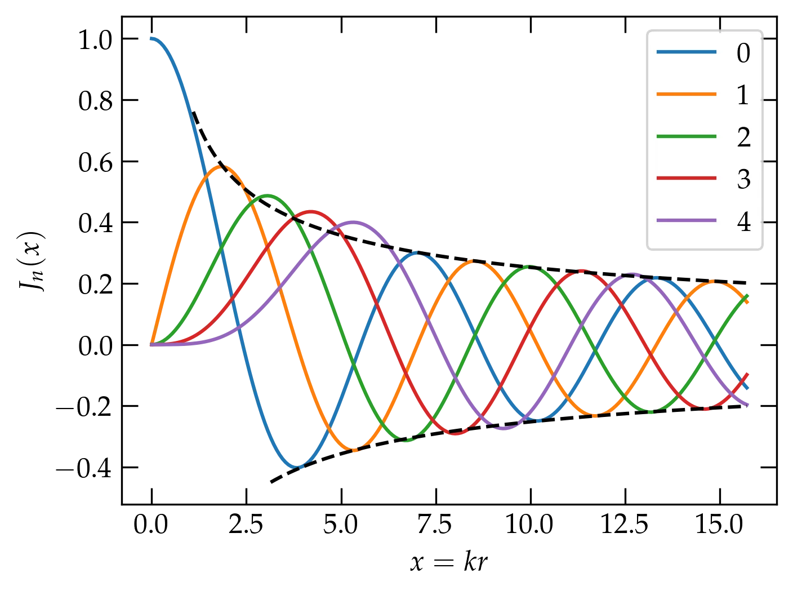
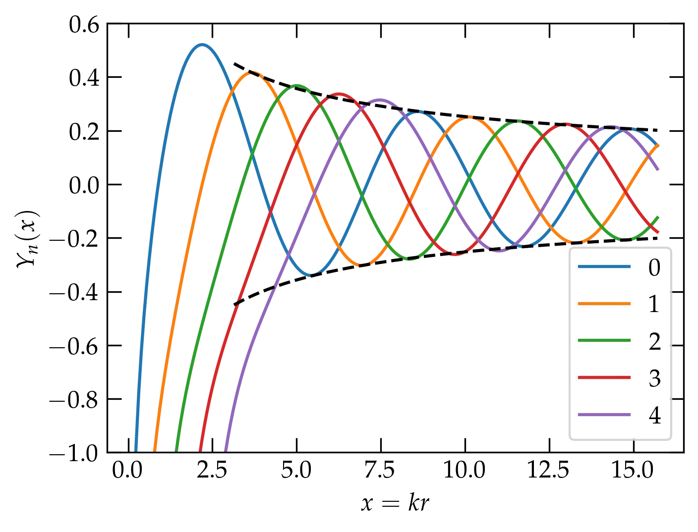
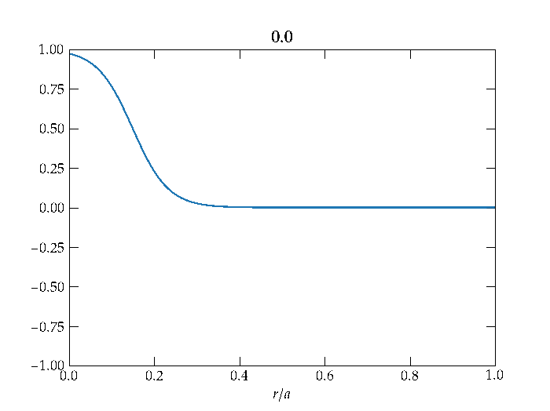
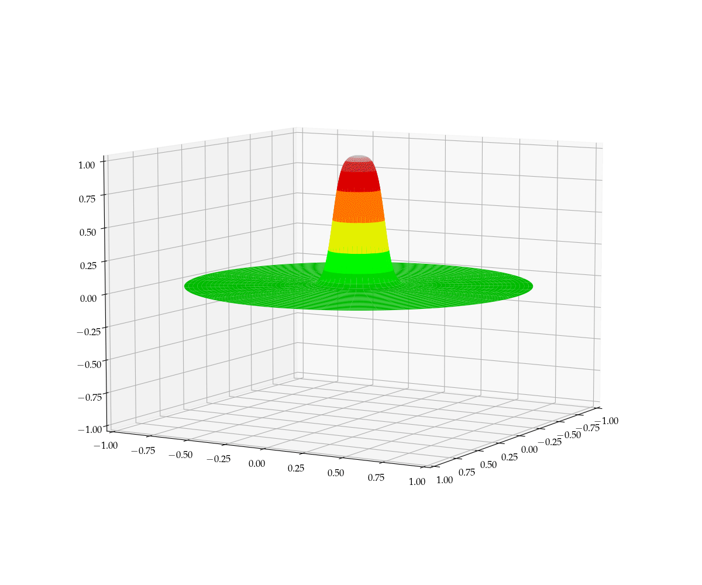

{:menu PD}
{::comment}menu-start{:/comment}

<label id="main-menu"></label>

<ul>
<li><a href="SW-Installation.html">Software Installation</a></li>
<li><a href="LA-LinearAlgebra.html">Linear Algebra</a></li>
<li><a href="FO-Intro.html">Fourier Series and Transforms</a></li>
<li><a href="ST-Random.html">Stochastic Processes</a></li>
<li><a href="DE-DE1.html">Differential Equations</a></li>
<li><a href="PD-PD1.html">Partial Differential Equations</a></li>
<li><a href="PR-Project.html">Projects</a></li>
</ul>

<label id="hamburger-menu"></label>

<ul>
<li><a href="PD-PD1.html">Partial Differential Equations</a></li>
<li><a href="PD-PD2.html">PDEs II — Laplace’s Equation</a></li>
<li><a href="PD-PD3.html">PDEs III — the Wave Equation</a></li>
<li><a href="PD-PD4.html">Combining Fourier Transforms and PDEs</a></li>
<li><a href="PD-PD5.html">Numerical Solution to Partial Differential Equations</a></li>
</ul>

{::comment}menu-end{:/comment}

# PDEs III — the Wave Equation

* toc
{:toc}

Many systems are well described by the linear wave equation,
\begin{equation}\label{eq:wave}
  \nabla^2 \psi = \frac{1}{v^2} \pdv[2]{\psi}{t}
\end{equation}
where $$v$$ is the wave speed and $$\psi$$ is something that's waving. 

### Cartesian coordinates

In cartesians, we assume a separated form $$\psi = X(x)Y(y)Z(z)T(t)$$ and get
\begin{equation}\label{eq:cartesians}
  \frac{X ^{\prime\prime}}{X} + \frac{Y ^{\prime\prime}}{Y} + \frac{Z ^{\prime\prime}}{Z} = \frac{1}{v^2} \frac{T ^{\prime\prime}}{T}
\end{equation}
The left-hand side depends only on spatial coordinates, while the right-hand side depends only on time. Each side must be a constant. For solutions that oscillate in time, that constant must be negative. In some problems you may need exponential solutions, in which case it would be a positive constant, but I'm going to assume oscillatory solutions.

By a similar argument, each of the terms on the left must separately be a constant. If each of those is negative, we have
\begin{align}
  X(x) &= e^{i k_x x} \notag \\\ 
  Y(y) &= e^{i k_y y} \notag \\\ 
  Z(y) &= e^{i k_z z} \notag \\\ 
  T(t) &= e^{-i \omega t} \notag 
\end{align}
where to satisfy Eq.&nbsp;(\ref{eq:cartesians}), we must have
\begin{equation}\label{eq:k}
  \boxed{k_x^2 + k_y^2 + k_z^2 = \frac{\omega^2}{v^2}}
\end{equation}
which is called the **dispersion relation**. It describes how frequencies $$\omega$$ depend on wave vectors $$\vb{k}$$.

In more compact notation, the solutions are **plane waves** of the form
\begin{equation}\label{eq:planewaves}
  \psi(\vb{r},t) = A_{\vb{k}} e^{i(\vb{k}\vdot\vb{r} - \omega t)}
\end{equation}

For sound waves in a fluid, this scalar version of the wave equation is appropriate. However, in a material that resists shearing forces, such as a solid, the amplitude for a given $$\vb{k}$$ is not a scalar but a vector. Actually, in that case we have to go back to the differential equation and include both compressive and shear forces, which generally makes the velocity of the wave different depending on whether the wave is transverse or longitudinal. This sort of problem is developed at length in **Fields and Waves**, *Physics 154*. 

In the case of light waves, what's waving? The electric and magnetic fields. We usually take $$\psi$$ to represent the electric field vector, in which case the amplitude $$A_{\vb{k}}$$ must itself be a vector. However, Gauss's law,
\begin{equation}\label{eq:gauss}
  \div\vb{E} = 0
\end{equation}
forces the wave to be transverse. The argument is straightforward. With $$\vb{E}$$ playing the role of $$\psi$$ in Eq.&nbsp;(\ref{eq:planewaves}), Gauss's law requires
\begin{equation}\label{eq:transverse}
  \div\vb{E} = \pdv{E_x}{x} + \pdv{E_y}{y} + \pdv{E_z}{z} = (ik_x A_x  + i k_y A_y + i k_z A_z)e^{i(\vb{k}\vdot\vb{r}-\omega t)}
   = i \vb{k}\vdot\vb{A}_{\vb{k}} e^{i(\vb{k}\vdot\vb{r}-\omega t)} = 0
\end{equation}
For the divergence to vanish, $$\vb{k}\vdot\vb{A}_{\vb{k}} = 0$$, so the electric field must be perpendicular to the direction of propagation $$\vb{k}$$.
A general solution to the wave equation for light is a superposition of plane waves that satisfy the dispersion relation $$\omega = c k$$, with two transverse components for each wave vector $$\vb{k}$$.

### Cylindrical coordinates

Bessel's equation arises when we solve the wave equation in a circular region, for instance in the shape of a taut drum head after being struck or the ripples on a smooth pond after a pebble is thrown into it—at least while the shore is far away. If we imagine the energy density in the ripples as they proceed outward, it must diminish as $$1/r$$, since the perimeter of the ripple is growing proportional to $$r$$. The energy is proportional to the amplitude squared (same as for a harmonic oscillator), so the amplitude of the wave must decay proportional to $$1/\sqrt{r}$$. So, roughly speaking, we should expect a form something like $$\frac{\sin(kr)}{\sqrt{kr}}$$, where $$k = 2\pi/\lambda$$ is the wave vector.

[As shown here](DE-PDE-II#solving-laplaces-equation-in-a-circular-region), the form of the laplacian in polar coordinates is
\\[
    \laplacian \psi = \frac{1}{r} \pdv{}{r}\qty(r \pdv{\psi}{r}) + \frac{1}{r^2} \pdv[2]{\psi}{\theta}
\\]
We will assume that we can look for a solution of the form
\\[
    \psi(r, \theta, t) = R(r) \Theta(\theta) T(t)
\\]
which we substitute into the wave equation to get
\\[
    \qty[R^{\prime\prime}(r) + \frac1r R'(r)]\Theta(\theta)T(t) +
    \frac{1}{r^2} R(r) \Theta^{\prime\prime}(\theta) T(t) =
    \frac{1}{v^2} R(r) \Theta(\theta) T^{\prime\prime}(t)
\\]
Dividing both sides by $$\psi = R\Theta T$$ gives
\begin{equation}\label{eq:B1}
    \frac{R^{\prime\prime} + \frac1r R'}{R} + 
    \frac{1}{r^2} \frac{\Theta^{\prime\prime}}{\Theta} =
    \frac{1}{v^2} \frac{T^{\prime\prime}}{T}
\end{equation}
which shows that all the time dependence is on the right-hand side. For this equation to hold, both sides must be equal to a constant, which I will call $$-k^2$$, yielding the time dependence
\\[
    T^{\prime\prime} = - k^2 v^2 T = -\omega^2 T
    \qquad\longrightarrow\qquad
    T(t) = e^{\pm i \omega t}
\\]
(I could also use $$\sin\omega t$$ and $$\cos\omega t$$.) Returning now to the left-hand side of Eq. (\ref{eq:B1}) and multiplying by $$r^2$$ we have
\\[
    \frac{r^2 R^{\prime\prime} + r R'}{R} + \frac{\Theta^{\prime\prime}}{\Theta} = -k^2 r^2
    \qquad\longrightarrow\qquad
    \frac{r^2 R^{\prime\prime} + r R'}{R} + k^2 r^2 = - \frac{\Theta^{\prime\prime}}{\Theta}
\\]
Once again, all $$\theta$$ dependence is on the right, while all radial dependence is on the left. Each side must equal a constant, which I will call $$n^2$$. Solving the azimuthal equation then gives
\\[
    \Theta^{\prime\prime} = -n^2 \Theta
    \qquad\longrightarrow\qquad
    \Theta(\theta) = \begin{cases} \sin n\theta & \\\ \cos n\theta & \end{cases}
\\]
Finally, the radial equation becomes
\\[
    r^2 R^{\prime\prime} + r R' + (k^2 r^2 - n^2) R = 0
\\]
The quantity $$kr = x$$ is dimensionless. Noting that
\\[
    \dv{R}{r} = k \dv{R}{kr} = k \dv{R}{x}
\\]
and taking $$y(x) = R(kr)$$, we get finally **Bessel's equation** in its standard form
\begin{equation}\label{eq:Bessel}
  \boxed{ x^2 y^{\prime\prime} + x y' + (x^2 - n^2) y = 0 }
\end{equation}

If the domain over which we seek to solve the equation includes the full circle, then $$n$$ must be an integer to make $$\Theta(\theta)$$ single valued. If it is restricted to a subrange of angles, then $$n$$ will generally be real.

## Bessel Functions

The solutions to Bessel's equation that are bounded at the origin are called **Bessel functions** (of the first kind) and denoted $$J_n(x)$$. We can look for a series solution using the [method of Frobenius](DE-DE1.md). I will simply illustrate here the shape of the solutions.

  

<a name="Fig1">Figure 1</a> — The first five Bessel functions of integer order. The dashed black curves show the asymptotic envelope, $$y = \pm\sqrt{2/\pi x}$$.  See Eq.&nbsp;(\ref{eq:asympt}).

The solutions that diverge at the origin are called **Neumann functions** (or Bessel functions of the second kind) and denoted $$Y_n(x)$$.

  

<a name="Fig2">Figure 2</a> — The first few Neumann functions of integer order. The dashed black curves show the asymptotic envelope, $$y = \pm\sqrt{2/\pi x}$$.  See Eq.&nbsp;(\ref{eq:asympt}).

~~~~ python
import matplotlib.pyplot as plt
from scipy.special import jv, yn

fig, ax = plt.subplots()
x = np.pi * np.linspace(0,5,201)
for n in range(5):
    ax.plot(x, jv(n,x), label=f"{n}")
ax.legend()
ax.set_xlabel("$x = kr$")
ax.set_ylabel("$J_n(x)$")

fig, ax = plt.subplots()
x = np.pi * np.linspace(0.05,5,201)
for n in range(5):
    ax.plot(x, yn(n,x), label=f"{n}")
ax.legend()
ax.set_xlabel("$x = kr$")
ax.set_ylabel("$Y_n(x)$")
ax.set_ylim(-1,0.6)
~~~~

If the domain of solution includes the origin, then we must rule out the Neumann functions. On the other hand, if we are working in an annular region, we will generally need both Bessel and Neumann functions to be able to satisfy boundary conditions at both the inner and outer radii.

## Properties of Bessel Functions

It is possible to show the following relationships among Bessel functions $$Z_n(x)$$, where $$Z$$ can represent either Bessel functions of the first kind ($$J_n$$) or of the second kind ($$Y_n$$):
\begin{align}
  Z\_{n-1}(x) + Z\_{n+1}(x) &= \frac{2n}{x} Z\_n(x) \label{eq:bes1} \\\ 
  Z\_{n-1}(x) - Z\_{n+1}(x) &= 2 Z'\_n(x) \label{eq:bes2}
\end{align}
There is an integral representation of Bessel functions,
\begin{equation}\label{eq:bes3}
J\_n(x) = \frac{1}{2\pi} \int_{0}^{2\pi} \cos(x \sin\theta - n\theta) \dd{\theta}
\end{equation}
and asymptotic forms, such as
\begin{equation}\label{eq:asympt}
  J_n(x) \approx \sqrt{\frac{2}{\pi x}} \cos \qty[x - \qty(n+\frac12)\qty(\frac{\pi}{2})]
\end{equation}
which capture the behavior at large values of $$x$$.

From [Sturm-Liouville theory](DE-SturmLiouville.md), we can show that if $$\alpha_{\nu}$$ is the $$\nu$$th zero of $$J_n(x)$$, then
\begin{equation}\label{eq:ortho}
  \int_{0}^{a} J_{n}(\alpha_{\nu} r/a) J_{n}(\alpha_{\mu}r/a)\; r\dd{r} = 
  \frac{a^2}{2}[J_{n+1}(\alpha_n)]^2 \delta_{\nu\mu}
\end{equation}
In other words, the orthogonality condition of the Bessel functions uses the weight factor $$r$$ in the integration.

## Vibrations of a Drum Head

A uniform thin drumhead is stretched across a circular rim of radius $$a$$. The wave speed of disturbances of the drumhead is set by the ratio of the tension (stress) in the membrane divided by its mass per unit area. For simplicity, let us assume that the initial disturbance of the drumhead has radial symmetry. The solution to the azimuthal dependence equation,
\\[
    \Theta^{\prime\prime} + n^2 \Theta = 0
\\]
becomes $$\Theta = 1$$ and $$n = 0$$.

Because the drumhead includes the origin, we must rule out Neumann functions in the expansion for the solution, which will therefore take the form
\begin{equation}\label{eq:symmetric}
  z(r, t) = \sum_{\nu=1}^{\infty} b_{\nu} J_0\qty(k_\nu r) \cos(v k_\nu t)
\end{equation}
where $$k_\nu = \alpha_\nu / a$$ and $$\alpha_\nu$$ is the $$\nu$$th zero of $$J_0(x)$$. By using only cosines for the time dependence, I am assuming that the initial displacement of the head is nonzero, but that it is initially at rest.

To determine the unknown coefficients $$b_\nu$$, we must solve
\begin{equation}\label{eq:initial}
  z(r, 0) = f(r) = \sum_{\nu=1}^{\infty} b_{\nu} J_0\qty(\alpha_\nu r/a)
\end{equation}
for the initial displacement function $$f(r)$$.

Using Eq.&nbsp;(\ref{eq:ortho}), we can evaluate the coefficients $$b_\nu$$, getting
\begin{equation}\label{eq:solution}
  b_\nu = \frac{ \displaystyle\int_0^a f(r) J_0(\alpha_\nu r/a) r\, dr}{\frac{a^2}{2}\left[J_1(\alpha_\nu) \right]^2}
\end{equation}

An example solution arising from an initial axially symmetric disturbance is shown in <a href="#Fig3">Figure&nbsp;3</a>.

  

<a name="Fig3">Figure 3</a> — The radial displacement of the drum head as a function of time (shown in the plot title) for an azimuthally symmetric initial disturbance. Note that the wave reflects from the clamped boundary condition at $$r = a$$, and that the amplitude of the wave diminishes as it propagates outward, consistent with conservation of energy, since the length of the wavefront increases proportional to the radius $$r$$.

Somehow, the two-dimensional plot leaves something to be desired. Wouldn't it be more natural to image the displacements of the two-dimensional drum surface, which would require a three-dimensional rendering as a function of time? I thought so!

  

<a name="Fig4">Figure 4</a> — Illustration of the motion of a drumhead given an initial axially symmetric disturbance. Note that the vertical displacements are highly exaggerated.

### Code to Generate the Drum Head Animation

First we show the class `Drum` that solves the differential equation for a chosen initial disturbance.

~~~~ python
import numpy as np
import matplotlib.pyplot as plt
from scipy.special import jv, yn, jn_zeros
from scipy.integrate import romberg
from matplotlib.animation import FuncAnimation

def f_initial(x):
    """Create a radially-symmetric disturbance near the origin"""
    t = 0.5*(1 - np.tanh(20*(x-0.15)))
    if isinstance(t, np.ndarray):
        t[np.where(t<0)]=0
    else:
        t = t if t > 0 else 0
    return t

class Drum:
    """
    Solve the Helmholtz equation in polar coordinates for a taut drum head
    with a clamped circular boundary. This class assumes azimuthal symmetry,
    but it wouldn't be too hard to lift that restriction.
    """
    def __init__(self, f_init, n_max=20, **kwargs):
        """
        Create a Drum object, initialize the displacement of the drum head
        according to the function f_init, and use n_max radial functions.
        
        The integration routine `romberg` is used to evaluate the coefficients
        in the radial expansion via integration. It does not handle functions with
        discontinuous derivatives gracefully, so I am using a smooth function.
        """
        self.f = f_init
        self.n_max = n_max
        self.an = jn_zeros(0, n_max)   # Get the first n_max zeros of J_0
        self.bn = np.zeros(n_max)      # Create space for the amplitude coefficients
        self.v = kwargs.get('v', 0.1)  # Set the wave speed
        # The next two fields will be set by set_radii()
        self.radii = None
        self.Jnr = None

        rz = 1

        for n, an in enumerate(self.an):
            integral = romberg(lambda x: self.f(x)*x*jv(0,x*an), 0, rz,
                               tol=1e-9, rtol=1e-9, divmax=15)
            self.bn[n] = 2 * integral / (jv(1, an))**2
        
        if 'radii' in kwargs:
            self.set_radii(kwargs['radii'])
    
    def set_radii(self, radii):
        """
        To evaluate the solution requires the values of J_0(an * r/a) at
        a set of radial values r. Rather than recomputing them each time,
        we evaluate them once here and store them away for use when
        __call__(self, t) is used to evaluate the solution at a particular
        time t.
        """
        self.radii = radii
        self.Jnr = np.zeros((len(radii), self.n_max))
        for n in range(self.n_max):
            self.Jnr[:,n] = self.bn[n] * jv(0, radii * self.an[n])
        
    def __call__(self, t):
        "Evaluate the solution at a given time"
        assert self.radii is not None, "You must set radii before evaluating"
        y = np.zeros_like(self.radii)
        for n in range(self.n_max):
            y += np.cos(self.an[n]*t*self.v) * self.Jnr[:,n]
        return y
~~~~

Then the code to make an animation.

~~~~ python
N = 201
xdata, ydata = np.linspace(0, 1, N), np.zeros(N)
drum = Drum(f_initial, n_max=100)
drum.set_radii(xdata)                 # we divide the radius from 0 to 1 into 200 intervals

fig = plt.figure(figsize=(12,7))
ax = fig.add_subplot(projection='3d') # an attempt at a faithful three-dimensional rendering
ax.view_init(elev=8, azim=30, roll=0)
r = np.linspace(0, 1, N)
phi = np.linspace(0, 2*np.pi, N)
R, P = np.meshgrid(r, phi)
X, Y = R * np.cos(P), R * np.sin(P)
z = drum(0)
Z = np.interp(R, xdata, z)
cmap = 'nipy_spectral'
surf = ax.plot_surface(X, Y, Z, cmap=cmap)
plt.subplots_adjust(left=0, bottom=0, top=1, right=1)

def init():
    ax.set_xlim(-1, 1)
    ax.set_ylim(-1, 1)
    ax.set_zlim(-1, 1)
    return surf,

def update(t):
    global surf
    if surf:
        surf.remove()
    z = drum(t)
    Z = np.interp(R, xdata, z)
    surf = ax.plot_surface(X, Y, Z, cmap=cmap, vmin=-1, vmax=1)
    #title = ax.set_title(f"{t:.1f}", usetex=False)
    return surf,

ani = FuncAnimation(fig, update, frames=np.linspace(0., 42, 201),
                    init_func=init, interval=50, blit=True)
~~~~
