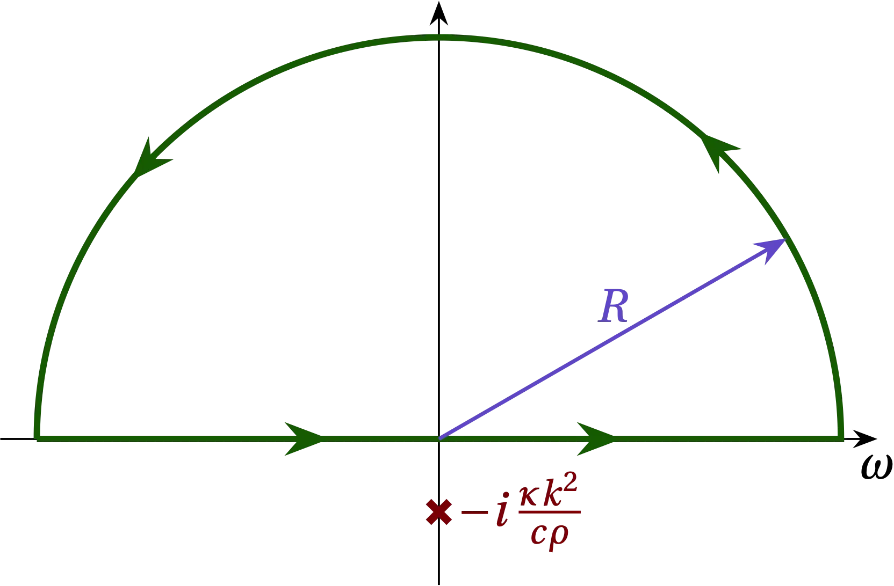

{:menu PD}

# Combining Fourier Transforms and PDEs

* toc
{:toc}

We showed in [the introduction to partial differential equations](PD-PD1.md) that the equation governing the temperature $$u(x,t)$$ in a uniform insulated rod subject to a source function $$g(x,t)$$ is
\begin{equation}\label{eq:DE}
  c \rho u_t - \kappa u_{xx} = g(x,t)
\end{equation} 
which is called the **diffusion equation**. We expect that as time passes, temperature variations will be smoothed out as heat flows from hot regions to cold regions.

For an arbitrary source $$g(x,t)$$, this is a challenging equation to solve. However, we can make useful progress by imagining that the source (forcing) function $$g(x,t)$$ is a superposition of unit impulses delivered at position $$x = x'$$ and time $$t = t'$$. That is, we seek to solve for the function $$G(x,t)$$ such that
\begin{equation}\label{eq:Green}
  c \rho G_t(x,t) - \kappa G_{xx}(x,t) = \delta(x-x') \delta(t-t')
\end{equation}
Once we find a solution to Eq.&nbsp;(\ref{eq:Green}), we can combine all these impulses by integrating 
Since the (arbitrary) forcing function $$g(x,t)$$ can be represented as 
\\[
    g(x,t) = \int_{-\infty}^\infty \dd{x'} \int_{-\infty}^\infty \dd{t'} g(x', t') \delta(x-x') \delta(t-t')
\\]

## Approach: Fourier transforms

To solve Eq.&nbsp;(\ref{eq:Green}), note that the delta functions scream that we integrate over them, since that is their mission in life. Therefore, let us take the (double) Fourier transform of the equation, to obtain the equation for $$\tilde{G}(k,\omega)$$:
\begin{align}
  \int_{-\infty}^{\infty} \dd{t} e^{i\omega t} \int_{-\infty}^{\infty} \dd{x} e^{i k x} \qty(c \rho \pdv{G}{t} - \kappa \pdv[2]{G}{x}) 
  &=
  \int_{-\infty}^{\infty} \dd{t} e^{i\omega t} \int_{-\infty}^{\infty} \dd{x} e^{i k x} \delta(x-x') \delta(t-t')
  \notag \\\ 
  \qty[c \rho (-i\omega) - \kappa (-i k)^2] \tilde{G} &= e^{i(kx'+\omega t')} \notag \\\ 
  \tilde{G}(k,\omega) &= \frac{e^{i(kx'+\omega t')}}{\kappa k^2 - i c \rho \omega}
\end{align}

Now, "all" that remains is for us to take the (double) inverse Fourier transform to obtain the function $$G(x,t)$$. Piece of cake!? That is, the integral we need to compute is
\begin{equation}\label{eq:ifft}
  G(x,t) = \frac{1}{2\pi} \int_{-\infty}^{\infty} \dd{k} \frac{1}{2\pi} \int_{-\infty}^\infty \dd{\omega} 
  \frac{e^{i(kx'+\omega t')}}{\kappa k^2 - i c \rho \omega}
  e^{-i\omega t} e^{-ikx}
\end{equation}

A quick peek at the denominator, which is linear in $$\omega$$, suggests that we should integrate first with respect to $$\omega$$. Rearranging to integrate first over $$\omega$$
\\[
    G(x,t) = \frac{1}{2\pi} \int_{-\infty}^{\infty} \dd{k} e^{-ik (x-x')} \; 
    \frac{1}{-2\pi i c \rho} \int_{-\infty}^\infty \dd{\omega} \frac{e^{-i\omega(t-t')}}
    {\omega + i \kappa k^2/c\rho}
\\]
we note that the pole lies on the negative imaginary axis. Consider first the case that $$t < t'$$. Along a semicircular arc in the upper half-plane, the numerator goes strongly to zero and contributes nothing to a contour integral that includes the real axis. Since this contour contains no poles, the value of the integral is zero. That's reassuring! Before the source is applied at $$t = t'$$ it contributes nothing to $$G(x,t)$$.

  

<a name="Fig1">Figure 1</a> — When $$t - t' < 0$$, we can close the contour in the upper half-plane without modifying the value of the integral along the real axis.

For $$t > t'$$, we must close in the lower half-plane to drive the contribution of the exponential along the semicircular arc to zero, which means that our contour now contains the pole. Noting that we now traverse the contour in the negative direction, the residue theorem allows us to evaluate the integral to get
\begin{align}
  G(x,t) &= \frac{1}{2\pi} \int_{-\infty}^{\infty} \dd{k} e^{-ik (x-x')} \; 
    \frac{1}{-2\pi i c \rho} 
    (-2\pi i) e^{-i(t-t')(-i\kappa k^2/c\rho)}  \notag \\\ 
    &= \frac{1}{2\pi} \int_{-\infty}^{\infty} \dd{k} e^{-ik (x-x')} \;
    \frac{1}{c\rho} e^{-\kappa k^2 (t-t') / c\rho} \notag \\\ 
    &= \frac{1}{2\pi c \rho} \int_{-\infty}^{\infty} \dd{k} 
    \exp\qty[
      -\underbrace{\frac{\kappa (t-t')}{c\rho}}\_{\alpha} k^2 - \underbrace{i(x-x')}_{\beta} k
      ]
\end{align}
What remains is a Gaussian integral, which we know how to do. We get
\begin{align}
  G(x,t) &= \frac{1}{2\pi c\rho} \sqrt{\frac{\pi c \rho}{\kappa(t-t')}} e^{-c\rho (x-x')^2 / 4\kappa(t-t')}  \notag \\\ 
  G(x,t) &= \begin{cases}
    0 & t < t' \\\ 
    \frac{1}{c\rho} \sqrt{\frac{D}{4\pi(t-t')}} \exp\qty[-\frac{D(x-x')^2}{4(t-t')}] & t > t'
  \end{cases}
\end{align}
where the thermal diffusivity is $$D = c\rho / \kappa$$ and in the last line I have included the prior result for times before $$t'$$.

Does this result make sense? As $$t \to t'$$, $$G(x,t)$$ becomes a Gaussian spike centered at $$x'$$ with area $$1/c\rho$$. As time passes, the spike spreads out. The width (standard deviation) of the temperature spike is
\\[
    \sigma(t-t') = \sqrt{\frac{2(t-t')}{D}}
\\]
which grows in time proportional to $$\sqrt{t-t'}$$.