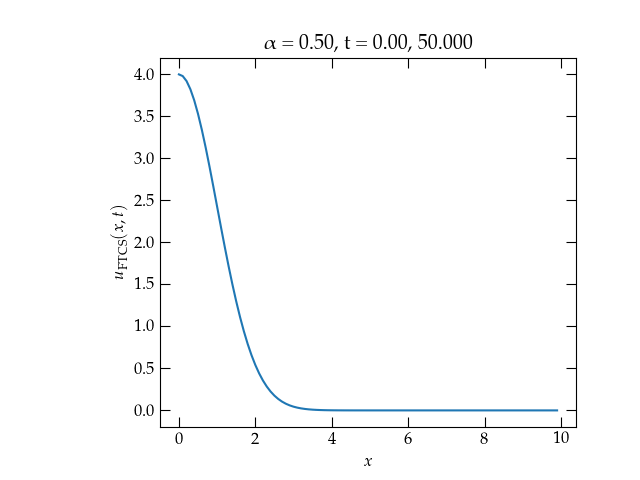

{:menu PD}

# Numerical Solution to Partial Differential Equations

* toc
{:toc}

We have developed an approach to solving Laplace’s equation using separation of variables, which yields solutions in the form of sums of products of a function of $$x$$ times a function of $$y$$. When we solved Laplace’s equation for the potential $$V(x,y)$$ in a square of side $$L$$ that had three grounded sides and the fourth side, at $$y=L$$ held at $$V_0$$, we found
\begin{equation}\label{eq:Lapl2}
    V(x,y) = 4 V_0 \sum_{n\text{ odd}} \frac{1}{n \pi \sinh(n\pi)} \sin\left(\frac{n \pi x}{L}\right) \sinh\left(\frac{n\pi y}{L}\right)
\end{equation}

## Relaxation Method

Here, we explore an entirely numerical approach to solving this problem that relies on approximating the derivatives with finite differences.

By definition,
\\[
    \pdv{V}{x} = \lim_{\Delta x \to 0} \frac{V(x+\Delta x, y) - V(x, y)}{\Delta x}
\\]
The finite-difference approach to approximating derivatives is to make $$\Delta x$$ small but finite. If we discretize the area using
\\[
    x_j = j\,\Delta x \qquad\text{and}\qquad y_i = i\,\Delta y
\\]
then
\\[
    \pdv{V}{x} \approx \frac{V_{i,j+1} - V_{i,j}}{\Delta x}
\\]
is an approximation to the value at $$x_j + \frac12 \Delta x$$. To get the second derivative, we use the same strategy again:
\\[
    \pdv[2]{V}{x} \approx \frac{
        \displaystyle\frac{V_{i,j+1}-V_{i,j}}{\Delta x} - \frac{V_{i,j}-V_{i,j-1}}{\Delta x}}{\Delta x}
    = \frac{V_{i,j+1} - 2 V_{i,j} + V_{i,j-1}}{(\Delta x)^2}
\\]
If we use a square grid, so that $$\Delta x = \Delta y$$, then
\\[
    \pdv[2]{V}{x} + \pdv[2]{V}{y} \approx \frac{V_{i,j+1} + V_{i,j-1} + V_{i+1,j} + V_{i-1,j} - 4V_{i,j}}{(\Delta x)^2} = 0
\\]
Rearranging slightly, we get
\begin{equation}\label{eq:average}
  V_{i,j} = \frac{1}{4}\left( V_{i+1,j} + V_{i-1,j} + V_{i,j+1} + V_{i,j-1} \right)
\end{equation}
In other words, the potential at $$[i,j]$$ is equal to the average of the four nearest neighbor values along the cardinal directions. A simple method to approach the true solution is to **relax** an initial configuration towards a solution that agrees with Eq.&nbsp;(\ref{eq:average}) by iterating multiple times through the array and applying Eq.&nbsp;(\ref{eq:average}).

### Successive Over-Relaxation

The relaxation method converges rather slowly. It typically takes a large number of iterations to achieve a potential distribution that doesn't change appreciably on subsequent iterations. One way to try to speed up convergence of the relaxation method is to **over-relax** by an amount between 1 and 2. That is, if Eq.&nbsp;(\ref{eq:average}) would change the value of $$V_{i,j}$$ by $$\delta V_{i,j}$$, change it by $$\rho \delta V_{i,j}$$ for $$1 \le \rho \le 2$$. For the "right" value of the successive over-relaxation parameter $$\rho$$, you can achieve significantly better performance. However, if you make $$\rho$$ too big, the convergence rate gets worse again, and for $$\rho \ge 2$$, the method becomes unstable and fails to converge.

Another strategy is to do an initial relaxation on a coarse lattice, and use the result of that relaxation to seed the initial values of a finer lattice. 

### Exercise

Compare over-relaxation and coarse-graining approaches for accelerating convergence of a 

## Diffusion in One-Dimension

We seek to solve the one-dimensional heat diffusion equation,
\begin{equation}
  u_t = D u_{xx}
\end{equation}
using a numerical approach. For concreteness, let us suppose that the our rod of thermal diffusivity $$D$$ has the initial temperature
\begin{equation}
  u(x, 0) = \frac{u_0}{\sqrt{2\pi\sigma^2}} \exp(-x^2/2\sigma^2)
\end{equation}
that the end at $$x = 0$$ is insulated, so no heat leaves the rod headed in the $$-x$$ direction, and that the other end of the rod is far away.

In that case, the solution for $$u(x,t)$$ may be written
\begin{equation}
  u(x,t) = \frac{u_0}{\sqrt{2\pi D(t + t_0)}} \exp\left[-\frac{x^2}{2 D (t+t_0)}\right]
\end{equation}
where $$t_0 = \sigma^2/D$$. You can verify that it agrees with the initial condition and also that it satisfies the differential equation. Can you picture how it evolves in time? Does it conserve energy?

## First attempt: FTCS

Let’s try the easiest thing: we'll use finite differences to handle both $$x$$ and $$t$$: let $$u[i,j]$$ represent the temperature at time $$i$$ and at position $$j$$, where 
\begin{equation}
    t_i = i \Delta t \qquad\text{and}\qquad x_j = j \Delta x
\end{equation}

Then the differential equation becomes
\begin{equation}\label{eq:FTCS}
  \frac{u[i+1,j] - u[i,j]}{\Delta t} = D \frac{u[i,j+1] - 2 u[i,j] + u[i,j-1]}{(\Delta x)^2}
\end{equation}
The only unknown in this equation is $$u[i+1,j]$$, so we have a really simple update formula:
\begin{equation}
  u[i+1,j] = u[i,j] + \underbrace{\frac{D \Delta t}{(\Delta x)^2}}_{\alpha} (u[i,j+1] - 2 u[i,j] + u[i,j-1])
\end{equation}
We’ll call this FTCS for *forward in time, centered in space*.

How does it work?

  

<a name="Fig1">Figure 1</a> — Solution to the one-dimensional heat diffusion equation for $$\alpha = 1$$. The solution is clearly unstable!

## Stability Analysis

Why doesn’t this method work? How can we estimate the stability of the method? John von Neumann argued that we should be able to treat solutions as having the general asymptotic form
\begin{equation}
  a(x,t) = f(t) e^{ikx} \qqtext{which discretizes to} \xi^n e^{ik\Delta x j}
\end{equation}
where $$f(t)$$ is a (complex) amplitude function of time. In the discrete version, $$\xi$$ represents the amplitude factor that shows how the amplitude of a mode at wave vector $$k$$ changes over a time step. Substituting the discrete form into the FTCS evolution equation gives
\begin{equation}\label{eq:blah}
  \xi^{n+1} e^{ik\Delta x j} = \xi^n \qty[ e^{ik\Delta x j} + \alpha\qty(e^{ik\Delta x(j+1)} - 2 e^{ik\Delta x j} + e^{ik\Delta x(j-1)}) ]
\end{equation}
Dividing through by $$\xi^n e^{ik\Delta x j}$$ we get
\\[
    \xi = 1 + \alpha(e^{ik\Delta x} - 2 + e^{-ik\Delta x}) = 1 + \alpha[2\cos(k\Delta x) - 2] =
    1 - 4\alpha \sin^2(k \Delta x/2)
\\]
For the solution to be stable, we must have $$|\xi| < 1$$ for all $$k$$. For small $$k$$, we have no problem; the sine term helps us out. The maximum value of $$\sin^2(k \Delta x)$$ is 1, so to keep the solution stable for all possible values of $$k$$, we must have
\\[
    \alpha < \frac{1}{2}
\\]

Let's run the simulation again, but this time adjust the time step so $$\alpha = \frac12$$.

  

<a name="Fig2">Figure 2</a> — Solution to the one-dimensional heat diffusion equation for $$\alpha = \frac12$$. The solution is now stable, although it appears to be losing energy.

## Implicit Methods

So, the FTCS approach to solving the diffusion equation can be stable, although it requires us to take a great many small time steps. Recall that the FTCS method uses the known values at time step $$i$$ to compute the new value at time $$i+1$$. Suppose that we flip this around and try to find the (unknown) temperature values at step $$i+1$$ so that they are self-consistent with the known values at step $$i$$. In other words, let’s replace the right-hand side of Eq.&nbsp;(\ref{eq:FTCS}) with the values at step $$i+1$$:
\begin{equation}
  \frac{u[i+1,j] - u[i,j]}{\Delta t} = D \frac{u[i+1,j+1] - 2 u[i+1,j] + u[i+1,j-1]}{(\Delta x)^2}
\end{equation}
A von Neumann stability analysis of this update formula gives
\\[
    \xi = \frac{1}{1 + 4\alpha\sin^2(k\Delta x/2)}
\\]
which shows that this method is *unconditionally stable*.

## Crank-Nicolson

An even better approach is to average these two methods
\begin{align}\label{eq:CrankNicolson}
  u[i+1,j] - u[i,j] = \frac{D \Delta t}{2(\Delta x)^2}
  &\bigg[\bigg(u[i+1,j+1] - 2u[i+1,j] + u[i+1,j-1]\bigg) \notag \\\ 
  & \qquad + \bigg(u[i,j+1] - 2u[i,j] + u[i,j-1] \bigg) \bigg]
\end{align}
which is called the **Crank-Nicolson method**. By averaging the explicit and implicit methods, Crank-Nicolson works out to be second order in time. The von Neumann stability analysis gives
\\[
    \xi_{\rm CN} = \frac{1 - 2\alpha\sin^2(k\Delta x/2)}{1 + 2\alpha\sin^2(k\Delta x/2)}
\\]
which shows that Crank-Nicolson is *unconditionally stable*.

If we separate the terms that involve the as-yet unknown values, $$u_j^{i+1}$$, from those that are already known, we get the system of equations

\begin{equation}
  \label{eq:CNmatrices}
  \begin{pmatrix}
    1 + \frac\alpha2 & -\frac\alpha2 & 0 & 0 & \cdots  \\\ 
    -\frac\alpha2 & 1 + \alpha & -\frac\alpha2 & 0 & \cdots \\\ 
    0 & -\frac\alpha2 & 1 + \alpha & -\frac\alpha2 & \cdots \\\ 
    0 & 0 & -\frac\alpha2 & 1 + \alpha & -\frac\alpha2  \\\ 
   \vdots & \vdots & \vdots & \vdots & \ddots
  \end{pmatrix}
  \begin{pmatrix}
    u_0^{i+1} \\\ 
    u_1^{i+1} \\\ 
    u_2^{i+1} \\\ 
    u_3^{i+1} \\\ 
    \vdots \\\ 
  \end{pmatrix}
  =
  \begin{pmatrix}
    1 - \frac\alpha2 & \frac\alpha2 & 0 & 0 & \cdots  \\\ 
    \frac\alpha2 & 1 - \alpha & \frac\alpha2 & 0 & \cdots \\\ 
    0 & \frac\alpha2 & 1 - \alpha & \frac\alpha2 & \cdots \\\ 
    0 & 0 & \frac\alpha2 & 1 - \alpha & \frac\alpha2  \\\ 
   \vdots & \vdots & \vdots & \vdots & \ddots
  \end{pmatrix}
  \begin{pmatrix}
    u_0^{i} \\\ 
    u_1^{i} \\\ 
    u_2^{i} \\\ 
    u_3^{i} \\\ 
    \vdots \\\ 
  \end{pmatrix}
\end{equation}

Notice that both matrices are **tridiagonal**. As you will undoubtedly recall, on the first homework assignment you wrote a solver for tridiagonal matrix problems. At the time, I mentioned that your routine would come in handy later when we were solving partial differential equations. This would be a wonderful time to pull it out to implement a Crank-Nicolson solver!

### Questions

1. Apart from the first and last rows, the rows of the two matrices in Eq.&nbsp;(\ref{eq:CNmatrices}) all have the same form. The right expressions for row 0 and row $$N-1$$ depend on the boundary conditions there. What assumption have I made in Eq.&nbsp;(\ref{eq:CNmatrices}) for the left end?

2. The most common boundary conditions are Dirichlet and Neumann conditions. In Dirichlet boundary conditions, the value of the variable is fixed, whereas in Neumann boundary conditions, the normal derivative is fixed (often at zero). In a one-dimensional problem, the normal derivative is the same thing as $$\partial u/\partial x$$. Work out how the tridiagonal matrices need to be adjusted for each type of boundary condition.

3. After implementing the Crank-Nicolson method for solving $$u_t = D u_{xx}$$ in a one-dimensional uniform rod, investigate the error compared to the analytic solution as a function of time step $$\Delta t$$ for fixed $$\Delta x$$. Is the method second-order in time? That is, is the error proportional to $$(\Delta t)^2$$?