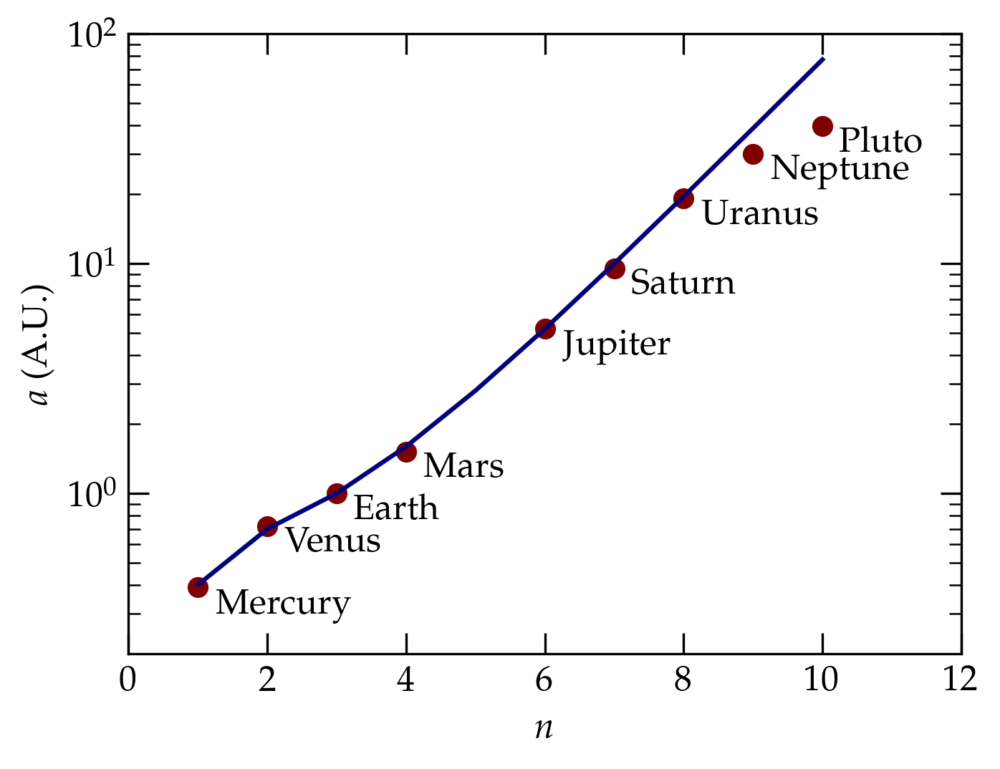
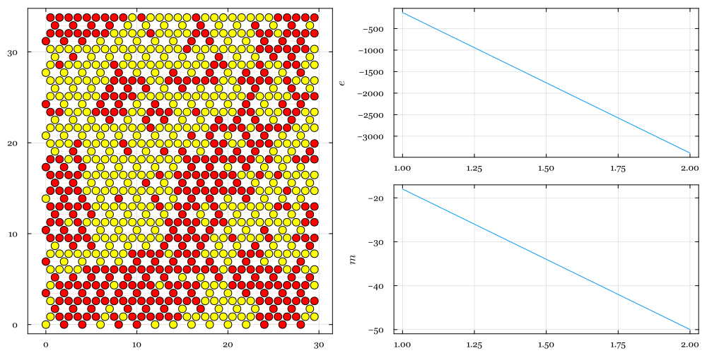
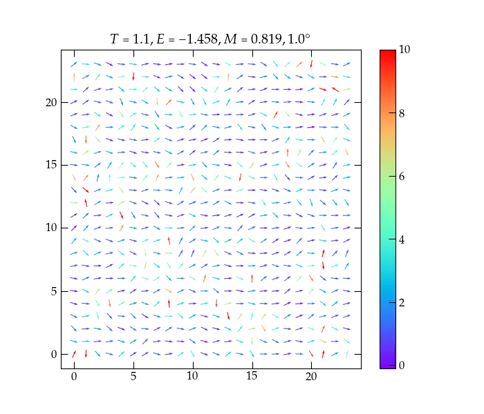

{:menu PR}

# Project Ideas

* toc
{:toc}

## Celestial Mechanics

### Janus and Epimetheus

Two moons of Saturn, Janus and Epimetheus, have almost identical orbits, which makes them seem to almost bounce off each other every four years or so. See [this NASA page](https://solarsystem.nasa.gov/moons/saturn-moons/epimetheus/in-depth/) for a description of this remarkable system.

### Kirkwood Gaps

The Titius-Bode formula,
\begin{equation}
  a_n = \frac{4 + 3 \times 2^{n-1}}{10}
\label{eq:titius-bode}
\end{equation}
predicts the positions of the planets in the solar system, as illustrated in Fig.&nbsp;1.

  

<a name="Fig1">Figure 1</a> — The red dots show the actual orbital radii of the planets; the blue curve shows the prediction of the Titius-Bode formula, Eq.&nbsp;(\ref{eq:titius-bode}).

Until Neptune, the agreement with the Titius-Bode formula is remarkably good. However, there is a suspicious gap in the data: where is the missing planet between Mars and Jupiter? Indeed, that is where the asteroid belt lives. So, there is a bunch of material at roughly the radius predicted by the Titius-Bode formula, but the material never coalesced into a planet. Given Jupiter's size, it seems plausible that the giant planet played a role in preventing the debris from coalescing.

A closer look at the asteroid belt shows that there are gaps at certain radii, where no (or relatively fewer) asteroids are found. These are called **Kirkwood gaps**. They turn out to have orbital periods that, when divided by Jupiter's period, form ratios of small integers; e.g., 2/3, 3/5, etc. Simulate the motion of an asteroid in a circular orbit at a range of radii in the asteroid belt under the influence of the Sun and Jupiter. Can you find evidence of Kirkwood gaps?

### Proxima Centauri

The closest star to our solar system is the binary $$\alpha$$ Centauri,
with masses 1.10 and 0.85 solar masses, having an average
separation of *about* 23 A.U. (One astronomical unit is the mean
distance from the earth to the sun.) The system has a period of about
80 years with an eccentricity of 0.52. (The eccentricity $$\epsilon$$ of
an ellipse is given by $$\epsilon = c/a$$, where the distance from
the center to one focus is $$ c = \sqrt{a^{2}- b^{2}} $$, $$a$$ is
the semimajor axis, and $$b$$ is the semiminor axis.) 
For the purposes of this problem, ignore the *average* separation of the stars; take instead the period of their orbit 
to be *exactly* 80 years. You can then use Kepler's third 
law
\begin{equation}
	T^{2} = \frac{4\pi^{2} \mu}{k} a^{3}
	\label{eq:KeplerIII}
\end{equation}
to figure out the necessary orbital parameters. In this 
expression, $$\mu$$ is the reduced mass of the two stars (their 
product over their sum), and $$k = GM_{1}M_{2}$$.

Investigate the motion of a planet of about the size of the Earth
around such a system. To avoid large numbers, use a system of units in
which time is measured in years, and masses are measured in solar
masses. The most difficult part of this problem is finding suitable
initial conditions and a suitable reference frame in which to observe the planet's motion.
You may simplify
the problem somewhat by first solving for the motion of the two stars,
then assuming that their motion is not significantly affected by the
planet. I offer some guidance below, but recommend consulting a
mechanics text such as Marion, Goldstein, or Symon regarding the
motion of planets. You may also find Chapter 4 of Gould and Tobochnik
useful.

## Mechanics

### Double Pendulum

A double pendulum consists of a two point masses suspended from light, rigid rods, with the second rod attached at the first mass. If released from rest at small amplitude, such a system is well behaved; its motion can be described as a combination of two normal modes. In a normal mode, both particles oscillate at the same frequency. Mass-spring systems (molecules, crystals) exhibit this behavior, as well. However, because the gravitational torque is a **nonlinear** function of displacement angle, when given sufficient initial energy, the double pendulum exhibits remarkable, chaotic behavior, as illustrated in <a href="#Fig2">Figure 2</a>.

  

<a name="Fig2">Figure 2</a> — A set of 5 double pendulums released from rest from very slightly different initial configurations. Initially, their motion is indistinguishable, but as time goes on, their trajectories diverge chaotically.

### Metronomes

A metronome is a sort of pendulum that is driven by a wound spring that gives the oscillating rod a periodic kick to keep it oscillating (that is, to overcome the inevitable dissipation caused by friction). If you place a great number of identical metronomes set the oscillate at the same frequency on a platform that is able to move, and you start them with random phases, the subtle motions of the platform eventually persuade them to all oscillate in phase. That is, they “synchronize.” They all end up ticking at the exact same time, even though they all started at different points in the cycle.
[See this video](https://www.youtube.com/watch?v=5v5eBf2KwF8&t=181s) or [this one](https://www.youtube.com/watch?v=Ov3aeqjeih0) for persuasive evidence that this actually happens.

Can you simulate it?

### Trebuchet

The Trebuchet is a medieval engine of war; it uses a long boom that is heavily weighted on its short end to rotate its long end rapidly. A stone or other projectile held in a sling attached to that long end will get flung with great speed as the heavy weight descends, causing the boom to whip. See [the wikipedia page on Trebuchets](https://en.wikipedia.org/wiki/Trebuchet) for some background on this form of catapult. Can you model it? *Warning: this project is quite challenging.*

### Kaptiza’s Pendulum

Consider a pendulum consisting of a light, stiff rod of length $$\ell$$ to which a small mass $$m$$ is attached at one end. The other end is made to oscillate rapidly in the vertical. If it oscillates with sufficient amplitude and at high enough frequency, then the inverted pendulum can oscillate stably about its **unstable** vertical equilibrium position. See [this page](https://en.wikipedia.org/wiki/Kapitza%27s_pendulum) for some background.

  

<a name="Fig2">Figure 2</a> — Phase plot of a Kapitza (inverted) pendulum driven at 40 times its natural frequency. The red curve shows the final 5% of the simulated duration.

## Magnetism

### Ising Model

The Ising model attempts to represent the interactions between neighboring spins in a crystalline latttice, which may give rise to ferromagnetic behavior. In this simple model, the energy of a collection of spins is given by
\begin{equation}
  E = -J \sum_{i=1}^N \sum_{j=\text{nn}(i)} s_i s_j - B \sum_{i=1}^N s_i
\end{equation}
where each spin $$s_i$$ is equal to $$\pm 1$$, $$J$$ measures the strength of interaction between nearest neighbors, and $$B$$ the strength of interaction with an externally applied magnetic field. If $$J > 0$$, the spins prefer to align; if $$J < 0$$, nearest neighbors prefer to point in opposite directions. Of course, on a triangular lattice, this is not possible, which can lead to interesting behavior.

  

<a name="Fig3">Figure 3</a> — Relaxation run of an Ising model on a two-dimensional kagome lattice with $$B = 0$$, $$J=2$$ and $$T=1$$ (in energy units). Starting from an initial random configuration and applying the Metropolis algorithm, this lattice settles into ferromagnetic alignment, but cannot figure out how to convert the yellow down-spins to red up-spins to continue to lower the system energy.

### Kosterlitz-Thouless Transition

A generalization of the Ising model, called the **planar model**, treats spins in a crystalline lattice as units vector in the $$xy$$ plane, yielding an energy function
\begin{equation}
  E = - J \sum_{i, j=\text{nn}(i)} \mathbf{s}_i \cdot \mathbf{s}\_j 
  = - J \sum\_{i, j=\text{nn}(i)} \cos(\theta_i - \theta_j)
\end{equation}
where $$\theta_i$$ is the angle spin $$i$$ makes with the $$x$$ axis. As discussed in Chapter 15 of Gould, Tobochnik, and Christian, the mean magnetization in this model is zero at all finite temperatures, but there is a phase transition (the Kosterlitz-Thouless transition) at $$T_{\text{KT}}$$. Below $$T_{\text{KT}}$$, the spin-spin correlation function $$C(r)$$ decreases as a power law, but above $$T_{\text{KT}}$$, $$C(r)$$ decreases exponentially.

  

<a name="Fig4">Figure 4</a> — The planar model that exhibits a Kosterlitz-Thouless transition.

### The Classical Heisenberg Model

The Heisenberg model generalizes the planar model by allowing the spins to point in any direction in three-dimensional space.

## Percolation

Imagine starting with a square sheet of aluminum and drilling holes at random positions through the sheet. For a small number of holes, the sheet will hold together. As the mean density of holes increases, however, the structural integrity of the sheet will eventually be compromised and there will no longer remain a path from one side to other without leaving metal. Or consider filling a cardboard cylinder with marbles and attempting to pass an electrical current from the metallic bottom to the top. No current will pass. Now selectively replace individual glass marbles with identically sized metal spheres. At some point, the conductivity will jump from zero to a finite value. These are but two examples of percolation thresholds. Such systems have interesting behavior as the density of holes or of conducting spheres approaches the percolation threshold and lend themselves to simulation.

## Electromagnetism

One can use a finite-difference time-domain (FDTD) approach to simulate time-dependent electromagnetic fields, such as optical waves. More details to follow.