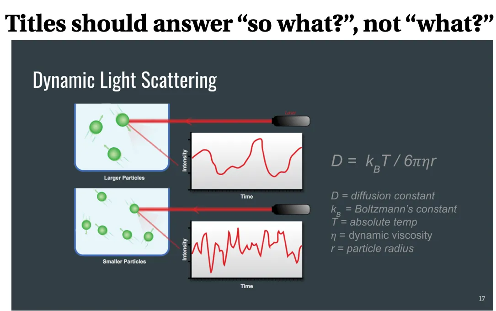
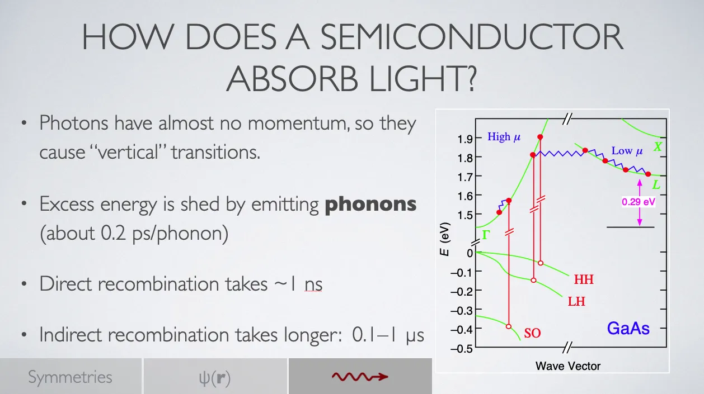

{:menu PR}

# Projects

* toc
{:toc}

## Purpose

The purpose of the project is for you to apply the mathematical and programming skills you have been developing in the course to a computational physics problem. Given the many constraints on your time and resources, you need not aim for original research—in the sense that you need not develop a heretofore unknown method for solving a computational physics problem. Rather, the goal is for you to solve a problem consistent with your level of physics background *by applying your current mastery of computational techniques*, not by using the Internet to look up how somebody else has solved the problem.

I know, copying somebody else is way more efficient. After all, they already had to make a bunch of stupid mistakes, track down coding errors, and run sanity checks to gain confidence that their code actually does what they wanted it to do. Why not take advantage of their efforts? Why reinvent the wheel?

Why? **Because I have high aspirations for you!** I want you to be a pioneer, a developer of new knowledge, a courageous individual who can pose questions and seek answers where none already exist. Can you prepare yourself for original research by merely copying what others have figured out? I don’t think so. You have to learn how to ask and answer questions for yourself. **And that’s what this project is about**. So please suppress your well-honed ability to “Google the answer” and instead search within your team’s collective brains for a path to a solution.

## Scope

Each team of 3 (or so) of you will develop code to simulate a system or to compute quantities of physical importance, prepare a presentation of your findings to be delivered on **Wednesday, 7 May 2025** during **Presentation Days**, and submit your documented code in a (zip) archive by **Friday, 9 May 2025**. The presentations and documented code should offer a clear description of the system you are modeling, should outline choices you made in developing the code and/or refining the model, the results you have obtained, and the sanity checks you have made to confirm that your results are trustworthy.

## Schedule

+ Week 11: (4/1) form teams and tentatively identify topic
+ Week 12: (4/8) read appropriate background information; gather thoughts about how to code your simulation
+ Week 13: (4/15) conference on project approach and getting going
+ Week 14: (4/22) coding
+ Week 15: (4/29) analyzing and preparing for presentation
+ Week 16: (5/7) [project presentations from 13:30–17:00 in Shanahan 2454]({PR-Schedule.md})

<!-- comment 
<table class="nicetable" style="width: 350px;">
  <tr>
   <th style="text-align: left;"> Time </th> <th style="text-align: left;">Team</th>
   </tr>
  <tr>
    <td> 9:00 </td><td> Abby, Alex, and Will </td>
  </tr>
  <tr>
    <td> 9:20 </td><td> Evan and Brigitte </td>
  </tr>
  <tr>
    <td> 9:40 </td><td> Conor and Nikolas </td>
  </tr>
  <tr>
    <td> 10:00 </td><td> Aaron and Collin </td>
  </tr>
  <tr>
    <td> 10:20 </td><td> Elena and Rori </td>
  </tr>
  <tr>
    <td> 11:00 </td><td> Abby, Eve, and Kate </td>
  </tr>
</table>
-->

## Systems

A reference we can all share is *An Introduction to Computer Simulation Methods: Applications to Physical Systems* by Harvey Gould, Jan Tobochnik, and Wolfgang Christian. I will bring copies and we can copy out portions.

### Monte Carlo Simulations of Thermal Systems

[Some background has been added to the Stochastic page](ST-Stochastic.md). Start there for background and for a description of the one-dimensional Ising model. A good project topic would be to generalize the model to two or three dimensions. Although there is no ferromagnetic transition of the Ising model in one dimension, there is in two or more dimensions. To get started observing the phase transition, use a modest value of $$N$$ (e.g., 16) and prepare a plot of the heat capacity (per spin) as a function of temperature in the range $$1 \le T \le 3$$ with $$B = 0$$. You should see a peak. Theoretical considerations hold that in the limit of a large system, we expect the following behavior for the magnetization and the heat capacity $$C$$ in the vicinity of the transition temperature $$T_c$$,
\begin{align}\label{eq:C}
  M(T) & \sim (T_c - T)^\beta \qquad T < T_c \notag \\\ 
  C(T) & \sim |T - T_c|^{-\alpha} \notag \\\ 
  \chi(T) & \sim |T - T_c|^{-\gamma}
\end{align}
where $$\alpha$$ and $$\gamma$$ are called **critical exponents**. For the two-dimensional Ising model, $$\beta = 1/8$$ and $$\gamma = 7/4$$; in three dimensions, they are $$\beta = 0.32$$ and $$\gamma = 1.24$$. How closely can you determine $$T_c = 2 / \ln(1 + \sqrt{2})$$? See Chapter 15 of Gould, Tobochnik, and Christian, *An Introduction to Computer Simulation Methods* for lots more information and project ideas, including putting a two-dimensional array of spins on a triangular lattice, rather than a square lattice.

### Quantum Mechanics

Chapter 16 discusses many approaches to simulating quantum systems. You may have explored the **shooting method** for finding eigenstates of the "quark potential", $$V \sim \|x\|$$. Does this approach generalize to higher spatial dimensions? Does it depend on having rotational or other symmetry that allows the problem to be factored?

### Partial Differential Equations

Chapter 10 discusses numerical solutions to boundary value problems, including Gauss-Seidel relaxation. Are there more direct methods that start from the same premise of a finite difference approximation to the Laplacian operator? 

### Molecular Dynamics

Chapter 8 discusses the dynamics of many-particle systems (often called **molecular dynamics**). We assume that the particles interact with one another via a known potential energy function, such as the Lennard-Jones potential,
\begin{equation}\label{eq:Lennard-Jones}
  U(r) = 4 \epsilon \qty[ \qty(\frac{r_0}{r})^{12} - \qty(\frac{r_0}{r})^6]
\end{equation}
$$r$$ is the distance between the two particles, $$\epsilon$$ is the depth of the attractive portion of the potential, and $$r_0$$ is the value of $$r$$ at which the two terms in brackets are equal and so $$U(r_0) = 0$$. By taking the gradient of the potential, you can find the force on each of the two particles. Dividing by the appropriate mass then gives you the contribution to the acceleration of each particle caused by this interaction. You must then sum these accelerations over all pairs of particles to determine how to update the particle positions and velocities.

Once you have determined the acceleration of all the particles, you can then update their positions and velocities using the **velocity Verlet** algorithm:
\begin{align}
  x_{n+1} &= x_n + v_n \Delta t + \frac12 a_n (\Delta t)^2 \label{eq:pos-update} \\\ 
  v_{n+1} &= v_n + \frac12 (a_{n+1} + a_n) \Delta t
\end{align}
A few considerations are in order:

1. These equations are written for a single cartesian direction; you would have similar expressions for the $$y$$ and $$z$$ directions.
2. The position at the $$n+1$$st step relies solely on the values of position, velocity, and acceleration known for the $$n$$th step.
3. The velocity at the $$n+1$$st step depends on the known velocity and the average of the accelerations at the prior step $$n$$ and the new step $$n+1$$. Typically, you cannot compute the acceleration $$a_{n+1}$$ until you have updated the positions of all the particles according to Eq.&nbsp;(\ref{eq:pos-update}) 

For $$N$$ particles, the number of pairs is $$N(N-1)/2$$. Typically, you don't have to evaluate all of them; the force dies off very rapidly for distances beyond something like $$2 r_0$$. Nonetheless, a straightforward implementation requires that you analyze $$N(N-1)/2$$ pairs (some of which you may simplify to zero if the particles are far enough apart). Therefore, the computational time to evaluate the accelerations scales as $$N^2$$. When the number of particles is small, this is not a big problem. For large simulations, however, the $$N^2$$ dependence can really slow things down. The [Barnes-Hut algorithm](https://en.wikipedia.org/wiki/Barnes–Hut_simulation) is an approach to sorting the particles that lowers the number of operations needed to compute the accelerations from $$O(N^2)$$ to $$O(N \log_2 N)$$ using [octrees](https://en.wikipedia.org/wiki/Octree).

### More ideas

[More project ideas](PR-Ideas.md) are described and illustrated on this page.

## Preparing Your Presentation

I'm going to go way out on a limb and suggest that you started the project with confusions, misunderstandings, and uncertainty about where you were headed or downright ignorance of the system you chose. I will further speculate that as you worked on it, you made some false moves, explored some dead ends, and gradually came to appreciate what worked and what didn't. There are two key points about this journey:

1. We don't need to hear about every bone-head move you made on the way to enlightment.
2. We don't want to be talked *at* as though we should already know everything it took you trial-and-error to figure out.

Invite us to learn with you, tracing for us *the most useful path* through the conceptual minefield so we are led to enlightment without having to spend as much time as you did. 

### “Why” Before “How”

+ Until you have motivated me to care about something, I am ill-disposed to follow your discussion of arcane details. 
+ Start with your purpose (avoiding jargon as much as possible)
+ What are you trying to investigate/accomplish? How does it fit in a bigger picture?
+ Once you have motivated me to *care* about this purpose, I am prepared to follow your discussion that illuminates the *how* or the *what* of the investigation. 

The advice “why before how” also applies to individual slides, if you make them.

  

<a name="Fig1">Figure 1</a> — This is a visually appealing slide created by a clinic team that aimed to explain how they were using a technique called dynamic light scattering to determine the size of particles in their samples. The title, "Dynamics Light Scattering" identifies the technique they used. They knew nothing about DLS at the start of the project and most audience members know nothing about it. Can you think of a more helpful title?

 Rather than titling a slide with the name of the phenomenon or technique, consider using a question, as illustrated in <a href="#Fig2">Figure&nbsp;2</a>. 

  

<a name="Fig2">Figure 2</a> — I could have titled this slide “Interband Transitions”, which makes perfect sense to those already in the know. However, I think using a question that gets at the heart of the issue is more helpful. My title for Fig. 1 might be “How We Measure Particle Size”.

### Framing

As the presenter, you know (should know?) more about your topic than the audience does. Your goal should *not be to lord this superiority over them*, but to invite them to learn something interesting about the topic you have studied and in which you have developed expertise. 

+ Each talk should aim for 15 minutes, with 5 minutes for questions.
+ You may find it most convenient to present from a Jupyter Notebook. The View menu has an option to enter **Presentation mode**, which increases the font size. Check it out to see if it suits your purposes.
+ Start your presentation with a brief description of the system or model that you investigated. Make explicit the geometry or the simplifying assumptions that underpin your model.
+ Pictures or equations here can be very helpful. Be concise, but end this section with a description of the primary issues you will explore.
+ Tell us about any creative approaches you used in coding or analyzing the system.
+ Show us some results. If they are graphs, make sure they are properly labeled and talk us through what is being shown. If animations, I strongly recommend having rendered animations as gifs, if for nothing more than backup in case dynamic updating in the notebook.
+ Conclude with a summary of what you found and suggestions for further exploration. 

