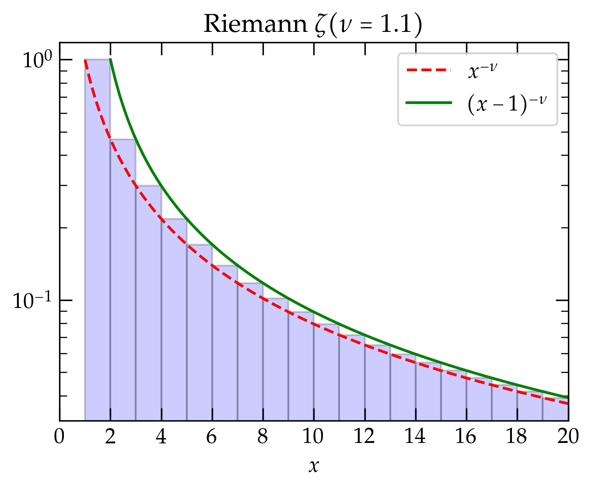
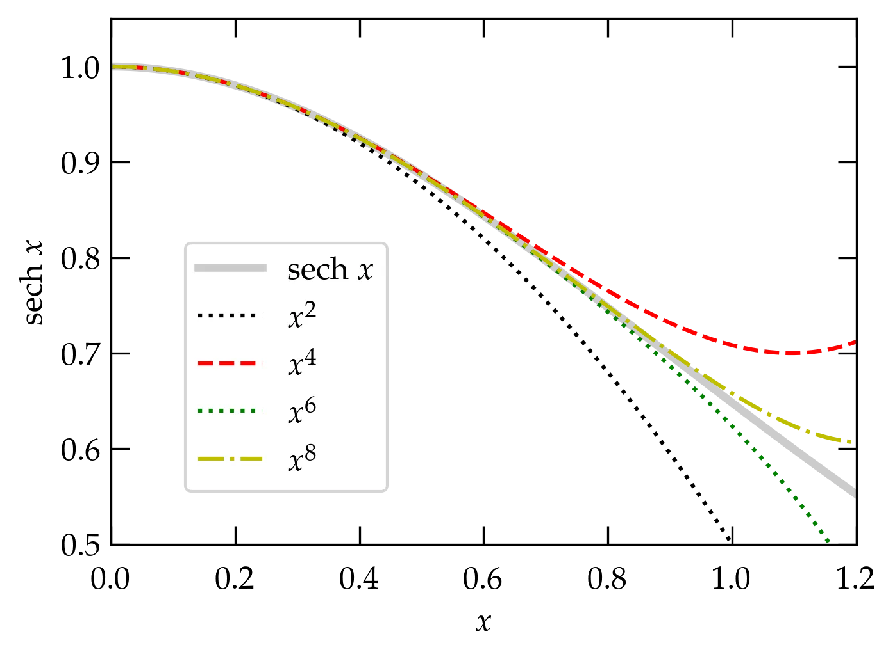

{:menu SE}

# Series

* toc
{:toc}

Series are among the most important mathematical tools in the physicist's toolbox. You are no doubt already familiar with Taylor series; for problems that are difficult to solve exactly, we can often satisfactory approximations by truncating a Taylor series. For example, the equation of a simple pendulum is
\\[
    \dv[2]{\theta}{t} + \frac{g}{L} \sin\theta = 0
\\]
It is a **nonlinear** differential equation because the variable $$\theta(t)$$ appears as a nonlinear function. That is
\\[
    \sin \theta = \theta - \frac{\theta^3}{3!} + \frac{\theta^5}{5!} - \cdots
\\]
includes terms with higher powers of $$\theta$$ than the first. However, if we ignore all terms but the first in the Taylor series for $$\sin\theta$$, we obtain
\\[
    \dv[2]{\theta}{t} + \frac{g}{L} \theta = 0
\\]
which is the equation of a simple harmonic oscillator and has a solution we can readily compute.

Key issues we need to understand include:

1. Does an infinite series converge?
2. Can we find a closed-form expression for the infinite sum?
3. Can a series be manipulated term by term?

## Definitions

An infinite series is an infinite sum,
\begin{equation}\label{eq:infseries}
  S = \sum_{n=1}^{\infty} a_n = \lim_{N\to\infty} \sum_{n=1}^N a_n
\end{equation}
that is the limit of partial sums having a finite number of terms. For the limit to exist, the magnitude of the terms $$a_n$$ must go to zero as $$n\to\infty$$. However, while this is a necessary condition it is not sufficient.
The **harmonic series**,
\\[
    H = \sum_{n=1}^{\infty} \frac1n = 1 + \frac12 + \frac13 + \cdots
\\]
does not converge, even though its terms tend to zero as $$n \to \infty$$. Its divergence is logarithmic (i.e., weak), as illustrated in the following figure

  

<a name="Fig1">Figure 1 </a> — The harmonic series is represented by the area shaded blue of the bars of height $$1$$, $$\frac12$$, $$\frac13$$, etc. The area of the bars is greater than the area under the curve $$1/x$$ (shown in red), since the curve is everywhere contained within a bar. Since $$\int_1^x \frac1{x'}\dd{x'} = \ln x$$, which slowly diverges as $$x\to\infty$$, the harmonic series diverges even though its individual terms tend to zero.

### Geometric Series

Successive terms of a **geometric series** form a fixed ratio $$r$$:
\\[
    S_N = a_0(1 + r + r^2 + \cdots r^N) = \sum_{n=0}^N a_0 r^n
\\]
There is a nifty trick for summing a (finite) geometric series. Consider $$r S_N$$:
\begin{align}
    S\_N &= a\_0 (1 + r + r^2 + \cdots + r^N) \\\ 
    r S\_N &= a\_0(\hphantom{1 + } \;\, r + r^2 + \cdots + r^N + r^{N+1})
\end{align}
If we now subtract the second line from the first, we get
\begin{equation}
  \label{eq:geo}
  S_N (1-r) = a_0 (1 - r^{N+1}) \qquad\text{so}\qquad \boxed{ S_N = a_0 \left( \frac{1 - r^{N+1}}{1 - r} \right) }
\end{equation}

The series converges to $$S_{\infty} = \frac{a_0}{1-r}$$ as $$N\to\infty$$, provided that
$$|r| < 1$$ (so that the numerator of the fraction goes to 1). Sometimes it is convenient to symmetrize this expression by factoring out $$r^{N/2}$$, which allows you to express the fraction in terms of the ratio between hyperbolic sine functions.

### Tests of Convergence

It is often necessary to know whether an infinite series converges to a finite value. Some of the useful tests to answer this question are:

1. **Comparison tests**: by comparing one series of unknown convergence term-by-term to a series of known convergence properties, it may be possible to deduce the convergence of the first series. For instance, if the series of terms $$\sum_n a_n$$ is known to converge and $$b_n < a_n$$ for all $$n$$, then $$\sum_n b_n$$ converges.
2. **Cauchy Root Test**: if $$(a_n)^{1/n} \le r < 1$$ for all terms $$n \ge N$$, with $$r$$ independent of $$n$$, then $$\sum_n a_n$$ converges. This test is a comparison to the convergence of a geometric series.
3. **Ratio test**: the convergence of a series may be determined from the limit of the ratio of successive terms:
\\[
    \lim_{n\to\infty} \frac{a_{n+1}}{a_n} \begin{cases}
    < 1 &\quad \text{convergence} \\\ 
    > 1 &\quad \text{divergence} \\\ 
    = 1 &\quad \text{indeterminate}
    \end{cases}
\\]
4. **Integral test**: The caption to Fig. 1 above illustrates using an integral test 

### Exercises

1. Use numpy to confirm Eq. \ref{eq:geo} for $$r = 0.99$$ and $$N=100$$.

1. Does the series $$\displaystyle \sum_{n=2}^{\infty} \frac{1}{n \ln n}$$ converge?

2. (a) Show that the series $$\displaystyle \sum_{n=2}^\infty \frac{1}{n(\ln n)^2}$$ converges. (b) Use numpy to sum the terms through $$n = 100,000$$. You should get 2.022 883 9. (c) Use an integral to obtain the sum of the infinite series to six significant figures.

3. Does the series $$\displaystyle \sum_{n=1}^{\infty} \frac{1}{n(n+1)}$$ converge? If it does, can you sum it?

## Riemann Zeta Function

The **Riemann zeta** function is defined by
\begin{equation}\label{eq:zeta}
  \zeta(\nu) = \sum_{n=1}^\infty \frac1{n^{\nu}}
\end{equation}
If $$\nu=1$$, this series becomes the harmonic series, which we know to be divergent. For $$\nu < 1$$ it diverges more rapidly, but for $$\nu > 1$$ we can use an integral test to check convergence:
\\[
    \zeta(\nu) = \sum_{n=1}^\infty \frac1{n^{\nu}} 
    < 1 + \int_2^{\infty} (x-1)^{-\nu} \dd{x}
    = 1 + \left.\frac{(x-1)^{1-\nu}}{1-\nu}\right|_{x=2}^{\infty} = 1 + \frac{1}{\nu-1} = \frac{\nu}{\nu-1} < \infty
    \qquad\text{when } \nu > 1
\\]

  

<a name="Fig2">Figure 2 </a> — The Riemann zeta function for $$\nu = 1.1$$. The red and green curves clearly bound the area of the blue bars, which represents the Riemann $$\zeta$$&nbsp; for $$\nu = 1.1$$ (note the logarithmic vertical scale).

The Riemann zeta function pops up occasionally in physics, including the theory of blackbody radiation and the determination of the Stefan-Boltzmann constant, $$\sigma$$, which relates the power per unit area radiated by an ideal blackbody at temperature $$T$$:
\begin{equation}\label{eq:Stefan-Boltzmann}
  p = \sigma T^4 \qquad\text{where}\qquad
  \sigma = \frac{6 \zeta(4) k\_{\mathrm{B}}^4}{\pi^2 c^2 \hbar^3}
  = \frac{2 \pi^5 k\_{\mathrm{B}}^4}{15 c^2 h^3}
  \approx 5.67 \times 10^{-8}\,\mathrm{W \cdot m^{-2} \cdot K^{-4}}
\end{equation}

## Alternating Series

If successive terms in a series alternate sign, and if the magnitude of the terms goes to zero as $$n\to\infty$$, then the series converges. An infinite series is **absolutely** convergent if the sum of the absolute value of its terms converges. If the series converges, but it is not absolutely convergent, it is called **conditionally** convergent.

Properties of absolutely convergent series:

+ the series sum is independent of the order in which one adds the terms
+ two absolutely convergent series may be added, subtracted, or multiplied termwise to yield another absolutely convergent series
+ the product of two absolutely convergent series converges to the product of the individual series

Note that **none of these claims** can be made for conditionally convergent series.

## Taylor Series

Taylor's expansion is a way of approximating a function $$f(x)$$ in the neighborhood of a point $$x=a$$ with a polynomial in powers of $$(x-a)$$ such that the first $$n$$ derivatives of the polynomial match the first $$n$$ derivatives of $$f(x)$$ at $$a$$,
\begin{equation} \label{eq:Taylor}
    f(x) \approx f(a) + (x-a) f'(a) + \frac{(x-a)^2}{2!} f^{\prime\prime}(a) + \cdots +
    \frac{(x-a)^n}{n!} f^{(n)}(a)
\end{equation}
where the inequality comes from ignoring higher-order terms.

A useful way to bound the error associated with ignoring those terms is to integrate the $$n$$th derivative from $$a$$ to $$x$$ $$n$$ times:
\begin{align}
  \int\_a^{x\_{n-1}} f^{(n)} \dd{x\_n} &= f^{(n-1)}(x_{n-1}) - f^{(n-1)}(a) \notag \\\ 
  \int\_a^{x\_{n-2}} \dd{x_{n-1}} \int\_a^{x\_{n-1}} \dd{x\_{n}} f^{(n)}(x_n) &= f^{(n-2)}(x\_{n-2}) - f^{(n-2)}(a) -(x\_{n-2} - a) f^{(n-1)}(a) \notag \\\ 
  \vdots \qquad & \qquad \vdots \notag \\\ 
  &= f(x) - f(a) -(x-a) f'(a) - \frac{(x-a)^2}{2!} f^{\prime\prime}(a) - \cdots - \frac{(x-a)^{n-1}}{(n-1)!} f^{(n-1)}(a)
\end{align}
Rearranging slightly gives
\begin{equation}\label{eq:Taylor2}
  f(x) = \sum\_{i=0}^{n-1} \frac{(x-a)^i}{i!} f^{(i)}(a) + R_n
\end{equation}
where the remainder is the $$n$$-dimensional integral,
\\[
    R_n = \int_a^x \dd{x_1} \cdots \int_a^{x\_{n}} \dd{x\_n} \; f^{(n)}(x_n) = \frac{(x-a)^n}{n!} f^{(n)}(\xi)
\\]
for some value $$a \le \xi \le x$$ by the mean value theorem. Equation (\ref{eq:Taylor2}), with the explicit form of the residual $$R_n$$ is a particularly powerful way of not only estimating functions but also the magnitude of the error associated with a finite series.

### Some Important Taylor Series

Physicists should know the following series cold; they arise very frequently in physics and it is worth your time to learn so well that you don't need to think about them. (Actually, each of these is a **Maclaurin series**, which is a form of Taylor series in which the derivatives are evaluated at $$a = 0$$):

\begin{align}
  e^x &= 1 + x + \frac{x^2}{2!} + \frac{x^3}{3!} + \frac{x^4}{4!} + \cdots &  &-\infty < x <\infty \notag \\\ 
  \sin x &= x - \frac{x^3}{3!} + \frac{x^5}{5!} - \frac{x^7}{7!} + \cdots &  &-\infty < x <\infty \notag \\\ 
  \cos x &= 1 - \frac{x^2}{2!} + \frac{x^4}{4!} - \frac{x^6}{6!} + \cdots &  &-\infty < x <\infty\notag \\\ 
  \sinh x &= x + \frac{x^3}{3!} + \frac{x^5}{5!} + \frac{x^7}{7!} + \cdots &  &-\infty < x <\infty \notag \\\ 
  \cosh x &= 1 + \frac{x^2}{2!} + \frac{x^4}{4!} + \frac{x^6}{6!} + \cdots &  &-\infty < x <\infty\notag \\\ 
  \frac{1}{1-x} &= 1 + x + x^2 + x^3 + x^4 + \cdots & & -1 < x < 1 \notag \\\ 
  \ln(1+x) &= x - \frac{x^2}{2} + \frac{x^3}{3} - \frac{x^4}{4} + \cdots &  &-1 < x \le 1 \notag \\\ 
  (1+x)^n &= 1 + n x + \frac{n(n-1)}{2!} x^2 + \frac{n(n-1)(n-2)}{3!} x^3 + \cdots
  & & -1 < x < 1 \tag{binomial}
\end{align}
Clearly, the radius of convergence of the logarithmic series does not include $$x = -1$$, which generates a divergent harmonic series. For the **binomial series**, the series terminates when $$n$$ is a positive integer and so converges for all $$x$$. When $$n$$ is not a positive integer, the series does not terminate and may not converge.

## Evaluating Limits

Taylor series offer a useful alternative to **l'Hôpital’s rule** for evaluating the limit of the ratio of two functions, $$f(x)$$ and $$g(x)$$, both of which tend to zero as $$x \to x_0$$. As an example, consider
\\[
  L = \lim_{x\to0} \frac{1 - \cos x}{x^2}
\\]
where $$f(x) = 1 - \cos x$$ and $$g(x) = x^2$$, both of which go to zero as $$ x \to 0$$. To evaluate using l'Hôpital’s rule, form $$f'(x)/g'(x)$$:
\\[
    L = \lim_{x\to0} \frac{f'(x)}{g'(x)} = \lim_{x\to0} \frac{\sin x}{2x}
\\]
That's still indeterminate, in the form $$0/0$$, so we can apply l'Hôpital's rule once again to get
\\[
    L = \lim_{x\to0}\frac{f^{\prime\prime}(x)}{g^{\prime\prime}(x)} = \lim_{x\to0}\frac{\cos x}{2} = \frac12
\\]

Alternatively, we can use the Taylor series for $$\cos x$$:
\\[
    L = \lim_{x\to0} \frac{1 - (1 - x^2/2! + x^4/4! - \cdots)}{x^2} = \lim_{x\to0} \frac{1}{2!} - \frac{x^2}{4!} + \cdots
    = \frac12
\\]
No need to compute derivatives (if you already know the Taylor series)! Oftentimes, this approach is much simplier than (successive) "trips to the hospital."

## Manipulating Series

Suppose that you knew a Maclaurin series for a function $$f(x)$$ but you need the series for $$1/f(x)$$, valid for small values of $$x$$. For example, we know the series for $$\cosh x$$ from the above list (or we could derive it ourselves). The hyperbolic secant function, $$\sech x = 1 / \cosh x$$. How could we compute the series for $$\sech x$$, valid for small $$x$$ through terms of order $$x^6$$?

The "easy" way is to go back to the definition in Eq.&nbsp;(\ref{eq:Taylor}) and work out all the derivatives of $$\sech(x)$$. While this is straightforward, in principle, the expressions for the derivatives get more and more complicated as we proceed. [If you don't believe me, try it!]

Here's another option. For small $$x$$, 
\begin{equation}
  \cosh x = 1 + \underbrace{\frac{x^2}{2!} + \frac{x^4}{4!} + \frac{x^6}{6!} + \cdots}_{q}
\end{equation}
where $$q$$ is a "small quantity" as long as $$x$$ isn't too large. So,
\begin{equation}\label{eq:sech1}
  \sech x = \frac{1}{\cosh x} = \frac{1}{1 + q} = (1 + q)^{-1}
\end{equation}
But, the binomial series for $$n = -1$$ is just
\\[
    \frac{1}{1 + q} = 1 - q + q^2 - q^3 + \cdots
\\]
To produce the series for $$\sech x$$ valid for terms through $$x^6$$ just requires us to keep **all** the terms in $$-q + q^2 - q^3$$ through $$x^6$$. We'll work term by term:
\begin{align}
  -q &= -\frac{x^2}{2!} - \frac{x^4}{4!} - \frac{x^6}{6!} - \frac{x^8}{8!} + \O{x^{10}}     \notag \\\ 
  q^2 &= \frac{x^4}{(2!)^2} + 2 \frac{x^2 \; x^4}{2! \; 4!} +
   2 \frac{x^2}{2!} \frac{x^6}{6!} + \left( \frac{x^4}{4!} \right)^2 + \O{x^{10}} \notag \\\ 
   &= \frac{x^4}{4} + \frac{x^6}{4!} + x^8 \left( \frac{1}{6!} + \frac{1}{(4!)^2} \right) + \O{x^{10}} \notag \\\ 
   -q^3 &= -\left(\frac{x^2}{2!} \right)^3 - 3 \left(\frac{x^2}{2!}\right)^2 \frac{x^4}{4!}
   + \O{x^{10}} \notag \\\ 
   q^4 &= \frac{x^8}{16} + \O{x^{10}} \notag
\end{align}

Now, we just need to combine all these terms:
\begin{align}
  \sech x &= 1 - \frac{x^2}{2} +
   x^4 \left( -\frac{1}{4!} + \frac{1}{4} \right) 
   + x^6 \left( -\frac{1}{6!} + \frac{1}{4!} - \frac{1}{8} \right) \notag
   \\\ 
   &\qquad + x^8 \left( -\frac{1}{8!} + \frac{1}{6!} + \frac{1}{(4!)^2} - \frac{1}{32} 
   + \frac{1}{16}
   \right) + \O{x^{10}} \notag \\\ 
   &= 1 - \frac{x^2}{2} + \frac{5 x^4}{24} - \frac{61 x^6}{720} + \frac{277 x^8}{8064} + \O{x^{10}}
\end{align}

  

<a name="Fig3">Figure 3</a> — Maclaurin series for the hyperbolic cosine obtained by inverting the series for $$\cosh x$$. Each successive curve includes the terms through the order listed in the legend.

See [the page on Euler’s $$\Gamma$$ function](FO-Gamma.md) for an illustration of the power of series expansion as a means of obtaining an analytic expression for the factorial function.

### Exercises

1. Derive a power series expansion through $$x^5$$ for $$\cot x$$ by dividing the series for $$\cos x$$ by the series for $$\sin x$$. Ans: 
\\[
  \cot x = \frac1x - \frac{x}{3} - \frac{x^3}{45} - \frac{2 x^5}{945} + \cdots
\\]
Note that this series includes a negative power of $$x$$, which means it is not a Taylor series. Series that include negative powers are called **Laurent series** and are very common in the theory of functions of a complex variable.

2. The derivative of $$\tan^{-1}x$$ is $$(1+x^2)^{-1}$$. By integrating, find a series expansion for $$\tan^{-1} x$$.

3. One way to compute a series for $$\sin^{-1} x$$ is to start with $$x = \sin y$$. Then $$dx/dy = 

## Bernoulli Numbers

Unless Vatche provides a reasonable justification, I suspect I'll omit this section!

The Bernoulli numbers $$B_n$$ arise in many computational physics problems; they may be defined by 
\\[
    \frac{t}{e^t-1} = \sum\_{n=0}^\infty \frac{B\_n t^n}{n!}
\\]
One way to work out the first few Bernoulli numbers is to multiply both sides by $$(e^t-1)/t$$ to get
\begin{align}
  1 &= t^{-1} \qty(e^t - 1) \qty(B\_0 + B\_1 t + \frac{B\_2 t^2}{2!} + \cdots) \notag \\\ 
  1 &= \qty(1 + \frac{t}{2!} + \frac{t^2}{3!} + \cdots)\qty(B\_0 + B\_1 t + \frac{B\_2 t^2}{2!} + \cdots) \notag
\end{align}
The only term on the right that has $$t^0$$ in it is $$B_0$$, so we deduce that $$B_0 = 1$$.
There are two terms that involve $$t^1$$, which gives
\\[
    0 = B_0 \frac{t}{2} + B_1 t = \qty(\frac{B_0}{2} + B_1)t 
    \longrightarrow B_1 = -\frac12
\\]
Gathering terms proportional to $$t^2$$ yields
\\[
    0 = \qty(\frac{B\_0 }{3!} + \frac{B\_1}{2!} + \frac{B\_2}{2!} )t^2
    = \qty( \frac16 - \frac14 + \frac{B\_2}{2})t^2 \longrightarrow B\_2 = \frac16
\\]

A routine to compute the first $$n$$ Bernoulli numbers is available in `scipy.special.bernoulli`:

~~~~ python
from scipy.special import bernoulli

bernoulli(6)
array([ 1.        , -0.5       ,  0.16666667,  0.        , -0.03333333,
        0.        ,  0.02380952])
~~~~

As you can probably guess from this output, the Bernoulli numbers for odd $$n \ge 3$$ all vanish.

## Problems

1.   The following problem arises in computing a Fresnel diffraction pattern, where
  we need the difference between $$s$$ and $$s_{0}$$ in the following figure:

  

<a name="Fig4">Figure 4</a> — Geometry of Fresnel diffraction, where $$|x| \ll s_0$$ and the cosine of the angle between $$s_0$$ and $$x$$ is $$x_s / s_0$$.

Compute $$s - s_{0}$$ **to second order in $$x$$**, where the law of cosines gives
\begin{equation}
	s^{2} = s_{0}^{2} + x^{2} - 2 x x_{s}
\end{equation}
  and $$x_{s}$$ is a constant. That is, you may ignore terms proportional to
  $$x^{3}$$ or any higher power of $$x$$.

<!---
## Possible Problems

1. Do certain series converge?
2. Combining absolutely convergent series.
3. Illustrating failure to converge of alternating series?
4. Working out the Taylor series for something
5. Expressing a Gaussian integral in terms of $$\Gamma(x)$$.
6. Multiplying a pair of series to determine unknown coefficients.
-->