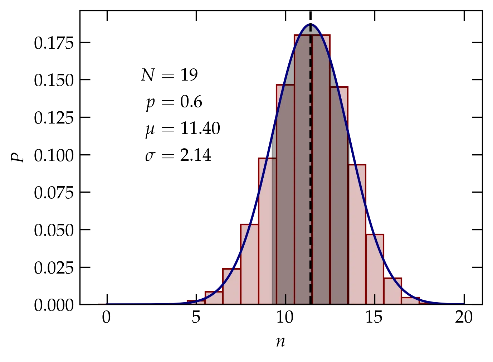

{:menu ST}

# Binomial Distribution

* toc
{:toc}

The binomial distribution describes the outcomes of an experiment with only two possible outcomes, but which is repeated many times. For example, if the probability that I can make a free throw is $$p$$, and if I shoot $$N$$ free throws, what is the probability that I make $$n$$ of them (where $$0 \le n \le N$$)? 

We'll call $$p$$ the probability of success and $$q = 1-p$$ the probability of failure. If we make two attempts, then the four possible outcomes are the terms in
\\[
    1 = (p+q) (p+q) = p^2 + 2 pq + q^2
\\]
where the first term shows the probability of 2 successes, the second the probability of a single success, and third the probability of no successes. Generalizing to $$N$$ attempts, we have the probability of $$n$$ successes is
\\[
    P(n) = \binom{N}{n} p^n q^{(N-n)} = \frac{N!}{n! (N-n)!} p^n q^{(N-n)}
\\] 
The average number of successes is then
\\[
    \ev{n} = \sum_{n=0}^{N} n P(n) = \sum_{n=0}^N n \binom{N}{n} p^n q^{N-n}
\\]
We can now employ our old friend, the **derivative trick**, to simplify this sum:
\\[
    \ev{n} = \sum_{n=0}^N \binom{N}{n} \left(p \pdv{}{p}\right) p^n q^{N-n}
    = \left(p \pdv{}{p}\right) \sum_{n=0}^N \binom{N}{n}  p^n q^{N-n} = \left(p\pdv{}{p}\right) (p+q)^N = p N (p+q)^{N-1} = Np
\\]
This was perhaps obvious from the start: each of the attempts is independent and has probability $$p$$ of success, so we should expect on average $$Np$$ successes. However, it points the way to computing the variance, which is average squared difference from the mean:
\\[
    \sigma^2 = \ev{(n-\ev{n})^2} = \ev{n^2 - 2n\ev{n} + \ev{n}^2} = \ev{n^2} - \ev{n}^2
\\]
Using the derivative trick again, we have
\\[
    \ev{n^2} = \qty(p\pdv{}{p}) \qty(p\pdv{}{p}) (p+q)^N = \qty(p\pdv{}{p}) N p(p+q)^{N-1} = p\qty[ N (p+q)^{N-1} + N p (N-1) (p+q)^{N-2}] = p[N + Np(N-1)]
\\]
so that the variance is
\\[
    \sigma^2 = \ev{n^2} - \ev{n}^2 = pN + p^2 (N^2 - N) - p^2 N^2 = N p (1 - p) = N p q
\\]
and the standard deviation is
\\[
    \sigma = \sqrt{N p q}
\\]

  

<a name="Fig1">Figure 1</a> — Plot of the binomial distribution for $$N=19$$ and $$p=0.6$$, which yields a mean of 11.4 and standard deviation of 2.14. The red bars show the binomial distribution, the black dashed line shows the mean $$\mu$$, blue curve shows the Gaussian approximation to the binomial distribution (that is, the normal distribution with the same mean and standard deviation), and the gray shaded region shows the range within one standard deviation from the mean.

