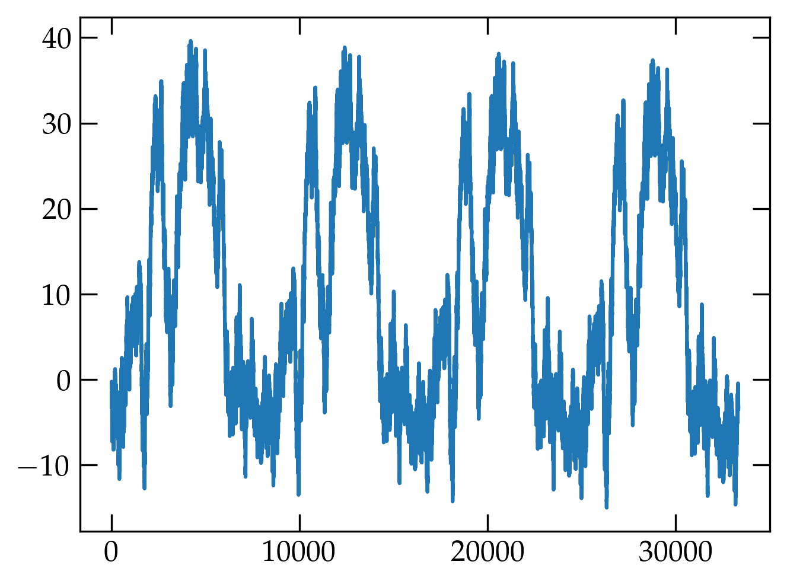
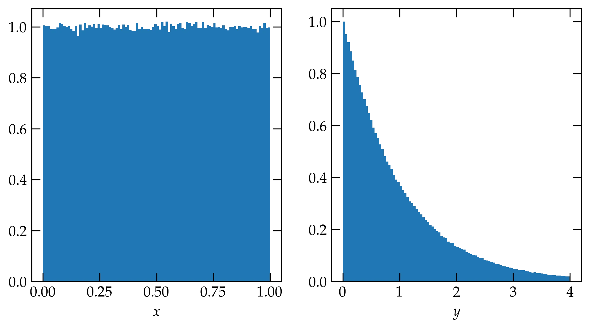
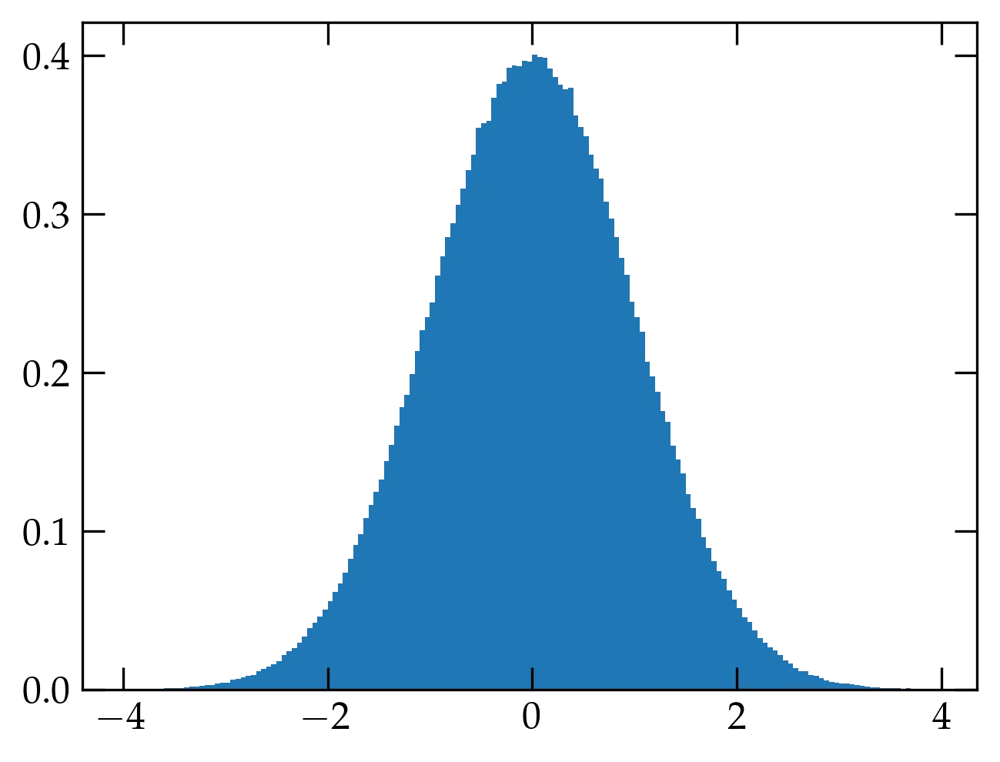
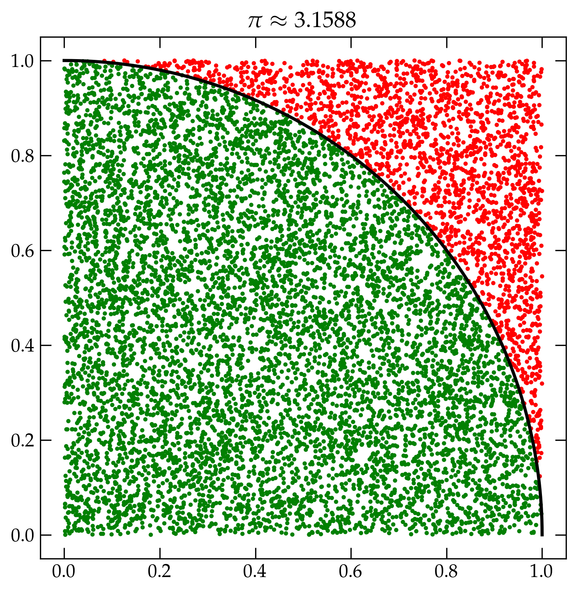

{:menu ST}

# Pseudorandom Numbers

* toc
{:toc}

## Linear Congruential Generators

There are many situations in which we wish to use random numbers to solve problems, either because the underlying physical processes have an element of randomness or because the parameter space is too large to sample exhaustively. The starting point for a variety of random distributions is the uniform deviate, such as a random integer between 0 and some maximum value $$N$$. Starting in 1949, a particularly simple sort of "random" number generator was used to approximate truly random numbers. It is called a **linear congruential generator (LCG)** and has the simple form
\begin{equation}\label{eq:LCG}
  I_{j+1} = (a I_j + c) \; \mathrm{mod} \; m
\end{equation}
with carefully chosen multiplier $$a$$, constant $$c$$, and modulus $$m$$ to make the period equal to the modulus. If the constant $$c$$ is zero, it is called a **multiplicative linear congruential generator (MLCG)**. Both approaches are **obsolete**; **do not use them!** They tend to produce values that lie on distinct hyperplanes in multidimensional space. We'll illustrate a problem using a MLCG in the next section.

## Tests of Randomness

A workhorse random number generator must pass a battery of tests of randomness. Examples include:

+ **Period** — You'd like this as long as possible. To investigate, use the generator to produce uniform deviates in the range $$[-1, 1]$$. Then plot the cumulative sum. When the plot begins to repeat, you'll be able to identify the period.
+ **Uniformity** — Prepare a histogram of values, dividing the output range into 100 bins. Are they all about evenly filled?
+ **$$\chi^2$$ test** — You may have encountered the $$\chi^2$$ test in biology (I know I did when I took Bio 52 in 2008). The $$\chi^2$$ statistic is
\\[
    \chi^2 = \sum_{n=1}^{N} \frac{(y_n - E_n)^2}{E_n}
\\]
where $$E_n$$ is the number of counts we expect to observe in the $$n$$th bin and $$y_n$$ is the actual number of counts observed. Roughly speaking, we expect $$\chi^2$$ to be about $$N$$.

There are plenty of others, as mentioned in *Numerical Recipes*, which references the "Diehard" battery of statistical tests with the caveat to be sure that said Diehard includes the so-called "Gorilla Test." How's that for colorful?!

As an illustration of the **Period** test run on a lousy generator (a naive LCG), we can use the following Python code to construct such a generator:

~~~~ python
class LCG:
    def __init__(self, a, c, m, x0=3829483):
        self.x = x0
        self.a = a
        self.c = c
        self.m = m
    
    def __call__(self):
        self.x = (self.a * self.x + self.c) % self.m
        return self.x / self.m
    
    @property
    def zero_mean(self):
        return 2 * self() - 1

# Now create a poorly designed MLCG and test it

poor = LCG(899, 0, 32768)
lousy = [poor.zero_mean for n in range(33333)]
fig, ax = plt.subplots()
ax.plot(np.cumsum(lousy), lw=0.5);
~~~~

  

<a name="Fig1">Figure 1</a> — Period test of a poorly designed MLCG with $$a=899$$, $$c=0$$, and $$m=32768$$, revealing a troublingly short period.

## Xorshift

A generator based on the xor operation and bit shifting is generally efficient and produces values that pass a number of tests for randomness. Recall that the **exclusive or** of two bits is 0 if the bits are the same and 1 if they are different. A simple 64-bit xorshift algorithm involves three steps:

~~~~ python
import numpy as np

class MyRNG:
    def __init__(self, seed=184738293):
        assert isinstance(seed, int) and seed != 0
        self._x = np.array([seed], dtype=np.uint64)
    
    def int(self):
        self._x = self._x ^ (self._x >> 21)
        self._x = self._x ^ (self._x << 35)
        self._x = self._x ^ (self._x >> 4)
        return self._x

    @property
    def zero_mean(self):
        n = self.int()
        v = (n & 0x00FFFFFF) / 0x01000000
        return 2 * v - 1
~~~~

The set of three integers (21, 35, 4) make a good xorshift random number generator. Other sets of three shift integers are certainly possible, as discussed in *Numerical Recipes*.

~~~~ python
mrng = MyRNG()
better = [mrng.zero for n in range(1000000)]
fig, ax = plt.subplots()
ax.plot(np.cumsum(better), lw=0.5)
~~~~

  

<a name="Fig">Figure </a> — Cumulative sum for a simple xorshift random number generator.

Of course, for more efficient work in Python, you should use the built-in functions:

~~~~ python
from numpy random import default_rng

rng = default_rng() # instantiate the default random number generator
rng.random(size=40) # generate an array of 40 uniform deviates
~~~~

## Nonuniform Deviates

Sometimes you may want random numbers that follow something more exotic than a uniform distribution between 0 and 1. If, for instance you need numbers between $$-1$$ and 1, you can just use `2 * rng.random() - 1`. But if the distribution isn't just a linear transformation of the range, then you have to work a bit harder. Imagine, for instance, that you draw a random number $$x$$ from the range [0,1) and then apply some function $$y(x)$$ to it. What is the distribution of $$y$$?

The probability that $$x$$ was in an infinitesimal range of width $$\dd{x}$$ around $$x$$ is $$p(x)\dd{x}$$. Since we start from a uniform distribution, $$p(x)$$ is just a constant. That little range of $$x$$ values maps into a corresponding range of $$y$$ values according to
\begin{equation}\label{eq:probxform}
  p(x)\dd{x} = P(y)|\dd{y}|
\end{equation}
where I need the absolute value to handle the fact that when $$x$$ increases, $$y$$ might decrease. Solving for the distribution $$P(y)$$ gives
\\[
    P(y) = p(x) \qty|\dv{x}{y}| = \frac{p(x)}{\qty|\dv{y}{x}|}
\\]

Let's look at an example. Suppose that $$y = -\ln x$$ or $$x = e^{-y}$$. Then
\\[
    P(y) = 1 \cdot |-e^{-y}| = e^{-y}
\\]

To illustrate this transformation, consider the following code, which computes a million uniform deviates, transforms them, and plots side-by-side histograms. The `density` argument to the histogram normalizes the resulting histogram to "integrate" to 1, as required for a normalized probability density distribution.

~~~~ python
from numpy.random import default_rng
rng = default_rng()

uniform = rng.random(1000000)
expo = -np.log(uniform)
fig, axs = plt.subplots(ncols=2, figsize=(8,4))
axs[0].hist(uniform, bins=np.linspace(0,1,101), density=True)
axs[0].set_xlabel("$x$")
axs[1].hist(expo, bins=np.linspace(0,4,101), density=True)
axs[1].set_xlabel("$y$");
~~~~

  

<a name="Fig1">Figure 1</a> — Histograms of one million uniform deviates $$x$$ (left) and the corresponding exponential deviates transformed via $$y = -\ln x$$ (right).

## Normal Deviates

One way to produce deviates that follow the normal distribution uses a generalization of Eq.&nbsp;(\ref{eq:probxform}) to two dimensions in an approach that mimics the way Poisson and Laplace figured out how to simplify the problem by squaring it. As you perhaps learned in Math 19, the Jacobian determinant generalizes the one-dimensional transformation of Eq.&nbsp;(\ref{eq:probxform}) to multiple dimensions:
\begin{equation}
  \label{eq:jacobian}
  P(y_1, y_2, \ldots) \dd{y_1} \dd{y_2} \ldots = p(x_1, x_2, \ldots) \qty| \frac{\partial(x_1, x_2, \ldots)}{\partial(y_1, y_2, \ldots)}| \dd{y_1} \dd{y_2} \ldots
\end{equation}
If we let
\begin{align}
  x_1 &= \exp\qty[-\frac12 (y_1^2 + y_2^2)] \notag \\\ 
  x_2 &= \frac{1}{2\pi} \arctan \frac{y_2}{y_1}
\end{align}
then the Jacobian is
\\[
    \left|\begin{pmatrix}
      -y_1 e^{-(y_1^2+y_2^2)^2/2} & \frac{1}{2\pi} \frac{1}{1+y_2^2/y_1^2}\qty(-\frac{y_2}{y_1^2}) \\\ 
      -y_2 e^{-(y_1^2+y_2^2)^2/2} & \frac{1}{2\pi} \frac{1}{1+y_2^2/y_1^2}\qty(\frac{1}{y_1})
    \end{pmatrix} \right|
    =
    \qty|\frac{1}{2\pi} e^{-(y_1^2+y_2^2)/2} \frac{y_1^2}{y_1^2+y_2^2}(-1 - \frac{y_2^2}{y_1^2})|
    = \frac{1}{2\pi} e^{-(y_1^2+y_2^2)/2}
    = \qty(\frac{1}{\sqrt{2\pi}} e^{-y_1^2/2}) \qty( \frac{1}{\sqrt{2\pi}} e^{-y_2^2/2})
\\]
That is
\\[
    P(y_1, y_2) \dd{y_1} \dd{y_2} = \qty(\frac{1}{\sqrt{2\pi}} e^{-y_1^2/2} \dd{y_1})
     \qty( \frac{1}{\sqrt{2\pi}} e^{-y_2^2/2} \dd{y_2})
\\]
showing that the two variables $$y_1$$ and $$y_2$$ each have Gaussian distributions. We now need to invert to get $$y_1$$ and $$y_2$$ as functions of $$x_1$$ and $$x_2$$:
\begin{align}
  -2\ln x_1 &= y_1^2 + y_2^2  \notag \\\ 
  \frac{\sin(2\pi x_2)}{\cos(2\pi x_2)} &= \frac{y_2}{y_1} \notag
\end{align}

So, 
\begin{align}
  y_1 &= \cos(2\pi x_2) \sqrt{-2 \ln x_1}  \notag \\\ 
  y_2 &= \sin(2\pi x_2) \sqrt{-2 \ln x_1}  \notag
\end{align}

If we draw two numbers ($$v_1, v_2$$) at random from within the unit circle, then we can use $$r^2 = v_1^2 + v_2^2$$ to find the radius, provided that it is less or equal to 1, and we can divide each by $$r$$ to produce the cosine and sine values to yield two normally distributed values $$y_1$$ and $$y_2$$. This is the **Box-Muller** method.

~~~~ python
box_muller = None

def normal():
    """Compute a standard normal deviate via the Box-Muller transformation.
    Each time we use the transformation we get two normal deviates. We
    will return one and save the other in the global box_muller, so we can
    return it on the next call.
    """
    global box_muller
    if box_muller is not None:
        res = box_muller
        box_muller = None
        return res
    # draw two values from a square from -1 to 1
    # until they are less than or equal to 1 from the origin
    while True:
        x1, x2 = rng.uniform(-1,1,size=(2))
        r2 = x1*x1+x2*x2
        if r2 <= 1:
            break
    
    mag = np.sqrt(-2*np.log(r2)/r2)
    box_muller = x1 * mag
    return x2 * mag

v = [normal() for x in range(1000000)]
fig, ax = plt.subplots()
ax.hist(v, bins=np.arange(-4,4,0.05), density=True);
~~~~

  

<a name="Fig2">Figure 2</a> — Normal deviates computed using the Box-Muller method.

Naturally, NumPy has an optimized routine to generate normal deviates called `rng.normal(loc, scale, size)`. The first two parameters are either floats or array_like of floats. The size parameter should be an int or a tuple of ints.

~~~~ python
fig, ax = plt.subplots()
ax.hist(rng.normal(size=1000000), bins=np.arange(-4,4,0.05), density=True);
~~~~

The result is essentially the same as shown above, albeit the data are computed much faster.

## Monte Carlo Integration

We have used `scipy`'s `quad` routine to perform numerical integration of a one-dimensional function; it gives both a result and an error estimate. As a reminder, we'll compute $$\int_0^1 \tanh x \dd{x} = \ln \cosh(1)$$.

~~~~ python
from scipy.integrate import quad
quad(lambda x: np.tanh(x), 0, 1)
(0.4337808304830271, 4.815934656432787e-15)
np.log(np.cosh(1))
0.4337808304830271
~~~~

As you can see, `quad` worked very well indeed. Where `quad` may not work so well is in a multidimensional integration. If a successful evaluation  of `quad` takes $$N$$ operations, an $$n$$-dimensional integral will require $$N^n$$ operations, which may take prohibitively long.

**Monte Carlo integration** takes an entirely different approach akin to throwing darts. To illustrate, I will compute $$\pi$$ in a simple-minded way: I will throw a bunch of darts at the unit square (as in, I will draw $$(x,y)$$ from a random number generator that returns uniform deviates). If the dart is within a radius of 1 of the origin, I will call it a success. Since the ratio of the area of the quarter circle to the square is $$\pi/4$$, if I multiply the success rate by 4 I should obtain an estimate of $$\pi$$.

~~~~ python
fig, ax = plt.subplots(figsize=(6,6))
phi = np.linspace(0, np.pi/2, 100)
ax.plot(np.cos(phi), np.sin(phi), 'k-', lw=2)
pts = rng.uniform(size=(10000,2))
r2 = pts[:,0]**2 + pts[:,1]**2
color = np.where(r2 < 1, 'g', 'r')
ax.scatter(pts[:,0], pts[:,1], s=3, marker='o', c=color)
inside = np.count_nonzero(r2<1)
pi_est = 4 * inside / pts.shape[0]
ax.set_title(r"$\pi \approx " + "%.4f" % pi_est + "$");
~~~~

  

<a name="Fig3">Figure 3</a> — Illustration of the Monte Carlo method of computing $$\pi$$.

Of course, this method cannot give the exact value for the integral. How much error should we expect? If the ratio of the success area to the total is $$p$$, then the probability that each dart is a success is $$p$$ and the probability that it is a failure is $$q = 1 - p$$. Each of the darts is independent of every other. If we throw two darts, then the four possible outcomes are the terms in
\\[
    1 = (p+q) (p+q) = p^2 + 2 pq + q^2
\\]
where the first term shows the probability of 2 successes, the second the probability of a single success, and third the probability of no successes. Generalizing to $$N$$ throws, we have the probability of $$n$$ successes is given by the [binomial distribution](ST-Binomial.md).
\\[
    P(n) = \binom{N}{n} p^n q^{(N-n)} = \frac{N!}{n! (N-n)!} p^n q^{(N-n)}
\\] 

As derived on [the binomial distribution page](ST-Binomial.md), the mean number of successes and their standard deviation are given by
\begin{align}
  \ev{n} &= Np  \notag \\\ 
  \sigma &= \sqrt{N p q} \notag
\end{align}

Using these results, we can compute the **relative uncertainty** in the determination of the value of $$p$$, by dividing the standard deviation of the distribution by the mean:
\\[
    \text{relative uncertainty} = \frac{\sigma}{\ev{n}} = \frac{\sqrt{N p q}}{Np} = \sqrt{\frac{q}{Np}}
\\]
In other words, the relative uncertainty will be minimized by making $$N$$ as large as possible and $$q$$ as small as possible. The latter corresponds to picking a surrounding shape that has an area as close to the success area as we can.

### Does our estimate agree with expectations?

Of course, we know what the correct value of $$\pi$$ is and our estimate is off by a relative error of
$$ (\pi - 3.1588) / \pi = -0.0055$$, whereas the expected standard deviation over the mean is
\\[
    \frac{\sigma}{\ev{n}} = \sqrt{ \frac{1-p}{Np} } = \sqrt{ \frac{0.215}{10\,000 \cdot 0.785}} = 0.005
\\]
Very nice agreement.

### Exercise: the Volume of a Hypersphere

The volume of a sphere is $$V = \frac{4}{3} \pi R^3$$; the volume of a hypersphere in $$d$$ dimensions is $$V = C_d R^d$$ for some number $$C_d$$ which depends on the number of dimensions. Use a Monte Carlo method to estimate $$C_5$$ (obtain a value and estimate its uncertainty). Use $$N = 10^7$$ points in the integration. Then compare your answer to the true answer, given by
\\[
    C_d = \frac{\pi^{d/2}}{\frac{d}{2} \Gamma\qty(\frac{d}{2})}
\\]