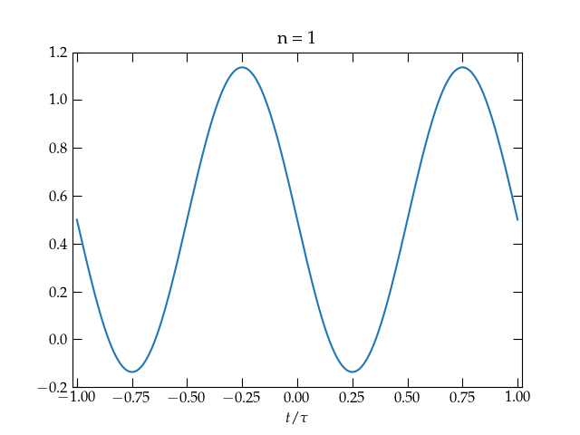
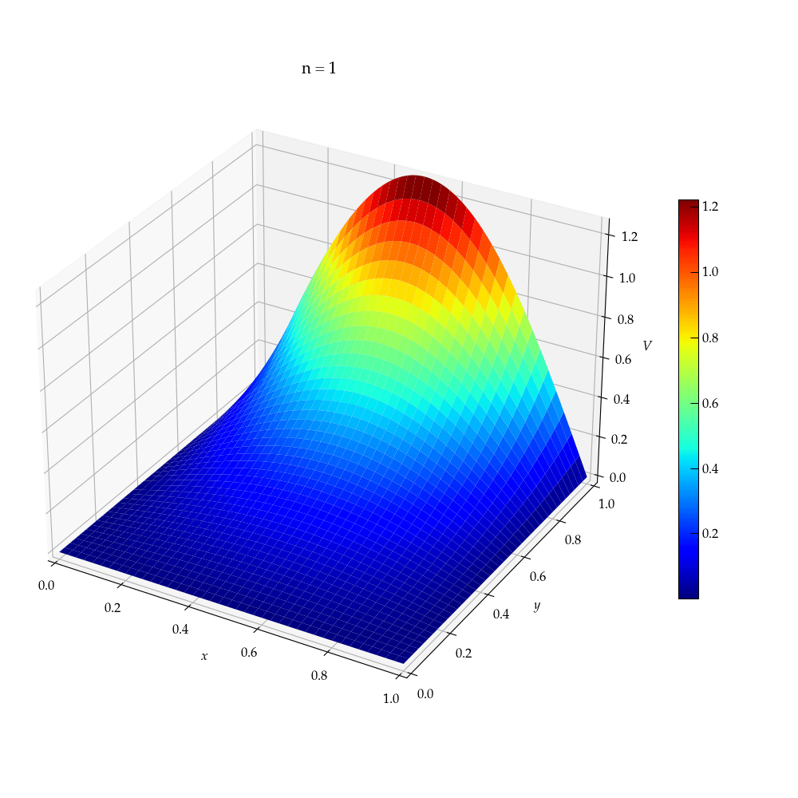

{:menu SW}

# Animations in Matplotlib

* toc
{:toc}

## Animation

Animating graphics generated by Matplotlib can be slightly tricky, in part because the internal calls are made in try-except blocks that suppress any errors. The basic steps to creating animation are:

1. Import `FuncAnimation` via `from matplotlib.animation import FuncAnimation`.
2. Create the figures and axes you will use for the animation.
3. Set the axes limits so they don't change during the animation.
4. Provide labels for axes, if appropriate. If you want to suppress drawing the axes and labels, you can call `ax.set_axis_off()`.
5. Add one or more traces to the figure, keeping track of the object returned from the calls that generate them. They don't need to have any data yet, but you can set the style for each that will then be retained across frames of the animation.
6. Write an update function that takes a single parameter that represents (in some fashion) the frame to generate. The function should compute the values needed to update the traces of the place by calling functions to update the data for each trace. It can be helpful for the update function to return a list of the `Artist`s that have been altered in the update function. This can include all the traces that were modified, as well as any labels or annotations (such as a plot title) that were modified.
7. Call `FuncAnimation` to generate the animation, making sure to save the output of the function call in a variable, so Python won't garbage collect it as soon as the function returns.
8. Optionally, save the animation in a convenient form using `ani.save("somename.gif", dpi=100, fps=24)` (you should adjust the dpi and fps parameters to suit your purposes).

> Once you start an animation, it can be tricky to get it to stop. If you try to reexecute the cell that defined it, you end up having two versions running, which essentially requires you to restart the kernel (using the Kernel menu). I have found it useful to use the following code, which stops the animation and deletes it. Running this before trying to regenerate the animation should help you avoid having relaunch the kernel.

~~~~ python
ani.pause()
del ani
~~~~

### Example

~~~~ python
from matplotlib.animation import FuncAnimation

fig, ax = plt.subplots()              # create the figure
ax.set_xlim(-1.02, 1.02)              # and adjust axes limits and labels
ax.set_ylim(-0.2,1.2)
ax.set_xlabel(r"$t/\tau$")
ax.set_title("1")
t = np.linspace(-1,1,1001)            # set the time values to use
line, = ax.plot(t,np.zeros_like(t))   # create the trace, saving in a variable
                                      # Note the comma; the ax.plot call returns a list

def frame(n:int):
    y = np.zeros_like(t)              # initialize a vector of y values
    y += 0.5                          # start with the constant
    for i in range(1, n+1, 2):
        y -= 2 / (np.pi * i) * np.sin(2 * np.pi * i * t)
    line.set_ydata(y)                 # update the trace
    title = ax.set_title(f"n = {n}")  # update the plot title
    return line, title                # return the Artists that have changed
    
ani = FuncAnimation(fig, frame, range(1, 80, 2), interval=100, blit=True)
ani.save("squarewave.gif", fps=10, dpi=100)
~~~~

  

<a name="Fig1">Figure 1</a> — Fourier series expansion of a square wave as it evolves by including increasing numbers of terms.

~~~~ python
def Lapl2d(X, Y, nmax):
    V = np.zeros_like(X)
    for n in range(1, nmax+1, 2):
        npi = n * np.pi
        c = 4 / (npi * np.sinh(npi))
        V += c * np.sin(npi * X) * np.sinh(npi * y)
    return V

fig = plt.figure(figsize=(10,10))
ax = fig.add_subplot(projection='3d')
cmap = 'jet'
x = np.linspace(0, 1, 201)
X, Y = np.meshgrid(x, x, indexing='ij')
V = Lapl2d(X, Y, 1)
surf = ax.plot_surface(X, Y, V, cmap=cmap)
# add a colorbar and shrink the margins
plt.colorbar(surf, shrink=0.5)
plt.subplots_adjust(left=0, right=1, bottom=0, top=1)

def init():
    ax.set_xlim(-0.1, 1.1)
    ax.set_ylim(-0.1, 1.1)
    ax.set_zlim(-0.1, 1.1)
    ax.set_xlabel("$x$")
    ax.set_ylabel("$y$")
    ax.set_zlabel("$V$")
    return surf,

def update(n:int):
    global surf
    if surf:
        surf.remove()
    V = Lapl2d(X, Y, n)
    surf = ax.plot_surface(X, Y, V, cmap=cmap)
    title = ax.set_title(f"n = {n}", usetex=False)
    return surf, title

ani = FuncAnimation(
    fig, update, frames=np.arange(1, 60, 2),
    init_func=init, interval=400, blit=False)    # I needed to set blit to False
~~~~

  

<a name="Fig2">Figure 2</a> — A 3-D animation showing the electrostatic potential as a function of the number of terms in the Fourier series used to estimate it. The elevation/color axis shows the potential.

## Dynamic updating of graphics

Sometimes you want to have a graphic update over the course of a computation in a Jupyter notebook. As illustrated in the code snippet below, it is easy to update an image plot. Just call `im.set_data()` with the new values. 

Unfortunately, a similar trick to update the data used to make line plots doesn't work;
I find that I have to clear the axes and redraw everything.

~~~~ python
V = np.zeros((100,100))                    # V will be updated during the computation
fig, (ax_image, ax_line) = plt.subplots(   # generate side-by-side figures, showing the image
    ncols=2, figsize=(10,5),               # and the maximum amount by which a voltage changes
    gridspec_kw=dict(width_ratios=(2,1)))  # during the update

im = ax_image.matshow(V, cmap='Spectral',  # create the image
    origin='lower', extent=(0,1,0,1))
plt.colorbar(im, shrink=0.75)              # show a colorbar to scale the voltages

# I'm now leaving out the code that actually does the computation,
# but will define the show() function that will dynamically redraw the plot

def show():
    im.set_data(V)                         # update the image
    ax_line.clear()                        # wipe out the line plot
    ax_line.semilogy(shift)                # shift holds the max change per iteration
    ax_line.set_ylabel("abs(shift)")       # labels are removed on clearing, so
    ax_line.set_xlabel("iteration")        # put them back
    fig.canvas.draw()                      # force the update
    fig.canvas.flush_events()              # also necessary!
~~~~

### Minimal example

~~~~ python
%matplotlib widget
import matplotlib.pyplot as plt
import numpy as np
from time import sleep

fig, ax = plt.subplots()
ax.plot([1],[1],'o', ms=20)
ax.set_xlim(0,6)
ax.set_ylim(0,6)

def show(x, y):
    ax.clear()
    ax.set_xlim(0,6)
    ax.set_ylim(0,6)
    ax.plot(x, y, 'o', ms=20)
    fig.canvas.draw()
    fig.canvas.flush_events()
~~~~

Now, in a second cell, enter

~~~~ python
for n in np.arange(1, 4, 0.05):
    show([n], [n])
    sleep(0.05)
~~~~

### Colab

The above example works in Jupyter lab, but not in Colab. However, the following does work in Google Colab:

~~~~ python
import matplotlib.pyplot as plt
from time import sleep
from IPython import display

fig, ax = plt.subplots()
vals = []
for i in range(10):
    vals.append(i)
    ax.clear()
    ax.plot(vals, vals, 'o')
    ax.set_xlim(0, 10)
    ax.set_ylim(0, 10)
    display.display(fig)
    display.clear_output(wait=True)
    sleep(0.5)
~~~~

## Output formats

There are several possible formats for an animation file. The oldest one is an [animated GIF (Graphics Interchange Format)](https://en.wikipedia.org/wiki/GIF), which was introduced in 1987. All browsers support GIFs, but for most animations there are better formats (better resolution, better compression). One modern option is [WebP](https://en.wikipedia.org/wiki/WebP), which is format developed Google to replace JPEG, PNG, and GIF. You can simply change the file extension in the call to save to switch from GIF to WebP:

~~~~ python
ani.save("squarewave.webp", fps=10, dpi=100)
~~~~