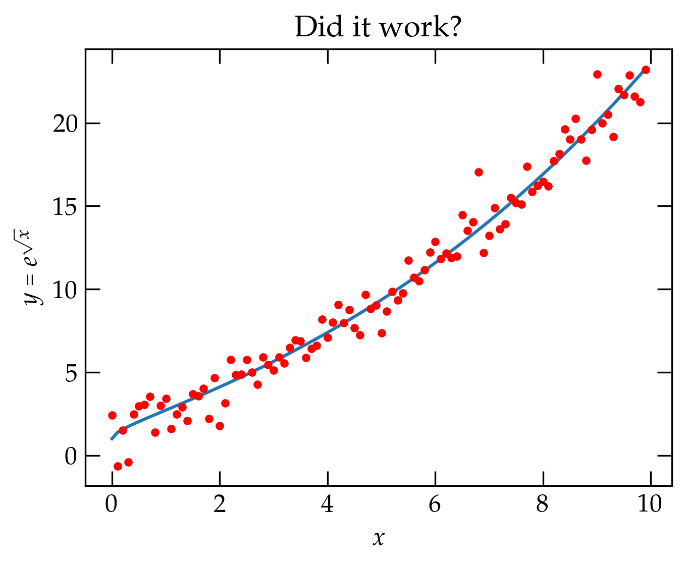
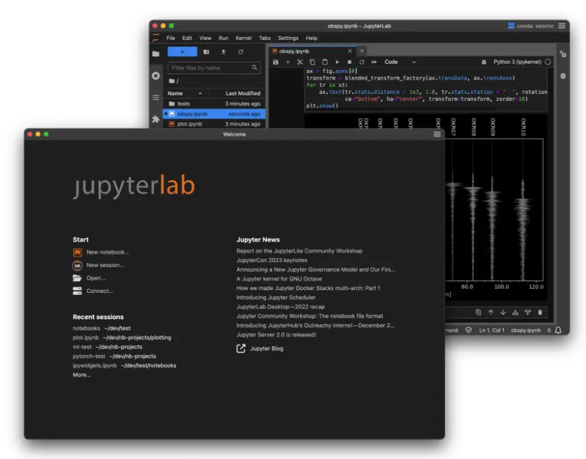
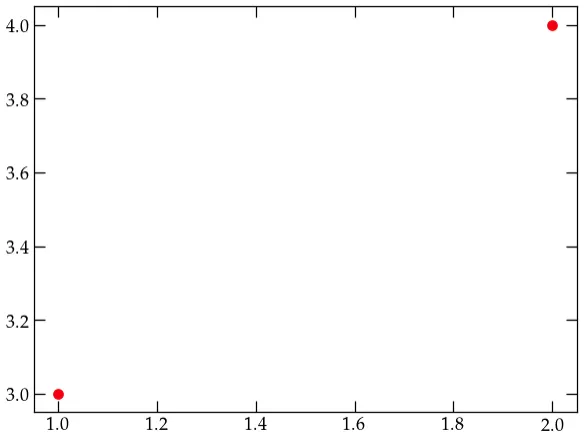
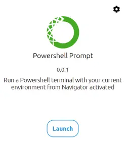
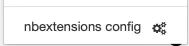
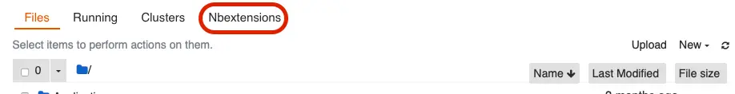
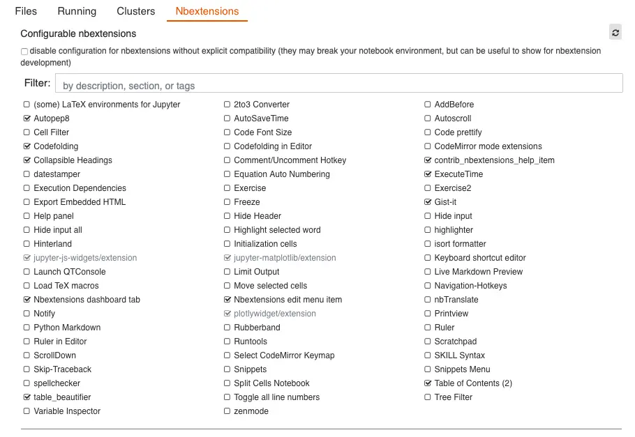
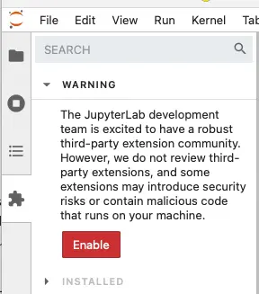
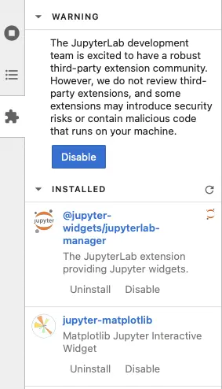

{:menu SW}

# Installing and Configuring Software

* toc
{:toc}

## Important — Don't Skip!

Computation in this course will use Python and JupyterLab, which are open-source software that is free to install and use. **You are responsible** for making sure that you have a working setup on your personal computer; I offer here some guidance.

* The current stable version of the Python language is 3.14, which is what I run by default.
* It is possible to have multiple versions of Python installed on your computer. Virtual environments allow these different versions to avoid conflicting with one another.
* On Unix-based systems (MacOS, Linux), you can launch Python from a terminal window by entering `python`. On Windows, use [Windows Subsystem for Linux](https://learn.microsoft.com/en-us/windows/wsl/install), which gives you a
UNIX command line and all the utilities you need to run Python, pip, etc. You
can check whether WSL is installed by typing the following command into
PowerShell or the Windows Command Prompt:

~~~ shell
> wsl -l -v
~~~~

If WSL is not installed, [you can install it with](https://learn.microsoft.com/en-us/windows/wsl/install)

~~~~ shell
> wsl --install
~~~~

Once you have installed WSL, you need to create a user account and password for
your [newly installed Linux
distribution](https://learn.microsoft.com/en-us/windows/wsl/install#set-up-your-linux-user-info). Follow
the instructions on the [WSL](https://learn.microsoft.com/en-us/windows/wsl/install) page. Then skip to the instructions below for
installing on Ubuntu (Linux).

## Checking your Installation

You may already have installed on your computer all the software you need for this 
course. To check, run the following code. If it
generates the plot, you are ready to proceed to [Jupyter](SW-Jupyter.md).

If you don't get 

~~~~ python
import numpy as np
import matplotlib.pyplot as plt
import pandas as pd
from numpy.random import default_rng
rng = default_rng()

x = np.arange(0, 10, 0.1)
y = np.exp(np.sqrt(x))
noise = rng.normal(size=len(x))
fig, ax = plt.subplots()
ax.plot(x, y)
ax.plot(x, y + noise, 'r.')
ax.set_xlabel("$$x$$", usetex=True)
ax.set_ylabel(r"$$y = e^{\sqrt{x}}$$", usetex=True)
ax.set_title("Did it work?")
plt.show()
~~~~

  

<a name="Fig">Figure 1</a> — Copy the code above
  and run it in a terminal after launching Python. If it generates this graph,
  you have all the packages we'll need.

## Installing from scratch

The computational portions of the course will use Python 3 and several modules,
most notably `numpy`, `scipy`, and `matplotlib`, and `jupyter`. If you are starting from scratch, I recommend you just install the Jupyter Lab application:

  

<a name="FigJL">Figure 1</a> — Installing the JupyterLab Desktop Application

1. Head to [its GitHub repository](https://github.com/jupyterlab/jupyterlab-desktop), then scroll down the page until you get the **Installation section**.

2. Click the link that corresponds to your operating system and processor.

3. Follow installation instructions, *and read carefully any messages*.

4. When you have finished installing, launch the Jupyter Lab application and watch whether it reports that you need to identify a Python installation. If it does, it gives you a link to install a default Python. **Do that!** It takes a bit longer, but once it's done, you have everything you need. It installs `numpy`, `scipy`, `matplotlib`, `ipython`, and `ipympl`. To check your installation, click the **New notebook…** link on the jupyterlab homepage and enter the following in the cell:

~~~~ python
import numpy as np
import matplotlib.pyplot as plt
%matplotlib widget

fig, ax = plt.subplots()
ax.plot([1, 2], [3, 4], 'ro')
~~~~

Press **shift-return** to execute the code in the cell. If your installation is working
properly, you should see a really dumb plot with two red dots:

  

<a name="FigDP">Figure DP</a> — a dumb test plot.

If you have Anaconda installed, you may already have everything you need. However, I prefer
*not to use Anaconda*, but to install the tools I need using `pip`, the Python
installer program.

Alternatively, you can let Google take care of hosting the software (which, of
course, requires a live net connection) by using Google Colab, a
Google-inflected version of JupyterLab. If you use this approach, all you need
to do is head to [Google's colab page](https://colab.research.google.com/).  If
you need to access your own Python code, see [the Colab page](SW-colab.md) for
more information.

## Anaconda

An Anaconda installation should already have Jupyter notebook installed and
available, but you don't need the full Anaconda distribution to use Jupyter
notebook and I have had some trouble in the past getting Anaconda to update to a
more recent version of some of the tools. If you already have an Anaconda
installation, it seems reasonable to check it out and make sure that it can run
what we need. Otherwise, I highly recommend a light-weight approach using Python/Pip,
as described [below](#pythonpip).

   If you have Anaconda installed you can launch the Anaconda Navigator from
   which you can launch Jupyter notebook. You can download Anaconda from
   [https://www.anaconda.com/](https://www.anaconda.com/).

## Python/Pip

Many systems have Python installed automatically. At this point, there is no
reason to use Python 2.7.x; it has been deprecated and is no longer supported
(although many projects have stubbornly refused to update to Python
3). Because Python 2 still hangs around, typing `python` at a command prompt
may launch a version 2 interpreter. You can test with

~~~~ python
> python
Python 2.7.17 (default, Dec 23 2019, 21:25:33)
[GCC 4.2.1 Compatible Apple LLVM 11.0.0 (clang-1100.0.33.16)] on darwin
Type "help", "copyright", "credits" or "license" for more information.
>>>
~~~~

To be sure that you are running some flavor of Python 3, you can use `python3`:

~~~~ python
> python3
Python 3.13.1 (main, Dec  3 2024, 17:59:52) [Clang 16.0.0 (clang-1600.0.26.4)] on darwin
Type "help", "copyright", "credits" or "license" for more information.
>>>
~~~~

If you have a much older version of Python 3 than the one listed above, it is probably worthwhile upgrading to the current version.

## Installing Python on MacOS

Although there is a Python version already installed in MacOS, it tends to lag
behind and I much prefer to use [Homebrew](https://homebrew.sh) to install an up-to-date version of Python (and plenty of other free software). You can check if you already have it installed by opening up a terminal window (the *Terminal.app* program is in `/Applications/Utilities/Terminal.app`, or you can use an alternative terminal
program, such as [iTerm2](https://iterm2.com)).

~~~~ shell
> which brew
/opt/homebrew/bin/brew
~~~~

Since I already have the `brew` command installed, I see that it is located in
`/opt/homebrew/bin`, which is where most Homebrew commands get linked.

If you do not have Homebrew installed, you can follow the directions at [brew.sh](https://brew.sh)
or paste the following at the terminal.

~~~~ shell
    /bin/bash -c "$$(curl -fsSL https://raw.githubusercontent.com/Homebrew/install/HEAD/install.sh)"
~~~~

Once Homebrew is installed, use it to install python:

~~~~ shell
brew install python
~~~~

This should install the most recent stable version of Python 3. It also includes
the Python installer `pip`.

~~~~ shell
> brew --version
Homebrew 4.4.1
~~~~

## Installing on Windows 10 or 11

I strongly recommend installing [Windows Subsystem for
Linux](https://learn.microsoft.com/en-us/windows/wsl/install), which gives you a
UNIX command line and all the utilities you need to run Python, pip, etc. You
can check whether WSL is installed by typing the following command into
PowerShell or the Windows Command Prompt:

~~~ shell
> wsl -l -v
~~~~

If WSL is not installed, [you can install it with](https://learn.microsoft.com/en-us/windows/wsl/install)

~~~~ shell
> wsl --install
~~~~

Once you have installed WSL, you need to create a user account and password for
your [newly installed Linux
distribution](https://learn.microsoft.com/en-us/windows/wsl/install#set-up-your-linux-user-info). Follow
the instructions on the WSL page. Then skip to the instructions below for
installing on Ubuntu (Linux).

Download the Anaconda3 installer and launch it. After it finishes installing, launch the Anaconda Navigator. Then click to launch a Powershell:

This opens a terminal window. Enter the command

~~~~ shell
pip install ipympl
~~~~

to install the Python package that allows graphs generated by `Matplotlib` to be
displayed inside a jupyter lab window.

## Installing on Ubuntu (Linux)

Make sure that Python 3 is installed:

~~~~ shell
sudo apt update
sudo apt -y upgrade
sudo apt install -y python3-dev python3-pip
sudo apt install -y build-essential libssl-dev libffi-dev
~~~~

## Environment

You can learn a lot about your current environment by issuing the `env` command
at a terminal prompt:

~~~~ shell
> env
PWD=/Users/saeta/Documents/Courses/p064
LOGNAME=saeta
LANG=en_US.UTF-8
TERM_PROGRAM=iTerm.app
TERM_PROGRAM_VERSION=3.5.10
LaunchInstanceID=42D7C565-643A-46C2-A54D-ECC2CBC9BA3E
COLORTERM=truecolor
EDITOR=/Applications/Emacs.app/Contents/MacOS/Emacs
TERM_FEATURES=T3CwLrMSc7UUw9Ts3BFGsSyHNoSxF
OMF_PATH=/Users/saeta/.local/share/omf
SHELL=/opt/homebrew/bin/fish
__CFBundleIdentifier=com.googlecode.iterm2
OMF_CONFIG=/Users/saeta/.config/omf
PATH=/Users/saeta/.virtualenvs/py13/bin:/Users/saeta/bin:/Users/saeta/.juliaup/bin:/usr/local/bin:/usr/local/sbin:/opt/homebrew/bin:/opt/homebrew/sbin:/opt/local/bin:/Users/saeta/Library/Python/3.10/bin:/opt/homebrew/opt/ruby/bin:/Users/saeta/.pyenv/bin:/opt/homebrew/opt/fzf/bin:/usr/local/bin:/System/Cryptexes/App/usr/bin:/usr/bin:/bin:/usr/sbin:/sbin:/var/run/com.apple.security.cryptexd/codex.system/bootstrap/usr/local/bin:/var/run/com.apple.security.cryptexd/codex.system/bootstrap/usr/bin:/var/run/com.apple.security.cryptexd/codex.system/bootstrap/usr/appleinternal/bin:/Library/Apple/usr/bin:/Library/TeX/texbin:/Applications/Wireshark.app/Contents/MacOS:/Users/saeta/Applications/iTerm.app/Contents/Resources/utilities:/Users/saeta/.local/bin:/Users/saeta/.gem/ruby/3.3.0/bin:/usr/local/mysql/bin
SHELL_PID=75906
LC_TERMINAL=iTerm2
COLORFGBG=0;15
TERM=xterm-256color
PYTHONPATH=/Users/saeta/.python
COMMAND_MODE=unix2003
GEM_HOME=/Users/saeta/.gem
HOME=/Users/saeta
USER=saeta
PYENV_ROOT=/Users/saeta/.pyenv
VIRTUAL_ENV=/Users/saeta/.virtualenvs/py13
~~~~

In particular, notice the value of the `PATH` shell variable, which tells you
where the system will look for commands that you name on the command line, and
shows them in the order in which they will be searched. Paths are separated with
colons, so in this example, my shell will first look in `/Users/saeta/.virtualenvs/py13/bin`, then
in `/Users/saeta/bin`, etc. If you have installed Anaconda, your `PATH` variable may
start with the path to the `bin` directory inside your Anaconda distribution.

## Using pip to install Python modules

Python has a standard package manager, `pip`, which stands for **Package
Installer for Python**. You can check if `pip` is available by entering the
following command at a terminal prompt:

~~~~ shell
$$ pip --version
pip 24.3.1 from /Users/saeta/.virtualenvs/py13/lib/python3.13/site-packages/pip (python 3.13)
~~~~

Look carefully at the path to your version of pip. If it has Anaconda in it
somewhere, then it is associated with an existing Anaconda installation (perhaps
a relic from CS 5?) and likely for an older version of Python and Pip. If so,
see if you can upgrade to a current version of Anaconda and its associated
versions of numpy, scipy, matplotlib, and plotly.

If you have a Python 3 installation, and pip is
available, you can install everything you need with the following. I recommend that you can first create a virtual environment for this Python installation
so any upgrades or installed libraries don't encounter conflicts. The following commands show how to create a virtual environment named `py13`:

~~~~ shell
$$ pip install --user virtualenv   # install virtualenv
$$ python -m virtualenv py13       # the standard virtualenv package
~~~~

After creating the virtual environment above, you need to activate it:

~~~~ shell
$$ source 

then run

~~~~ shell
pip install --upgrade pip  # make sure you have an up-to-date version
pip install numpy scipy matplotlib jupyter pandas
~~~~

These commands install the minimum you need to get going. However, I recommend also installing some more packages:

~~~~ shell
pip install autopep8 ipympl plotly
jupyter contrib nbextension install --user
~~~~

## Configuration

Although Jupyter and Matplotlib work “out of the box,” you will probably want to customize things a bit. Here are some basic ideas.

### Extensions in Jupyter Notebook

First install `jupyter_contrib_nbextensions` from pip:

~~~~ shell
pip install jupyter_contrib_nbextensions
~~~~

Next install the necessary javascript and css files

~~~~ shell
jupyter contrib nbextension install --user
pip install jupyter_nbextensions_configurator
jupyter nbextensions_configurator enable --user
~~~~

Launch Jupyter notebook from the directory where you would like to load code and save notebooks:

~~~~ shell
> cd ~/Documents/testing
> jupyter notebook
~~~~

A browser window should open and you will see a listing of the files in the current directory. At the bottom of the Edit menu you should see

You should now see a menu item called **Nbextensions**, as illustrated in the figure.
   

   

Clicking on the **Nbextensions** menu will allow you to load extensions as  desired. I recommend several, including 

+ Autopep8
+ Codefolding
+ Collapsible Headings
+ ExecuteTime

### Extensions in Jupyter Lab

We will need a couple of extensions to be installed in JupyterLab. The first step to install those is to enable them by clicking the jigsaw icon as shown in the figure below and then clicking on the **Enable** button.

Once you have enabled extensions, you can use the search box to install the two extensions shown here

Alternatively, you can issue the following statement in the terminal

~~~~ shell
jupyter labextension install @jupyter-widgets/controls @jupyter-widgets/jupyterlab-manager \
   jupyterlab-plotly jupyter-matplotlib
~~~~

### Jupyter Notebook

By default, Jupyter notebook uses a fixed-width column no matter how wide you
make your browser window. Perhaps this is just what you want, but I have
sometimes found it very convenient to allow the column to expand with the
window.

You can override default styling of notebook cells by preparing a `custom.css`
file and placing it in `~/.jupyter/custom/custom.css`. The following example
allows the width of the cell to expand as the window is made wider:

~~~~ css
.container {
  width: 100% !important;
  margin-right: 40px;
  margin-left: 40px;
}
~~~~

### Matplotlib

I dislike matplotlib's defaults. Although it is possible to customize each plot,
it is convenient to put common changes in a preferences file. A copy of the
format file is located in `site-packages/matplotlib/mpl-data/matplotlibrc`. Save
a copy of this file at `~/.config/matplotlib/matplotlibrc` on a Unix/Linux
system or in `$$HOME/.matplotlib/matplotlibrc` on other systems.

This file has all sorts of options, all of them commented out with leading hash
tags. Uncomment the lines you wish to modify and set appropriate values. On my
system, I have set the following lines:

~~~~ shell
saeta@Saeta-MBP19~/.c/matplotlib> grep "^[^ #]" matplotlibrc
backend             : macosx
font.family         : serif # sans-serif
font.size           : 12.0 # 10.0
font.serif          : Utopia, DejaVu Serif, Bitstream Vera Serif, ...

text.usetex         : True ## use latex for all text handling. 

xtick.top           : True ## draw ticks on the top side
xtick.direction     : in   ## direction: in, out, or inout
ytick.right         : True ## draw ticks on the right side
ytick.direction     : in   ## direction: in, out, or inout

savefig.format      : pdf  ## png, ps, pdf, svg
savefig.transparent : True ## setting that controls whether figures are saved with a
                           ## transparent background by default
~~~~

### Using LaTeX in matplotlib labels

If you set `text.usetex: True` in the configuration file, you can take full
advantage of TeX formatting in labels and annotations. However, beware that
certain characters that have special meaning in TeX, such as the underscore, may
cause labels to throw TeX errors unless they are in math mode. If you have
set the default text style to use TeX, you can always pass the optional
keyword argument `usetex=False` in the label to avoid the problem.

### Configuring defaults in a Jupyter notebook

You can change the defaults used to generate graphs in a notebook by writing
values directly to the `matplotlib.rcParams` dictionary.

~~~~ python
import matplotlib as mpl
mpl.rcParams['figure.figsize'] = [12, 8] # You can adjust the plot size
mpl.rcParams['axes.titlesize'] = 18
mpl.rcParams['axes.labelsize'] = 14
mpl.rcParams['xtick.labelsize'] = 14
mpl.rcParams['ytick.labelsize'] = 14
mpl.rcParams['legend.fontsize'] = 'large'
~~~~

If you'd like to see *all* the available parameters and their current values,
launch Python and run

~~~~ python
import matplotlib as mpl
for k, v in mpl.rcParams.items():
    print(f"{k: >32s} = {v}")
~~~~

The output runs to 300+ lines.
