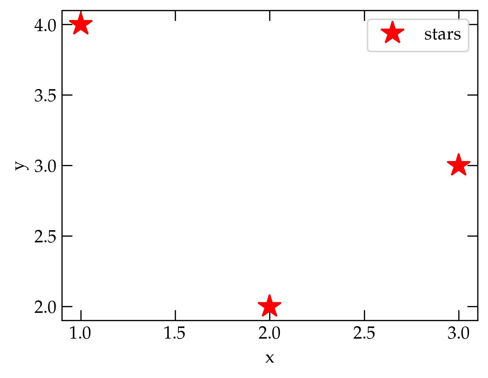

{:menu SW}
{::comment}menu-start{:/comment}

<label id="main-menu"></label>

<ul>
<li><a href="SW-Installation.html">Software Installation</a></li>
<li><a href="LA-LinearAlgebra.html">Linear Algebra</a></li>
<li><a href="FO-Intro.html">Fourier Series and Transforms</a></li>
<li><a href="ST-Random.html">Stochastic Processes</a></li>
<li><a href="DE-DE1.html">Differential Equations</a></li>
<li><a href="PD-PD1.html">Partial Differential Equations</a></li>
<li><a href="PR-Project.html">Projects</a></li>
</ul>

<label id="hamburger-menu"></label>

<ul>
<li><a href="SW-Installation.html">Installing and Configuring Software</a></li>
<li><a href="SW-Jupyter.html">Using Jupyter Notebooks</a></li>
<li><a href="SW-NumPy.html">Basics of NumPy</a></li>
<li><a href="SW-Matplotlib.html">Introduction to Plotting with Matplotlib</a></li>
<li><a href="SW-MPLFormatting.html">Formatting in Matplotlib</a></li>
<li><a href="SW-pandas.html">Pandas</a></li>
<li></li>
<li><a href="SW-Python.html">Python</a></li>
<li><a href="SW-Animation.html">Animations in Matplotlib</a></li>
</ul>

{::comment}menu-end{:/comment}

# Using Jupyter Notebooks

* toc
{:toc}

Jupyter notebooks use a browser to provide an interactive computation and
authoring environment that allows one freely to combine text (including LaTeX
equations), graphics, computation, and the results of computations in a single
window. Jupyter Notebook is the more established code base; Jupyter Lab is newer, has a number of nice features, but is buggier than the Notebook interface; use it at your own risk!

Notebook cells can include text written in **Markdown** (such as this cell),
**Code** (the cell below this one) or **Raw** mode. Markdown cells can include
formatting information and math expressions written in LaTeX (more about that in
a bit). Raw cells just hold the text and don’t interpret symbols that would
change the font or show equations if they were processed as Markdown. Code cells
get submitted to the Jupyter kernel (and passed to the Python interpreter). 
This cell is in Raw mode so I can illustrate the basics of Markdown.

~~~~ markdown
Italics: *this will be in italics*

Boldface: **whereas this statement is in boldface.**

Code: `def fred(x, y)`

- a bullet
- in a list

1. Or a numbered
2. list

To write math, surround with dollar signs:
$E = m c^2$ or $x = \frac{-b \pm \sqrt{b^2 - 4 a c}}{2a}$

To center an equation on its own line, use
\begin{equation}
\sin^2 \theta + \cos^2 \theta = 1
\end{equation}

Notice that mathematical functions should be preceded with a backslash
and that you get Greek letters by preceding their name in English with a backslash. 

For more information about Markdown, check out the **Markdown Reference**
item in the Jupyter **Help** menu.
~~~~

And this is how that same text appears when used in a Markdown cell:

Italics: *this will be in italics*

Boldface: **whereas this statement is in boldface.**

Code: `def fred(x, y)`

- a bullet
- in a list

1. Or a numbered
2. list

To write math, surround with dollar signs: $$E = m c^2$$ or $$x = \frac{-b \pm \sqrt{b^2 - 4 a c}}{2a}$$

To center an equation on its own line, use
\begin{equation}
  \sin^2 \theta + \cos^2 \theta = 1
\end{equation}

Notice that mathematical functions should be preceded with a backslash and that
you get Greek letters by preceding their name in English with a backslash. 

For more information about Markdown, check out the **Markdown Reference** item
in the Jupyter **Help** menu. 

## Code

The first step in a new notebook is a line containing a magic command that
allows graphs to appear in output cells of the notebook. Magic lines start with
a % (and you can’t put a comment after them the way you can in Python. To
execute the commands in a cell, make sure the cell is selected and press
**shift-enter** or **shift-return**. Or, if you are a mouse person, click the
triangle symbol at the top of the page. 

~~~~ python
# the following line is for jupyter notebook
%matplotlib notebook
# if you use jupyter lab, replace "notebook" with "widget"
import numpy as np               # np is the standard abbreviation for numpy
import matplotlib.pyplot as plt  # plt is the standard abbreviation for pyplot
~~~~

## A simple plot

To illustrate how you can make a plot and have it show up in the notebook, let’s
try a very simple example. 

~~~~ python
fig, ax = plt.subplots()
ax.plot([1, 2, 3], [4, 2, 3], 'r*', label="stars")
ax.set_xlabel("x")
ax.set_ylabel("y")
ax.legend();
~~~~

  

Some explanations:

- `plt.subplots` returns both a figure object and an axes object
- `ax.plot` takes two lists, one for the x values, and the other for the y
  values. They must have the same length! The optional argument `'r*'` says to use
  red star symbols, and the label allows the legend to associate a label with
  the symbol in the legend. 
- `ax.set_xlabel` and `ax.set_ylabel` take a string. The string can contain
  LaTeX commands (see below).
- `ax.legend();` says to show a legend of the traces on the plot, letting
  matplotlib decide the best location for it. The semicolon suppresses the
  output of this command. (You can remove it and run the command again to see
  what gets returned.) 

See [Introduction to Matplotlib](SW-Matplotlib.md) for some basics on using Matplotlib to generate plots.

## Troubleshooting

For Jupyter Lab to work with matplotlib, you need to have a few extensions installed. If plotting or animations aren't working for you, you may have out-of-date versions of Python and/or the necessary modules. 

From a terminal, type

~~~~ bash
> jupyter labextension list
JupyterLab v3.6.3
/opt/homebrew/Cellar/jupyterlab/3.6.3/libexec/share/jupyter/labextensions
        jupyterlab_pygments v0.2.2 enabled OK (python, jupyterlab_pygments)

Other labextensions (built into JupyterLab)
   app dir: /opt/homebrew/Cellar/jupyterlab/3.6.3/libexec/share/jupyter/lab
        @jupyter-widgets/jupyterlab-manager v5.0.7 enabled OK
        jupyter-matplotlib v0.11.3 enabled OK

~~~~

This command gives the version of the JupyterLab software and the status of all installed and enabled extensions.
I have found that I need both **@jupyter-widgets/jupyterlab-manager** and **jupyter-matplotlib** installed and enabled. See below for instructions on installing and updating them right from within Jupyter Lab.

Notice that my installation is in the `/opt/homebrew` directory structure, since I installed it with homebrew. If your installation is from anaconda, which you can tell by looking at the directory path of the files listed in the output you see from the `jupyter labextension list` command, then please try

~~~~ bash
conda update conda
conda update anaconda
~~~~

Kate Riggs found that these two commands fixed her installation, which was running an old version of Python and which would not display figures.

## Installing Jupyter labextensions

  

You may need to install `node.js` to be able to compile these extensions. In homebrew, try

~~~~ sh
brew install node
~~~~