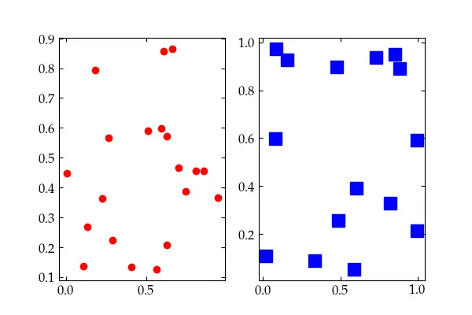
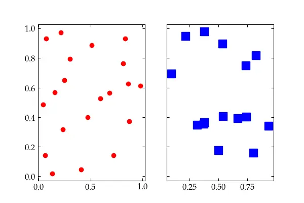
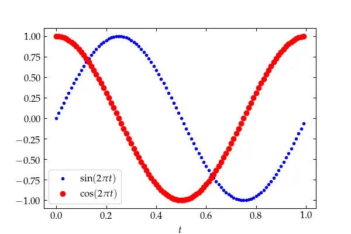
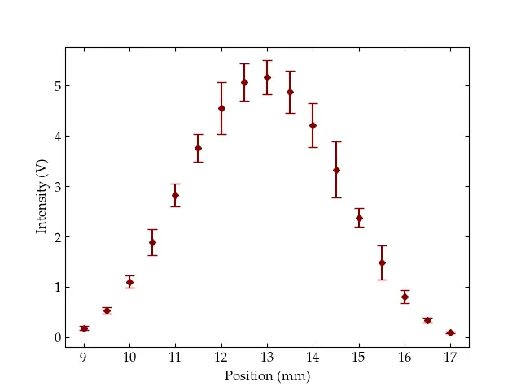
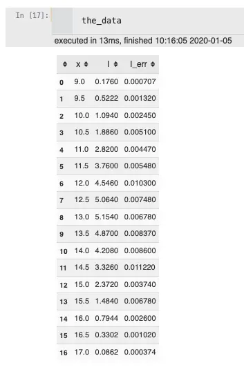

{:menu SW}

# Formatting in Matplotlib

* toc
{:toc}
 
## Cheat sheets

  - [Beginners](https://matplotlib.org/cheatsheets/handout-beginner.pdf)
  - [Intermediate users](https://matplotlib.org/cheatsheets/handout-intermediate.pdf)
  - [Tips and tricks](https://matplotlib.org/cheatsheets/handout-intermediate.pdf)
  - [Full sheet](https://matplotlib.org/cheatsheets/cheatsheets.pdf)

## Figures

You can override the default figure size by including the figsize keyword
argument:

~~~~ python
fig = plt.figure(figsize=(8,6)) # create a figure that is 8" x 6"
~~~~
To make all figures in a notebook use a different size, you can execute the
following code near the top of the notebook:

~~~~ python 
import matplotlib as mpl
mpl.rcParams['figure.figsize'] = (8.0, 6.0) 
~~~~
Or you can put your preference in your matplotlibrc so that it is loaded
automatically every time you use matplotlib. See [Configuration](SW-Installation.md) for details.

## Subplots

A figure can have more than one set of *Axes*. There are several ways to create
these. The simplest is `plt.subplots()`, which creates a new figure and populates
it with the number of rows and columns of subplots that you specify.

~~~~ python 
fig, axes = plt.subplots(1, 2, figsize=(8,5))
axleft, axright = axes  # if there is only one row, axes is a vector; otherwise, a 2-D array
axleft.plot(np.random.random(20), np.random.random(20), 'ro')
axright.plot(np.random.random(15), np.random.random(15), 'bs', markersize=12)
~~~~

If you wish to tie certain axes of the subplots to one another, pass
`sharex=True` and/or `sharey=True` as optional keyword arguments to
`plt.subplots()`. In <a href="#Fig1">Fig. 1</a> the value of `sharey` was implicitly set to
`False`.

Fig. 1 — A simple figure with two subplots

Had we passed `sharey=True` to the `plt.subplots()` command, we would have
obtained a figure like <a href="#Fig2">Fig. 2</a>.

Fig. 2 — Two subplots with a shared y axis

For more control you can pass in a `gridspec_kw` dictionary to generate a
`GridSpec` object to determine just how the figure's space will be allocated to
the subplots. See
[the GridSpec](https://matplotlib.org/api/_as_gen/matplotlib.gridspec.GridSpec.html#matplotlib.gridspec.GridSpec) page for more information.

## Labels

Axes should be labeled (with units, where appropriate). The following example
assumes that `usetex=True`. See [Configuration](SW-Installation.md) for how to set that up. 

~~~~ python 
fig3, ax3 = plt.subplots(figsize=(6,4))
t_vals = np.arange(0.0, 1.0, 0.01)
sines = np.sin(2 * np.pi * t_vals)
cosines = np.cos(2 * np.pi * t_vals)
ax3.plot(t_vals, sines, 'b.', t_vals, cosines, 'ro')
ax3.set_xlabel(r'$$t$$')
ax3.legend([r'$$\sin(2\pi t)$$', r'$$\cos(2\pi t)$$']);
~~~~

Using LaTeX to produce properly formatted labels, with variables set in italics and functions in roman font.

In this example, the legend was created by passing in a list of strings, one for
each trace. A better approach is to build in the labels for the legend explicitly:

~~~~ python 
    fig4 = plt.figure(4, figsize=(6,4))
    ax4 = fig4.add_subplot(111)
    ax4.plot(t_vals, sines, 'b.', label=r'$\sin(2\pi t)$')
    ax4.plot(t_vals, cosines, 'ro', label=r'$\cos(2\pi t)$')
    ax4.set_xlabel(r'$t$')
    ax4.legend() # put the legend in the 'best' location automatically
~~~~

## Error Bars

To plot a series of data with error bars, use `errorbar(xdata, ydata,
yerr=yerrors)`. Here's an example that loads some data from a web site using
the pandas package. Pandas makes it easier to work with tables of data.

~~~~ python 
import pandas as pd
the_data = pd.read_table('https://www.physics.hmc.edu/courses/p134/CircularMoore2004.txt')
ebars = plt.figure()
eax = ebars.add_subplot(111)
eax.errorbar(the_data['x'], the_data['I'], color="#800000",
  yerr=the_data['I_err'] * 50, fmt='D', marker='D', markersize=4, capsize=4)
eax.set_xlabel('Position (mm)')
eax.set_ylabel('Intensity (V)');
~~~~

A figure with error bars showing data taken by a student in Physics 134,
 *Optics Lab*  (I had to grow the error bars by a factor of 50 so you could see them!).

The `pd.read_table()` call produces a pandas `DataFrame`. You can examine the
contents of the frame just by entering the variable name in a cell:

A pandas `DataFrame`.

See [Pandas](SW-pandas.md) for more information on how to use pandas.
