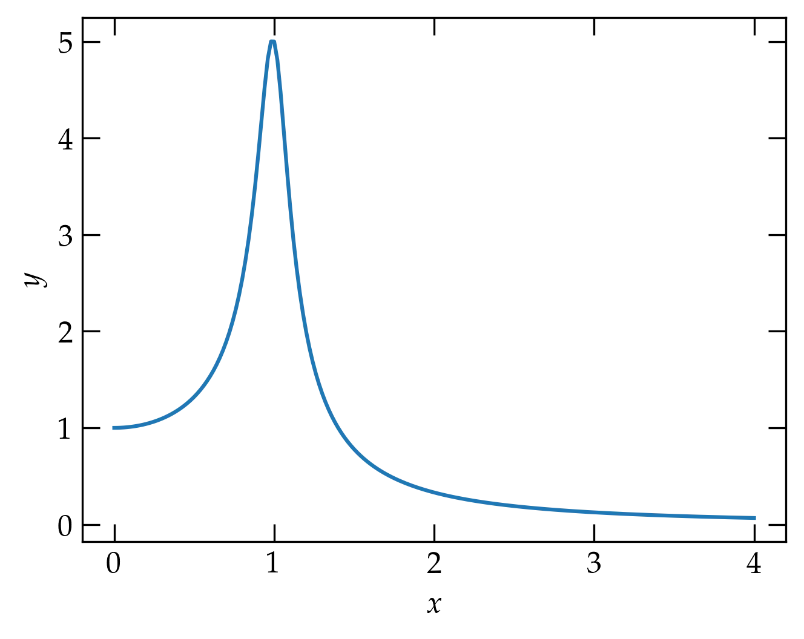
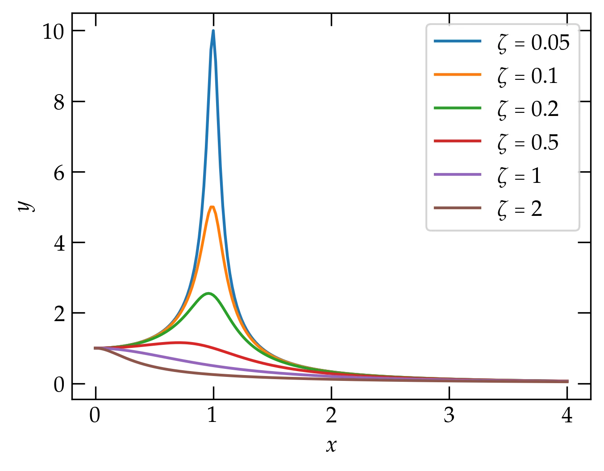
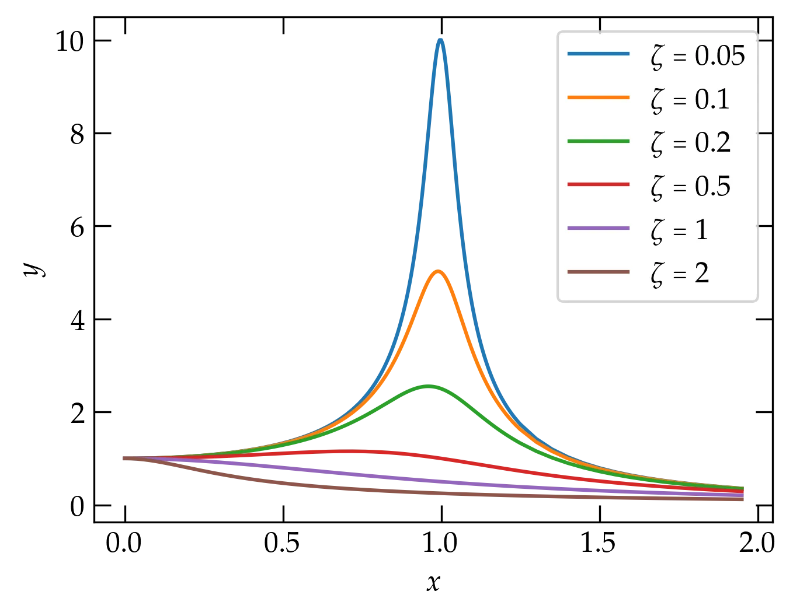
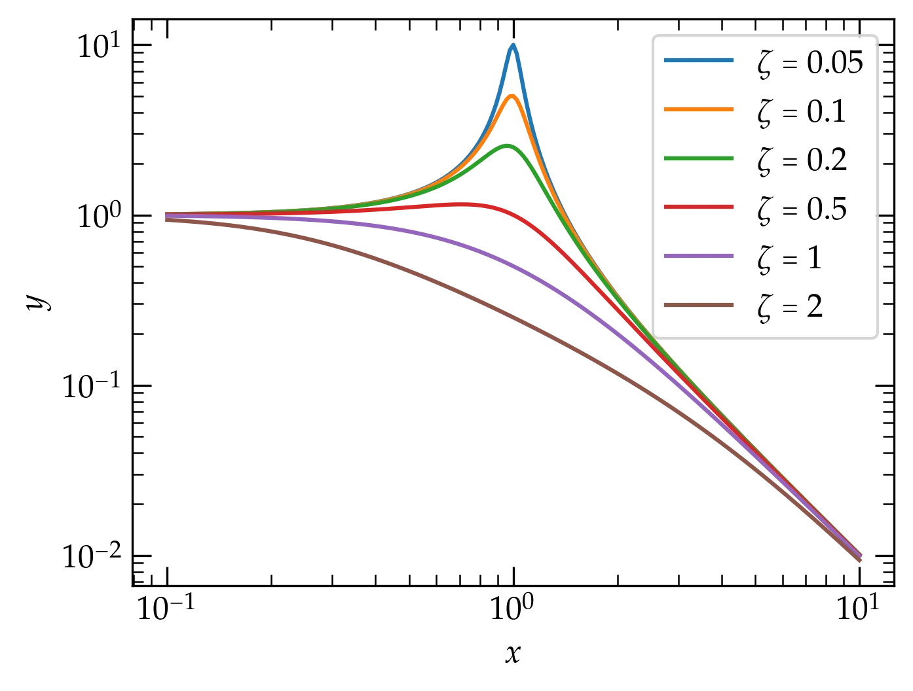

{:menu SW}

# Introduction to Plotting with Matplotlib

* toc
{:toc}

[Back to the top](index.md)

## Plotting a function

To plot a function in matplotlib you need to first compute $$x$$ values and $$y$$ values. Let’s see how to plot the function
\begin{equation}
    y(x) = \frac{1}{\sqrt{(1-x^2)^2 + 4 \zeta^2 x^2}}
\end{equation}
where $$\zeta$$ is called the *damping parameter* and *x* represents the ratio of
the frequency of an oscillator to its *natural frequency*, as you learned in E79.

*Can you imagine what the curve looks like for $$x \ge 0$$? See if you can guess
the shape of the curve for a value of $$\zeta \ll 1$$ and also for $$\zeta >
1$$. Then proceed.*

We need to pick a suitable range of the independent variable `x`. I’m going to
start at zero and go to $$x = 4$$ for starters. Let’s use 201 points over that
interval. Fortunately, numpy has a very convenient function we can use:

~~~~ python
x = np.linspace(0, 4, 201) # make an array of 201 equally spaced
                           # values between 0 and 4, inclusive
x                          # show the values we just computed
~~~~

*Can you explain why we used 201 points, not 200?*

Now we need to calculate the corresponding values of $$y$$. But those values
depend on the value of $$\zeta$$, which we haven’t yet specified. Let’s write a
little function to take two inputs, the `x` array of values and a single value of
$$\zeta$$, producing the corresponding values of `y`.

~~~~ python
def myfunc(x: np.ndarray, zeta:float):
    """Calculate the y values given by the equation defined above in the section
    called Plotting a function
    """
    return 1.0 / np.sqrt((1 - x*x)**2 + 4 * zeta**2 * x*x)
~~~~

Some explanations:

* `myfunc` takes two arguments, and their types are indicated after the
  colons. Where possible, specifying the type expected for the argument makes
  your functions easier to interpret. 
* the type `np.ndarray` is the kind of array that gets returned from
  `np.linspace`; it is a very commonly used type in numpy.
* A docstring helps explain the purpose of the function.
* the square root function is defined differently in numpy than in the Python
  `math` module. The numpy version notices when an argument is not a single
  number but a np.ndarray of values and automatically calculates for each value
  in the array. 

Read that last bullet point again. NumPy calls this feature *broadcasting*; it
is **really** nice. It means we don’t need to write loops to compute array
values; numpy will take care of that for us. 

Let’s try a curve with a small value of damping parameter $$\zeta$$.

~~~~ python
    y = myfunc(x, 0.1)
    fig, ax = plt.subplots()
    ax.plot(x, y, label="0.1")
    ax.set_xlabel("$x$")
    ax.set_ylabel("$y$");
~~~~

  

Okay, that looks like a peak near $$x = 1$$ (which means that the frequency is
near the *natural frequency*). Now let’s add a curve on the same axes but with
$$\zeta = 0.5$$ this time. 

### Adding a second curve

~~~~ python
y2 = myfunc(x, 0.5)
ax.plot(x, y2, label="0.5")
ax.legend();
~~~~

  

Stronger damping attenuates the resonance peak.

Well, that’s interesting. Increasing the damping parameter really pushed the
peak down. I wonder if we could make a plot that showed curves for several
values of damping parameter. Let’s try.

~~~~ python
fig, ax = plt.subplots()
ax.set_xlabel("$x$")
ax.set_ylabel("$y$")
for zeta in (0.05,0.1, 0.2, 0.5, 1, 2):
    y = myfunc(x, zeta)
    ax.plot(x, y, label=r"$\zeta = %g$" % zeta)
ax.legend();
~~~~

Now our resonance cup runneth over!

Can you summarize the behavior you observe?

### Refining the graph

You may notice that when the damping parameter is small, we aren't calculating enough points near the peak to get a smooth curve. One strategy would be to use more points in `x`, but that seems inelegant: we don't need all those extra points except around the peak. 

We can use `np.concatenate` to generate a set of points for `x` that are more closely spaced around the peak:

~~~~ python
x = np.concatenate((
    np.arange(0.0, 0.75, 0.02),
    np.arange(0.75,1.25, 0.005),
    np.arange(1.25, 2, 0.05)
    ))
~~~~

  

Smoother curves around the peak.

### Logarithmic axes

It turns out that this plot will look better if we use logarithmic axes. Let’s see what that looks like. For grins, I’m going to compute a more suitable set of $$x$$ values first.

~~~~ python
logx = np.logspace(-1, 1, 201)
fig, ax = plt.subplots()
ax.set_xlabel("$x$")
ax.set_ylabel("$y$")
for zeta in (0.05, 0.1, 0.2, 0.5, 1, 2):
    y = myfunc(logx, zeta)
    ax.loglog(logx, y, label=r"$\zeta = %g$" % zeta)
ax.legend();
~~~~

Now our resonance cup runneth over in style!

How would you summarize the behavior you observe in this plot?

## Quiz

Let’s see if you can now apply what we’ve explored so far.

1. Make an array called `hermione` that has 51 equally spaced points between 0 and 1, inclusive.
2. Make a plot of the square of the values in `hermione`. Use blue dots to plot
   the points by passing **'bo'** to the `plot` function. 

## Modifying the way a trace is displayed

You can modify the way a trace appears with both positional and keyword
arguments to the call to =plot(xvals, yvals)=. For a few basic colors, you can
use the following shortcuts:

| color code   | meaning | symbol code | meaning       |
|------------+---------+-------------+---------------|
| `'b'`        | blue    | `'o'`         | filled circle |
| `'r'`        | red     | `'.'`         | dot           |
| `'g'`        | green   | `'*'`         | star          |
| `'k'`        | black   | `'-'`         | line          |
| `'y'`        | yellow  | `'v'`         | triangle down |
| `'w'`        | white   | `'^'`         | triangle up   |
| `'m'`        | magenta | `'s'`         | square        |
| `'c'`        | cyan    | `'d'`         | thin diamond  |
|------------+---------+-------------+---------------|

You can also use an RGB or RGBA notation, such as =#0f0800= or =#0f0f0f80=. To
combine such a color specification with a marker designation, use a command such
as the following

~~~~ python
ax.plot([0, 0.25, 0.5, 0.75], [1, 0.75, 0.5, -0.25], 'o', color='#44bb60')
~~~~

See [markers](https://matplotlib.org/api/markers_api.html?highlight=marker#module-matplotlib.markers) for more marker options and [colors](https://matplotlib.org/api/colors_api.html?highlight=color#module-matplotlib.colors) for more options for representing colors. 

[Next step: formatting in Matplotlib](SW-MPLFormatting.md)
