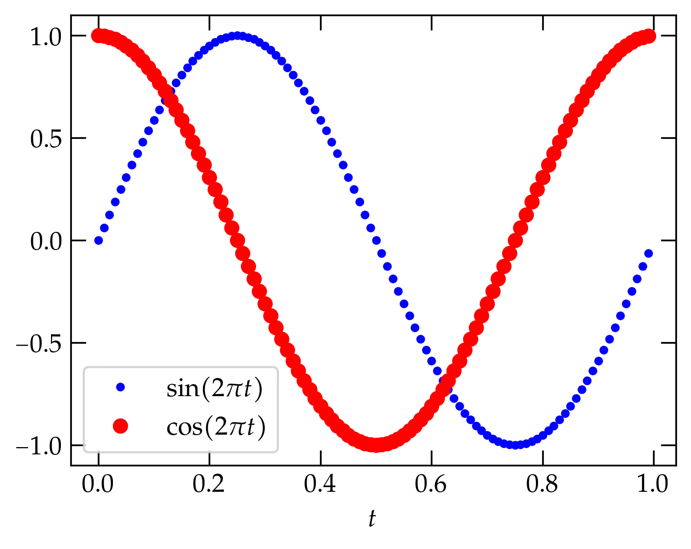

{:menu SW}

# Basics of NumPy

* toc
{:toc}

[Back to Linear Algebra](LA-LinearAlgebra.md)

NumPy ("num-pie") is a Python library of optimized routines for computing with arrays. Compared to writing loops over nested lists, as in normal Python syntax, operating with NumPy routines on NumPy arrays greatly accelerates operations and uses more readable syntax.

The standard way to access the routines of NumPy in a Python program is with an import statement of the form

~~~~ python
import numpy as np
~~~~

A basic numerical type in NumPy is the `np.ndarray`, which can represent an array of arbitrary numbers of dimensions. You can create an array from basic Python types such as **lists** and **tuples** using `np.array(list_or_tuple)`. For example

~~~~ python
a = np.array([[1, 2, 3], [4, 5, 6]])
~~~~

generates the $$2\times 3$$ array

~~~~ python
array([[1, 2, 3],
       [4, 5, 6]])
~~~~

Besides listing all elements of a NumPy array, you can use a number of convenience functions to generate them:

+ `np.arange(start, end, dx)` generates a one-dimensional array of values (start, start + dx, start + 2 * dx, ..., start + n * dx) where the final value satisfies start + n * dx < end. For instance, `np.arange(1, 4, 1)` produces  `array([1, 2, 3])`. That is, the final value in the array *is smaller than the second argument*.
+ `np.linspace(start, end, n)` generates a one-dimensional array of values that divides [start, end] into $$n-1$$ equal intervals, so that `np.linspace(1, 4, 4)` produces `array([1, 2, 3, 4])`. That is, `linspace` includes the end points, whereas `arange` does not include its end point.
+ `np.zeros((nrows, ncols))` generates an array with `nrows` and `ncols` filled with zeros. You can include any number of dimensions in the tuple that specifies the size of the array.
+ You can also pass an optional numerical type for the array, as in `np.zeros(nelements, dtype=np.int8)`
+ `np.ones((nrows, ncols))` generates an array of ones.
+ If you aren't sure whether an object `A` is already an array (or might be some other iterable), use `np.asarray(A)`, rather than `np.array(A)`. Why? Because `np.asarray(A)` does not create a copy if it doesn't need to, whereas `np.array(A)` creates a copy of `A` regardless.
+ [See the NumPy page on Array creation routines](https://numpy.org/doc/stable/reference/routines.array-creation.html) for more information.

## Properties of NumPy arrays

Suppose that you want to multiply each element in a list by 3.2. In standard Python, you could write a list comprehension of the form

~~~~ python
b = [x * 3.2 for x in mylist]
~~~~

for a list stored in `mylist`. If, instead, you use a NumPy array, you can simplify the notation to eliminate explicit loops:

~~~~ python
b = np.asarray(mylist) * 3.2
~~~~

This notation also works for multiplying (or performing similar arithmetic operations) on all elements of a NumPy array of arbitrary dimensions.

All of the standard functions have NumPy versions that “broadcast” in this way over the elements of the array that they are passed. So, the following code computes a comb of equally spaced $$x$$ values and computes the corresponding sine values and then uses matplotlib to plot the result:

~~~~ python
import matplotlib.pyplot as plt
x = np.linspace(0, np.pi, 101)  # create an array of equally spaced x values
y = np.sin(x)                   # compute the corresponding y values via broadcasting
fig, ax = plt.subplots()        # start a matplotlib plot
ax.plot(x, y)                   # by default, matplotlib connects the points
ax.set_xlabel('$x$')            # dollar signs turn on LaTeX; x is set in italics
ax.set_ylabel(r'$\sin{x}$')     # a raw string protects the backslash from escaping
~~~~

  

<a name="Fig">Figure 1</a> — Plot of $$\sin(x)$$ on the interval $$[0, \pi]$$. Note that my preferences set `usetex=True` automatically, so that text between dollar signs is fed through TeX. If you don't see proper rendering, try including the optional keyword argument `usetex=True` in the two `set_label` commands.

### Universal functions

Functions that "broadcast" across the elements of an array are called **universal functions**. 
You can [read more about NumPy's universal functions](https://numpy.org/doc/stable/reference/ufuncs.html) in the official documentation. They include all the standard trigonometric, exponential, and hyperbolic functions, degree-radian conversions, rounding, etc. Some “unusual” ones you might find handy:

+ `square(x)` computes the square of all elements of `x`
+ `cbrt(x)` computes the cube root of all elements of `x`
+ `arctan2(y, x)` computes the arctangent of (x,y) points, in radians, making sure to get the quadrant correct
+ `degrees(x)` converts values in `x` from radians to degrees; `rad2deg(x)` does the same thing
+ `isnan(x)` returns a boolean array of True values if `x` is not a number and False otherwise
+ `floor(x)` returns the greatest integer less than each value of `x`; see also `round(x)` and `trunc(x)`

### Array axes

Sometimes you want to operate row-wise or column-wise on a two-dimensional array. Consider the following example:

~~~~ python
from numpy.random import default_rng
rng = default_rng()                     # initialize a random number generator
m = np.around(rng.uniform(-5., 5., size=(2, 3)), 1)
m                                       # make a row of random numbers in [-5.0, 5.0) with 2 rows and 3 columns
array([[-1.5,  4.8, -0.7],              # but round to one digit after the decimal point
        [ 3.4, -4.8,  2.7]])

m.shape                                 # describe the size of m
(2, 3)

m.max()                                 # what is the single largest value in the array?
4.8

m.max(axis=0)                           # what is the largest value in any row
array([3.4, 4.8, 2.7])                  # three answers, one for each column

m.max(axis=1)                           # what is the largest value in any column
array([4.8, 3.4])                       # two answers, one for each row
~~~~

This approach is not limited to two-dimensional arrays:

~~~~ python
m3 = np.around(rng.uniform(-10., 10., size=(2,3,4)), 1)
m3
array([[[ 6.1,  0.2, -2.8,  3.8],
        [ 8.1,  4.5, -3.1, -4.1],
        [ 8.2,  0.1, -0.8, -5.6]],

        [[ 9.3, -5.6, -6.2, -5.6],
        [ 1.6,  0.2,  4.6, -8.5],
        [ 5.8, -1.9,  1.2,  6. ]]])
m3.max()            # the maximum of all elements
9.3
m3.max(axis=0)      # the maximum in each row
array([[ 9.3,  0.2, -2.8,  3.8],
        [ 8.1,  4.5,  4.6, -4.1],
        [ 8.2,  0.1,  1.2,  6. ]])
m3.max(axis=1)      # the maximum in each column
array([[ 8.2,  4.5, -0.8,  3.8],
        [ 9.3,  0.2,  4.6,  6. ]])
m3.max(axis=2)      # the maximum in each chunk
array([[6.1, 8.1, 8.2],
        [9.3, 4.6, 6. ]])
m3.max(axis=(0,1))  # the maximum in each (row, col) portion
array([9.3, 4.5, 4.6, 6. ])
~~~~

In short, functions such as `sum`, `max`, `min`, etc., operate by default on all elements of multidimensional arrays, but can also be specialized to work along various axes (directions) of the array.

## Slicing

Like lists and tuples, NumPy arrays understand slices. To extract the first column (column 0) from `m`, use `m[:,0]`:

~~~~ python
m[:,0]
array([-1.5,  3.4])

m[1,:]
array([ 3.4, -4.8,  2.7])
~~~~

Note that the "bare" colon means *all*; you can use `start:stop` or `start:stop:stride` syntax, as well.

~~~~ python
p = np.array(range(12))
array([ 0,  1,  2,  3,  4,  5,  6,  7,  8,  9, 10, 11])

p[0:10:2]
array([0, 2, 4, 6, 8])
~~~~

## Searching and sorting

Sometimes you want to know not just what the largest value is but where it is in the array.

~~~~ python
np.argmax(m3)                           # where is the largest element
12                                      # 9.3 is at offset 12 (the 13th element)

np.argmax(m3, axis=0)
array([[1, 0, 0, 0],
        [0, 0, 1, 0],
        [0, 0, 1, 1]])

np.sort(m3)                             # sort over the last index of the array
array([[[-2.8,  0.2,  3.8,  6.1],
        [-4.1, -3.1,  4.5,  8.1],
        [-5.6, -0.8,  0.1,  8.2]],

        [[-6.2, -5.6, -5.6,  9.3],
        [-8.5,  0.2,  1.6,  4.6],
        [-1.9,  1.2,  5.8,  6. ]]])    
~~~~

You can also sort over other axes.

## Sums and products

+ `sum(x)` computes the sum of all elements, but you can also use `axis=` to adjust what is summed
+ `product(x)` multiplies all elements
+ `cumsum(x)` (cumulative sum) returns an array in which the nth value is the sum of all entries up to and including the nth value
+ `cumprod(x)` (cumulative product) like `cumsum` but multiplies all prior elements together
+ `nansum(x)` compute the sum of all values in `x` that are not NaNs (not a numbers)