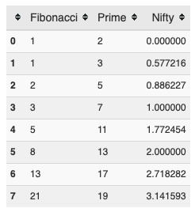
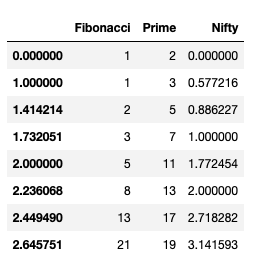
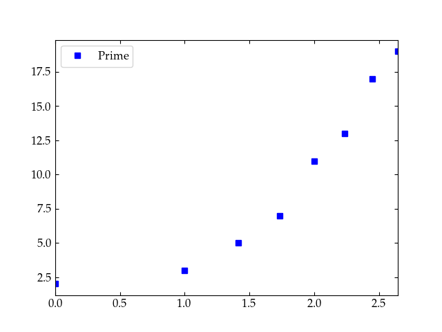
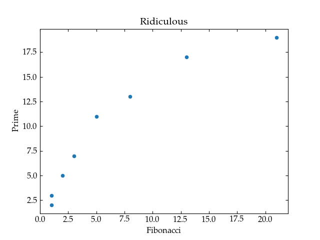
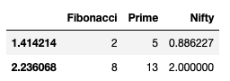
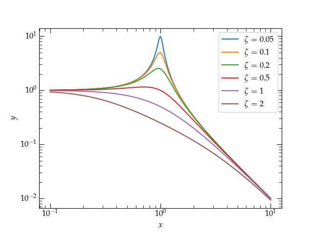
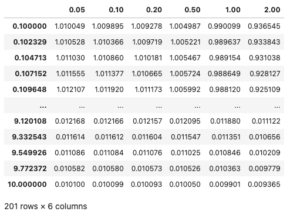
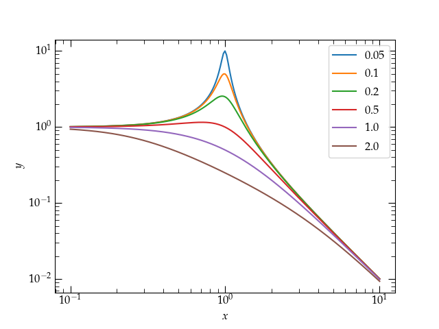
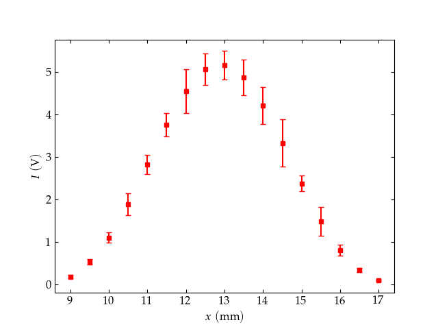

{:menu SW}
{::comment}menu-start{:/comment}

<label id="hamburger-menu"></label>

<ul>
<li><a href="SW-Installation.html">Installing necessary software</a></li>
<li><a href="SW-Jupyter.html">Jupyter notebooks</a></li>
<li><a href="SW-NumPy.html">NumPy</a></li>
<li><a href="SW-Matplotlib.html">Matplotlib</a></li>
<li><a href="SW-MPLFormatting.html">Formatting Plots</a></li>
<li><a href="SW-pandas.html">Pandas</a></li>
</ul>

{::comment}menu-end{:/comment}

# Pandas

* toc
{:toc}

[Pandas](https://pandas.pydata.org) is a Python module that provides features 
somewhat akin to a spreadsheet or database and meshes very naturally with both
[NumPy](SW-NumPy.md) and [Matplotlib](SW-Matplotlib.md). Before we can
explore it, we need to import this module. 

## Installation

If you enter `import pandas as pd` in a cell in a Jupyter notebook and Python
doesn’t complain, pandas is already installed. If not, installing is easy. If you
are running jupyter notebook having installed with `pip`, enter

~~~~ shell
pip install pandas
~~~~

If you are using Anaconda, use

~~~~ shell
conda install pandas
~~~~

## Creating a pandas DataFrame

The easiest way to create a `DataFrame` is from a dictionary of arrays, which
all must have the same length. Here's a simple example.

~~~~ python
fibo = [1, 1, 2, 3, 5, 8, 13, 21]
prime = [2, 3, 5, 7, 11, 13, 17, 19]
nifty = [0., np.euler_gamma, np.sqrt(np.pi)/2, 1., np.sqrt(np.pi), 2.0, np.e, np.pi]
df = pd.DataFrame(dict(Fibonacci=fibo, Prime=prime, Nifty=nifty))
~~~~

If we ask Jupyter to display the DataFrame by submitting df, this is what we
get:

In combination with Jupyter, pandas generates a nice looking table, with column
heads you can use for sorting. In this case, everything is sorted in ascending
order, so the sort buttons aren't particularly useful. In general, however, they
can be quite useful. Also in this case, I have not set an index array, so Pandas
uses the default integer vector starting from zero. Let's change the index of
this DataFrame to use the square root of integers:

~~~~ python
df.index = np.sqrt(range(8))
df
~~~~
which generates the output

* Plotting data in a pandas DataFrame

Plotting a pandas data column against the index is straightforward. Since I
would like a plot of discrete points, I will add the keyword argument `style`
and use it to specify blue squares:

~~~~ python
df.plot(y='Prime', style='bs')
~~~~

If I would rather plot one column against another, I can specify both `x` and
`y` values. I'll gussy up some other things, too.

~~~~ python
df.plot(x='Fibonacci', y='Prime', kind='scatter', title='Ridiculous')
~~~~

As usual, you can get lots more information about a command by asking for help:

~~~~ python
help(df.plot)
~~~~

* Filtering data

Suppose we wanted to work only with the data in the table for which the
Fibonacci number was even. We can construct a new subset table with the
following command

~~~~ python
df[df['Fibonacci'] % 2 == 0]
~~~~
which yields

What’s going on here? The interior expression, `df['Fibonacci'] % 2 == 0`
produces a boolean array of values, one for each row in the DataFrame. This
array is then used to index into `df`, yielding only those rows corresponding to
`True` values in the array.

You can access individual columns either with a string index, as in the previous
example, or as a data member field of the same name:

~~~~ python
df.Fibonacci

0.000000     1
1.000000     1
1.414214     2
1.732051     3
2.000000     5
2.236068     8
2.449490    13
2.645751    21
Name: Fibonacci, dtype: int64
~~~~

## Example

On the [Matplotlib introduction page](SW-Matplotlib.md), we developed the following figure.

Now our resonance cup runneth over in style!

I’m going to recompute the values plotted in this figure and store them
in a pandas DataFrame for easy display.

~~~~ python
# First make a dictionary of vectors
values = {z:myfunc(logx, z) for z in (0.05, 0.1, 0.2, 0.5, 1, 2)}
# Now create a pandas DataFrame to store them
df = pd.DataFrame(values, index=logx)
df
~~~~

Displaying a pandas DataFrame.

You can access individual columns using their name:

~~~~ python
    df[0.2]
    df.plot(logx=True, logy=True, xlabel="$x$", ylabel="$y$");
~~~~

With the curves in a pandas DataFrame, the plot command takes a single line.

Notice how the value of $$\zeta$$ doesn’t affect the frequencies either
significantly below the natural frequency ($$x = 1$$) nor significantly above it,
where all the curves fall off in the same way with increasing frequency. Also
note how the plotting operation could be achieved with a single call, with the
various properties adjusted with keyword arguments. 

## Practice with pandas and matplotlib

I have placed some experimental data with uncertainties at
https://www.physics.hmc.edu/courses/p134/CircularMoore2004.txt. The $$x$$ axis
variable is the position of the detector (in mm); the $$y$$ axis variable is the
observed light intensity (in volts); the $$y$$ uncertainty values are in the same
units. 

Prepare a plot of these data using discrete points for the data, error bars set
according to the uncertainties, and see if you can style your graph *exactly*
like the one shown below. Feel free to consult the matplotlib documentation as
liberally as you like! 

Target practice: Can you make your plot look <strong>exactly</strong> like this one?

**Hints**

+ You can load the data into a convenient data structure defined by pandas with
   some code like 

~~~~ python
import pandas as pd
the_data = pd.read_table('filename_or_URL')
~~~~

You can then see a table of the data by entering `the_data` in a Jupyter
cell. You can access individual columns of the data by name: `the_data['x']` or
`the_data.x`. 

+ The command to plot with error bars is `ax.errorbar(xvals, yvals, yerrors)`
   and you can add lots of keyword arguments to make things look the way you
   wish. To make a pleasant-looking plot, I recommend scaling the errors in
   Moore’s data by a factor of 50 (yeah, he was good!). The data in the
   $$x$$ column is the position of the detector in millimeters, while the data in
   the columns labeled `I` and `I_err` are the intensity and intensity errors,
   with values in volts. 

+ Potentially interesting keywords:
    - `marker`
    - `fmt`
    - `markersize`
    - `capsize`

