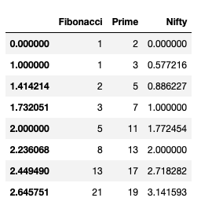

{:menu Setup}
{::comment}menu-start{:/comment}

<label id="hamburger-menu"></label>

<ul>
<li><a href="Installation.html">Installing necessary software</a></li>
<li><a href="Jupyter.html">Jupyter notebooks</a></li>
<li><a href="NumPy.html">NumPy</a></li>
<li><a href="Matplotlib.html">Matplotlib</a></li>
<li><a href="MPLFormatting.html">Formatting Plots</a></li>
<li><a href="pandas.html">Pandas</a></li>
</ul>

{::comment}menu-end{:/comment}

[Pandas](https://pandas.pydata.org) is a Python module that makes is easier to analyze data. 

## Installation

If you enter `import pandas as pd` in a cell in a Jupyter notebook and Python
doesn’t complain, pandas is already installed. If not, installing is easy. If you
are running jupyter notebook having installed with `pip`, enter

~~~~ shell
pip install pandas
~~~~

If you are using Anaconda, use

~~~~ shell
conda install pandas
~~~~

## Creating a pandas DataFrame

The easiest way to create a `DataFrame` is from a dictionary of arrays, which
all must have the same length. Here's a simple example.

~~~~ python
fibo = [1, 1, 2, 3, 5, 8, 13, 21]
prime = [2, 3, 5, 7, 11, 13, 17, 19]
nifty = [0., np.euler_gamma, np.sqrt(np.pi)/2, 1., np.sqrt(np.pi), 2.0, np.e, np.pi]
df = pd.DataFrame(dict(Fibonacci=fibo, Prime=prime, Nifty=nifty))
~~~~

If we ask Jupyter to display the DataFrame by submitting df, this is what we
get:

In combination with Jupyter, pandas generates a nice looking table, with column
heads you can use for sorting. In this case, everything is sorted in ascending
order, so the sort buttons aren't particularly useful. In general, however, they
can be quite useful. Also in this case, I have not set an index array, so Pandas
uses the default integer vector starting from zero. Let's change the index of
this DataFrame to use the square root of integers:

~~~~ python
df.index = np.sqrt(range(8))
df
~~~~
which generates the output

* Plotting data in a pandas DataFrame

Plotting a pandas data column against the index is straightforward. Since I
would like a plot of discrete points, I will add the keyword argument `style`
and use it to specify blue squares:

~~~~ python
df.plot(y='Prime', style='bs')
~~~~

If I would rather plot one column against another, I can specify both `x` and
`y` values. I'll gussy up some other things, too.

~~~~ python
df.plot(x='Fibonacci', y='Prime', kind='scatter', title='Ridiculous')
~~~~

As usual, you can get lots more information about a command by asking for help:

~~~~ python
help(df.plot)
~~~~

* Filtering data

Suppose we wanted to work only with the data in the table for which the
Fibonacci number was even. We can construct a new subset table with the
following command

~~~~ python
df[df['Fibonacci'] % 2 == 0]
~~~~
which yields

What’s going on here? The interior expression, `df['Fibonacci'] % 2 == 0`
produces a boolean array of values, one for each row in the DataFrame. This
array is then used to index into `df`, yielding only those rows corresponding to
`True` values in the array.

You can access individual columns either with a string index, as in the previous
example, or as a data member field of the same name:

~~~~ python
df.Fibonacci

0.000000     1
1.000000     1
1.414214     2
1.732051     3
2.000000     5
2.236068     8
2.449490    13
2.645751    21
Name: Fibonacci, dtype: int64
~~~~
