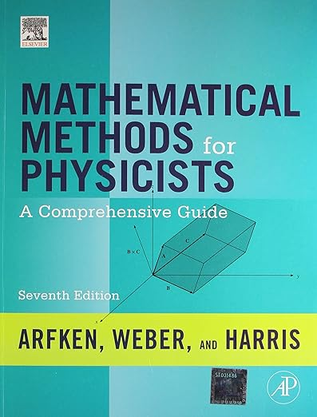
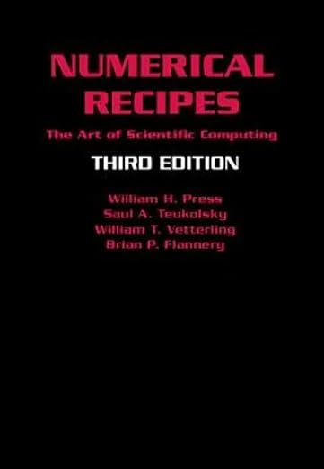

# Syllabus

The first three semesters at Harvey Mudd College provide an introduction to computation in Python and grounding in important topics in the mathematics that underpins physics, including single- and multi-variable calculus, linear algebra, and ordinary differential equations. Our course builds on that foundation to develop your ability to use computation to explore physically meaningful problems using standard and powerful Python modules (NumPy, scipy, matplotlib, and pandas) and to extend your mathematical foundation to include several topics of central importance to physics. These include

- series expansions
- Fourier series and transforms
- the algebra and calculus of functions of a complex variable
- stochastic processes
- nonlinear dynamics and chaos
- systems of ordinary differential equations, and
- partial differential equations

Note:  **Math/Physics Joint Majors must take Math 180** (*Introduction to Partial Differential Equations*).
Our course is for straight physics majors and CS/Physics Joint Majors; it replaces Math 115 (*Fourier Series and Boundary Value Problems*), which was a mainstay of the major for decades. Our purpose in developing this course has been to integrate more carefully the mathematical and computational approaches to problem solving that physicists need to know for upper-division physics courses and research, and to help ensure that all majors achieve a fluency in computation that prepares them for further work in physics and related disciplines.

## Nuts and Bolts

- Meetings: Tuesdays and Thursdays, 13:15–14:30, Shanahan 2454

### Instructor

- Peter N. Saeta, Keck 1231, 7-3939, [saeta@hmc.edu](mailto:saeta@hmc.edu)
- Zoom: [https://hmc-edu.zoom.us/my/saeta](https://hmc-edu.zoom.us/my/saeta)
- Office Hours:
  - Mondays: 13:00–14:30
  - Tuesdays: 15:00–16:00
  - Wednesdays: 13:00–15:00
  - Thursdays: 15:00–16:00
  - most Fridays: 13:15–15:00

and by appointment: email me at [saeta@hmc.edu](mailto:saeta@hmc.edu); I maintain a [Google calendar which you can view at https://saeta.physics.hmc.edu/](https://saeta.physics.hmc.edu/), which can help you suggest a meeting time when I am available.

### Resources

There is no textbook for this course, although I will suggest some books I find useful below. The primary sources are available at [the schedule page](https://physics.hmc.edu/c/p064/) and [the course site](https://saeta.physics.hmc.edu/p064/); we will use [Canvas](https://harveymuddcollege.instructure.com/courses/3093/) for connection to Gradescope for assignments and occasional announcements.

<table class="nicetable" style="width: 800px;">
  <tr>
    <td></td>
    <td>Nearing, James. <em>Mathematical Tools for Physics</em> (Dover, 2010). Available inexpensively from Dover or on Amazon. This text is aimed at about the right level for this course.
    </td>
  </tr>
  <tr>
    <td></td>
    <td>Arfken, George B., Hans J. Weber, and Frank E. Harris. <em>Mathematical Methods for Physicists</em> (Elsevier, 2013). Available in paperback on Amazon. This text aims a bit beyond Nearing, more at a senior undergraduate or introductory graduate level, but is a valuable resource and has lots of great problems.</td>
  </tr>
  <tr>
    <td></td>
    <td>Press, William H., Saul A. Teukolsky, William T. Vetterling, and Brian P. Flannery. <em>Numerical Recipes: the Art of Scientific Computing</em>, Third edition (Cambridge University Press, 2007). An invaluable reference for a broad range of topics. Somewhat pricier than the other two, and it has examples in C++.</td>
  </tr>
</table>

### Grutors

- [Annika Larson](mailto:anlarson@g.hmc.edu)
- [Chengyi Tang](mailto:chtang@g.hmc.edu)

## Objectives

On successfully completing this course, you will:

- have a broadened understanding of the notion of a **vector** and will see many examples of both finite- and infinite-dimensional **vector spaces**
- understand the centrality of linear algebra in physics and some of the numerical methods commonly used to solve linear algebraic problems
- understand that periodic functions may be represented with Fourier series, be able to compute Fourier series for simple periodic functions, understand the relationship between time- and frequency-based representations of functions, appreciate how the fast Fourier Transform can allow the efficient solution of a class of problems.
- be introduced to simulations of physical systems in (Hamiltonian) phase space, including systems involving random variables.
- use the method of separation of variables to simplify partial differential equations to products of solutions to ordinary differential equations.
- learn some basic approaches to numerically approximating the solution of partial differential equations.

## Grade

- (30%) Midterm on linear algebra, series, Fourier series, and Fourier transforms
- (40%) Homework, quizzes, and class participation
- (30%) Project

## Use of Artificial Intelligence

ChatGPT can write simple programs in a variety of languages, including Python. I might be tempted to use it to show me how to translate something I have already written in Python to a different language, such as Julia, in which I am not nearly as fluent as I am in Python. However, our goals in this course include helping you develop your ability to solve problems using computation, to debug code, and to assess the reliability of solutions. The only way to learn how to solve complicated problems is to develop your skills on simpler ones—ones that are simple enough that modern A.I. tools can handle them. I ask you not to use them, however, because they will not help you to develop a working foundation that you can extend to more complex and interesting problems.

## Mission

Harvey Mudd College seeks to educate engineers, scientists, and mathematicians well versed in all of these areas and in the humanities and social sciences so that they may assume leadership in their fields with a clear understanding of the impact of their work on society.

*These days, well-versedness requires computational fluency.*

## Values

The Harvey Mudd College Physics Department recognizes the value, dignity, and
humanity of every member of our community. We strive to conduct ourselves with
honesty and integrity. We commit to building an environment that is welcoming,
supportive, and free from intimidation, harassment, and discrimination. And we
challenge ourselves to pursue educational and scientific excellence that
embodies these values.

## Accommodations

HMC is committed to providing an inclusive learning environment and support for all students. We recognize that the challenges facing students are different and student accommodation needs may evolve in time. Students with a disability (including mental health, chronic or temporary medical conditions) who may need accommodations in order to fully participate in this class are encouraged to contact the [Office of Accessible Education](https://www.hmc.edu/student-success/accessible-education/) to request accommodations. Students from the other Claremont Colleges should contact their home college's Accessible Education officer.

## Belonging

Everyone who is registered for this course belongs here and has valuable contributions to make to our class. Our diversity of backgrounds, experiences, and viewpoints enrich the classroom, and our mutual respectn grants us all the grace to make mistakes and to learn from them. Some of my most memorable experiences in college center on just such mistakes.

Physics is a very challenging discipline—Nature, while not capricious, does not always read like an open book. Every successful physicist has failed countless times and has wondered whether she or he is cut out for this most beautiful and difficult discipline. What sustains any of us is the incredible realization that we *can* understand (some) things about how the physical universe actually works and that our understanding can be tested in a court of law that is not subject to the whims of mere mortals. In troubling times, this knowledge can be incredibly reassuring and definitely worth a few bruises along the way. When things are tough, reach out, get help; we're in this together!

I am dedicated to fostering an equitable atmosphere in this course, this department, and at HMC, while simultaneously maintaining standards that encourage and promote excellence. Please let me know if you have suggestions or concerns regarding the course or a specific situation; alternatively, you can bring concerns to another member of the faculty or staff.

## Title IX

Harvey Mudd College is committed to providing an environment free
of all forms of discrimination and sexual harassment, including sexual assault, domestic vi-
olence, dating violence, and stalking. If you (or someone you know) has experienced or
experiences any of these incidents, know that you are not alone. Instructors are available to
talk to you if you are in need, but keep in mind that we are obligated to report any contraven-
tions of Title IX to the HMC Title IX Coordinator, [Danny Ledezma](dledezma@hmc.edu). If
you want to speak to someone completely confidentially, the following resources are available
on and off campus: the EmPOWER Center (909-607-2689), the Monsour Counseling Center
(909-621-8202), the Project Sister Family Services’ 24-hr crisis hotline (909-626-4357) and
the McAlister Chaplains (909-621-8685). Additional information and options are available
at [https://www.hmc.edu/student-life/title-ix](https://www.hmc.edu/student-life/title-ix).
